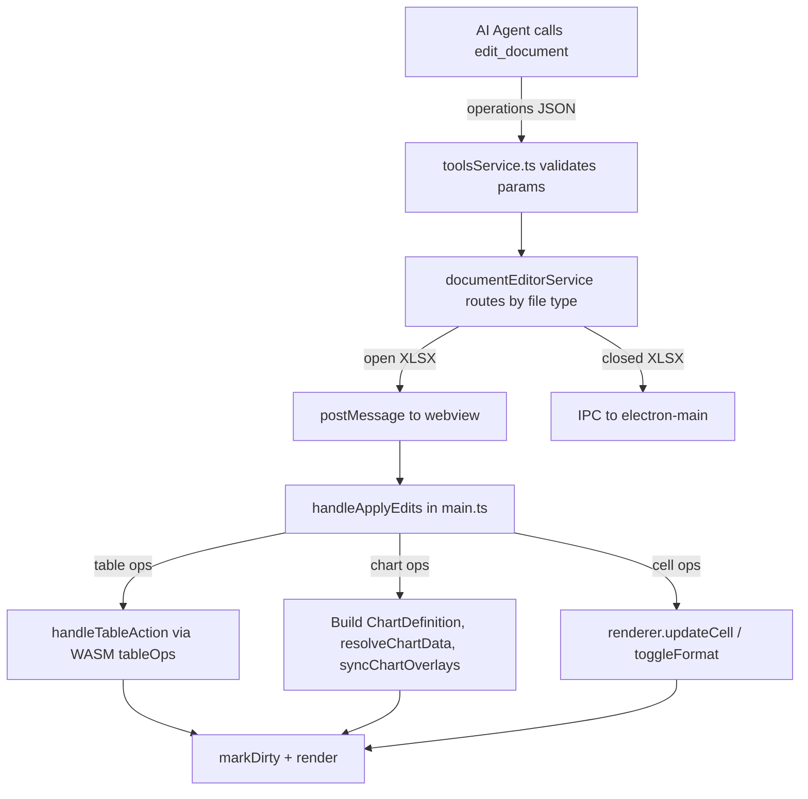

# AI Agent Table and Chart Tools for XLSX

## Current State

- **Tables**: The `XLSXEditOperation` type already declares 7 table operations
  (`create_table`, `resize_table`, `rename_table`, `set_table_style`,
  `toggle_table_filter`, `set_totals_row`, `convert_table_to_range`), and
  `main.ts` has a fully working `handleTableAction()` function (line 873) that
  calls the Rust WASM `tableOps` API. But these operations are not listed in the
  AI description, not validated, and not handled in `handleApplyEdits`.
- **Charts**: No chart operations exist anywhere in the tool pipeline. The
  webview has a working `handleChartWizardAction()` (line 1224) and
  `resolveChartData()` (line 1258) that push `ChartDefinition` objects into the
  model.

## Changes Required

### 1. Add chart operation type to `XLSXEditOperation`

**File**:
[documentEditorService.ts](src/vs/workbench/contrib/void/browser/documentViewers/documentEditorService.ts)
(line 39)

Add after the existing table operations:

```typescript
| { type: 'insert_chart'; sheet: string | number; chart_type: string; data_range: string; title?: string; position?: string }
| { type: 'delete_chart'; sheet: string | number; chart_index: number }
```

- `chart_type`: "column", "bar", "line", "pie", "scatter", "area", "doughnut",
  "radar"
- `data_range`: cell range like "A1:D10"
- `position`: optional anchor cell like "F2" (defaults to below data)

### 2. Update AI tool description

**File**: [prompts.ts](src/vs/workbench/contrib/void/common/prompt/prompts.ts)
(line 20)

Update `EDIT_DOCUMENT_DESCRIPTION` to list the new operations and add examples:

- Add table operations to the XLSX operations list: `create_table`,
  `rename_table`, `set_table_style`, `toggle_table_filter`, `set_totals_row`,
  `convert_table_to_range`
- Add chart operations: `insert_chart`, `delete_chart`
- Add examples showing table creation with data and chart insertion

### 3. Add validation for new operations

**File**:
[toolsService.ts](src/vs/workbench/contrib/void/browser/tools/toolsService.ts)
(line 544, after the `delete_column` case)

Add validation cases:

- `create_table`: requires `sheet`, `range` (string like "A1:D10"), `tableName`
  (string)
- `rename_table`: requires `oldName`, `newName`
- `set_table_style`: requires `tableName`, `styleName`
- `toggle_table_filter`: requires `tableName`
- `set_totals_row`: requires `tableName`, `enabled` (boolean)
- `convert_table_to_range`: requires `tableName`
- `insert_chart`: requires `sheet`, `chart_type`, `data_range`
- `delete_chart`: requires `sheet`, `chart_index`

### 4. Add handlers in webview `handleApplyEdits`

**File**:
[main.ts](src/vs/workbench/contrib/void/browser/documentViewers/xlsxRustViewer/media/main.ts)
(line 471, before the `default` case)

#### Table operations

Wire each table operation to the existing `handleTableAction()` function:

- `create_table` -- parse the range string to
  `{start_row, start_col, end_row, end_col}`, call
  `handleTableAction('createTable', { name, style })` after setting the renderer
  selection to the range
- `rename_table` -- call
  `handleTableAction('renameTable', { oldName, newName })`
- `set_table_style` -- call
  `handleTableAction('setTableStyle', { tableName, style })`
- `toggle_table_filter` -- call
  `handleTableAction('toggleFilter', { tableName })`
- `set_totals_row` -- call
  `handleTableAction('setTotalsRow', { tableName, enabled })`
- `convert_table_to_range` -- call
  `handleTableAction('convertToRange', { tableName })`

#### Chart operations

- `insert_chart` -- build a `ChartDefinition` from the operation params (map
  `data_range` to `values_ref`, set `chart_type`, `title`, compute anchor from
  `position` or default), call `resolveChartData()`, push to `sheet.charts`,
  call `syncChartOverlays()`
- `delete_chart` -- remove the chart at `chart_index` from `sheet.charts`, call
  `syncChartOverlays()`

### 5. Update example in tool XML prompt

**File**: [prompts.ts](src/vs/workbench/contrib/void/common/prompt/prompts.ts)
(line 787)

Update the `edit_document` example to show an XLSX example with table/chart
creation instead of only the DOCX example.

## Data Flow



## Files Modified

- [prompts.ts](src/vs/workbench/contrib/void/common/prompt/prompts.ts) --
  `EDIT_DOCUMENT_DESCRIPTION` and example
- [toolsService.ts](src/vs/workbench/contrib/void/browser/tools/toolsService.ts)
  -- validation for table/chart ops
- [documentEditorService.ts](src/vs/workbench/contrib/void/browser/documentViewers/documentEditorService.ts)
  -- `XLSXEditOperation` type
- [main.ts](src/vs/workbench/contrib/void/browser/documentViewers/xlsxRustViewer/media/main.ts)
  -- `handleApplyEdits` handlers
