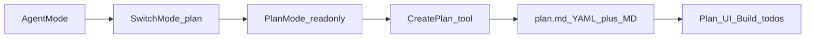

# Cursor Plan Mode Harness (live dump + how pretty plans work)

This plan is the research deliverable: what the agent sees in Plan Mode, which tools create `.plan.md`, and why those files look “styled” in Cursor even though the on-disk file is ordinary Markdown + YAML.

Researcher briefings folded in from [Cursor .plan.md styling](c721d87d-984b-4c8a-a395-289420ef0724) and [Research Cursor plan.md styling](6f804bc9-9aa5-4a1a-bc92-7cc7c916337d).

## 1. Live Plan Mode system prompt (this session)

After `SwitchMode` → `plan`, the harness injected this (paraphrased structure is exact; this is the Plan Mode overlay on top of the normal agent prompt):

**Hard constraints**

- Plan mode is active; user does not want execution yet
- MUST NOT make edits, run non-readonly tools, change configs, or commit
- Supersedes other instructions that would allow edits

**Required workflow**

1. Answer by searching / gathering info
2. If info is insufficient → ask the user
3. If request is too broad → ask 1–2 narrowing questions
4. If multiple valid implementations change the approach → ask which one
5. Ask clarifying questions immediately when needed (small pre-read OK if ≤5 files)
6. When research is done → present the plan by calling **CreatePlan** (do not edit files until user confirms)
7. Plan must be concise, specific, actionable; cite paths as markdown links with full paths
8. Keep plan proportional to complexity
9. No emojis in the plan
10. Speed research with parallel explore subagents
11. Use mermaid for architecture/data-flow when helpful
12. Ask questions **inline** (not via a separate ask-question tool)

**Mermaid rules (plan renderer)**

- No spaces in node IDs; use camelCase / underscores
- Quote edge labels that contain `()`, `[]`, etc.
- Quote node labels with special chars
- Avoid reserved IDs like `end`
- Subgraphs: `subgraph id [Label]`
- No HTML entities / angle brackets in labels
- No explicit colors/`style`/`classDef` (breaks dark mode)
- No `click` events

**Concrete plans rule**

- Commit to one approach
- No Option A vs B, TBDs, soft optionality, or “awaiting answers” plans
- If a decision would material change the approach and cannot be resolved → ask before CreatePlan; else pick a default and state it

**Mode switch note (from Agent-mode tool, before this switch)**

- `SwitchMode` with `target_mode_id: "plan"` | `"agent"`
- Plan = read-only collaborative design; Agent = implementation
- User approval required for the mode switch
- Docs/community: agent SwitchMode is mainly Agent→Plan; reverse often via UI / Shift+Tab

## 2. Tools that make `.plan.md`

### CreatePlan / `create_plan` (Plan Mode only)

- Called when research is done; mode-gated (Agent-only sessions can report tool missing)
- Writes/updates a plan the product treats as a first-class Plan artifact
- **Update contract** (forum error text): must provide either `plan` (full body) **or** both `old_str` + `new_str` (string patch)
- Create fields the product persists into frontmatter + body:
  - `name` — short title
  - `overview` — 1–2 sentence summary
  - `plan` — markdown body (what you are reading)
  - `todos` — structured checklist (`id`, `content`, `status`)
- On disk this becomes something like:
  - `~/.cursor/plans/<slug>_<hash>.plan.md` (default home plans)
  - or workspace `[.cursor/plans/*.plan.md](.cursor/plans/)` after “Save to workspace”
- Do **not** call CreatePlan again to update — edit the plan file (or use `old_str`/`new_str` when the tool exposes it)

### SwitchMode (Agent harness)

- Not a plan-file writer
- Moves the composer into Plan Mode so CreatePlan + the read-only Plan prompt apply

### What official docs say

- [Plan Mode docs](https://cursor.com/docs/agent/plan-mode.md): research → plan → review/edit → Build
- Plans are Markdown; editable in chat or as files
- Default save: home directory; “Save to workspace” → `.cursor/plans/`
- Blog: Plan mode gives the model **tools to create/update plans** plus an interactive editor ([blog/plan-mode](https://cursor.com/blog/plan-mode))
- Tool names like `CreatePlan` are **harness-internal**, not documented on the public Plan Mode page

## 3. On-disk schema (confirmed from this machine)

Observed frontmatter in SafeAppeals / `~/.cursor/plans`:

```yaml
---
name: Human Title
overview: "One-line summary"
todos:
  - id: some-id
    content: Task text
    status: pending   # or completed
isProject: false
---

# Markdown body starts here
```

Filename pattern: `snake_or_slug_title_<8hex>.plan.md`

The body is normal Markdown: headings, lists, tables, fenced code, mermaid, links to files / agent IDs.

## 4. Why it looks “pretty” (not special Markdown)

**Confirmed**

- On disk: ordinary Markdown + YAML frontmatter — **not MDX**, not a public custom MD dialect
- `*.plan.md` opens in a **dedicated Plan editor/viewer** (not VS Code Markdown Preview)
- Frontmatter → chrome: `name`, `overview`, interactive `todos`, Build / Save
- Body → styled markdown; **Plan Mermaid** gets extras (fullscreen / zoom / pan) that ordinary `.md` does **not** get ([forum](https://forum.cursor.com/t/feature-request-enable-plan-style-mermaid-rendering-for-regular-md-files/148067))
- Preview ↔ Markdown/Code toggle near Build for raw vs styled view
- “Pretty” = **product UI chrome**, not prettier source text

**Practical implication**

- Prefer Plan Mode + CreatePlan so the plan is **registered** (Build/todos wiring)
- Hand-dropped `.plan.md` can open plain / miss Build registration
- Broken or missing frontmatter → falls back toward basic markdown look
- Author tips: valid YAML `---` block; `name` + `todos` with `id`/`content`/`status`; clear H1/H2s; mermaid that follows harness rules; use Preview to review, Markdown mode for YAML surgery




## 5. Agent vs Plan vs Ask vs Debug (product)


| Mode  | Role                      | Edits                |
| ----- | ------------------------- | -------------------- |
| Agent | Implement                 | Yes                  |
| Plan  | Design / approve approach | After Build approval |
| Ask   | Q&A                       | No                   |
| Debug | Runtime evidence          | Yes                  |


Each mode uses its own context window (help docs). Project/user/team rules still apply.

## 6. How to enter Plan Mode

- Mode picker
- Shift+Tab in chat
- Agent `SwitchMode` → plan (this session)
- Auto-suggest on complex prompts

## 7. Confidence (documented vs reverse-engineered)


| Claim                                                                | Status                                                                                          |
| -------------------------------------------------------------------- | ----------------------------------------------------------------------------------------------- |
| Plan Mode workflow, Shift+Tab, Build, Save to workspace              | Official docs                                                                                   |
| Tools to create/update plans + interactive editor                    | Official blog (unnamed tools)                                                                   |
| Live Plan Mode system overlay (read-only, CreatePlan, mermaid rules) | This harness session                                                                            |
| `create_plan` accepts `plan` OR `old_str`+`new_str`                  | Forum error text                                                                                |
| On-disk `name`/`overview`/`todos`/`isProject`                        | Observed locally + community / [cursor-plan-view](https://github.com/snasa045/cursor-plan-view) |
| Dedicated Plan UI + special Mermaid                                  | Strong community evidence                                                                       |
| Full published CreatePlan JSON Schema / full system prompt           | Not public                                                                                      |
| Custom Markdown extensions for styling                               | No evidence — treat as false                                                                    |


