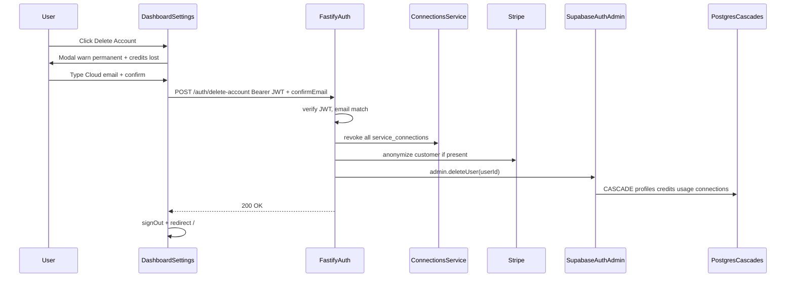

# Self-serve Delete Account (void-cloud)

## Context from exploration

- [Explore void-cloud account UI](1c93db48-9408-44db-acb6-3be056bef503): Settings Danger Zone stub is the insertion point; Cloud identity is **Google-only**; Microsoft is mail/calendar **Service Connections** only; cascades confirmed; no Edge Functions.
- [Vault recall](a751f00e-1a50-4fea-8dc4-bf2d4692f2db): no prior deletion work in vault; **void-cloud is a separate gitignored repo** — commit/deploy there, not via parent SafeAppeals2.0 PR.

## What already exists

- Danger Zone stub on `[void-cloud/dashboard/app/dashboard/settings/page.tsx](void-cloud/dashboard/app/dashboard/settings/page.tsx)`: `Delete Account` button is **disabled** ("Contact Support"); unused `deleteConfirm` state is already declared.
- Dashboard already calls the API with `Bearer ${session.access_token}` (billing page pattern using `NEXT_PUBLIC_API_URL`).
- Fastify service-role clients in `[void-cloud/api/src/services/supabase.ts](void-cloud/api/src/services/supabase.ts)`; JWT middleware `[verifySupabaseToken](void-cloud/api/src/middleware/auth.ts)`.
- Connection revoke precedent: `DELETE /connections/:id` / `deleteConnection` in `[api/src/services/connections.ts](void-cloud/api/src/services/connections.ts)`.
- **No Supabase Edge Functions** — use Fastify.
- **No new DB tables.** Live FKs cascade on auth user delete:
  - `profiles.id → auth.users(id) ON DELETE CASCADE`
  - `credit_transactions` / `usage_logs` → `profiles` CASCADE
  - `service_connections` / `connection_requests` → `auth.users` CASCADE

Legal: unused credits forfeited (`[TERMS_OF_SERVICE.md](void-cloud/legal/TERMS_OF_SERVICE.md)`); Privacy still says email support only — update to Settings self-serve. Privacy also retains transaction records as required by law → **do not hard-delete Stripe customers**.

## Chosen approach

- **UI location:** Existing Settings Danger Zone
- **Confirmation:** Modal with permanent + credits-lost warning; user types their **Cloud identity email** (Google sign-in email from session / `profiles.email`)
- **Match rule:** `trim().toLowerCase()` client + server vs JWT email
- **Delete mechanism:** `supabase.auth.admin.deleteUser(userId)` via service role
- **Pre-delete:** Best-effort revoke/delete each `service_connections` row via existing `deleteConnection` (clears provider grants before cascade)
- **Stripe:** Best-effort **anonymize** customer (clear email/name/metadata) when `stripe_customer_id` exists; **do not** `customers.del` (legal retention). Auth delete still proceeds if Stripe anonymize fails
- **Schema / MCP writes:** None

## Implementation

### 1. Fastify: `POST /auth/delete-account`

Add to `[void-cloud/api/src/routes/auth.ts](void-cloud/api/src/routes/auth.ts)`:

- `preHandler: verifySupabaseToken`
- Body: `{ confirmEmail: string }`
- Reject 400 if missing; 403 if normalized email ≠ `request.user.email`
- List user's connections; call `deleteConnection` for each (best-effort, log failures)
- Load `stripe_customer_id` via `supabaseDb`; if present, best-effort Stripe customer update to redact PII
- `await supabase.auth.admin.deleteUser(request.user.id)` (hard delete)
- Invalidate token cache for the bearer token
- Return `{ ok: true }`

### 2. Dashboard Settings UI

In `[settings/page.tsx](void-cloud/dashboard/app/dashboard/settings/page.tsx)`:

- Enable Delete Account → confirmation panel/modal (`deleteConfirm`)
- Warn: permanent; all remaining credits lost; profile/usage/connected mail-calendar removed
- "Type your email to confirm" — show account email as hint, not pre-filled
- Confirm disabled until typed email matches; server re-checks
- Fetch like billing (`API_URL` + Bearer); success → `signOut()` → `/`
- Match existing Danger Zone styling (`AlertTriangle` / `Trash2`)

### 3. Docs / legal + repo boundary

- Update Privacy Account Deletion: self-serve via Dashboard → Settings; keep support email as fallback
- No migrations; no Supabase MCP table writes
- Implement/commit inside **void-cloud** (gitignored from parent); deploy API (Railway) + dashboard (Vercel) separately

### 4. Tests

Under `[void-cloud/api/test/](void-cloud/api/test/)`:

- 401 without token; 403 email mismatch; 200 mocks `admin.deleteUser` + connection revoke + Stripe anonymize

## Out of scope

- Soft-delete / 30-day grace (privacy “within 30 days” = backup/log retention language; product action is immediate hard delete)
- Desktop/extension in-app delete (point users at dashboard Settings)
- Fixing hardcoded “Signed in with Google” label polish beyond accuracy (it is already correct for Cloud identity)

