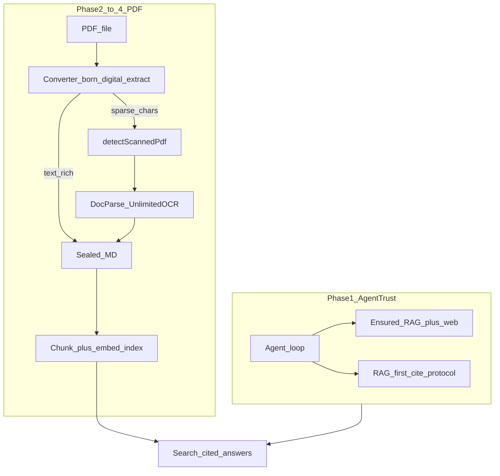

# Private Search Trust Layer + HW-Gated PDF Ingest

Architect recommendation ([Architect RAG trust + PDF OCR](6cc02e0e-42e5-4788-af2f-9cc5539f860f)): **Track A first**, then PDF ingest in sub-phases. Stub digital PDF extract currently blocks the entire OCR ladder.

## Problem

Lawyers trust SafeAppeals because the agent grounds answers in **on-device Private Search** (cases, core references, citations) and can ingest **case PDFs** into searchable Markdown when the machine can run Unlimited-OCR. Today:

- Web tools are **ensured**; five `safeappeals_rag_*` tools are only aliased — agent often never sees RAG.
- No shipping Agent protocol for RAG-first + cite `[n]` + fail-closed (Void prompts orphaned).
- `IndexPipeline` / watcher are **txt/md-only**; `StubDigitalPdfExtractor` hard-fails every PDF **before** scanned detection / DocParse can run.
- HW probe + `IngestRouter` OCR ladder already exist; wiring and artifact pin are the gaps.



## Sequencing (committed)

| Phase | Track | Ships |
|-------|-------|--------|
| **1** | A | Ensure RAG tools, agent protocol, nls/tool set, product.json, contextPack footer |
| **2** | B1 | Born-digital PDF extract via converter sidecar (unblocks ladder) |
| **3** | B2 | Open IndexPipeline + watcher to PDF; checksum skip; agent index |
| **4** | B3 | Scanned OCR production (pin Unlimited-OCR URL/sha; HW/consent gates already in router) |
| **5** | A+B | Merge PDF guidance into agent protocol; end-to-end smoke |

**Assumptions:** Workspace-wide `**/*.pdf` create/change watchers **deferred** (OCR storm risk). Case PDFs index via startup walk + `core_references/**` watch + agent `index_document`. Phases 1–3 ship without OCR pack pin; scanned path stays hard-disabled until Phase 4 pin.

---

## Phase 1 — Agent trust layer

**Files:** [`toolAllowlist.ts`](extensions/safeappeals-authentication/src/chat/toolAllowlist.ts), new `privateSearchAgentProtocol.ts`, [`agentLoop.ts`](extensions/safeappeals-authentication/src/chat/agentLoop.ts), [`package.nls.json`](extensions/safeappeals-rag/package.nls.json), [`safeappeals-rag/package.json`](extensions/safeappeals-rag/package.json), [`product.json`](product.json), [`contextPack.ts`](extensions/safeappeals-rag/src/contextPack.ts), tests.

1. Append all five `safeappeals_rag_*` to `ENSURED_AGENT_TOOL_NAMES` + rich `ENSURED_AGENT_TOOL_DESCRIPTORS` (from Void WHEN/scope/cite playbook).
2. Inject concise Private Search protocol User message every Agent turn (after mode reminder): RAG-first, scope rules, multi-query, cite `[n]`, fail-closed, web supplements not replaces, index writes on primary.
3. Align `package.nls.json` modelDescriptions; add `languageModelToolSets` `safeappeals_privateSearch`.
4. Grant auth proposals in product.json: `contribLanguageModelToolSets`, `findTextInFiles`, `textSearchProvider`.
5. Context-pack footer: cite headers; do not fabricate.
6. Keep secondary `read-only-session` index messaging (already shipped).

**Accept:** RAG tools force-present like web; protocol every turn; cited packs; no proposal DELTA noise; Agents index still read-only.

---

## Phase 2 — Born-digital PDF extract (B1)

**Critical:** Without this, opening PDF in the pipeline only hits stub → `extract-failed`.

1. Converter: per-page text extract RPC (`rust/converter` + `converterService.extractPdfPages`).
2. New `ConverterDigitalPdfExtract` implementing `IDigitalPdfExtractor`; wire into `IngestRouter` in rag `extension.ts` (replace stub default).
3. Fail closed if converter missing; **no** `withLease('docparse')` for digital extract (sidecar RPC only).
4. Tests with fakes for digital path + `detectScannedPdf` input.

**Accept:** Born-digital PDF → `fidelity: digital` → sealed MD → markdown with page anchors.

---

## Phase 3 — Open pipeline/watcher to PDF (B2)

1. Add `pdf` to `INDEXABLE_EXTENSIONS` / glob suffixes; rename helper to source-path (not txt-only).
2. Startup walk + delete watchers for PDF; **no** workspace-wide PDF create/change watch (v1).
3. `core_references/**` existing watch already picks up PDF drops.
4. Update index tool descriptions; tests for index/skip/hard-disable PDF paths.

**Accept:** Primary `index_document` on born-digital PDF end-to-end; unchanged PDF checksum-skips; secondary read-only.

**Lease order (keep):** ingest (docparse only if scanned) → then `withLease('embedding')` for index — never concurrent heavy XOR.

---

## Phase 4 — Scanned OCR (B3)

Uses existing [`IngestRouter.ingestScannedPdf`](extensions/safeappeals-rag/src) ladder:

| Condition | Code |
|-----------|------|
| HW ineligible | `scanned-ocr-ineligible` |
| Eligible, not installed | `scanned-ocr-not-installed` |
| Sidecar down | `scanned-ocr-sidecar-not-ready` |
| OK | `withLease('docparse')` → sealed `fidelity: ocr` |

1. Pin `UNLIMITED_OCR_SPEC.downloadUrl` + `sha256` in model catalog when ops bundle ready.
2. Verify setup panel / Install Missing Models consent path.
3. DocParse loopback-only; never EH-spawned vLLM; never Tesseract; never plaintext fallback.

**Accept:** Scanned fixture on eligible+installed machine indexes with page citations; ineligible never downloads.

---

## Phase 5 — Protocol merge + smoke

Extend `privateSearchAgentProtocol` with PDF: search first; index new/changed PDFs via primary; interpret OCR hard-disable codes; `get_stats` before re-index.

**Manual smoke:** legal Q → RAG cite; born-digital PDF searchable; scanned OCR or honest hard-disable; Agents search OK / index read-only.

---

## What NOT to do

- Spawn DocParse/vLLM/Unlimited-OCR inside the extension host
- Pull pdfium into RAG EH; use converter sidecar for digital extract
- Tesseract or silent plaintext for scanned PDFs
- Auto-download OCR without consent
- Non-loopback DocParse URLs
- Bypass PathGuard / write outside `globalStorageUri`
- `indexChunks` without embedding lease
- Workspace-wide PDF create/change watchers in v1

## Verification (each phase)

```bash
bun run test   # safeappeals-authentication + safeappeals-rag (+ converter from Phase 2)
bun run gulp compile-extension:safeappeals-authentication
bun run gulp compile-extension:safeappeals-rag
# Phase 2+: compile-extension:safeappeals-converter
```
