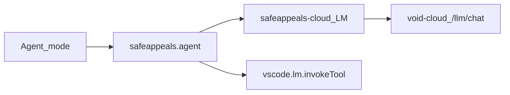

# SafeAppeals Cloud Agent

## Goal

Cloud-signed-in **Agent** uses SafeAppeals (Cloud LM + tools). No GitHub Copilot. Ask unchanged. Privacy: no chat bodies in SafeAppeals DB; soft retention copy until provider “no training” terms verified.

## Architecture (architect recommendation)

**Register a SafeAppeals default chat participant** in [`extensions/safeappeals-authentication`](extensions/safeappeals-authentication) — id `safeappeals.agent`, `isDefault: true`, `modes: ["agent"]`, **not** `isCore`. Own tool loop: `request.model` (Cloud) → `vscode.lm.invokeTool` → repeat (cap **500** as of Aug 1 2026; was ~25).

**Do not** turn core SetupAgent into a tool loop, and **do not** rebrand vendored [`extensions/copilot`](extensions/copilot) as the product path (GitHub-entitlement-gated; being removed). Core already fail-fasts Agent when no non-core default exists (`shouldFailFastCloudAgentMode`); once our participant registers, setup routing prefers it automatically.

Host tools: SafeAppeals-owned LM tools in auth + documents + timer + email. **Tools pass core surface shipped Aug 2** (`e1754228`) — workspace/file, Brave search/fetch, DOCX/XLSX open+closed, timer start/stop, email createDraft. Email read/organize still open in `safeappeals_agent_tools` plan.

## Master-plan mapping

| Phase | Master plan |
|-------|-------------|
| 1 | Rung 13 — void-cloud `tool_calls` + stream credits |
| 2 | Client `toolCalling: true` |
| 3 | Agent delivery (new participant; fuller `defaultChatAgent` string rebrand can follow) |
| Tools | Tools pass — **DONE** for docs/workspace/web/timer/draft (Aug 2); email read/organize remainder in agent_tools plan |

Diverges from older “rebrand vendored copilot” wording: extension-first participant is smaller and avoids Copilot auth. Tell Steve if he prefers full copilot rebrand instead.

## Phases

### Phase 0 — Fail-fast until Agent ships

- Keep clear “use Ask” when Cloud signed in and no usable non-core Agent; finish/clean unfinished helper edits.

### Phase 1 — void-cloud (rung 13)

- [`void-cloud/api/src/routes/llm.ts`](void-cloud/api/src/routes/llm.ts): forward `tools`, `tool_choice`, `tool_calls`, `role: tool`; SSE deltas; no body persistence; streaming credits/`usage_logs`.
- Validation middleware; tests; Railway deploy.

### Phase 2 — Provider tool support

- [`messageMapping.ts`](extensions/safeappeals-authentication/src/llm/messageMapping.ts), [`cloudChatProvider.ts`](extensions/safeappeals-authentication/src/llm/cloudChatProvider.ts), [`sse.ts`](extensions/safeappeals-authentication/src/llm/sse.ts), api client: `toolCalling: true`, map tool parts, accumulate streamed tool_calls.
- Unit tests; E2E one tool call against deployed Phase 1.

### Phase 3 — Participant + loop

- `package.json`: `chatParticipants` + `defaultChatParticipant` proposal; `src/chat/agentParticipant.ts`, `agentLoop.ts`, `tools.ts`; register in `extension.ts`.
- DoD: Agent button → SafeAppeals; multi-step read→edit works; signed-out → Cloud sign-in not Copilot; Ask/Edit unchanged; fail-fast off when participant present.

### Phase 4 — Gates — DONE (smoke bar Aug 1–2 2026)

- Unit tests (agentLoop, braveSearch, docx/xlsx headless/overlay/external-sync) + multi-round agent smoke QA passed (replaceSelection, structure read, credits, tool rounds, open/closed). Formal sentinel / dedicated Ask regression still optional polish.

### Tools pass — DONE (core surface, Aug 2 `e1754228`)

- Auth: workspace/file tools + Brave `webSearch`/`multiWebSearch`/`fetchWebPage` (credits footer, filters, autoFetch raw pages).
- Documents: DOCX/XLSX create/edit/read + `openDocument`; open+ready vs headless; structure JSON on `xlsx_read`; formula overlay on headless edit.
- Timer: start/stop/getState. Email: createDraft only.
- Remainder tracked in `safeappeals_agent_tools_da04f06e.plan.md` (email read/organize, pattern docs, timer annotate/list).

## Definition of done

1. Agent works on Cloud without Copilot; no hang.
2. Real tool round-trips for the host surface users expect (read/edit/create at minimum; expand to match Built-In sets the UI advertises).
3. Ask still works; no chat bodies in SafeAppeals DB.
4. Participant branded SafeAppeals.
5. Tool picker enablement and agent allowlist stay aligned — checking a Built-In set must not silently no-op.

## After you approve

Coder per phase → reviewer + verifier → sentinel → pilot → scribe. No code until you confirm.
