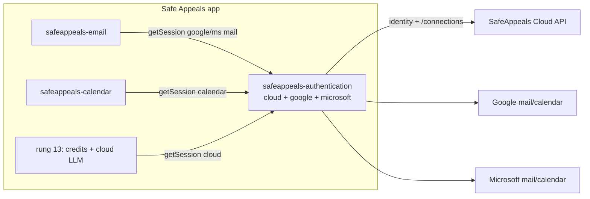

# Unified SafeAppeals Sign-In (new Rung 6.5)

## Status (Aug 3, 2026) — **LIMB DONE** (engineering)

| Slice | Status |
| --- | --- |
| Server work brief | **Done** |
| Auth extension + `safeappeals-cloud` | **Done** |
| Cloud LM / Ask | **Done** |
| Multi-account google/microsoft (connections) | **Done** |
| Calendar `getSession` + loopback deleted | **Done** |
| Email XOAUTH2 + connectionId | **Done** |
| void-cloud `/connections/*` + drop piggyback | **Done** (prod live) |
| Engineering verify | **Done** (`rung65-verify`) |
| WP0 / site marketing / interactive smoke | **Master business** (not this limb) |

Canonical connections plan (all todos completed):
`~/.cursor/plans/service_connections_auth_3fbdccee.plan.md`

Piggyback history: `archive/email_oauth_piggyback_e435d610.plan.md` (superseded).

## Decisions (Jul 20, user-confirmed)

- **Route: brokered via SafeAppeals Cloud.** One free account is the identity
  for everything; mail/calendar grants are **Service Connections** (Aug 3
  model) — not a second GoTrue login.
- **Positioning:** free account unlocks calendar, email, documents; pay for AI.
  In-app onboarding covers this; safeappeals.com site copy is master/business.
- **Sequencing:** Rung 6.5 before rung 7; rung 13 slims to credits/LLM only.

## Model (current)

## Ladder impact

- **Rung 6.5 engineering closed.** Continue master ladder (rung 7 timeline, etc.).
- Business gates on master: Google restricted-scope verification (WP0),
  interactive Electron smoke (Cloud A ≠ Gmail B ≠ Calendar C), site marketing.
