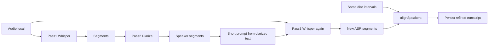

# Local Whisper third-pass refine

## Decision (committed)

- **Pass 1:** Whisper ASR (words + timestamps)
- **Pass 2:** sherpa-onnx diarization → speaker labels on segments
- **Pass 3:** **Second Whisper ASR** on the same 16 kHz audio, with a **short** `initial_prompt` built from the diarized transcript, then **re-apply the same diarization intervals** via existing `alignSpeakers` (no second diarize, no cloud)

**Rejected (privacy):** SafeAppeals Cloud / any `vscode.lm` polish — sensitive case audio/transcript must not leave the device. Desktop `CloudChatProvider` is text-only today and strips binary parts; even if multimodal were wired, Steve’s rule is no cloud for case content. Local multimodal LLM deferred.

**Honest constraint baked in:** Whisper prompts are ~224 tokens. Pass 3 does **not** paste the full long transcript into the prompt. It re-listens to the **full audio** (the real improve), and uses a **truncated diarized prompt** (speaker turns / vocabulary bias) so Whisper is steered by the diarized version without silent truncation of a huge dump.




## Where it lives

Primary: `[extensions/safeappeals-audio/](extensions/safeappeals-audio/)`

- New: `src/transcriptRefine.ts` — build truncated `initial_prompt` from speaker-tagged segments; parse/validate refine result
- Extend: `[src/whisperHost.ts](extensions/safeappeals-audio/src/whisperHost.ts)` / `[src/whisperProbe.ts](extensions/safeappeals-audio/src/whisperProbe.ts)` — pass optional `initial_prompt` through to kutalia (index signature already allows extras; keep `translate: false`)
- Extend: `[src/audioService.ts](extensions/safeappeals-audio/src/audioService.ts)` — `refineRecording(id)` under `mlEngine.withLease('whisper', …)`; chain `maybeAutoRefineAfterDiarize` after successful diarize (auto + manual Identify Speakers)
- Reuse: `[src/whisperAudioPrep.ts](extensions/safeappeals-audio/src/whisperAudioPrep.ts)` (16 kHz gate), `[src/alignSpeakers.ts](extensions/safeappeals-audio/src/alignSpeakers.ts)`
- Settings (machine-scoped): `safeappeals.audio.refine.enabled` (default **true** when we want auto third pass), `refine.autoAfterDiarize` (or single enabled flag mirroring diarization)
- UI: sidebar **Improve Transcript** button + toast “Improving transcript…” / complete; auto toast when chained after diarize
- Persist: update `transcript` + `transcriptSegments` (with speakers re-aligned). Keep ASR+diarize as recoverable by not inventing a parallel store unless needed — overwrite refined result in place after success; on refine failure leave diarized version untouched

## Prompt construction (local)

From labeled segments, build plain text like:

```text
Speaker 1: …
Speaker 2: …
```

Truncate to ~800 characters / ~200 tokens from the **start** (or rolling head+tail if useful), strip SRT markup. No PII-enrichment from cloud. No uploading audio.

## ML engine / concurrency

- Pass 3 acquires `**whisper**` lease → engine already unloads diarization first (affinity rules in `[resourceEngine.ts](extensions/safeappeals-audio/src/ml/resourceEngine.ts)`)
- Same `busyRecordingIds` / unique jobId pattern as transcribe
- Soft-fail auto path (like auto-diarize): missing model / busy → warn, keep diarized transcript

## Kutalia `initial_prompt` spike (first implementation slice)

1. Small spike or unit-level call: pass `initial_prompt` through existing spread in `whisperProbe`; confirm native accepts it (typed API omits it but `[key: string]: any` exists)
2. If native **ignores** it: still run full second ASR (audio re-listen is the main value); log that prompt was unused; do not block ship on prompt

## Failure / legal safety

- Never call `vscode.lm` / cloud from this path
- Never write refine temps outside managed store (`whisperAudioPrep` / store `tmp/`)
- If pass-3 text is empty or looks like non-speech hallucination loop, **reject refine** and keep post-diarize transcript
- Export continues to use whatever is currently stored (refined when successful)

## Tests

- Prompt builder truncation + speaker line format
- `refineRecording` happy path with mocked Whisper + fixed diar intervals → speakers restored
- Failure leaves prior diarized segments intact
- Auto-chain only when refine enabled + whisper ready
- Compile + mocha green; rebuild webview for new button

## Out of scope

- Cloud / `vscode.lm` polish
- Multimodal audio LLMs
- Second diarization pass
- Bundling models (rung 14)
- Changing “no re-ASR for diarization” to mean “never Whisper again” — that rule stays for **pass 2**; pass 3 is an explicit new product step

