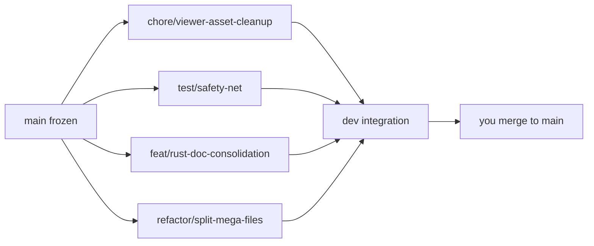

# Cleanup & Rust Consolidation Plan

## Ground rules

- `main` is frozen — it is the sellable product. Nothing lands on it from this
  work. You alone promote from `dev` → `main` when you're ready.
- Each workstream gets its own branch cut from `main` (or from current `dev` if
  that branch already has prior merged work we depend on).
- **Merge target is `dev`:** when a feature branch is done and smoke-tested,
  merge it into `dev`. Use `dev` to verify all changes work together before any
  promotion to `main`.
- Per repo rules, I won't run builds to validate — after each phase you run
  `bun run compile` / `bun run buildreact` and smoke-test on that branch, then
  we merge to `dev`.

Upstream VS Code merge investigation is tracked separately (see the Upstream VS
Code Merge Spike plan).

## Branch 1: `chore/viewer-asset-cleanup` (small, fast win)

Delete confirmed-dead files (verified unreferenced by any TS/contribution code):

- `src/vs/workbench/contrib/void/browser/documentViewers/pdfViewer/media/pdfViewer.js`
  (~66 KB legacy viewer)
- `.../pdfViewer/media/lib/pdf.min.js` and `.../lib/pdf.worker.min.js` (~1.75 MB
  pdf.js runtime)
- Stale duplicate XLSX WASM output dirs (`media/wasm/pkg/`, `media/wasm-out/`,
  `wasm/pkg/`, `wasm-out/` under `xlsxRustViewer/`) — keep only the shipped
  `media/wasm/` artifacts

## Branch 2: `feat/rust-doc-consolidation` (the main event)

Make the Rust crates the single implementation per format. SheetJS lives only in
[ragFileService.ts](src/vs/workbench/contrib/void/electron-main/rag/ragFileService.ts)
(3 call sites); pdfjs-dist there plus
[emailMainService.ts](src/vs/workbench/contrib/void/electron-main/email/emailMainService.ts)
(1 call site).

**Loading strategy (validated by research):** reuse the existing `--target web`
WASM artifacts in the main process via `fs.readFileSync(wasmPath)` +
`init(bytes)` — no second build target needed. The pdfium.js Emscripten glue
already supports Node. New shared loader module under `electron-main/` (e.g.
`electron-main/wasm/wasmDocLoader.ts`).

**Phase 2a — PDF text extraction (read-only, lowest risk):**

- Replace `pdfjs-dist` `getTextContent` loops in `extractPDFPages` and
  `parsePdfEmail` with `PdfRenderer.load` + per-page `get_page_text` (flatten
  JSON text blocks to strings)
- Add `get_document_info()` (Title/Author) to the Rust crate for the
  hybrid-metadata path, or accept dropping rich metadata there — decide during
  implementation

**Phase 2b — XLSX extraction + creation:**

- Add `extract_text_csv()` to the Rust crate (or flatten `XlsxParser.load` JSON
  to CSV in a thin TS helper) to replace `sheet_to_csv`
- Add `create_empty_xlsx()` (the existing `create_simple_xlsx` is demo code) to
  replace `createEmptyXLSX`

**Phase 2c — XLSX editing (highest risk, do last):**

- Formula round-trip gap: calamine drops formula ASTs on load and the writer
  stores formulas as strings, so a load→save via Rust today would destroy
  formulas in existing workbooks. Fix: parse `<f>` elements in `parser.rs`, use
  `write_formula` in `writer.rs`
- Only after formula preservation is verified, switch `editXLSX`
  (`set_cell_value`/`set_cell_formula`) to the Rust path
- SheetJS stays in place until this phase passes round-trip tests

**Phase 2d — remove deps:** drop `xlsx` and `pdfjs-dist` from `package.json`
(root-file change — flagging now for approval as part of this branch).

## Branch 3: `test/safety-net` (can run parallel to Branch 2)

Extend the existing harness at
`src/vs/workbench/contrib/void/test/electron-main/` (currently 2 files / ~378
lines):

- XLSX round-trip tests: load → save → reload, asserting values, formats, and
  formulas survive (these directly gate Phase 2c)
- PDF extraction tests: known fixture PDF → expected text
- DOCX edit path: `editDOCX` operations preserve document integrity
- Search/replace block parsing in the apply pipeline (`editCodeService`
  fast-apply format)

## Branch 4: `refactor/split-mega-files`

- [SidebarChat.tsx](src/vs/workbench/contrib/void/browser/react/src/sidebar-tsx/SidebarChat.tsx)
  (4,549 lines) — extract message rendering, tool-call display, input area into
  separate components
- [renderer.ts](src/vs/workbench/contrib/void/browser/documentViewers/xlsxRustViewer/media/renderer.ts)
  (5,248 lines) — split grid painting, selection, headers/freeze panes into
  modules
- Behavior-preserving only; no logic changes mixed in

## Suggested order and merge flow

1. Branch 1 (hours) → smoke-test PDF viewer → merge to `dev`
2. Branch 3 XLSX round-trip tests first (gates Branch 2c) → merge to `dev`
3. Branch 2 phases a→d → merge to `dev` as phases stabilize (or one PR at end)
4. Branch 4 → merge to `dev` when convenient
5. When `dev` looks solid end-to-end, you merge `dev` → `main`

## Notes

- `package.json` dep removal is outside `contrib/void`; called out above as an
  explicit exception approved via this plan.
- Docling, mammoth, and the `docx` package stay as-is (DOCX remains JS for now —
  that's a future project).
