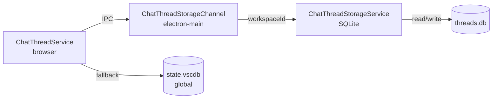

# Per-Workspace Chat Thread Storage - Implementation Complete

## Summary

Successfully refactored chat thread storage from global `StorageScope.APPLICATION` to per-workspace SQLite micro databases, following the existing RAG storage pattern. Threads are now isolated per project/case and won't mix across workspaces.

## Architecture

### Storage Location

```
%APPDATA%/.safe-appeals-navigator/databases/workspaces/[workspaceHash]/
├── workspace.db      (existing - RAG documents/chunks)
├── chroma/          (existing - RAG embeddings)
├── emails.db        (existing - email data)
└── threads.db       (NEW - chat threads for this workspace)
```

### Components Created

1. **electron-main/chat/chatThreadStorageService.ts** (267 lines)
   - Per-workspace SQLite storage service
   - Schema: `threads(id, data, last_modified)` + `schema_version`
   - CRUD operations for thread storage

2. **electron-main/chat/chatThreadStorageChannel.ts** (115 lines)
   - IPC channel for browser-main communication
   - Manages multiple workspace instances
   - Methods: `readAllThreads`, `storeAllThreads`, `deleteThread`

3. **common/chat/chatThreadStorageService.ts** (48 lines)
   - Browser-side proxy service
   - Calls main process via IPC channel
   - Registered as singleton service

## Components Modified

1. **common/rag/ragPathService.ts**
   - Added `getChatThreadsSqlitePath(workspaceId)` method
   - Follows same validation pattern as other workspace paths

2. **browser/chatThreadService.ts** (major refactor)
   - Added workspace ID computation (hash-based, like RAG)
   - Replaced synchronous storage with async SQLite calls
   - Added `_initializeThreadsFromStorage()` - loads from per-workspace or fallback
   - Added `_getWorkspaceId()` - computes stable workspace identifier
   - Added `_migrateGlobalThreadsIfNeeded()` - one-time migration prompt
   - Added `_readAllThreadsFromGlobal()` - fallback for no workspace
   - Workspace change listener reloads threads automatically

3. **common/storageKeys.ts**
   - Added `THREAD_MIGRATION_FLAG` constant

4. **code/electron-main/app.ts**
   - Imported `ChatThreadStorageChannel`
   - Registered IPC channel as `'void-channel-chat-threads'`

## Key Features

### 1. Per-Workspace Isolation
- Each workspace gets unique SQLite database via hash of folder path
- Threads never mix between projects
- Matches RAG micro database pattern

### 2. Workspace Switching
- Listens to `onDidChangeWorkspaceFolders` event
- Automatically reloads threads when workspace changes
- Invalidates cached workspace ID on change

### 3. Migration Support
- One-time prompt when opening workspace with global threads
- User chooses: "Migrate Threads" or "Start Fresh"
- Migration flag prevents repeated prompts
- Graceful fallback to global storage when no workspace open

### 4. Fallback Behavior
- No workspace open → uses global `StorageScope.APPLICATION`
- Ensures threads work even without workspace folder
- Seamless transition between modes

## Data Flow



## Testing Checklist

To validate the implementation:

1. **New User Flow**
   - Open a project → threads stored in workspace database
   - Create threads → verify in `threads.db`
   - Close/reopen → threads persist

2. **Existing User Migration**
   - User with global threads opens workspace
   - Migration prompt appears
   - Choose "Migrate" → threads copied to workspace
   - Migration flag prevents repeat prompts

3. **Workspace Switching**
   - Open Project A → create threads
   - Switch to Project B → different threads
   - Switch back to A → original threads restored

4. **No Workspace Mode**
   - Close all folders
   - Create threads → stored globally
   - Open workspace → prompt to migrate

5. **Multiple Workspaces**
   - Open Project A → threads stored in `[hashA]/threads.db`
   - Open Project B → threads stored in `[hashB]/threads.db`
   - Verify complete isolation

## Technical Notes

### Workspace ID Computation
```typescript
// Same algorithm as RAGService for consistency
const folderPath = folders[0].uri.fsPath
let hash = 0
for (let i = 0; i < folderPath.length; i++) {
    hash = ((hash << 5) - hash) + folderPath.charCodeAt(i)
    hash = hash & hash // 32-bit integer
}
const workspaceId = Math.abs(hash).toString(16).padStart(8, '0').substring(0, 16)
```

### URI Marshalling
- Preserved existing `_convertThreadDataFromStorage()` logic
- Handles URI revival from JSON (`$mid === 1`)
- Ensures file paths restored correctly

### Async Storage
- Changed from synchronous `IStorageService.get()` to async SQLite
- All `_storeAllThreads()` calls now `await`
- Compatible with existing code flow

## Future Enhancements

1. **Bulk Operations** - Optimize multiple thread writes
2. **Thread Export/Import** - Move threads between workspaces
3. **Schema Migrations** - Version-based database upgrades
4. **Thread Search** - FTS5 index for searching across threads
5. **Workspace Cleanup** - Delete old workspace databases

## Files Changed

**New Files:**
- `src/vs/workbench/contrib/void/electron-main/chat/chatThreadStorageService.ts`
- `src/vs/workbench/contrib/void/electron-main/chat/chatThreadStorageChannel.ts`
- `src/vs/workbench/contrib/void/common/chat/chatThreadStorageService.ts`

**Modified Files:**
- `src/vs/workbench/contrib/void/common/rag/ragPathService.ts`
- `src/vs/workbench/contrib/void/browser/chatThreadService.ts`
- `src/vs/workbench/contrib/void/common/storageKeys.ts`
- `src/vs/code/electron-main/app.ts`

## Build Instructions

After pulling these changes:

```bash
# 1. Compile TypeScript
bun run compile

# 2. Restart the application
# Ctrl+Shift+P → "Developer: Reload Window"
# Or: ./scripts/code.sh (macOS/Linux) / .\scripts\code.bat (Windows)
```

---

**Implementation Status:** ✅ Complete
**Linter Errors:** 0
**All TODOs:** Completed
