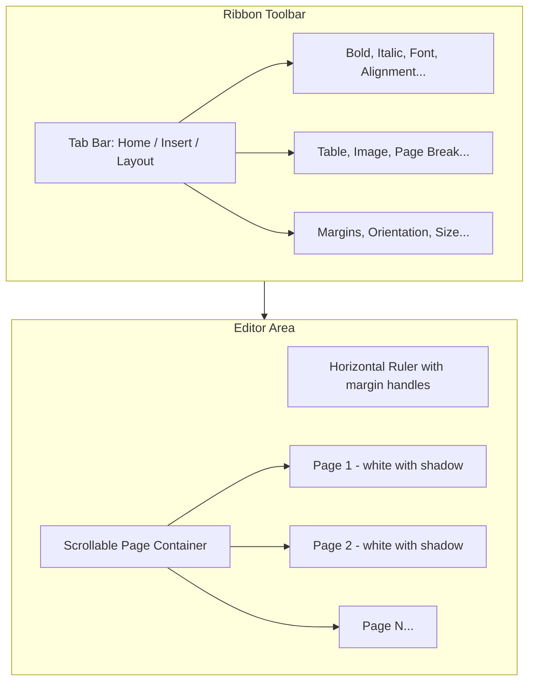

# DOCX Viewer: MS Word-Style Upgrade

## Current State

The viewer uses Tiptap with basic pagination that shows dashed "Page Break" lines but lacks:
- Visual page separation (shadows, gaps between pages)
- MS Word ribbon toolbar
- Horizontal ruler
- Page numbers
- Professional styling

## Target State

A document editor matching MS Word's Print Layout view with:
- Continuous scroll with visual page breaks (Google Docs style)
- Tabbed ribbon toolbar (Home, Insert, Layout tabs)
- Horizontal ruler with margin handles
- Page numbers in footer
- Professional white-on-gray page styling

---

## Architecture



---

## Key Files to Modify

| File | Changes |
|------|---------|
| [`docxViewer.css`](src/vs/workbench/contrib/void/browser/documentViewers/docxViewer/media/docxViewer.css) | Ribbon styles, page separation, ruler |
| [`docxViewerTiptap.js`](src/vs/workbench/contrib/void/browser/documentViewers/docxViewer/media/docxViewerTiptap.js) | Ribbon logic, ruler interaction, page flow |
| [`docxViewerEditor.ts`](src/vs/workbench/contrib/void/browser/documentViewers/docxViewer/docxViewerEditor.ts) | HTML structure for ribbon and ruler |
| [`tiptapBundleEntry.js`](src/vs/workbench/contrib/void/browser/documentViewers/docxViewer/media/tiptapBundleEntry.js) | Add tiptap-pagination-plus |
| `package.json` | Add tiptap-pagination-plus dependency |

---

## Phase 1: Visual Page Separation

Transform the single continuous editor into visually distinct pages with shadows and gaps.

**CSS Changes:**
- Gray background for container (`#e8e8e8`)
- White pages with box-shadow
- 20px gap between pages
- Fixed page dimensions per size (Letter: 8.5" x 11")
- Overflow handling to flow content naturally

**JavaScript Changes:**
- Detect content overflow and visually indicate page boundaries
- Page counter for footer display

---

## Phase 2: Ribbon Toolbar

Replace the simple toolbar with an MS Word-style ribbon interface.

**Structure:**
```
+----------------------------------------------------------+
| [Home] [Insert] [Layout]                                  |
+----------------------------------------------------------+
| Clipboard | Font          | Paragraph    | Styles        |
| Paste     | B I U S | Aa  | Align | List | Normal | H1   |
+----------------------------------------------------------+
```

**Ribbon Sections (Home Tab):**
- **Clipboard**: Cut, Copy, Paste, Format Painter
- **Font**: Bold, Italic, Underline, Strikethrough, Font family, Size, Color
- **Paragraph**: Align (L/C/R/J), Line spacing, Bullets, Numbers, Indent
- **Styles**: Normal, Heading 1-4, Title

**Insert Tab:**
- Table, Image, Link, Page Break, Horizontal Line

**Layout Tab:**
- Margins (Normal/Narrow/Wide), Orientation, Size (Letter/Legal/A4)

---

## Phase 3: Horizontal Ruler

Add a ruler above the document for margin visualization.

**Features:**
- Inch/cm markings
- Draggable margin handles (left/right indent)
- First-line indent marker
- Updates based on page size selection

---

## Phase 4: Page Numbers

Add automatic page numbering.

**Options:**
- Position: Footer center
- Format: "Page X of Y"
- Updates dynamically as pages are added/removed

---

## Phase 5: Enhanced Pagination

Upgrade to `tiptap-pagination-plus` for better page break handling.

```bash
bun add tiptap-pagination-plus
```

**Benefits:**
- Automatic content overflow detection
- Table splitting across pages
- Configurable page gaps
- Better print output

---

## Validation

After implementation, verify:
1. Pages display with white background and shadow on gray canvas
2. Content flows naturally between pages
3. Ribbon tabs switch correctly
4. Ruler shows correct margins
5. Page numbers update accurately
6. Print output matches screen layout