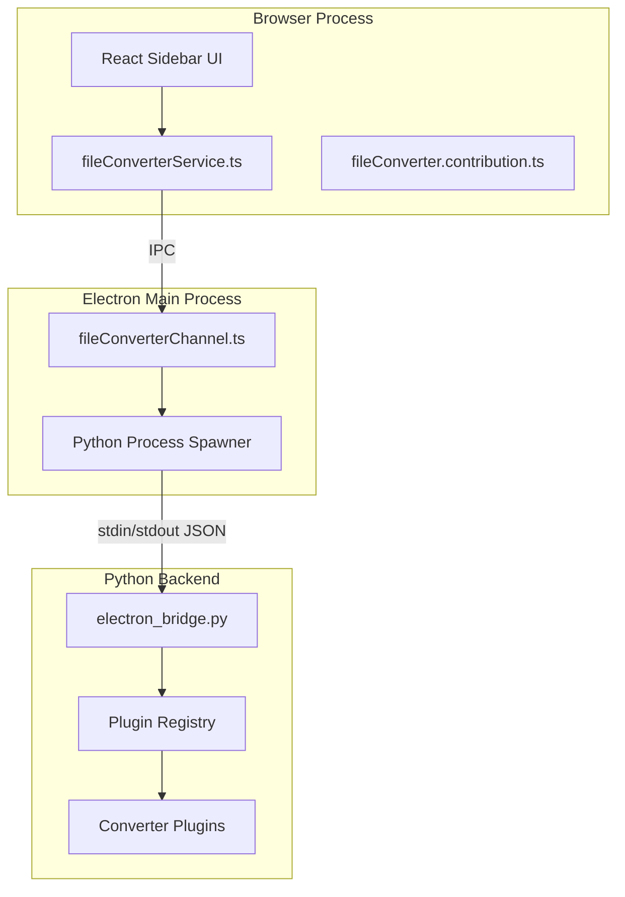

# File Conversion Feature Integration Plan

## Architecture Overview

Integrate the Transmutations Python converter system into SafeAppeals following the established modular pattern (like `documentViewers/` and `fileOrganizer/`).



## Supported Conversions (40+ types)

| Source | Targets |

|--------|---------|

| CSV | pdf, xlsx |

| DOCX | epub, markdown, pdf |

| EPUB | docx, html, markdown, pdf |

| HTML | epub, pdf |

| Image | image, pdf, text (OCR) |

| Markdown | docx, epub, html, pdf |

| PDF | compress, editable, encrypt, html, images, markdown, ocr_layer, pages, split, watermark, xlsx |

| PPTX | html, images, markdown, pdf |

| TXT | pdf |

| XLSX | csv, html, markdown, pdf |

## Directory Structure

```
src/vs/workbench/contrib/void/
├── browser/
│   └── fileConverter/                    # NEW modular feature folder
│       ├── fileConverter.contribution.ts # View + command registration
│       ├── fileConverterService.ts       # Browser-side service (IPC client)
│       ├── fileConverterDashboardPane.ts # ViewPane with React mounting
│       └── types.ts                      # TypeScript interfaces
├── common/
│   └── fileConverterTypes.ts             # Shared types for IPC
├── electron-main/
│   └── fileConverterChannel.ts           # IPC channel + Python spawner
└── react/src/
    └── file-converter-tsx/               # React dashboard components
        ├── index.tsx
        ├── FileConverterDashboard.tsx
        ├── ConversionSelector.tsx
        └── ConversionProgress.tsx

python/                                   # NEW: Python backend (at repo root)
└── transmutation_codex/                  # Copied from AiChemist
    ├── adapters/bridges/                 # Modified for SafeAppeals
    ├── core/                             # Core utilities (stripped licensing)
    ├── plugins/                          # All converter plugins
    └── services/                         # Batcher, merger
```

## Implementation Steps

### Phase 1: Copy Python Backend

1. Create `python/` directory at SafeAppeals repo root
2. Copy `transmutation_codex/` package with these modifications:

   - **Keep**: `plugins/`, `services/`, `adapters/bridges/`
   - **Keep (modified)**: `core/` - remove licensing imports, use simplified stubs
   - **Remove**: `core/licensing/`, `core/telemetry/`

3. Simplify `core/__init__.py` to remove license-related exports
4. Update import paths in bridge modules

### Phase 2: Create IPC Channel (electron-main)

Create [electron-main/fileConverterChannel.ts](src/vs/workbench/contrib/void/electron-main/fileConverterChannel.ts):

- Spawn Python process with `electron_bridge.py` as entry point
- Parse JSON messages with prefixes: `PROGRESS:`, `RESULT:`, `ERROR:`
- Implement request/response pattern for conversions
- Handle batch conversions and PDF merge operations

Key interface:

```typescript
interface IFileConverterMainService {
    convert(input: string, output: string, type: string, options?: object): Promise<ConversionResult>;
    batchConvert(files: string[], outputDir: string, type: string): Promise<BatchResult>;
    mergePDFs(files: string[], output: string): Promise<MergeResult>;
    getAvailableConversions(): Promise<ConversionMap>;
}
```

### Phase 3: Create Browser Service

Create [browser/fileConverter/fileConverterService.ts](src/vs/workbench/contrib/void/browser/fileConverter/fileConverterService.ts):

- IPC client that calls the main process channel
- Progress event emitter for UI updates
- File selection integration
- Conversion history tracking

### Phase 4: Create Contribution File

Create [browser/fileConverter/fileConverter.contribution.ts](src/vs/workbench/contrib/void/browser/fileConverter/fileConverter.contribution.ts):

- Register sidebar view container (like File Organizer)
- Register commands: "Convert File", "Batch Convert", "Merge PDFs"
- Register keybinding: `Ctrl+Shift+C`
- Register context menu items for supported file types

### Phase 5: Create React Dashboard

Create React components in `react/src/file-converter-tsx/`:

- **FileConverterDashboard.tsx**: Main wizard-style UI
- **ConversionSelector.tsx**: Source/target format dropdowns
- **ConversionProgress.tsx**: Real-time progress display
- **ConversionHistory.tsx**: Recent conversions list

### Phase 6: Wire Everything Together

1. Import contribution in [void.contribution.ts](src/vs/workbench/contrib/void/browser/void.contribution.ts)
2. Update React build config to include new components
3. Add Python path configuration to settings

## Key Files to Create/Modify

| File | Action | Purpose |

|------|--------|---------|

| `python/transmutation_codex/` | CREATE | Python converter backend |

| `electron-main/fileConverterChannel.ts` | CREATE | IPC + Python spawner |

| `browser/fileConverter/fileConverter.contribution.ts` | CREATE | View/command registration |

| `browser/fileConverter/fileConverterService.ts` | CREATE | Browser service |

| `browser/fileConverter/fileConverterDashboardPane.ts` | CREATE | ViewPane |

| `common/fileConverterTypes.ts` | CREATE | Shared types |

| `react/src/file-converter-tsx/` | CREATE | React components |

| `browser/void.contribution.ts` | MODIFY | Import new contribution |

| `react/build.js` | MODIFY | Add new component build |

## IPC Communication Protocol

Messages from Python to Electron (stdout):

```json
// Progress
PROGRESS:{"percent": 50, "message": "Converting page 5 of 10", "current_file": "doc.pdf"}

// Success
RESULT:{"success": true, "output_path": "/path/to/output.md", "duration": 2.5}

// Error
ERROR:{"message": "Failed to read PDF", "error_type": "conversion", "code": "PDF_READ_FAILED"}
```

## Testing Strategy

1. Unit test Python converters (existing tests in Transmutations)
2. Integration test IPC channel with mock Python responses
3. E2E test via browser automation

## Dependencies

- Python 3.13+ with UV package manager
- Python packages from Transmutations `pyproject.toml`:
  - `markdown-pdf`, `PyPDF2`, `python-docx`, `mammoth`, etc.
- Bundle or reference Python from SafeAppeals installation