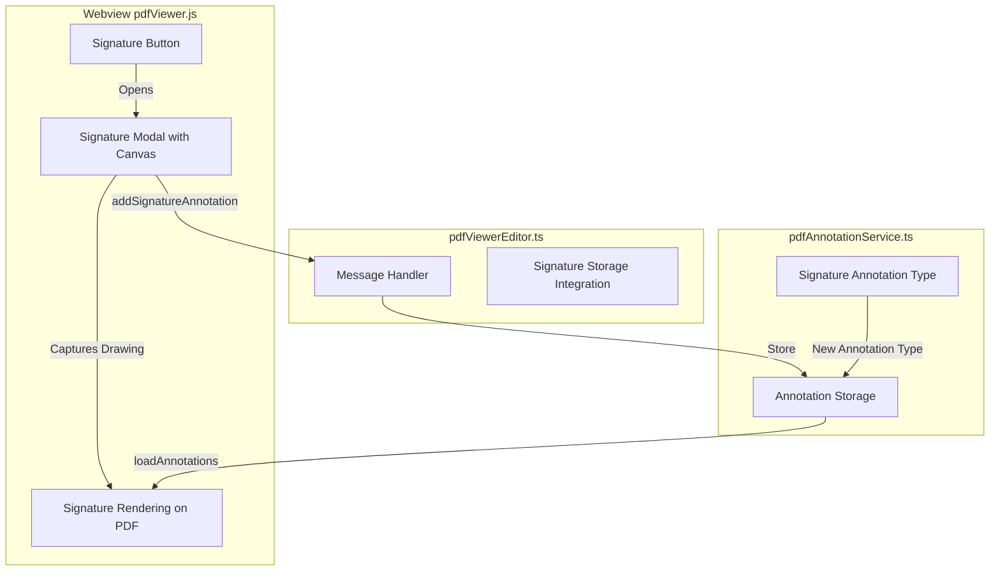

# PDF Signature Feature Implementation

## Summary

Add signature functionality to the existing PDF viewer including: a toolbar button to add signatures, a signature drawing modal with save/load capabilities, and rendering signatures as positioned image annotations on the PDF.

## Architecture Overview




## Key Files to Modify

1. **[pdfAnnotationService.ts](src/vs/workbench/contrib/void/browser/documentViewers/pdfViewer/pdfAnnotationService.ts)**

- Extend `PDFAnnotation` interface with `imageData` field for signature images
- Add signature-specific color type ('signature')

2. **[pdfViewerEditor.ts](src/vs/workbench/contrib/void/browser/documentViewers/pdfViewer/pdfViewerEditor.ts)**

- Add signature button to toolbar HTML in `getWebviewHTML()`
- Handle new message types: `addSignatureAnnotation`, `getSavedSignatures`

3. **[pdfViewer.js](src/vs/workbench/contrib/void/browser/documentViewers/pdfViewer/media/pdfViewer.js)**

- Implement signature modal with drawing canvas
- Add signature pad drawing logic (pen stroke capture)
- Implement signature placement mode (click-to-place)
- Render signature annotations as images on the PDF

4. **[pdfViewer.css](src/vs/workbench/contrib/void/browser/documentViewers/pdfViewer/media/pdfViewer.css)**

- Signature modal styling
- Signature placement cursor/preview styling

## Implementation Details

### 1. Signature Annotation Schema

```typescript
// Extended PDFAnnotation in pdfAnnotationService.ts
interface PDFAnnotation {
  // ...existing fields
  imageData?: string;  // Base64 PNG for signatures
}
```


### 2. Signature Drawing Modal Features

- HTML5 Canvas for freehand signature drawing
- Clear button to restart
- Save signature for reuse (stored in localStorage)
- Load previously saved signatures
- Done button to place signature

### 3. Signature Placement Flow

1. User clicks "Add Signature" button in toolbar
2. Modal opens with drawing canvas
3. User draws signature or selects saved one
4. User clicks "Done" - modal closes
5. Cursor changes to placement mode
6. User clicks on PDF to position signature
7. Signature is added as annotation at clicked coordinates

### 4. Rendering Signatures

- Signatures render as images in the highlight layer
- Scale with zoom level
- Support selection and deletion like other annotations

## Testing Approach