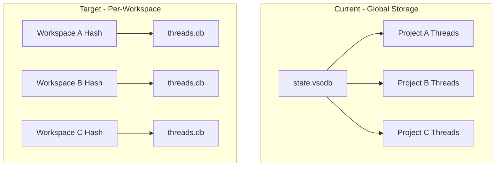

# Refactor Chat Threads to Per-Workspace Storage

## Current Architecture

Chat threads are stored globally using VSCode's `IStorageService`:

```typescript
// chatThreadService.ts line 414
const threadsStr = this._storageService.get(THREAD_STORAGE_KEY, StorageScope.APPLICATION);
```

This stores ALL threads in `%APPDATA%\SafeAppealNavigator\User\globalStorage\state.vscdb`, causing threads from different projects to mix.

## Target Architecture

Follow the RAG micro database pattern where each workspace has isolated storage:

```
%APPDATA%/.safe-appeals-navigator/databases/workspaces/[workspaceHash]/
├── workspace.db      (existing - RAG documents/chunks)
├── chroma/          (existing - RAG embeddings)
├── emails.db        (existing - email data)
└── threads.db       (NEW - chat threads for this workspace)
```


## Implementation Plan

### 1. Extend RAGPathService

Add new method to [`ragPathService.ts`](src/vs/workbench/contrib/void/common/rag/ragPathService.ts):

```typescript
getChatThreadsSqlitePath(workspaceId: string): string {
    return join(this.getBaseDir(), 'databases', 'workspaces', workspaceId, 'threads.db');
}
```

### 2. Create ChatThreadStorageService

New file: `src/vs/workbench/contrib/void/electron-main/chatThreadStorageService.ts`

SQLite-based storage service following the `RAGIndexService` pattern:

- Initialize per-workspace SQLite database
- Store/retrieve threads as JSON in a simple `threads` table
- Handle schema versioning for future migrations

Schema:

```sql
CREATE TABLE threads (
    id TEXT PRIMARY KEY,
    data TEXT NOT NULL,  -- JSON serialized thread
    last_modified TEXT NOT NULL
);
```

### 3. Create IPC Channel

New channel in `electron-main/` to communicate between browser and main process (browser cannot access SQLite directly).

Methods:

- `readAllThreads(workspaceId): Promise<ChatThreads>`
- `storeAllThreads(workspaceId, threads): Promise<void>`
- `deleteThread(workspaceId, threadId): Promise<void>`

### 4. Modify ChatThreadService

Update [`chatThreadService.ts`](src/vs/workbench/contrib/void/browser/chatThreadService.ts):

- Inject `IWorkspaceContextService` (already present at line 333)
- Add workspace ID computation (reuse pattern from RAGService)
- Replace `IStorageService` reads/writes with IPC calls to main process
- Listen for `onDidChangeWorkspaceFolders` to reload threads on workspace switch
- Handle "no workspace open" case gracefully (show message or use temp storage)

### 5. Migration Strategy

On first load with new system:

1. Check if global storage has threads
2. If workspace is open, offer to migrate threads to workspace storage
3. Optionally keep global storage as fallback for threads created without a workspace

## Key Files to Modify

| File | Changes |

|------|---------|

| [`ragPathService.ts`](src/vs/workbench/contrib/void/common/rag/ragPathService.ts) | Add `getChatThreadsSqlitePath()` |

| [`chatThreadService.ts`](src/vs/workbench/contrib/void/browser/chatThreadService.ts) | Replace storage mechanism |

| [`storageKeys.ts`](src/vs/workbench/contrib/void/common/storageKeys.ts) | Add migration flag key |

## New Files to Create

| File | Purpose |

|------|---------|

| `electron-main/chat/chatThreadStorageService.ts` | SQLite storage operations |

| `electron-main/chat/chatThreadStorageChannel.ts` | IPC channel |

| `common/chat/chatThreadStorageService.ts` | Interface + browser proxy |
