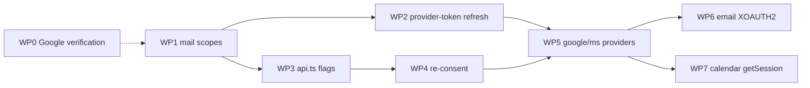

# Email Dashboard Login via SafeAppeals Google/Microsoft OAuth

## Verdict

**Yes** — email consumes Cloud identity via provider-token providers (rung 6.5). Not reverse: Email Dashboard is never the product login surface.

Architect plan: [Architect email OAuth plan](23c8a2c3-a724-417a-b84c-c03a2f504f51). Owns alignment with [`unified_safeappeals_sign-in_225af75a.plan.md`](unified_safeappeals_sign-in_225af75a.plan.md) + master `r65-auth-remainder` — do not fork a third narrative.

## Critical nuance

| Layer | Provider |
| --- | --- |
| Product identity | `safeappeals-cloud` (shipped) |
| Mailbox / calendar tokens | `safeappeals-google` / `safeappeals-microsoft` (not built) |

Incremental consent only — never request `https://mail.google.com/` at Cloud sign-in / onboarding.



## Credential model (email)

```typescript
type EmailAccountCredentials =
	| { type: 'password'; password: string }
	| { type: 'oauth'; provider: 'google' | 'microsoft' };
// Legacy { password } → treat as password
```

OAuth accounts store **no** access/refresh tokens in email SecretStorage — only `type` + `provider`. Resolve via `getSession('safeappeals-google'|'safeappeals-microsoft')` at sync/send. Tokens live in auth extension envelope + server refresh store.

## UX (committed)

**Primary:** Email sidebar Account… → Add account → **Sign in with Safe Appeals (Google)** (later Microsoft). If no Cloud session, `createSession('safeappeals-cloud')` first, then incremental mail scopes. Secondary: **Advanced: app password / IMAP**. Dashboard may deep-link the same `safeappeals-email.addAccount` only.

Copy: never “Cloud unlocks email.”

## Work packages (ordered)

### WP0 — Google verification (Steve, parallel day 0)
Start restricted-scope / CASA checklist for `mail.google.com`. Ship against test users until approved.

### WP1 — void-cloud: `include_mail_scopes`
Mirror `include_calendar_scopes` in `googleOAuthUrl.ts` / `auth.ts`. Opt-in only. Separate repo commits.

### WP2 — void-cloud: `POST /auth/provider-token`
Persist provider refresh encrypted server-side; refresh Google (later MS). **Mandate callback token-leak audit before enabling mail scopes on production Supabase app.**

### WP3 — `api.ts`
`includeMailScopes` / `includeCalendarScopes` on authorize URL; `refreshProviderToken()` client.

### WP4 — `cloudAuthProvider.ts` re-consent
**Load-bearing:** `createSession` today early-returns if already signed in and ignores scopes. Add `requestGoogleProviderScopes({ mail?, calendar? })` that runs a new PKCE flow with flags, merges provider tokens into envelope atomically, fires session change. Do not put mail on onboarding CTA.

### WP5 — Provider-token providers
New `googleAuthProvider.ts` / `microsoftAuthProvider.ts`; register; `product.json` trust for email+calendar. Session `accessToken` = **provider** token, not cloud JWT.

### WP6 — Email XOAUTH2
E1 types/accountStore → E2 imap/smtp → E3 syncEngine getSession → E4 `promptAddAccount` quick-pick. No OAuth in webview.

### WP7 — Calendar getSession
Convert Google/Outlook clients; delete `oauthLoopback` / `tokenStore` / client-secret settings. One reconnect migration OK.

### WP8 — Microsoft server symmetry
After Google desktop DoD.

## Coder task graph (no shared files when parallel)

Serialize: **S1→S2**, **A1→A2→A3**, then **(E1→E2∥E3∥E4) ∥ (C1→C3)**. MS after Google green if needed.

| ID | Depends | Files |
| --- | --- | --- |
| S1 | — | void-cloud googleOAuthUrl + auth query + tests |
| S2 | S1 | providerToken.ts, auth route, migration, tests |
| A1 | S1 contract | auth `api.ts` |
| A2 | A1 | `cloudAuthProvider.ts` |
| A3 | A2+S2 | google/ms providers, extension.ts, package.json, product.json |
| E1–E4 | A3 (E1 can freeze interface) | email types/store, imap/smtp, syncEngine, extension.ts |
| C1–C3 | A3 | calendar clients + delete loopback stack |

## Stop-and-ask (Steve) before code

1. **Google verification** — start WP0 now; no “production Gmail OAuth ready” claims until approved.
2. **Server-side encrypted provider refresh** (architect + sentinel default) — confirmed as the plan; not client-only.
3. **Approve Agent mode** to start coding (plan mode cannot implement).

Out of scope: Q1 email/password **product** identity for non-Google lawyers (app-password covers mail).

## Sentinel hard blockers before prod `mail.google.com` ([Sentinel auth plan audit](2e7df410-09d6-4df3-a311-11c96cc6a0a8))

Architecture: **ship-to-build**. Production mail scopes: **no-ship** until:

1. **CRITICAL:** `POST /auth/refresh` today returns `googleProviderRefreshToken` (and provider access) to anyone with a cloud refresh token, no Bearer. Strip provider tokens from `/auth/refresh` and `/auth/callback` once `/auth/provider-token` exists — provider refresh must never leave the server. (Real leak is refresh, not PKCE callback — PKCE path is closed.)
2. `/auth/provider-token`: `user_id` from verified JWT only; short-lived access only; store envelope-encrypted with key outside DB; RLS service-role-only.
3. Re-consent: `returnedUser.id === currentSession.user.id` before merge; serialize envelope writes (same chain as pending PKCE).
4. Scope partitioning: calendar must not silently receive a mail-scoped token via one shared `safeappeals-google` getSession — provider-id-per-capability or downscope per requested scopes.

Follow-ups before GA (not before first internal build): JWT cache bypass on mint endpoint; rate-limit refresh/provider-token; disable `/auth/dev-callback` in prod; assert consumers keep provider access tokens in memory only.

**Build order implication:** WP2 must close finding 1 before enabling mail scopes on the **production** Supabase Google app. Desktop coding against test users can proceed once Agent mode is approved.

## Binding amendments ([Stress-test OAuth plan](7ced206c-8954-489d-b7fe-a7b3affef3b2))

Architecture holds. Break was the missing **reconnect contract** — oauth rows look healthy while minting fails and sync only logs.

1. **Do not persist `{type:'oauth'}`** until a mail-scoped access token is minted **and** server refresh persistence is ACK’d.
2. **WP1 ship gate ([Research GoTrue scopes merge](4aeaee6e-ab8b-4c14-a63b-413ab69af679)):** GoTrue **unions/appends** `scopes=` onto Google defaults (`email`+`profile`) — it does **not** replace. Still always send the **full** list for belt-and-suspenders: `scopes=email,profile,openid,https://mail.google.com/` (prefer commas; GoTrue splits on `,`). Same pattern for calendar. Do not rely on mail-only `scopes=` even though union makes it sufficient today.
3. On any later `getSession` / `/auth/provider-token` failure: visible **Reconnect mailbox** (sidebar + toast), not silent `meta.error` with a stale inbox.
4. Cloud sign-out must cascade to disable/clear oauth email accounts (or force reconnect state).
5. **Split DoD:** email XOAUTH2 may ship before calendar loopback deletion; calendar cleanup is same-rung follow-on, not email GA blocker.
6. Still **no** refresh copy in email SecretStorage — reliability is state machine + toast, not a third token store.

## Definition of done (desktop Electron) — email GA

1. Cloud sign-in without Gmail consent.
2. Sidebar → Sign in with Safe Appeals → Gmail consent → oauth row only after mail token + server refresh ACK.
3. IMAP/SMTP via XOAUTH2 + `getSession('safeappeals-google')`.
4. Token expiry → refresh via `/auth/provider-token` without re-consent.
5. Auth mint failure → visible Reconnect mailbox (not silent log-only).
6. Cloud sign-out → oauth mail accounts enter reconnect / disabled state.
7. App-password path still works without Cloud.
8. No third OAuth stack in email; plans/`r65-auth-remainder` updated; void-cloud commits separate.

### Same-rung follow-on (not email GA blocker)

9. Calendar on `getSession`; loopback/tokenStore/client-secret settings gone.
