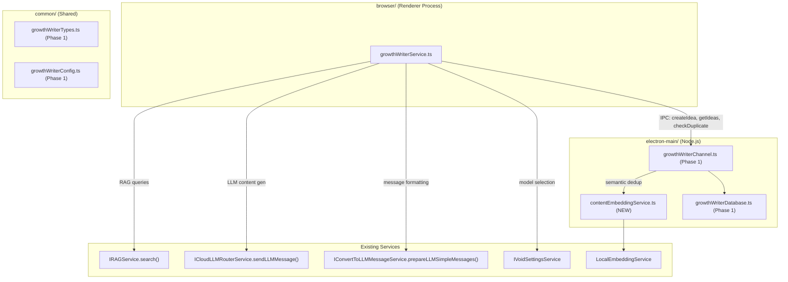

# Growth Writer Phase 2: Blog Ideas Engine

## Goal

AI generates a backlog of 20+ blog ideas per silo using RAG over the marketing
workspace's core references. Semantic dedup (cosine similarity threshold 0.85)
prevents duplicate topics. Ideas are stored in the `growth_blog_ideas` SQLite
table via the Phase 1 IPC channel.

## Architecture



## Files to Create (2 new files)

### 1. `src/vs/workbench/contrib/void/electron-main/growthWriter/contentEmbeddingService.ts`

Semantic dedup service running in electron-main. Uses `LocalEmbeddingService`
directly (not DI - it's a plain class).

- Constructor takes `appDataPath` and `logService`
- Lazy-initializes `LocalEmbeddingService` with model cache at
  `{appDataPath}/growthWriter/model-cache`
- `checkSemanticDuplicate(newTitle: string, existingTitles: string[])` returns
  `{ isDuplicate: boolean; mostSimilar: { title: string; similarity: number } | null }`
- Uses dot product on normalized vectors (equivalent to cosine similarity) -
  copy the `dotSimilarity` helper from
  [ragVectorAdapter.ts](src/vs/workbench/contrib/void/common/rag/ragVectorAdapter.ts)
  lines 333-340
- Threshold: `SEMANTIC_SIMILARITY_THRESHOLD` (0.85) from
  [growthWriterConfig.ts](src/vs/workbench/contrib/void/common/growthWriter/growthWriterConfig.ts)
  line 135

### 2. `src/vs/workbench/contrib/void/browser/growthWriter/growthWriterService.ts`

Main orchestration service. Registered as a DI singleton following the DocuSign
pattern.

**Injected dependencies:**

- `@IMainProcessService` - for IPC channel to electron-main
- `@ICloudLLMRouterService` - for programmatic LLM calls
- `@IConvertToLLMMessageService` - for message formatting
- `@IVoidSettingsService` - for model selection
- `@IRAGService` - for querying workspace core references
- `@ILogService` - for logging

**Interface `IGrowthWriterService`** (defined in same file, exported with
`createDecorator`):

- `generateIdeasForSilo(silo: Silo, count?: number): Promise<IBlogIdea[]>` -
  main entry point
- `getIdeas(filters?): Promise<IBlogIdea[]>` - fetch from DB
- `updateIdeaStatus(id, status): Promise<void>` - approve/reject
- `initializeForWorkspace(workspaceId: string): Promise<void>` - set workspace
  context

**Key implementation patterns (from plan lines 2166-2228):**

Programmatic LLM call (same as SCM service / email classifier):

```typescript
private async generateContent(systemPrompt: string, userPrompt: string): Promise<string> {
    const modelSelection = this.settingsService.state.modelSelectionOfFeature['Chat']
    if (!modelSelection) throw new Error('No model selected')
    const modelSelectionOptions = this.settingsService.state.optionsOfModelSelection[JSON.stringify(modelSelection)]
    const overridesOfModel = this.settingsService.state.overridesOfModel
    const { messages, separateSystemMessage } = this.convertService.prepareLLMSimpleMessages({
        simpleMessages: [{ role: 'user', content: userPrompt }],
        systemMessage: systemPrompt,
        modelSelection,
        featureName: 'Chat',
    })
    return new Promise((resolve, reject) => {
        this.llmRouter.sendLLMMessage({
            messagesType: 'chatMessages',
            messages,
            separateSystemMessage,
            chatMode: null,  // bypasses WC system prompt
            modelSelection,
            modelSelectionOptions,
            overridesOfModel,
            logging: { loggingName: 'growth-writer-ideas' },
            onText: () => {},
            onFinalMessage: ({ fullText }) => resolve(fullText),
            onError: ({ message }) => reject(new Error(message)),
            onAbort: () => reject(new Error('Aborted')),
        })
    })
}
```

RAG multi-query (from plan lines 2232-2282):

```typescript
private async gatherRAGContext(silo: Silo, topic: string): Promise<string> {
    const queries = queryTemplatesOfSilo[silo](topic)
    const results = await Promise.all(
        Object.values(queries).map(q => this.ragService.search({
            query: q,
            scope: 'core_references',
            limit: 5,
            workspaceId: this.workspaceId,
        }))
    )
    // Deduplicate chunks by docId+chunkId, combine answerContext
    // Return combined context string
}
```

Idea generation flow:

1. Build a user prompt asking the LLM to generate N blog ideas for the silo
2. Include RAG context about SafeAppeals features for that audience
3. Parse the structured response (JSON array of ideas)
4. For each idea, call IPC `checkSemanticDuplicate` against existing ideas
5. Store non-duplicate ideas via IPC `createIdea`
6. Return the list of newly created ideas

## Files to Modify (2 existing files)

### 3. `src/vs/workbench/contrib/void/electron-main/growthWriter/growthWriterChannel.ts`

Add two new IPC commands to the `call()` switch:

- `checkSemanticDuplicate` - delegates to
  `ContentEmbeddingService.checkSemanticDuplicate()`
- `getIdeaTitles` - fetches all idea titles for a silo (needed by the dedup
  check)

Add `ContentEmbeddingService` as a private member, instantiated lazily on first
dedup call.

### 4. `src/vs/workbench/contrib/void/browser/void.contribution.ts`

Add import for the new service file to trigger singleton registration:

```typescript
import "./growthWriter/growthWriterService.js";
```

Place after the existing DocuSign imports (~line 169).

## Types to Add

### 5. `src/vs/workbench/contrib/void/common/growthWriter/growthWriterTypes.ts`

Add to `IGrowthWriterChannelCommand`:

- `checkSemanticDuplicate: { workspaceId: string; newTitle: string; silo: Silo }` -
  returns
  `{ isDuplicate: boolean; mostSimilar: { title: string; similarity: number } | null }`
- `getIdeaTitles: { workspaceId: string; silo: Silo }` - returns `string[]`

### 6. `src/vs/workbench/contrib/void/common/growthWriter/growthWriterConfig.ts`

Add `queryTemplatesOfSilo` (the multi-query RAG templates from plan lines
2246-2271) and an `IDEA_GENERATION_SYSTEM_PROMPT` +
`IDEA_GENERATION_USER_PROMPT_TEMPLATE` for the blog idea generation LLM call.

### 7. `src/vs/workbench/contrib/void/electron-main/growthWriter/growthWriterDatabase.ts`

Add `getIdeaTitles(silo: Silo): Promise<string[]>` method that returns just the
titles for semantic comparison.

## Key Patterns

- **Service registration**:
  `registerSingleton(IGrowthWriterService, GrowthWriterService, InstantiationType.Delayed)`
  at bottom of file (same as DocuSign)
- **IPC channel access**:
  `this.channel = mainProcessService.getChannel('void-channel-growth-writer')`
  (same as DocuSign, email, chat thread storage)
- **LLM calls**: `chatMode: null` with custom system prompt via
  `prepareLLMSimpleMessages` (same as SCM service, email classifier)
- **RAG queries**:
  `ragService.search({ query, scope: 'core_references', limit: 5, workspaceId })`
  returning `ContextPack` with `answerContext` string
- **No semicolons**: Follow existing convention in each file

## Verification

After implementation:

1. Run `bun run compile` to verify TypeScript compiles
2. Launch the app, open a workspace with core references indexed
3. Call `generateIdeasForSilo('lawyers', 5)` from DevTools console
4. Verify ideas appear in SQLite database
5. Call again and verify semantic dedup catches similar titles
