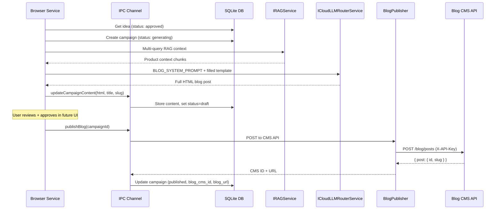

# Phase 3: Blog Generation Pipeline

## Goal

End-to-end blog creation: idea selection -> RAG context -> LLM writes full HTML
blog -> store as draft campaign -> manual approval -> publish to CMS with
UTM-tracked URLs.

## Architecture



## What Already Exists

- `BLOG_SYSTEM_PROMPT` and `BLOG_USER_PROMPT_TEMPLATE` in
  [growthWriterConfig.ts](src/vs/workbench/contrib/void/common/growthWriter/growthWriterConfig.ts)
  (lines 150-184) -- prompts ready, not yet wired up
- `BLOG_CMS_API_URL` = `https://api.safeappeals.com/blog/posts` (line 99)
- `buildUtmUrl(slug, source, medium, campaign, content?)` utility (lines 84-93)
- `generateContent(systemPrompt, userPrompt)` private method on
  `GrowthWriterService` -- reusable for blog generation
- `gatherRAGContext(silo, topic)` private method -- reusable
- `createCampaign` and `updateCampaignStatus` IPC commands + DB methods
- Campaign table has `blog_content`, `blog_slug`, `blog_cms_id`, `blog_url`
  columns
- Blog CMS API: `POST /blog/posts` with `X-API-Key` header, returns
  `{ post: { id, slug } }`

## What's Missing

1. **No `updateCampaignContent` DB method** -- `updateCampaignStatus` only sets
   status/timestamps, not content fields
2. **No `blogPublisher` service** -- nothing makes HTTP requests to the Blog CMS
   API from electron-main
3. **No browser-side blog generation method** -- `generateIdeasForSilo` exists
   but no `generateBlogForIdea`
4. **No publish flow** -- no method to push approved content to CMS
5. **Blog API key access** -- needs to be read from `process.env.BLOG_API_KEY`
   in electron-main

## Files to Create

### 1. `electron-main/growthWriter/blogPublisher.ts` (NEW)

HTTP client for the Blog CMS API. Runs in electron-main (Node.js) to avoid CSP
restrictions.

```typescript
export interface ICMSPublishRequest {
	title: string;
	content: string;
	slug: string;
	excerpt: string | null;
	status: "published";
	tags: string[];
	meta_description: string | null;
}

export interface ICMSPublishResult {
	id: string;
	slug: string;
	url: string;
}

export class BlogPublisher {
	async publish(request: ICMSPublishRequest): Promise<ICMSPublishResult>;
}
```

- Uses Node.js native `fetch` (available in Electron's Node.js)
- Reads `BLOG_API_KEY` from `process.env`
- Posts to `BLOG_CMS_API_URL`
- Returns `{ id, slug, url }` where `url` =
  `https://safeappeals.com/blog/{slug}`
- Handles errors: missing API key, 401/403 auth errors, 409 duplicate slug,
  network errors

## Files to Modify

### 2. `common/growthWriter/growthWriterTypes.ts`

Add to `IGrowthWriterChannelCommand`:

- `updateCampaignContent: { id: string; blog_title: string; blog_slug: string; blog_content: string; blog_url: string }`
- `publishBlog: { campaignId: string }`

Add new interface:

- `ICMSPublishResult { id: string; slug: string; url: string }`

### 3. `electron-main/growthWriter/growthWriterDatabase.ts`

Add new method:

- `updateCampaignContent(id, blog_title, blog_slug, blog_content, blog_url)` --
  updates content fields + sets `status = 'draft'` and `generated_at = now()`

### 4. `electron-main/growthWriter/growthWriterChannel.ts`

Add two new cases to the `call()` switch:

- `updateCampaignContent` -- calls `db.updateCampaignContent()`
- `publishBlog` -- instantiates `BlogPublisher`, calls `publish()`, then updates
  campaign status to `published` with `blog_cms_id` and `blog_url` via DB

### 5. `browser/growthWriter/growthWriterService.ts`

Expand `IGrowthWriterService` interface with:

- `generateBlogForIdea(ideaId: string): Promise<ICampaign>` -- main
  orchestration
- `getCampaigns(filters?): Promise<ICampaign[]>` -- pass-through to IPC
- `approveBlog(campaignId: string): Promise<void>` -- set status to `approved`
- `publishBlog(campaignId: string): Promise<ICMSPublishResult>` -- trigger CMS
  publish

Add imports for `ICampaign`, `CampaignStatus`, `BLOG_SYSTEM_PROMPT`,
`BLOG_USER_PROMPT_TEMPLATE`, `buildUtmUrl`, `SILO_CONFIGS`.

#### `generateBlogForIdea(ideaId)` flow:

1. Fetch the idea from DB via `getIdeas` + filter by ID
2. Validate idea status is `approved` or `pending`
3. Create campaign record:
   `{ status: 'generating', silo, blog_idea_id: ideaId }`
4. Gather RAG context via existing `gatherRAGContext(silo, idea.contentAngle)`
5. Fill `BLOG_USER_PROMPT_TEMPLATE` with idea title, keywords, content_angle,
   silo, audience, RAG context
6. Call `generateContent(BLOG_SYSTEM_PROMPT, filledPrompt)` -- reuses existing
   method
7. Extract meta description from HTML comment if present
8. Generate slug from title (simple `slugify` -- lowercase, replace spaces with
   hyphens, strip special chars)
9. Build UTM base URL via `buildUtmUrl(slug, 'blog', 'organic', silo)`
10. Update campaign via new `updateCampaignContent` IPC command (sets
    `blog_content`, `blog_title`, `blog_slug`, `blog_url`, status -> `draft`)
11. Mark idea as `used` via `updateIdeaStatus(ideaId, 'used')`
12. Return the updated campaign

#### `publishBlog(campaignId)` flow:

1. Get campaign from DB, validate status is `approved`
2. Call IPC `publishBlog` command (electron-main handles HTTP)
3. Return the CMS result (id, slug, url)

## Key Decisions

- **Blog CMS API key**: Read from `process.env.BLOG_API_KEY` in electron-main.
  The `blogPublisher.ts` lives in electron-main where `process.env` is
  available. No need to pass it through IPC.
- **Slug generation**: Done browser-side as a simple utility (lowercase,
  hyphenate, strip). CMS also auto-generates if omitted, but we want to control
  it for UTM URLs.
- **Status flow**:
  `generating -> draft -> approved -> publishing -> published | failed`. Phase 3
  implements `generating -> draft` (auto) and `approved -> published` (manual
  trigger). The `approved` step is set manually by the user in the future UI.
- **HTML output**: LLM outputs raw HTML per the prompt template. No
  markdown-to-HTML conversion needed.
- **Logging name**: Change from `growth-writer-ideas` to `growth-writer-blog`
  for the blog generation LLM call to distinguish in logs.
- **Error handling**: If LLM fails or returns empty content, set campaign status
  to `failed` with `error_message`.
