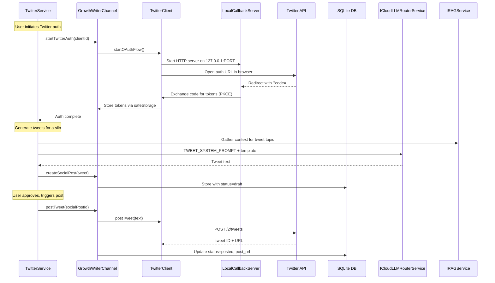

# Phase 5: Twitter/X Integration

## Goal

Authenticate with Twitter/X via OAuth 2.0 PKCE (desktop native app flow with
local callback server), generate silo-specific tweets using LLM + RAG, post
individual tweets and threads, collect engagement metrics, and drip-post 5
tweets/day spaced ~3 hours apart. Tokens stored securely via Electron
`safeStorage`.

## Architecture



## What Already Exists

- **Config constants** in
  [growthWriterConfig.ts](src/vs/workbench/contrib/void/common/growthWriter/growthWriterConfig.ts)
  lines 115-120: `TWITTER_API_BASE`, `TWITTER_TOKEN_URL`, `TWITTER_AUTH_URL`,
  `TWITTER_TWEETS_PER_DAY` (5), `TWITTER_TWEET_CHAR_LIMIT` (280),
  `TWITTER_URL_CHAR_COUNT` (23)
- **Prompts**: `TWEET_SYSTEM_PROMPT` + `TWEET_USER_PROMPT_TEMPLATE` in same file
  lines 211-230
- **Types**: `ISocialPost` (with `platform: 'twitter'`,
  `post_type: 'tweet' | 'thread'`), `SocialPostStatus`, `Platform` all in
  [growthWriterTypes.ts](src/vs/workbench/contrib/void/common/growthWriter/growthWriterTypes.ts)
- **DB CRUD**: `getSocialPosts`, `createSocialPost`, `updateSocialPostStatus` in
  [growthWriterDatabase.ts](src/vs/workbench/contrib/void/electron-main/growthWriter/growthWriterDatabase.ts)
  and wired in
  [growthWriterChannel.ts](src/vs/workbench/contrib/void/electron-main/growthWriter/growthWriterChannel.ts)
- **Platform auth storage**: `getPlatformAuth('twitter')` and
  `upsertPlatformAuth` already work for any platform
- **safeStorage pattern**: Reddit credentials use `safeStorage.encryptString()`
  / `decryptString()` to `{appDataPath}/growthWriter/reddit_credentials.enc`
- **LLM + RAG pattern**: `generateContent()` and `gatherRAGContext()` in both
  [growthWriterService.ts](src/vs/workbench/contrib/void/browser/growthWriter/growthWriterService.ts)
  and
  [redditMonitorService.ts](src/vs/workbench/contrib/void/browser/growthWriter/redditMonitorService.ts)

## What's Missing

1. **No `TwitterClient`** -- nothing makes HTTP requests to Twitter API or
   handles OAuth 2.0 PKCE flow
2. **No `TwitterService`** -- no browser-side orchestration for tweet generation
   or posting
3. **No IPC commands for Twitter operations** -- `startTwitterAuth`,
   `postTweet`, `postThread`, `getTweetMetrics`, `getTwitterMe` not in the
   channel
4. **No PKCE auth flow** -- requires a temporary local HTTP server for the OAuth
   callback (unlike Reddit's password grant)
5. **No token refresh logic** -- Twitter access tokens expire every 2 hours,
   refresh tokens are single-use

## Files to Create (2 new files)

### 1. `electron-main/growthWriter/twitterClient.ts` (NEW)

Twitter API client running in electron-main (Node.js). Uses raw `fetch`, OAuth
2.0 PKCE.

**Class `TwitterClient`** with constructor taking `logService`:

- **Auth (PKCE flow)**:
  - `startOAuthFlow(clientId, redirectPort)` -- generates code
    verifier/challenge, builds auth URL, starts a temporary HTTP server on
    `127.0.0.1:{redirectPort}/callback`, opens auth URL via
    `shell.openExternal()`, waits for callback with auth code, exchanges code
    for tokens, shuts down server. Returns
    `{ accessToken, refreshToken, expiresAt }`
  - `refreshAccessToken(refreshToken, clientId)` -- single-use refresh token
    exchange. Returns new `{ accessToken, refreshToken, expiresAt }` pair
  - `setTokens(accessToken, refreshToken, expiresAt)` -- set tokens from stored
    credentials
  - `ensureAuth()` -- auto-refresh if access token near expiry (< 5 min
    remaining)
- **Posting**:
  - `postTweet(text)` -- `POST /2/tweets`, returns `{ id, text }`
  - `postThread(tweets[])` -- posts each tweet as reply to previous with 1s
    delay, returns array of `{ id, text }`
- **Reading**:
  - `getMe()` -- `GET /2/users/me`, returns user profile
  - `getTweetMetrics(tweetId)` --
    `GET /2/tweets/:id?tweet.fields=public_metrics,created_at`
  - `getUserTweets(userId, maxResults?)` -- `GET /2/users/:id/tweets`
- **Rate limiting**: Track `x-rate-limit-remaining` and `x-rate-limit-reset`
  headers. Wait on 429.
- **Error handling**: Auto-refresh on 401. Throw on 403/other errors.

Key difference from RedditClient: PKCE requires a local HTTP callback server
(using Node `http.createServer`), code verifier/challenge generation (via
`crypto`), and `shell.openExternal()` to open the auth URL in the user's
browser. Tokens are encrypted and stored to
`{appDataPath}/growthWriter/twitter_tokens.enc` via safeStorage.

### 2. `browser/growthWriter/twitterService.ts` (NEW)

Browser-side orchestration service for tweet generation and posting.

**Interface `ITwitterService`** (registered with `createDecorator`):

- `initializeForWorkspace(workspaceId)` -- set workspace context
- `authenticate(clientId)` -- trigger OAuth PKCE flow via IPC
- `isAuthenticated()` -- check if tokens exist and are valid
- `generateTweetsForSilo(silo, count?)` -- RAG context + LLM generates tweets,
  stores as social posts with `status: 'draft'`
- `generateTweetForBlog(campaignId)` -- generate a promotional tweet for a
  published blog
- `getSocialPosts(filters?)` -- pass-through to IPC for twitter platform
- `approveTweet(socialPostId)` -- set status to `approved`
- `postTweet(socialPostId)` -- trigger posting via IPC, update status
- `postThread(socialPostIds[])` -- post multiple tweets as a thread
- `collectMetrics(socialPostId)` -- fetch engagement metrics from Twitter,
  update on social post record

**Tweet generation flow**:

1. Determine content type (informational, tip, blog promo, engagement question)
   -- rotate to maintain variety
2. Gather RAG context via `gatherRAGContext(silo, topic)`
3. Find most recent published blog for optional linking
4. Fill `TWEET_USER_PROMPT_TEMPLATE` with silo, blog title/URL, content type,
   RAG context
5. Call
   `generateContent(TWEET_SYSTEM_PROMPT, filledPrompt, 'growth-writer-tweet')`
6. Validate output is within 280 char limit (accounting for 23-char URL)
7. Store as `ISocialPost` with `platform: 'twitter'`, `post_type: 'tweet'`,
   `status: 'draft'`

**Content type rotation**: Cycle through
`['informational', 'tip', 'blog_promo', 'feature_highlight', 'engagement_question']`
to ensure variety across 5 daily tweets.

## Files to Modify (3 files)

### 3. `common/growthWriter/growthWriterTypes.ts`

Add to `IGrowthWriterChannelCommand`:

- `startTwitterAuth: { clientId: string; redirectPort?: number }`
- `postTweet: { socialPostId: string; text: string }`
- `postThread: { tweets: Array<{ socialPostId: string; text: string }> }`
- `getTweetMetrics: { tweetId: string }`
- `getTwitterMe: {}`
- `refreshTwitterTokens: {}`
- `storeTwitterTokens: { accessToken: string; refreshToken: string; expiresAt: number; clientId: string }`
- `loadTwitterTokens: {}`

Add new interfaces:

- `ITwitterAuthResult { accessToken: string; refreshToken: string; expiresAt: number }`
- `ITweetResult { id: string; text: string }`
- `ITweetMetrics { retweet_count: number; reply_count: number; like_count: number; quote_count: number; impression_count: number; bookmark_count: number }`

### 4. `electron-main/growthWriter/growthWriterChannel.ts`

Add new cases to the `call()` switch:

- `startTwitterAuth` -- instantiates TwitterClient, calls `startOAuthFlow()`,
  stores tokens via safeStorage
- `postTweet` -- uses `TwitterClient.postTweet()`, returns tweet ID + URL
- `postThread` -- uses `TwitterClient.postThread()`, returns array of results
- `getTweetMetrics` -- uses `TwitterClient.getTweetMetrics()`
- `getTwitterMe` -- uses `TwitterClient.getMe()`
- `refreshTwitterTokens` -- loads stored tokens, calls `refreshAccessToken()`,
  stores new tokens
- `storeTwitterTokens` -- encrypts with `safeStorage.encryptString()`, writes to
  `twitter_tokens.enc`
- `loadTwitterTokens` -- reads from disk, decrypts with
  `safeStorage.decryptString()`

Lazy `TwitterClient` instantiation (same pattern as `RedditClient`). On first
Twitter command, loads stored tokens if available.

### 5. `browser/void.contribution.ts`

Add import to register the new service singleton:

```typescript
import "./growthWriter/twitterService.js";
```

## Key Decisions

- **PKCE over password grant**: Twitter does not support password grants. Uses
  OAuth 2.0 PKCE with a temporary local HTTP server on
  `127.0.0.1:3847/callback`. This requires `shell.openExternal()` from Electron
  to open the auth URL in the user's default browser.
- **Token refresh is critical**: Access tokens expire every 2 hours. Refresh
  tokens are single-use. Every refresh returns a new pair. Always store the
  latest refresh token immediately after each refresh.
- **Credentials in electron-main only**: Twitter tokens (access + refresh) never
  cross IPC. Browser sends `startTwitterAuth` to initiate the flow, then all
  Twitter API calls go through electron-main.
- **safeStorage for tokens**: Encrypt the entire token object (`accessToken`,
  `refreshToken`, `expiresAt`, `clientId`) to
  `{appDataPath}/growthWriter/twitter_tokens.enc`.
- **Social posts table reuse**: Tweets are stored as `ISocialPost` with
  `platform: 'twitter'`, `post_type: 'tweet'` or `'thread'`. No new database
  tables needed.
- **Manual approval first**: All generated tweets are stored with
  `status: 'draft'` and require explicit approval before posting. Same pattern
  as Reddit comments.
- **Content variety**: Rotate through 5 content types across daily tweets to
  avoid spam detection and keep the feed diverse.
- **Rate limits are generous**: 100 tweets per 15-min window, 10,000 per day. At
  5 tweets/day, we are far below limits. Cost ~$2.55/month under pay-per-usage.
- **Callback port**: Default to `3847` (arbitrary high port), configurable via
  `startTwitterAuth` args.
