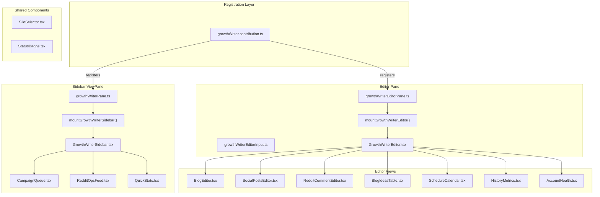

# Phase 6: Growth Writer UI - Sidebar + Editor Pane

## Goal

Full dual-panel UI. Sidebar for navigation, status, and quick actions. Editor
pane for full-width content editing and management views. Sidebar items open
editor tabs for detailed work -- exactly like VSCode's file explorer + code
editor interaction.

## Architecture



## What Already Exists

- **Services**: `IGrowthWriterService`, `IRedditMonitorService`,
  `ITwitterService` (Phases 2-5) with full IPC to electron-main for all CRUD,
  content generation, and platform API operations
- **React build pipeline**: `tsup.config.js` with entry points,
  `mountFnGenerator` pattern, `scope-tailwind` CSS scoping
- **ViewPane pattern**: `TimelinePane`, `EmailDashboardPane` (sidebar
  registration + React mounting)
- **EditorPane pattern**: `VoidSettingsPane` / `VoidSettingsInput` (editor
  registration + React mounting)
- **Contribution pattern**: `timeline.contribution.ts`,
  `emailDashboard.contribution.ts` (ViewContainer + ViewsRegistry + commands)
- **React service hooks**: `useAccessor()`, `useSettingsState()` etc. in
  `util/services.js`

## Files to Create (20 files)

### TypeScript Registration (4 files)

#### 1. `browser/growthWriter/growthWriter.contribution.ts`

Registers the sidebar ViewContainer, editor pane, and commands. Follows
`timeline.contribution.ts` exactly.

- ViewContainer: `workbench.view.growthWriter`, icon `Codicon.megaphone`,
  `ViewContainerLocation.Sidebar`, order `8`
- View: `GrowthWriterPane` with `SyncDescriptor`
- EditorPane: registered via
  `EditorPaneDescriptor.create(GrowthWriterEditorPane, ...)` with
  `[new SyncDescriptor(GrowthWriterEditorInput)]`
- Commands: `OpenGrowthWriterAction` (Ctrl+Shift+G),
  `OpenGrowthWriterBlogEditorAction`, `OpenGrowthWriterIdeasAction`,
  `OpenGrowthWriterScheduleAction`
- Reference:
  [timeline.contribution.ts](src/vs/workbench/contrib/void/browser/timeline/timeline.contribution.ts)
  lines 32-61 for ViewContainer,
  [voidSettingsPane.ts](src/vs/workbench/contrib/void/browser/voidSettingsPane.ts)
  lines 114-117 for EditorPane registration

#### 2. `browser/growthWriter/growthWriterPane.ts`

Sidebar ViewPane class. Mounts React sidebar component.

```typescript
export class GrowthWriterPane extends ViewPane {
	static readonly ID = "void.growthWriterPane";
	static readonly TITLE = "Growth Writer";
	// renderBody mounts React via mountGrowthWriterSidebar(parent, accessor)
	// layoutBody sets height/width
}
```

Reference:
[timelinePane.ts](src/vs/workbench/contrib/void/browser/timeline/timelinePane.ts)
lines 20-57

#### 3. `browser/growthWriter/growthWriterEditorPane.ts`

EditorPane class for full-width editor views. Mounts React editor component,
passing the `GrowthWriterEditorInput` so the React router knows which view to
render.

```typescript
class GrowthWriterEditorPane extends EditorPane {
	static readonly ID = "void.growthWriterEditor";
	// createEditor mounts React via mountGrowthWriterEditor(element, accessor, { viewType, viewData })
	// setInput extracts viewType/viewData from GrowthWriterEditorInput.resource URI query params
}
```

Reference:
[voidSettingsPane.ts](src/vs/workbench/contrib/void/browser/voidSettingsPane.ts)
lines 62-111

#### 4. `browser/growthWriter/growthWriterEditorInput.ts`

EditorInput with URI-based view routing. The URI scheme
`void://growth-writer/{viewType}?{params}` determines which editor view renders.

```typescript
export type GrowthWriterViewType =
	| "blog-editor"
	| "social-posts"
	| "reddit-comment"
	| "blog-ideas"
	| "schedule"
	| "history"
	| "account-health";

export class GrowthWriterEditorInput extends EditorInput {
	static readonly TYPE_ID = "workbench.input.growthWriter";
	static readonly EDITOR_ID = "void.growthWriterEditor";
	// resource: URI with scheme='void', authority='growth-writer', path=viewType, query=params
	// Matches by resource URI comparison
	// getName() returns view-specific titles (e.g., "Blog Editor - Lawyers Campaign")
}
```

Reference:
[docxViewerInput.ts](src/vs/workbench/contrib/void/browser/documentViewers/docxViewer/docxViewerInput.ts)
lines 19-107

### React Components - Sidebar (4 files)

All in `browser/react/src/growth-writer-tsx/sidebar/`

#### 5. `GrowthWriterSidebar.tsx`

Main sidebar container. Renders three sections stacked vertically with
collapsible headers. Contains "Quick Actions" buttons that open editor tabs.

- Uses `useAccessor()` to get service references
- Calls `IGrowthWriterService.getIdeas()`, `.getCampaigns()` on mount
- Calls `IRedditMonitorService.getOpportunities()` on mount
- Quick actions: "Generate Ideas", "New Campaign", "Schedule", "History"
- Each action opens a `GrowthWriterEditorInput` in the editor area

#### 6. `CampaignQueue.tsx`

Shows this week's campaigns grouped by silo/day with status indicators.

- Status icons: check (published), spinner (generating), clock (draft/pending),
  play (in progress)
- Click a campaign row to open `blog-editor` or `social-posts` editor tab
- Shows silo color/label, blog title (or "Not generated"), scheduled day

#### 7. `RedditOpsFeed.tsx`

Live feed of Reddit opportunities from monitoring.

- Groups by subreddit
- Shows post title, relevance score, status (new/drafted/approved/commented)
- Click to open `reddit-comment` editor tab
- "Scan Now" button to trigger `IRedditMonitorService.scanForOpportunities()`

#### 8. `QuickStats.tsx`

Compact weekly progress summary.

- Campaigns: X/4 published this week
- Tweets: X/Y posted vs. generated
- Ideas: N pending across silos
- Reddit: X comments posted, Y opportunities found
- Account health indicators (Reddit karma, warmup %, Twitter auth status)
- Click health section to open `account-health` editor tab

### React Components - Editor Views (7 files)

All in `browser/react/src/growth-writer-tsx/editor/`

#### 9. `GrowthWriterEditor.tsx`

Router component. Receives `viewType` and `viewData` as props, renders the
appropriate editor view.

```typescript
const VIEWS: Record<GrowthWriterViewType, React.ComponentType<any>> = {
	"blog-editor": BlogEditor,
	"social-posts": SocialPostsEditor,
	"reddit-comment": RedditCommentEditor,
	"blog-ideas": BlogIdeasTable,
	schedule: ScheduleCalendar,
	history: HistoryMetrics,
	"account-health": AccountHealth,
};
```

#### 10. `BlogEditor.tsx`

Full blog post editor with side-by-side source and preview.

- Left panel: raw HTML content in a textarea/code editor
- Right panel: rendered HTML preview
- Top bar: title, silo badge, status, slug
- Action buttons: "Approve" (set status approved), "Publish" (trigger CMS
  publish), "Regenerate" (re-run LLM)
- Calls `IGrowthWriterService.approveBlog()`, `.publishBlog()`

#### 11. `SocialPostsEditor.tsx`

All social posts for a campaign with per-platform tabs (Reddit, Twitter,
LinkedIn).

- Tab bar: Reddit | Twitter | LinkedIn
- Each tab shows list of posts with status, content preview, character count
- Tweet tab: shows effective length (URLs counted as 23 chars)
- Action buttons per post: "Edit", "Approve", "Post"
- Calls `ITwitterService.approveTweet()`, `.postTweet()` etc.

#### 12. `RedditCommentEditor.tsx`

Thread context + comment draft side by side.

- Left: original Reddit thread (title, body, subreddit, score)
- Right: generated comment draft in editable textarea
- Warm-up status indicator (whether links are allowed)
- Action buttons: "Regenerate", "Approve", "Post Comment"
- Calls `IRedditMonitorService.generateCommentForOpportunity()`,
  `.approveComment()`, `.postComment()`

#### 13. `BlogIdeasTable.tsx`

Full idea backlog with filters, bulk actions.

- Table columns: title, silo, content angle, status, created date
- Filters: by silo, by status (pending/approved/rejected/used)
- Bulk actions: approve selected, reject selected
- "Generate More" button per silo
- Calls `IGrowthWriterService.generateIdeasForSilo()`, `.updateIdeaStatus()`

#### 14. `ScheduleCalendar.tsx`

Weekly calendar showing scheduled campaigns and social posts.

- Columns: Mon through Fri (matching silo schedule)
- Each cell shows: silo name, blog status, social posts count, Reddit comments
  count
- Current week highlighted
- Manual override controls (reschedule a campaign to a different day)

#### 15. `HistoryMetrics.tsx`

Past campaigns with engagement data.

- Table of past campaigns: title, silo, published date, blog URL
- Per-campaign metrics: page views (from UTM), tweet impressions, Reddit karma
  gained
- Summary charts: campaigns per week, engagement over time
- Filter by silo, date range

#### 16. `AccountHealth.tsx`

Platform authentication status and health metrics.

- Reddit section: auth status, username, karma, warmup progress bar, removal
  count/rate
- Twitter section: auth status, handle, last tweet date
- LinkedIn section: auth status (future)
- "Authenticate" buttons for each platform
- Warm-up timeline visualization

### React Components - Shared (2 files)

All in `browser/react/src/growth-writer-tsx/shared/`

#### 17. `SiloSelector.tsx`

Reusable silo picker dropdown.

- Shows 4 silos: Lawyers, Researchers, Students, Business
- Each with a color indicator and label
- `onChange(silo: Silo)` callback
- Optional "All" option for filter views

#### 18. `StatusBadge.tsx`

Consistent status indicator component.

- Maps status strings to colors/icons: `draft` (yellow), `approved` (blue),
  `published` (green), `failed` (red), `generating` (spinner), etc.
- Works for campaign status, social post status, opportunity status, idea status

### React Entry Points (2 files)

#### 19. `browser/react/src/growth-writer-tsx/sidebar/index.tsx`

```typescript
import { mountFnGenerator } from "../../util/mountFnGenerator.js";
import { GrowthWriterSidebar } from "./GrowthWriterSidebar.js";
export const mountGrowthWriterSidebar = mountFnGenerator(GrowthWriterSidebar);
```

#### 20. `browser/react/src/growth-writer-tsx/editor/index.tsx`

```typescript
import { mountFnGenerator } from "../../util/mountFnGenerator.js";
import { GrowthWriterEditor } from "./GrowthWriterEditor.js";
export const mountGrowthWriterEditor = mountFnGenerator(GrowthWriterEditor);
```

## Files to Modify (2 files)

### 21. `browser/react/tsup.config.js`

Add two new entry points to the `entry` array:

```typescript
'./src2/growth-writer-tsx/sidebar/index.tsx',
'./src2/growth-writer-tsx/editor/index.tsx',
```

Reference:
[tsup.config.js](src/vs/workbench/contrib/void/browser/react/tsup.config.js)
lines 9-23

### 22. `browser/void.contribution.ts`

Add import for the new contribution file (after the existing Growth Writer
service imports at line 174):

```typescript
import "./growthWriter/growthWriter.contribution.js";
```

## React Service Communication Pattern

All React components access services through the `accessor` prop (injected by
`mountFnGenerator`). The key pattern:

```typescript
const accessor = useAccessor();
const channel = accessor
	.get(IMainProcessService)
	.getChannel("void-channel-growth-writer");

// For IPC calls:
const ideas = await channel.call("getIdeas", { workspaceId, silo: "lawyers" });

// For browser-side services (if exposed):
const gwService = accessor.get(IGrowthWriterService);
await gwService.generateIdeasForSilo("lawyers", 5);
```

Services to expose to React:

- `IGrowthWriterService` - blog ideas, campaigns, blog generation/publishing
- `IRedditMonitorService` - scanning, comment generation, posting
- `ITwitterService` - tweet generation, posting, metrics

## Key Design Decisions

- **EditorInput URI routing**: Use `void://growth-writer/{viewType}?key=value`
  URIs to determine which React view to render. This allows multiple editor tabs
  for different views, and `matches()` compares URIs to prevent duplicate tabs.
- **Sidebar refreshes on IPC events**: The sidebar should poll or listen for
  state changes (campaign status updates, new opportunities). Initially use a
  30-second refresh interval; later upgrade to `listen()` events from the IPC
  channel.
- **No new database tables**: All data already exists in the Phase 1-5 SQLite
  tables. The UI just reads/writes via existing IPC commands.
- **Scoped Tailwind CSS**: All React components use `void-` prefixed Tailwind
  classes via `scope-tailwind`. Use VSCode CSS variables for theming
  (`var(--vscode-*)`).
- **Editor tab titles**: `getName()` on `GrowthWriterEditorInput` returns
  contextual titles like "Blog Editor - Lawyers", "Reddit Comment - r/LawFirm",
  "Schedule" based on the URI.

## Implementation Order

Start with the registration layer (contribution, pane, editor), then the React
entry points and router, then the sidebar components, then the editor views one
at a time. This allows incremental testing.

## Verification

After implementation:

1. Run `bun run buildreact` to verify React components compile
2. Run `bun run compile` to verify TypeScript compiles
3. Launch the app and verify the Growth Writer icon appears in the Activity Bar
4. Click the icon and verify the sidebar renders with three sections
5. Click "Blog Ideas" in quick actions and verify the editor tab opens
