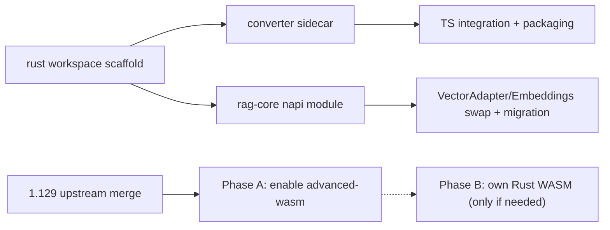

# Rust Acceleration Plan (3 Changes)

## Context

- Fork product code lives on `main` (`src/vs/workbench/contrib/void/`,
  `python/`); current `update-vscode` branch is a clean Code OSS 1.129 import
  mid-merge.
- Strategy: build the Rust crates **branch-independent** in a new top-level
  `rust/` Cargo workspace (separate from upstream's `cli/` to avoid merge
  conflicts), with contract tests. TS integration lands wherever `contrib/void`
  lives (today `main`, later the post-merge branch).

## Change 1: Rust conversion sidecar (replaces `python/` transmutation-codex)

Highest value: removes the bundled Python venv (+ PyMuPDF/ocrmypdf/LibreOffice
deps) and ~200 lines of fragile venv-discovery in
[fileConverterChannel.ts](src/vs/workbench/contrib/void/electron-main/fileConverterChannel.ts)
(on `main`).

**Contract to preserve** (from
`main:src/vs/workbench/contrib/void/common/fileConverterTypes.ts`):

```typescript
interface IFileConverterMainService {
  configure(config: FileConverterConfig): Promise<void>;
  convert(input, output, type, options?): Promise<ConversionResult>;
  batchConvert(files, outputDir, type): Promise<BatchResult>;
  mergePDFs(files, output): Promise<MergeResult>;
  getAvailableConversions(): Promise<ConversionMap>;
}
```

**Protocol to preserve**: long-lived child process, newline-delimited JSON
`{command, args}` on stdin, prefixed JSON responses/progress on stdout (same as
`electron_bridge.py`). This keeps TS changes minimal.

**New crate `rust/converter/`** (bin: `sa-converter`):

- PDF: `pdfium-render` (render/rasterize), `lopdf` (merge, metadata) — covers
  `mergePDFs` and PDF extraction
- OCR: `ocrs` (pure Rust) first; feature-flag `leptess` (Tesseract) if quality
  requires
- DOCX: `docx-rs`; XLSX/CSV: `calamine` + `rust_xlsxwriter`; Markdown/HTML:
  `comrak` + `ammonia`; EPUB: `epub` crate
- Port converters incrementally by conversion pair; report unsupported pairs via
  `getAvailableConversions` so the dashboard UI degrades gracefully
  (LibreOffice-dependent pairs like docx→pdf-via-LO come last or stay
  unsupported initially)
- Golden-file contract tests: same inputs → compare against Python engine
  outputs

**TS side**: replace Python discovery in `fileConverterChannel.ts` with a single
resolved binary path (dev: `rust/target/…`; packaged: `resources/app/bin/`);
wire binary into `build/gulpfile.vscode.js` packaging. Delete `python/` shipping
once conversion-pair parity is reached.

## Change 2: Rust RAG core (napi-rs module)

Replaces the three hot internals on `main` while keeping `IRAGMainService`,
`ragMainChannel`, and all browser-side services untouched:

- `ragLocalEmbeddings.ts` (Transformers.js MiniLM) → `fastembed-rs` (same
  all-MiniLM-L6-v2, 384-dim, ONNX via `ort`) — keeps existing embeddings
  compatible, no re-index needed
- `ragVectorAdapter.ts` `ChromaPersistentAdapter` (in-memory Map + brute-force
  dot product + SQLite persistence) → Rust HNSW index (`usearch`) with mmap
  persistence per workspace
- BM25 side of `ragHybridRetriever.ts` → `tantivy` index; fusion (RRF) can stay
  in TS initially
- Optional phase: `ragReranker.ts` cross-encoder → `ort` in the same module

**New crate `rust/rag-core/`** built with napi-rs → `@safeappeals/rag-core`
native module, N-API surface roughly: `embedBatch(texts) -> Float32Array[]`,
`indexChunks(workspaceId, chunks)`,
`search(workspaceId, queryVec, queryText, scope, k)`, `removeDoc`, `stats`.

**TS side**: implement `RustVectorAdapter implements VectorAdapter` and a
drop-in `LocalEmbeddingService` replacement; keep SQLite chunk/document store
as-is (it is metadata, not the bottleneck). Migration: on first load, detect
legacy `embeddings.db`, bulk-load vectors into usearch, keep SQLite as fallback
flag for one release.

**Build**: napi-rs prebuilds per platform (win-x64 first), wired into
`npm postinstall`/gulp like other native deps.

## Change 3: Rust-backed WASM diff (rides the 1.129 merge)

The 1.129 base already ships the slot: `diffAlgorithm: 'advanced-wasm'` →
[linesDiffComputers.ts](src/vs/editor/common/diff/linesDiffComputers.ts) →
[externalLinesDiffComputer.ts](src/vs/editor/common/diff/externalLinesDiffComputer.ts)
→ `@vscode/diff` (already in `package.json` at `0.0.2-7`). Runs in the editor
worker; used constantly by AI apply/diff views.

- Phase A (cheap): flip the default in the fork's `product.json`/configuration
  defaults to `'advanced-wasm'`, benchmark against `'advanced'` on large legal
  docs (10k+ line texts), watch the two known TODOs in
  `externalLinesDiffComputer.ts` (`ignoreTrimWhitespace` forced true;
  `maxComputationTimeMs` unsupported — verify acceptable or gate rollout)
- Phase B (optional, only if A shows gaps): own `rust/diff-wasm/` crate
  (wasm-bindgen, `imara-diff` or hand-rolled Myers + char refinement) exporting
  the same `createDiffComputer` interface, loaded via the same
  `resolveAmdNodeModulePath` mechanism

## Sequencing



1. Scaffold `rust/` workspace (independent of both branches)
2. Converter sidecar with golden-file tests vs Python engine → TS integration →
   packaging → remove `python/`
3. rag-core module → adapter swap + legacy embedding migration
4. Diff Phase A after the upstream merge lands; Phase B only if benchmarks
   demand

## Risks

- Conversion fidelity: some Python pairs (LibreOffice-based docx→pdf) have no
  great Rust equivalent — keep them listed unsupported or retain a LibreOffice
  shell-out for those pairs only
- RAG index migration: vectors are reusable (same model/dims), but validate
  score parity between brute-force dot product and HNSW recall before removing
  fallback
- `main` is being rebased onto 1.129 per the merge-spike plan — TS integration
  diffs should be written against `contrib/void` files so they apply to either
  branch
