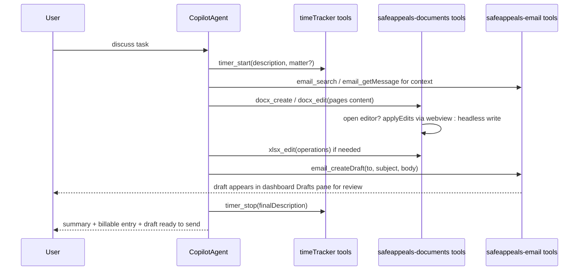

# Agent Tools for DOCX, XLSX, Time Tracker, and Email

## How tools work in this fork (research summary)

- VS Code core owns the tool pipeline: `ILanguageModelToolsService` in
  [src/vs/workbench/contrib/chat/common/tools/languageModelToolsService.ts](src/vs/workbench/contrib/chat/common/tools/languageModelToolsService.ts)
  handles registration, confirmation UI, and invoke plumbing. Extensions
  contribute tool metadata via `contributes.languageModelTools` in package.json
  and register implementations with `vscode.lm.registerTool(name, impl)`; each
  contribution auto-generates an `onLanguageModelTool:<name>` activation event,
  so tools lazily activate the owning extension.
- The vendored Copilot extension (`extensions/copilot`) picks up every tool
  registered through `vscode.lm` — including third-party extension tools — via
  its `ToolsService`, so tools registered by our extensions appear in the
  agent's tool list automatically. No Copilot or core changes are required.
- Decision (confirmed): implement all new tools inside the owning extensions
  using the standard contribution + `vscode.lm.registerTool` pattern, and
  document this pattern for future extensions.
- Decision (confirmed): hybrid write path for documents — drive open editors
  through webview protocols; fall back to headless writes when the file is not
  open, using the `docx` npm package on the host for DOCX and a Node-target WASM
  build of the existing `xlsx_rust_viewer` Rust crate for XLSX (no second
  spreadsheet library; identical serialization to the UI).

## Current state of the extensions

- `extensions/safeappeals-documents`: editable DOCX custom editor (docx-preview
  → TipTap → `docx` Packer) and XLSX editor (Rust WASM
  `XlsxParser`/`XlsxWriter` + canvas). The XLSX webview already implements an
  `applyEdits` operation handler (`handleApplyEdits` in
  [extensions/safeappeals-documents/webview-src/xlsx/main.ts](extensions/safeappeals-documents/webview-src/xlsx/main.ts)
  — `set_cell_value`, formulas, formatting, insert/delete rows, tables, charts),
  but the host never posts it. DOCX webview has partial
  `inlineEditRequest`/`applyInlineEdit` hooks; host explicitly ignores them. No
  LM tools registered. Host already has `requestSerializeAndWait` + `_panels`
  map per URI in both providers — the building blocks for deterministic
  agent-driven save.
- `extensions/time-tracker`:
  `TimeTrackerService.start(matterId, rateId, description, utbmsTask, utbmsActivity, isBillable)`,
  `stop(): TimeEntry`, `updateTimerState(...)`, plus SQLite `StorageService`
  (matters, rates, entries). All commands are interactive (QuickPick/InputBox,
  zero args), `activate()` exports nothing, no LM tools. The service layer
  already supports everything the agent needs; only a non-interactive surface is
  missing.
- Rust crate source:
  [void-reference/browser/documentViewers/xlsxRustViewer/wasm/Cargo.toml](void-reference/browser/documentViewers/xlsxRustViewer/wasm/Cargo.toml)
  (wasm-bindgen, calamine reader, rust_xlsxwriter writer). Currently built only
  for the browser target shipped as `media/xlsx/wasm/xlsx_rust_viewer_bg.wasm`.
- `extensions/safeappeals-email`: IMAP sync (imapflow) + SMTP send (nodemailer)
  + React sidebar (inbox) + dashboard `WebviewPanel` (reader/compose/drafts).
  Local JSON index in `globalStorageUri`: `email-index.json`,
  `email-drafts.json`, `email-case-links.json` (threadId → case folder),
  `email-tags.json` (`knownTags`, `threadTags`, `hiddenThreads`). Headers
  lazy-load bodies on read. Organize commands already exist as the agent seam:
  `linkThreadToCase` / `unlinkThreadFromCase`, `tagThread` / `untagThread` /
  `listTags` / `deleteTag`, `hideThread` / `unhideThread`. Hide sinks threads
  to the bottom and greys them out (does not exclude). Read APIs:
  `searchEmails`, `listThreads` (folder/offset/limit/sort/tag/caseFolderPath),
  `getThread`, `getMessage`, `listFolders`. No LM tools registered yet; drafts
  are local-only (no IMAP APPEND). Search is local substring match over the
  synced index.

## Target workflow

## Phase 1 — Time tracker tools (smallest, ship first)

In `extensions/time-tracker`:

1. Non-interactive surface: allow `timeTracker.start`/`stop` command handlers in
   [extensions/time-tracker/src/extension.ts](extensions/time-tracker/src/extension.ts)
   to accept an optional args object
   (`{ description, matterId, rateId, utbmsTask, utbmsActivity, isBillable }`)
   and skip all UI when provided; keep interactive flow when omitted.
2. New file `src/agentTools.ts` registering LM tools that call the services
   directly:
   - `timeTracker_start` — start timer with description (+ optional
     matter/rate/UTBMS). Auto-stops and saves any running timer (existing
     semantics).
   - `timeTracker_stop` — optional final description (applied via
     `updateTimerState` before `stop()` so the required-description rule is
     satisfied); returns the created `TimeEntry` (duration, rounded tenths).
   - `timeTracker_getState` — running/elapsed/description/matter, so the agent
     can check before acting.
   - `timeTracker_updateEntry` — annotate a completed entry
     (`StorageService.updateEntry`): description, UTBMS codes, billable.
   - `timeTracker_listMatters` — read-only list so the agent can pick a valid
     `matterId` while discussing the task.
3. `contributes.languageModelTools` entries in
   [extensions/time-tracker/package.json](extensions/time-tracker/package.json)
   with `modelDescription`, `inputSchema`, `toolReferenceName`,
   `canBeReferencedInPrompt: true`. Start/stop tools get `prepareInvocation`
   confirmation messages (they create billable records); getState/listMatters do
   not.

## Phase 2 — Document write tools

In `extensions/safeappeals-documents`:

1. Host plumbing (both providers in
   [extensions/safeappeals-documents/src/docx/docxEditorProvider.ts](extensions/safeappeals-documents/src/docx/docxEditorProvider.ts)
   and
   [extensions/safeappeals-documents/src/xlsx/xlsxEditorProvider.ts](extensions/safeappeals-documents/src/xlsx/xlsxEditorProvider.ts)):
   - Expose a small host-side registry (`findPanel(uri)`,
     `applyEditsAndWait(uri, ops)`, `saveAndWait(uri)`) built on the existing
     `_panels` map and `requestSerializeAndWait`.
   - XLSX: post `applyEdits` host→webview (handler already exists), add an
     `applyEditsResult` ack message in the webview so the tool gets
     success/failure per operation.
   - DOCX: add a host→webview `applyDocxEdits` protocol in
     `webview-src/docx/vendor/docxViewerTiptap.js` supporting structured ops
     (append/replace section content, insert paragraphs/headings/tables at
     anchor text or end-of-doc) executed against the TipTap document, plus ack.
     Reuse the existing `applyInlineEdit` machinery where it fits.
2. Headless fallback paths:
   - DOCX: move `docx` from webview-only bundling to also be usable on the
     extension host; a `DocxWriter` host module converts the tool's structured
     content (markdown-ish blocks: headings, paragraphs, lists, tables) into a
     `Document` + `Packer.toBuffer` and writes via `workspace.fs.writeFile`.
     Used for creating new files and editing unopened files (parse-append is v2;
     initially headless edit = create/overwrite with provided content).
   - XLSX: build the existing Rust crate for Node —
     `wasm-pack build --target nodejs` on
     `void-reference/browser/documentViewers/xlsxRustViewer/wasm`, output
     vendored into the extension (e.g.
     `extensions/safeappeals-documents/node-wasm/`). Host module loads
     `XlsxParser`/`XlsxWriter`, applies the same operation set as
     `handleApplyEdits` against the model JSON, serializes back to bytes.
     Identical engine to the UI, so no fidelity drift.
   - Routing rule inside each tool: editor open for URI → webview path (keeps UI
     model in sync, then deterministic save); not open → headless path; if the
     file is open AND dirty, still use the webview path so no user edits are
     lost.
3. LM tools (new `src/agentTools.ts` + package.json contributions):
   - `docx_create` — new .docx from structured content (title, headings,
     paragraphs, lists, tables, page setup).
   - `docx_edit` — apply structured edit ops to an existing .docx (open-editor
     or headless per routing rule).
   - `docx_read` — extract text/structure so the agent can read a document
     before editing (docx-preview HTML→text in webview, or host-side unzip +
     `quick-xml`-style plain text; simplest: JSZip + XML text extraction on
     host).
   - `xlsx_edit` — apply the operation array (same schema as
     `handleApplyEdits`).
   - `xlsx_read` — sheet names + cell range values as text/CSV for agent context
     (headless parser).
   - Edit/create tools return a `PreparedToolInvocation` confirmation with
     target file + summary of ops; reads are unconfirmed.

## Phase 3 — Email read + draft-only tools

In `extensions/safeappeals-email` (new `src/agentTools.ts` + package.json
contributions):

1. Read tools — thin wrappers over the existing index/engine APIs (no new
   plumbing needed):
   - `email_search` — wraps `EmailIndex.search(query, accountId?)`; returns
     summaries (from, subject, date, snippet, messageId). Notes in
     `modelDescription` that search covers the locally synced default folder.
   - `email_listThreads` — wraps `SyncEngine.listThreads` with
     folder/offset/limit/sort/tag/caseFolderPath. Returned threads include
     `tags`, `hidden`, and `caseFolderPath`. Hidden threads are included but
     always sorted to the bottom (greyed in UI).
   - `email_getMessage` — wraps `SyncEngine.getMessage(messageId)`; lazy-loads
     the body over IMAP on first read. Returned as text for the model.
   - `email_listAccounts` / reuse of `listFolders` so the agent can target the
     right account.
2. Draft tool — `email_createDraft`:
   - Calls `EmailIndex.saveDraft({ accountId, to, cc?, bcc?, subject, content, emailId? })`
     ([extensions/safeappeals-email/src/emailIndex.ts](extensions/safeappeals-email/src/emailIndex.ts)),
     supporting reply drafts by passing the source message id so the compose
     pane prefills threading context. Compose defaults
     (`safeappealsEmail.compose.header` / `signature` global;
     `compose.autoCc` / `autoBcc` per-case workspace settings under
     `.safeAppeals/settings.json`) can be applied by the tool or left for the
     dashboard to inject when the draft is opened.
   - Never sends: the tool layer does not reference `SyncEngine.send` /
     `smtpClient`, and no send tool is contributed. Sending remains a
     user-initiated dashboard action only.
   - `prepareInvocation` confirmation showing recipient + subject before the
     draft is written; result message tells the user the draft is in the
     dashboard Drafts pane awaiting their review.
3. Surface the draft for review:
   - After save, call `DashboardPanel.refreshIfOpen()` so the Drafts pane
     updates immediately.
   - Add a host→webview `openCompose`/`loadDraft` message in
     [extensions/safeappeals-email/src/dashboardPanel.ts](extensions/safeappeals-email/src/dashboardPanel.ts)
     and the React app so the tool can optionally pop the new draft straight
     into the compose pane for editing.
4. Organize tools — thin wrappers over the argument-taking commands added in
   rung 6.6 (case links) and rung 6.7 (tags/hide), which were built
   deliberately as the agent seam:
   - `email_listTags` — wraps `safeappeals-email.listTags`; returns
     `{ name, count }[]` so the model reuses existing vocabulary before
     inventing new tags. UI tag filter derives from the same store.
   - `email_tagThread` / `email_untagThread` — wrap
     `safeappeals-email.tagThread` / `untagThread` (threadId, tag). Enables
     "read this inbox and tag everything" auto-classification flows.
   - `email_deleteTag` — wraps `safeappeals-email.deleteTag` (tag). Removes
     the tag from `knownTags` and strips it from every thread that has it.
     **Never deletes emails** — only the tag label/association.
   - `email_hideThread` / `email_unhideThread` — wrap
     `safeappeals-email.hideThread` / `unhideThread` (threadId). Hide sinks
     the thread to the bottom of listings and greys it out; unhide restores
     natural sort position. Does not exclude from listings or delete mail.
   - `email_linkThreadToCase` / `email_unlinkThreadFromCase` — wrap the rung
     6.6 commands (threadId, optional caseFolderPath → defaults to open
     workspace).
   - `email_listThreads` (read tool above) exposes `tag`, `caseFolderPath`,
     and `sort` so the agent can scope reads to a tag or case.
5. Out of scope for now: IMAP APPEND to the server Drafts folder (imapflow
   supports `client.append` with the `\Draft` flag and special-use folder
   discovery, but local drafts fully satisfy "user reviews, edits, and sends
   themselves"; server-side drafts can be a later rung).

## Phase 4 — Pattern documentation + polish

1. Write `docs/agent-tools-pattern.md` (repo docs folder) documenting the house
   pattern for future extensions: contribution schema, naming rules
   (`^(?!copilot_|vscode_)[\w-]+$`), activation via `onLanguageModelTool:`,
   `prepareInvocation` confirmations, result shapes (`LanguageModelTextPart`),
   and the hybrid open-editor/headless routing convention — per your request
   that future extensions follow this pattern.
2. Tune `modelDescription` texts so the agent reliably chains the workflow (e.g.
   timer tool descriptions mention "start before beginning work on a task the
   user described; stop when the deliverable is written").

## Testing

- Time tracker: extension-host tests for start/stop/annotate via tools (assert
  SQLite rows + rounding), args-based commands.
- Documents: round-trip tests — `docx_create` → bytes on disk readable by the
  DOCX editor; `xlsx_edit` headless → reopen via parser and assert cell values;
  webview-path tests where the harness allows (existing extension test infra
  under `extensions/*/src/test` conventions).
- Email: tests that `email_createDraft` writes to `email-drafts.json` with
  status `draft` and that no code path from the tool layer reaches
  `smtpClient.sendMail`; read tools return expected summaries from a seeded
  index.
- Manual smoke: run the "discuss → start timer → read email context → write
  docx → draft reply email → stop timer" flow in the dev build with the Copilot
  agent, then verify the draft is editable/sendable only from the dashboard.

## Explicit non-goals

- No changes to `extensions/copilot` or core chat code (tools flow in
  automatically).
- No Rust rewrite of tool glue; Rust stays confined to the XLSX engine (new Node
  build target only).
- No pause semantics for the timer (start/stop only, matching existing model).
- No agent-facing send capability for email — drafts only, sending stays a
  manual dashboard action. No IMAP APPEND/server drafts in this iteration.
