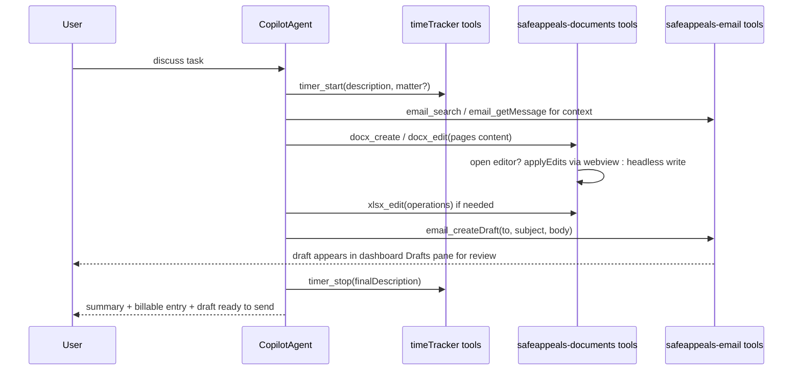

# Agent Tools for DOCX, XLSX, Time Tracker, and Email

**Status (Aug 2, 2026):** ACTIVE — core document + workspace + search + timer start/stop + email draft tools shipped and agent-smoke verified. Remaining ladder items: email read/organize, compose UX, pattern docs, timer annotate/list matters, unified edit wrapper.

## How tools work in this fork (research summary)

- VS Code core owns the tool pipeline: `ILanguageModelToolsService` in
  [src/vs/workbench/contrib/chat/common/tools/languageModelToolsService.ts](src/vs/workbench/contrib/chat/common/tools/languageModelToolsService.ts)
  handles registration, confirmation UI, and invoke plumbing. Extensions
  contribute tool metadata via `contributes.languageModelTools` in package.json
  and register implementations with `vscode.lm.registerTool(name, impl)`; each
  contribution auto-generates an `onLanguageModelTool:<name>` activation event,
  so tools lazily activate the owning extension.
- The vendored Copilot extension (`extensions/copilot`) picks up every tool
  registered through `vscode.lm` — including third-party extension tools — via
  its `ToolsService`, so tools registered by our extensions appear in the
  agent's tool list automatically. No Copilot or core changes are required.
- Decision (confirmed): implement all new tools inside the owning extensions
  using the standard contribution + `vscode.lm.registerTool` pattern, and
  document this pattern for future extensions.
- Decision (confirmed): hybrid write path for documents — drive open editors
  through webview protocols; fall back to headless writes when the file is not
  open. XLSX uses the existing `--target web` WASM in the extension host
  (dynamic `import` + `initSync`), not a separate nodejs wasm-pack build.
- Decision (Aug 1 2026): open path only when custom editor is **open and ready**;
  headless when closed/not-ready/clean; external-sync flag prevents save from
  clobbering headless writes with stale TipTap/WASM bytes.
- Decision (future): thin unified `edit`/`read` wrapper for the model; format
  engines stay underneath (see vault Decision note).

## Shipped tool surface (Aug 2 2026)

**Documents (`safeappeals-documents`):**
`docx_read` / `docx_create` / `docx_edit`, `xlsx_read` / `xlsx_create` / `xlsx_edit`,
`openDocument`. Open+closed routing; structure JSON + TSV on xlsx_read; formula
overlay on headless edit/read; replaceSelection fail-closed without selection.

**Auth / workspace / web (`safeappeals-authentication`):**
File/workspace tools (`readFile`, `editFile`, `createFile`, …),
`webSearch` / `multiWebSearch` / `fetchWebPage` (credits footer, freshness/site/
safesearch, autoFetch raw pages — no AI summarizer).

**Time tracker:** `timer_getState` / `timer_start` / `timer_stop`.

**Email:** `email_createDraft` only (no send). Read/organize tools still open.

## Current state of the extensions

- `extensions/safeappeals-documents`: editable DOCX (TipTap) + XLSX (Rust WASM).
  Host posts `applyEdits` / `applyDocxEdits`; headless DOCX via `docxXmlEdit`;
  headless XLSX via `xlsxHeadless` + `xlsxFormulaOverlay`. External sync
  (`documentExternalSync`, `reloadFromBytes`) keeps host cache authoritative
  after agent headless writes while a tab is open.
- `extensions/time-tracker`: LM tools for start/stop/getState. `updateEntry` /
  `listMatters` tools not yet contributed.
- Rust crate source:
  [void-reference/browser/documentViewers/xlsxRustViewer/wasm/Cargo.toml](void-reference/browser/documentViewers/xlsxRustViewer/wasm/Cargo.toml)
  — browser WASM also loaded in extension host for headless.
- `extensions/safeappeals-email`: `email_createDraft` contributed; organize/
  search LM tools still to land on existing command/index seams.

## Target workflow

## Phase 1 — Time tracker tools (smallest, ship first)

In `extensions/time-tracker`:

1. Non-interactive surface: allow `timeTracker.start`/`stop` command handlers in
   [extensions/time-tracker/src/extension.ts](extensions/time-tracker/src/extension.ts)
   to accept an optional args object
   (`{ description, matterId, rateId, utbmsTask, utbmsActivity, isBillable }`)
   and skip all UI when provided; keep interactive flow when omitted.
2. New file `src/agentTools.ts` registering LM tools that call the services
   directly:
   - `timeTracker_start` — start timer with description (+ optional
     matter/rate/UTBMS). Auto-stops and saves any running timer (existing
     semantics).
   - `timeTracker_stop` — optional final description (applied via
     `updateTimerState` before `stop()` so the required-description rule is
     satisfied); returns the created `TimeEntry` (duration, rounded tenths).
   - `timeTracker_getState` — running/elapsed/description/matter, so the agent
     can check before acting.
   - `timeTracker_updateEntry` — annotate a completed entry
     (`StorageService.updateEntry`): description, UTBMS codes, billable.
   - `timeTracker_listMatters` — read-only list so the agent can pick a valid
     `matterId` while discussing the task.
3. `contributes.languageModelTools` entries in
   [extensions/time-tracker/package.json](extensions/time-tracker/package.json)
   with `modelDescription`, `inputSchema`, `toolReferenceName`,
   `canBeReferencedInPrompt: true`. Start/stop tools get `prepareInvocation`
   confirmation messages (they create billable records); getState/listMatters do
   not.

**Done:** start / stop / getState. **Still open:** updateEntry / listMatters.

## Phase 2 — Document write tools — DONE (Aug 1–2 2026)

In `extensions/safeappeals-documents`:

1. Host plumbing (both providers): `findPanel`, `applyEditsAndWait`,
   `saveAndWait`, `isReady` / `awaitReady`, `reloadFromBytes` + external-sync
   save protection.
2. Headless: DOCX `docxXmlEdit`; XLSX host WASM + `overlayFormulasFromXlsx` on
   read **and** edit paths (prevents formula flatten on subsequent edits).
3. LM tools: `docx_*`, `xlsx_*`, `openDocument`. `xlsx_read` returns
   `--- Workbook structure (JSON) ---` + TSV (tables, styles, formulas, charts).

## Phase 3 — Email read + draft-only tools

In `extensions/safeappeals-email` (new `src/agentTools.ts` + package.json
contributions):

1. Read tools — thin wrappers over the existing index/engine APIs (no new
   plumbing needed):
   - `email_search` — wraps `EmailIndex.search(query, accountId?)`; returns
     summaries (from, subject, date, snippet, messageId). Notes in
     `modelDescription` that search covers the locally synced default folder.
   - `email_listThreads` — wraps `SyncEngine.listThreads` with
     folder/offset/limit/sort/tag/caseFolderPath. Returned threads include
     `tags`, `hidden`, and `caseFolderPath`. Hidden threads are included but
     always sorted to the bottom (greyed in UI).
   - `email_getMessage` — wraps `SyncEngine.getMessage(messageId)`; lazy-loads
     the body over IMAP on first read. Returned as text for the model.
   - `email_listAccounts` / reuse of `listFolders` so the agent can target the
     right account.
2. Draft tool — `email_createDraft`:
   - Calls `EmailIndex.saveDraft({ accountId, to, cc?, bcc?, subject, content, emailId? })`
     ([extensions/safeappeals-email/src/emailIndex.ts](extensions/safeappeals-email/src/emailIndex.ts)),
     supporting reply drafts by passing the source message id so the compose
     pane prefills threading context. Compose defaults
     (`safeappealsEmail.compose.header` / `signature` global;
     `compose.autoCc` / `autoBcc` per-case workspace settings under
     `.safeAppeals/settings.json`) can be applied by the tool or left for the
     dashboard to inject when the draft is opened.
   - Never sends: the tool layer does not reference `SyncEngine.send` /
     `smtpClient`, and no send tool is contributed. Sending remains a
     user-initiated dashboard action only.
   - `prepareInvocation` confirmation showing recipient + subject before the
     draft is written; result message tells the user the draft is in the
     dashboard Drafts pane awaiting their review.
3. Surface the draft for review:
   - After save, call `DashboardPanel.refreshIfOpen()` so the Drafts pane
     updates immediately.
   - Add a host→webview `openCompose`/`loadDraft` message in
     [extensions/safeappeals-email/src/dashboardPanel.ts](extensions/safeappeals-email/src/dashboardPanel.ts)
     and the React app so the tool can optionally pop the new draft straight
     into the compose pane for editing.
4. Organize tools — thin wrappers over the argument-taking commands added in
   rung 6.6 (case links) and rung 6.7 (tags/hide), which were built
   deliberately as the agent seam:
   - `email_listTags` — wraps `safeappeals-email.listTags`; returns
     `{ name, count }[]` so the model reuses existing vocabulary before
     inventing new tags. UI tag filter derives from the same store.
   - `email_tagThread` / `email_untagThread` — wrap
     `safeappeals-email.tagThread` / `untagThread` (threadId, tag). Enables
     "read this inbox and tag everything" auto-classification flows.
   - `email_deleteTag` — wraps `safeappeals-email.deleteTag` (tag). Removes
     the tag from `knownTags` and strips it from every thread that has it.
     **Never deletes emails** — only the tag label/association.
   - `email_hideThread` / `email_unhideThread` — wrap
     `safeappeals-email.hideThread` / `unhideThread` (threadId). Hide sinks
     the thread to the bottom of listings and greys it out; unhide restores
     natural sort position. Does not exclude from listings or delete mail.
   - `email_linkThreadToCase` / `email_unlinkThreadFromCase` — wrap the rung
     6.6 commands (threadId, optional caseFolderPath → defaults to open
     workspace).
   - `email_listThreads` (read tool above) exposes `tag`, `caseFolderPath`,
     and `sort` so the agent can scope reads to a tag or case.
5. Out of scope for now: IMAP APPEND to the server Drafts folder (imapflow
   supports `client.append` with the `\Draft` flag and special-use folder
   discovery, but local drafts fully satisfy "user reviews, edits, and sends
   themselves"; server-side drafts can be a later rung).

**Done:** `email_createDraft`. **Still open:** read tools, compose UX, organize tools.

## Phase 4 — Pattern documentation + polish

1. Write `docs/agent-tools-pattern.md` (repo docs folder) documenting the house
   pattern for future extensions: contribution schema, naming rules
   (`^(?!copilot_|vscode_)[\w-]+$`), activation via `onLanguageModelTool:`,
   `prepareInvocation` confirmations, result shapes (`LanguageModelTextPart`),
   and the hybrid open-editor/headless routing convention — per your request
   that future extensions follow this pattern.
2. Tune `modelDescription` texts so the agent reliably chains the workflow (e.g.
   timer tool descriptions mention "start before beginning work on a task the
   user described; stop when the deliverable is written").

## Testing

- Time tracker: extension-host tests for start/stop/annotate via tools (assert
  SQLite rows + rounding), args-based commands.
- Documents: round-trip tests — `docx_create` → bytes on disk readable by the
  DOCX editor; `xlsx_edit` headless → reopen via parser and assert cell values;
  webview-path tests where the harness allows (existing extension test infra
  under `extensions/*/src/test` conventions). **Done** for headless docs +
  formula/overlay/external-sync; agent smoke Aug 1–2 PASS.
- Email: tests that `email_createDraft` writes to `email-drafts.json` with
  status `draft` and that no code path from the tool layer reaches
  `smtpClient.sendMail`; read tools return expected summaries from a seeded
  index.
- Manual smoke: run the "discuss → start timer → read email context → write
  docx → draft reply email → stop timer" flow in the dev build with the Copilot
  agent, then verify the draft is editable/sendable only from the dashboard.

## Explicit non-goals

- No changes to `extensions/copilot` or core chat code (tools flow in
  automatically).
- No Rust rewrite of tool glue; Rust stays confined to the XLSX engine.
- No pause semantics for the timer (start/stop only, matching existing model).
- No agent-facing send capability for email — drafts only, sending stays a
  manual dashboard action. No IMAP APPEND/server drafts in this iteration.
- No AI summarizer for Brave search — agent reads raw page text via fetch/
  autoFetch.
