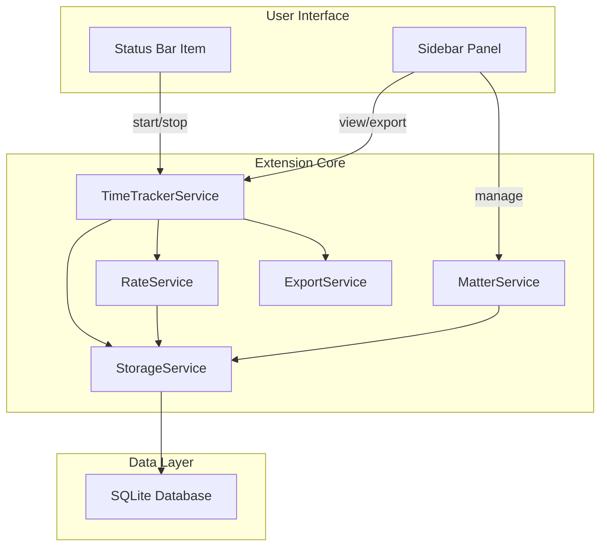

# Legal Time Tracker Extension

## Architecture Overview



## File Structure

```
extensions/time-tracker/
├── package.json              # Extension manifest
├── tsconfig.json             # TypeScript config
├── src/
│   ├── extension.ts          # Activation + commands
│   ├── timeTrackerService.ts # Core timer logic + 6-min rounding
│   ├── matterService.ts      # Case/matter management
│   ├── rateService.ts        # Billing rate configuration
│   ├── storageService.ts     # SQLite operations
│   ├── exportService.ts      # CSV/JSON/LEDES export
│   ├── utbmsCodes.ts         # UTBMS code definitions
│   ├── ledesFormatter.ts     # LEDES 1998B format generator
│   ├── statusBarController.ts # Status bar UI
│   └── sidebarProvider.ts    # Webview sidebar panel
├── data/
│   └── utbms-codes.json      # Standard UTBMS code reference
└── media/
    ├── sidebar.html          # Sidebar webview content
    └── sidebar.css           # Sidebar styles
```

## Database Schema

Stored at
`.safe-appeals-navigator/databases/workspaces/{workspaceId}/timetracker.db`:

```sql
-- Matters/Cases table
CREATE TABLE matters (
    id INTEGER PRIMARY KEY AUTOINCREMENT,
    workspace_id TEXT NOT NULL,
    client_name TEXT NOT NULL,
    matter_name TEXT NOT NULL,
    matter_number TEXT,              -- Optional case number
    default_rate REAL,               -- $/hour, NULL = use global
    is_active INTEGER DEFAULT 1,
    created_at INTEGER DEFAULT (strftime('%s','now') * 1000)
);

-- Billing rates table
CREATE TABLE billing_rates (
    id INTEGER PRIMARY KEY AUTOINCREMENT,
    workspace_id TEXT NOT NULL,
    name TEXT NOT NULL,              -- e.g., "Partner", "Associate", "Paralegal"
    hourly_rate REAL NOT NULL,       -- $/hour
    is_default INTEGER DEFAULT 0,
    created_at INTEGER DEFAULT (strftime('%s','now') * 1000)
);

-- Time entries table
CREATE TABLE time_entries (
    id INTEGER PRIMARY KEY AUTOINCREMENT,
    workspace_id TEXT NOT NULL,
    matter_id INTEGER,               -- FK to matters, NULL = no matter
    rate_id INTEGER,                 -- FK to billing_rates
    start_time INTEGER NOT NULL,     -- Unix timestamp (ms)
    end_time INTEGER,                -- NULL if running
    duration_tenths REAL,            -- Duration in 0.1 hour increments
    utbms_task TEXT,                 -- e.g., "L110" (Fact Investigation)
    utbms_activity TEXT,             -- e.g., "A101" (Plan/Prepare)
    description TEXT NOT NULL,       -- Narrative (required for legal)
    is_billable INTEGER DEFAULT 1,
    created_at INTEGER DEFAULT (strftime('%s','now') * 1000),
    FOREIGN KEY (matter_id) REFERENCES matters(id),
    FOREIGN KEY (rate_id) REFERENCES billing_rates(id)
);

CREATE INDEX idx_entries_workspace ON time_entries(workspace_id, start_time);
CREATE INDEX idx_entries_matter ON time_entries(matter_id);
```

## UTBMS Code Structure

Standard litigation codes (stored in `data/utbms-codes.json`):

```typescript
// Phase/Task codes (L = Litigation)
const UTBMS_TASKS = {
	L100: "Case Assessment, Development, and Administration",
	L110: "Fact Investigation/Development",
	L120: "Analysis/Strategy",
	L130: "Experts/Consultants",
	L140: "Document/File Management",
	L150: "Budgeting",
	L160: "Settlement/Non-Binding ADR",
	L200: "Pre-Trial Pleadings and Motions",
	L300: "Discovery",
	L400: "Trial Preparation and Trial",
	L500: "Appeal",
	// Workers' Comp specific could be added
};

// Activity codes
const UTBMS_ACTIVITIES = {
	A101: "Plan and prepare for",
	A102: "Research",
	A103: "Draft/revise",
	A104: "Review/analyze",
	A105: "Communicate (in firm)",
	A106: "Communicate (with client)",
	A107: "Communicate (other outside counsel)",
	A108: "Appear for/attend",
	A109: "Travel",
	A110: "Manage data/files",
	A111: "Other",
};
```

## Key Implementation Details

### 1. Package.json Configuration

```json
{
	"name": "time-tracker",
	"displayName": "Legal Time Tracker",
	"description": "Professional time tracking with UTBMS codes and LEDES export",
	"version": "1.0.0",
	"main": "./out/extension.js",
	"contributes": {
		"commands": [
			{
				"command": "timeTracker.start",
				"title": "Start Timer",
				"category": "Time Tracker"
			},
			{
				"command": "timeTracker.stop",
				"title": "Stop Timer",
				"category": "Time Tracker"
			},
			{
				"command": "timeTracker.toggle",
				"title": "Toggle Timer",
				"category": "Time Tracker"
			},
			{
				"command": "timeTracker.addEntry",
				"title": "Add Manual Entry",
				"category": "Time Tracker"
			},
			{
				"command": "timeTracker.manageMatter",
				"title": "Manage Matters",
				"category": "Time Tracker"
			},
			{
				"command": "timeTracker.manageRates",
				"title": "Manage Billing Rates",
				"category": "Time Tracker"
			},
			{
				"command": "timeTracker.exportCSV",
				"title": "Export to CSV",
				"category": "Time Tracker"
			},
			{
				"command": "timeTracker.exportJSON",
				"title": "Export to JSON",
				"category": "Time Tracker"
			},
			{
				"command": "timeTracker.exportLEDES",
				"title": "Export to LEDES 1998B",
				"category": "Time Tracker"
			}
		],
		"viewsContainers": {
			"activitybar": [
				{
					"id": "timeTracker",
					"title": "Time Tracker",
					"icon": "$(clock)"
				}
			]
		},
		"views": {
			"timeTracker": [
				{
					"type": "webview",
					"id": "timeTracker.sidebar",
					"name": "Time Tracker"
				}
			]
		},
		"configuration": {
			"title": "Time Tracker",
			"properties": {
				"timeTracker.defaultRoundingMode": {
					"type": "string",
					"enum": ["up", "down", "nearest"],
					"default": "up",
					"description": "How to round time to 0.1 hour increments"
				},
				"timeTracker.minimumIncrement": {
					"type": "number",
					"default": 0.1,
					"description": "Minimum billable time in hours (0.1 = 6 minutes)"
				},
				"timeTracker.descriptionMaxLength": {
					"type": "number",
					"default": 500,
					"description": "Maximum description length (many clients cap at 500)"
				}
			}
		}
	}
}
```

### 2. 6-Minute Billing Increment Logic

```typescript
// timeTrackerService.ts
export function roundToTenths(
	durationMs: number,
	mode: "up" | "down" | "nearest",
): number {
	const hours = durationMs / (1000 * 60 * 60);
	const tenths = hours * 10;

	switch (mode) {
		case "up":
			return Math.ceil(tenths) / 10;
		case "down":
			return Math.floor(tenths) / 10;
		case "nearest":
			return Math.round(tenths) / 10;
	}
}

// Examples:
// 5 minutes → 0.1 hours (rounded up)
// 7 minutes → 0.2 hours (rounded up)
// 12 minutes → 0.2 hours (nearest)
```

### 3. LEDES 1998B Export Format

```typescript
// ledesFormatter.ts
// LEDES 1998B is pipe-delimited with specific column order

const LEDES_HEADER = [
	"INVOICE_DATE",
	"INVOICE_NUMBER",
	"CLIENT_ID",
	"LAW_FIRM_MATTER_ID",
	"INVOICE_TOTAL",
	"BILLING_START_DATE",
	"BILLING_END_DATE",
	"INVOICE_DESCRIPTION",
	"LINE_ITEM_NUMBER",
	"EXP/FEE/INV_ADJ_TYPE",
	"LINE_ITEM_NUMBER_OF_UNITS",
	"LINE_ITEM_ADJUSTMENT_AMOUNT",
	"LINE_ITEM_TOTAL",
	"LINE_ITEM_DATE",
	"LINE_ITEM_TASK_CODE",
	"LINE_ITEM_EXPENSE_CODE",
	"LINE_ITEM_ACTIVITY_CODE",
	"TIMEKEEPER_ID",
	"LINE_ITEM_DESCRIPTION",
	"LAW_FIRM_ID",
	"LINE_ITEM_UNIT_COST",
	"TIMEKEEPER_NAME",
	"TIMEKEEPER_CLASSIFICATION",
	"CLIENT_MATTER_ID",
].join("|");

export function formatLedesEntry(entry: TimeEntry, matter: Matter): string {
	return [
		formatDate(entry.end_time), // INVOICE_DATE
		"", // INVOICE_NUMBER (blank for time only)
		matter.client_name, // CLIENT_ID
		matter.matter_number || matter.id, // LAW_FIRM_MATTER_ID
		"", // INVOICE_TOTAL
		formatDate(entry.start_time), // BILLING_START_DATE
		formatDate(entry.end_time), // BILLING_END_DATE
		"", // INVOICE_DESCRIPTION
		entry.id.toString(), // LINE_ITEM_NUMBER
		"F", // EXP/FEE/INV_ADJ_TYPE (F = Fee)
		entry.duration_tenths.toFixed(1), // LINE_ITEM_NUMBER_OF_UNITS
		"0", // LINE_ITEM_ADJUSTMENT_AMOUNT
		(entry.duration_tenths * entry.rate).toFixed(2), // LINE_ITEM_TOTAL
		formatDate(entry.start_time), // LINE_ITEM_DATE
		entry.utbms_task || "", // LINE_ITEM_TASK_CODE
		"", // LINE_ITEM_EXPENSE_CODE
		entry.utbms_activity || "", // LINE_ITEM_ACTIVITY_CODE
		"", // TIMEKEEPER_ID
		entry.description, // LINE_ITEM_DESCRIPTION
		"", // LAW_FIRM_ID
		entry.rate.toFixed(2), // LINE_ITEM_UNIT_COST
		"", // TIMEKEEPER_NAME
		"", // TIMEKEEPER_CLASSIFICATION
		matter.matter_number || "", // CLIENT_MATTER_ID
	].join("|");
}
```

### 4. Status Bar Controller

- Shows: `$(clock) [Matter] 0.3 hrs` when running
- Shows: `$(clock) Start Timer` when idle
- Click opens quick-start dialog (select matter + start)
- Tooltip shows: today's total, current matter, billable amount

### 5. Sidebar Panel Features

**Timer Section:**

- Live timer with matter dropdown
- UTBMS task/activity code selectors
- Description field with character counter
- Billable/non-billable toggle
- Start/Stop button

**Entries Section:**

- Today's entries grouped by matter
- Edit/delete individual entries
- Quick duplicate entry

**Reports Section:**

- Filter by date range, matter, billable status
- Summary: total hours, billable hours, value
- Export buttons: CSV, JSON, LEDES

**Settings Section:**

- Manage matters (add/edit/archive)
- Manage billing rates
- Default rounding mode

## Commands

| Command                   | Keybinding     | Description                  |
| ------------------------- | -------------- | ---------------------------- |
| `timeTracker.toggle`      | `Ctrl+Shift+T` | Start/stop timer             |
| `timeTracker.start`       | -              | Start timer with dialog      |
| `timeTracker.stop`        | -              | Stop and save                |
| `timeTracker.addEntry`    | `Ctrl+Shift+E` | Add manual time entry        |
| `timeTracker.exportLEDES` | -              | Export to LEDES 1998B format |

## Export Formats

**CSV (human-readable):**

```csv
date,client,matter,hours,rate,amount,task_code,activity_code,description,billable
2026-02-02,Smith,Smith v. Jones,1.5,250.00,375.00,L300,A104,"Review discovery documents",true
```

**LEDES 1998B (legal standard):**

```
LEDES1998B[]
INVOICE_DATE|INVOICE_NUMBER|CLIENT_ID|...
20260202||Smith|SMITH-001|...|L300||A104|...|Review discovery documents|...
```

**JSON (API-friendly):**

```json
{
  "workspace": "my-cases",
  "exported_at": "2026-02-02T12:00:00Z",
  "summary": { "total_hours": 8.5, "billable_hours": 7.2, "total_value": 1800.00 },
  "entries": [...]
}
```

## CSS Styling (Matching Timeline & CaseInfo)

The sidebar must match the existing Timeline and CaseInfo components using:

### CSS Variable Pattern

Use VSCode CSS variables for theming (from `styles.css`):

```typescript
// Reusable style objects - same pattern as TimelineEventCard.tsx
const cardStyle: React.CSSProperties = {
	backgroundColor: "var(--vscode-input-background)",
	border: "1px solid var(--vscode-panel-border)",
	borderRadius: "12px",
};

const buttonPrimaryStyle: React.CSSProperties = {
	backgroundColor: "var(--vscode-button-background)",
	color: "var(--vscode-button-foreground)",
	border: "none",
	borderRadius: "8px",
	cursor: "pointer",
};

const buttonSecondaryStyle: React.CSSProperties = {
	backgroundColor: "var(--vscode-button-secondaryBackground)",
	color: "var(--vscode-button-secondaryForeground)",
	border: "1px solid var(--vscode-panel-border)",
	borderRadius: "8px",
};

const inputStyle: React.CSSProperties = {
	width: "100%",
	padding: "8px",
	backgroundColor: "var(--vscode-input-background)",
	color: "var(--vscode-input-foreground)",
	border: "1px solid var(--vscode-input-border)",
	borderRadius: "4px",
	fontSize: "13px",
};

const textPrimaryStyle: React.CSSProperties = {
	color: "var(--vscode-editor-foreground)",
};

const textMutedStyle: React.CSSProperties = {
	color: "var(--vscode-descriptionForeground)",
};
```

### Badge Styles (for status indicators)

```typescript
// Running timer badge (success state)
const runningBadgeStyle: React.CSSProperties = {
	backgroundColor: "var(--vscode-testing-iconPassed)",
	color: "var(--vscode-editor-background)",
	padding: "2px 8px",
	borderRadius: "12px",
	fontSize: "11px",
	fontWeight: 600,
};

// Billable indicator
const billableBadgeStyle: React.CSSProperties = {
	backgroundColor: "var(--vscode-button-secondaryBackground)",
	color: "var(--vscode-button-background)",
	border: "1px solid var(--vscode-panel-border)",
	padding: "2px 8px",
	borderRadius: "4px",
	fontSize: "11px",
};
```

### Container Styles

```typescript
const containerStyle: React.CSSProperties = {
	backgroundColor: "var(--vscode-editor-background)",
	color: "var(--vscode-editor-foreground)",
};

const sidebarStyle: React.CSSProperties = {
	backgroundColor: "var(--vscode-sideBar-background)",
};
```

### Tailwind Classes Used

Combine Tailwind utility classes with CSS variables:

- Cards: `rounded-xl` (12px), `p-4`, `mb-4`
- Buttons: `rounded-lg` (8px), `px-4 py-2`
- Badges: `rounded-md`, `px-2 py-0.5`, `text-xs font-semibold`
- Layout: `flex`, `flex-col`, `gap-2`, `space-y-4`
- Scrollbar: `void-scrollbar` class for styled scrollbars
- Icons: `codicon codicon-{name}` for VSCode icons

### Time Entry Card Example

```tsx
<div className="rounded-xl p-4 mb-4 group" style={cardStyle}>
	{/* Header: Matter + Duration */}
	<div className="flex justify-between items-start mb-2">
		<div>
			<span className="text-xs font-semibold" style={textMutedStyle}>
				{entry.matter_name}
			</span>
			<h3 className="font-semibold text-base" style={textPrimaryStyle}>
				{entry.duration_tenths.toFixed(1)} hrs
			</h3>
		</div>
		<span style={billableBadgeStyle}>
			{entry.is_billable ? "Billable" : "Non-billable"}
		</span>
	</div>

	{/* UTBMS Codes */}
	<div className="flex gap-2 mb-2">
		<span
			className="text-xs px-2 py-0.5 rounded"
			style={{
				backgroundColor: "var(--vscode-badge-background)",
				color: "var(--vscode-badge-foreground)",
			}}
		>
			{entry.utbms_task}
		</span>
		<span
			className="text-xs px-2 py-0.5 rounded"
			style={{
				backgroundColor: "var(--vscode-badge-background)",
				color: "var(--vscode-badge-foreground)",
			}}
		>
			{entry.utbms_activity}
		</span>
	</div>

	{/* Description */}
	<p className="text-sm" style={textMutedStyle}>
		{entry.description}
	</p>

	{/* Actions - visible on hover */}
	<div className="flex gap-1 mt-2 opacity-0 group-hover:opacity-100 transition-opacity">
		<button style={buttonSecondaryStyle}>
			<i className="codicon codicon-edit" />
		</button>
		<button style={buttonSecondaryStyle}>
			<i className="codicon codicon-trash" />
		</button>
	</div>
</div>
```

### Key Files to Reference

- [styles.css](src/vs/workbench/contrib/void/browser/react/src/styles.css) - CSS variables
- [TimelineEventCard.tsx](src/vs/workbench/contrib/void/browser/react/src/timeline-tsx/TimelineEventCard.tsx) - Card pattern
- [CaseInfoDashboard.tsx](src/vs/workbench/contrib/void/browser/react/src/case-info-dashboard-tsx/CaseInfoDashboard.tsx) - Form/input pattern

## Integration Points

- **Storage path**: Follows RAG pattern using `ragPathService` path conventions
- **Workspace ID**: Same hash algorithm as RAG for consistency
- **Case files**: Can link to documents in workspace via URI
- **IPC pattern**: If needed for main process SQLite, follow `ragMainChannel.ts` pattern
- **CSS theming**: Uses VSCode CSS variables for automatic dark/light mode support
