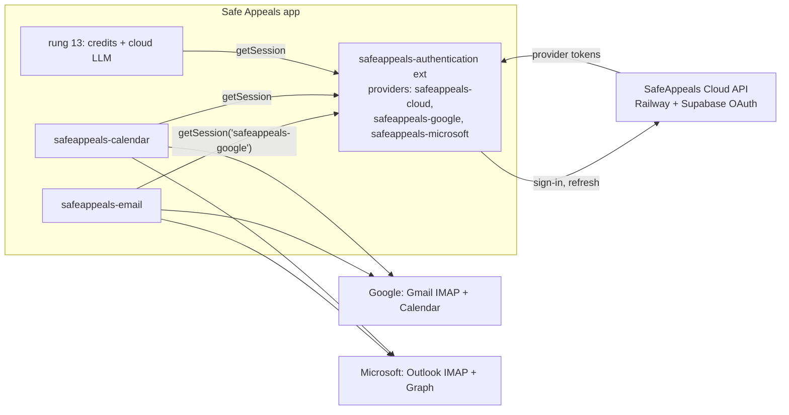

# Unified SafeAppeals Sign-In (new Rung 6.5)

## Decisions (Jul 20, user-confirmed)

- **Route: brokered via SafeAppeals Cloud.** One free account is the identity
  for everything; Google/Microsoft OAuth happens server-side (Supabase behind
  the Railway API) and the app receives cloud session + provider tokens.
- **Positioning (business task):** update safeappeals.com marketing AND in-app
  messaging (onboarding/welcome/accounts UI): "Sign-up is free — a free account
  unlocks calendar, email, and document features. You only pay when you use
  AI." Track alongside the Google restricted-scope verification work.
- **Sequencing:** runs as Rung 6.5, immediately before rung 7. Rung 13 slims to
  credits/LLM only.
- Context: rung 6 email currently uses passwords (Gmail requires app
  passwords — user hit this Jul 20; fixed error surfacing in `60ddcb05`,
  `9fbd862e`, `a08afbfe`). The app-password path stays as fallback; OAuth
  becomes the primary flow.

## Model

One free SafeAppeals Cloud account is the identity for everything. Signing in
with Google (or Microsoft) through the cloud API yields a cloud session **plus**
provider tokens for Gmail (IMAP XOAUTH2), Google Calendar, and Outlook/Graph. AI
credits (rung 13) reuse the same session. Business note: update
safeappeals.com + in-app messaging — "account is free, unlocks
calendar/email/docs; pay only for AI."

This copies VS Code's own GitHub pattern exactly: auth providers are built-in
extensions registered via `contributes.authentication`; the workbench already
provides the Accounts menu, session UI, consent, and `getSession()` plumbing
(`src/vs/workbench/services/authentication/`). No new workbench code needed —
old Void even had a working `safeappeals-cloud` provider to port
([void-reference/browser/voidCloudAuthProvider.ts](void-reference/browser/voidCloudAuthProvider.ts)).

## Workstream 1 — Server (external prerequisite, your Railway/Supabase repo)

- Add Gmail (`https://mail.google.com/`) + Calendar scopes to the Supabase
  Google OAuth app; add Azure provider with Outlook IMAP
  (`IMAP.AccessAsUser.All`, `SMTP.Send`) + Calendar Graph scopes.
- New endpoint to refresh **provider** tokens (Supabase does not auto-refresh
  `provider_token`); keep existing `/auth/google`, `/auth/callback`,
  `/auth/refresh`.
- Risk to track: Gmail is a Google **restricted scope** — the cloud OAuth app
  needs Google verification (possibly CASA assessment) before non-test users can
  sign in. Until then it works for up to 100 test users. Business task alongside
  marketing.

### Server work brief (hand to an agent in the Railway/Supabase repo)

Context: the desktop app (SafeAppeals, a VS Code fork) is adding unified
sign-in. The client calls `{apiUrl}/auth/google?redirect_uri=…`, the server
runs Supabase Google OAuth, and the callback returns a session
(`POST /auth/callback` with `{ code }`, refresh via `POST /auth/refresh`).
Existing endpoints stay compatible: `/auth/google`, `/auth/callback`,
`/auth/me`, `/auth/refresh`, `/credits/*`, `/llm/chat`, `/health`. Prod
callback protocol: `safe-appeals-navigator://auth/callback`; dev uses
`/auth/dev-callback` paste flow.

Deliverables:

1. **Google OAuth scopes.** Add to the Supabase Google provider (and consent
   screen): `https://mail.google.com/` (Gmail IMAP/SMTP XOAUTH2),
   `https://www.googleapis.com/auth/calendar.events`,
   `https://www.googleapis.com/auth/calendar.readonly`. Use incremental
   consent if possible so email-only users aren't over-prompted.
2. **Microsoft provider.** Enable Supabase Azure provider (tenant `common`)
   with scopes: `openid email profile offline_access`,
   `https://outlook.office.com/IMAP.AccessAsUser.All`,
   `https://outlook.office.com/SMTP.Send`, `Calendars.ReadWrite`. Requires an
   Azure app registration (personal + org accounts).
3. **Provider-token refresh endpoint** (the critical new piece): Supabase
   returns `provider_token`/`provider_refresh_token` at sign-in but does NOT
   refresh them. Add e.g. `POST /auth/provider-token` (Bearer cloud session)
   → `{ provider: 'google'|'microsoft', accessToken, expiresAt }`, refreshing
   server-side with the stored provider refresh token (client secret stays
   server-side). Store provider refresh tokens per user (encrypted at rest).
4. **Sign-up = free account.** Ensure the flow provisions an account with 0
   paid credits without any payment step (client gates only AI usage on
   credits).
5. **Google verification checklist** (business, start early — weeks of lead
   time): OAuth consent screen branding, privacy policy URL on
   safeappeals.com, restricted-scope justification for `mail.google.com`
   (client is an email app the user installs), demo video, possible CASA
   security assessment. Until approved: 100-user test cap.
6. **Marketing/site**: update safeappeals.com messaging — free account
   unlocks calendar/email/documents; pay only for AI.

## Workstream 2 — New built-in extension `extensions/safeappeals-authentication`

- Port from void-reference: cloud session logic
  ([voidCloudService.ts](void-reference/browser/voidCloudService.ts) auth half
  only), URL handler (`safe-appeals-navigator://auth/callback`), dev
  paste-callback command. Sessions move from plain `IStorageService` to
  `context.secrets`.
- Register three providers so consumers use plain
  `vscode.authentication.getSession()`:
  - `safeappeals-cloud` — the account itself (shows in Accounts menu)
  - `safeappeals-google` / `safeappeals-microsoft` — resolve
    Gmail/Calendar/Graph access tokens from the cloud session, refreshing via
    the server
- Add to `build/gulpfile.extensions.ts` + `build/npm/dirs.ts`; add
  `trustedExtensionAuthAccess` in [product.json](product.json) so built-in
  email/calendar skip consent prompts.
- Web (code-server) flow: use `vscode.env.asExternalUri` + URL handler; verify
  on both targets like rungs 1–6.

## Workstream 3 — Convert consumers

- **Email** ([extensions/safeappeals-email](extensions/safeappeals-email)): add
  OAuth credential type next to `{ password }`; `imapflow` gets
  `auth: { user, accessToken }` (XOAUTH2, supported in installed 1.4.7),
  nodemailer gets `auth: { type: 'OAuth2', ... }`. Add-account offers "Sign in
  with Safe Appeals (Google/Outlook)" that auto-configures hosts; app-password
  path stays as fallback (recent error-surfacing/diagnostic work remains valid
  for it).
- **Calendar**
  ([extensions/safeappeals-calendar](extensions/safeappeals-calendar)): replace
  `oauthLoopback.ts`/`tokenStore.ts` and the client-ID/secret settings with
  `getSession()`; keep sync engine + event cache untouched. This closes the
  deferred "cloud token inject" note from rung 4.

## Ladder impact

- Insert as **Rung 6.5** before rung 7; rungs 7–12 unchanged.
- **Rung 13 slims** to credits/balance/checkout UI, cloud LLM routing + server
  SSE work — it consumes `getSession('safeappeals-cloud')` instead of building
  auth.
- Delegation model as before: one worker per workstream (2 then 3; workstream 1
  is your server repo — I can brief it but it lives outside this codebase).

## Sequencing within the rung

Server scopes/endpoints must exist before end-to-end testing, but extension work
can start immediately against the existing `/auth/google` flow (cloud session +
whatever provider tokens Supabase already returns). Suggested order: auth
extension first (testable via Accounts menu sign-in), then calendar conversion
(lower risk), then email OAuth.
