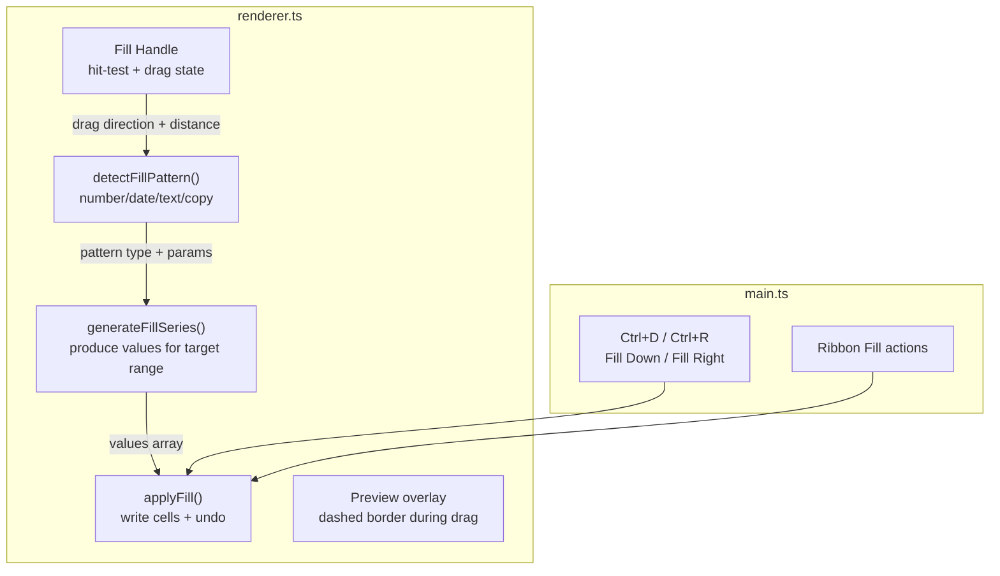

# XLSX Auto-Fill / Fill Series

## Current State

- The fill handle (small blue square at bottom-right of selection) is already
  **rendered** at
  [renderer.ts lines 2548-2553](src/vs/workbench/contrib/void/browser/documentViewers/xlsxRustViewer/media/renderer.ts)
  but has **no interaction logic**
- Selection model: `selectedCell` (anchor) + `selectionRange` (`SelectionRange`
  interface at line 17)
- Mouse handling: `handleMouseDown` (line 1165), `handleMouseMove` (line 1352),
  `handleMouseUp` (line 1487) -- all in `renderer.ts`
- Cell data: `sheet.cells[row][col] = { value, data_type, style? }` (nested hash
  maps)
- `updateCell()` (line 711) handles single-cell writes with undo
- `pushUndo()` (line 1051) snapshots state before mutations
- Keyboard shortcuts: global `document.addEventListener('keydown')` at
  [main.ts line 1775](src/vs/workbench/contrib/void/browser/documentViewers/xlsxRustViewer/media/main.ts)
  for Ctrl+shortcuts; canvas-level `handleKeyDown` at renderer.ts line 1846
- Date serial helpers exist in Rust (`formulas.rs` line 2190+) but TypeScript
  equivalents are needed for client-side series generation

## Architecture



## Step 1: Fill Handle Hit-Testing and Drag State (`renderer.ts`)

### New private state fields (add near line 205):

```typescript
private _fillDragging: boolean = false;
private _fillDragOrigin: SelectionRange | null = null;
private _fillDragTarget: SelectionRange | null = null;
private _fillDragDirection: 'down' | 'up' | 'right' | 'left' | null = null;
```

### Hit-test method:

```typescript
private _hitTestFillHandle(canvasX: number, canvasY: number): boolean
```

Check if the mouse position is within ~4px of the fill handle square
(bottom-right corner of the selection rectangle). Use the same coordinate math
from the fill handle drawing code at line 2548.

### `handleMouseDown` changes (line 1249+):

Before the normal cell-click logic, check if the mousedown lands on the fill
handle. If so:

- Set `_fillDragging = true`
- Store `_fillDragOrigin = normalizeRange(selectionRange)` (snapshot of current
  selection)
- Prevent default cell selection
- Return early

### `handleMouseMove` changes (line 1352+):

When `_fillDragging` is true:

- Hit-test the current mouse position to a cell
- Determine drag direction (down/up/right/left) based on which axis the mouse
  moves further from the origin range
- Constrain to one axis (same as Excel: either rows OR columns, not both)
- Set `_fillDragTarget` to the extended range
- Call `render()` to draw the preview

### `handleMouseUp` changes (line 1487+):

When `_fillDragging` is true:

- If `_fillDragTarget` extends beyond `_fillDragOrigin`, execute the fill
- Call `_executeFill(_fillDragOrigin, _fillDragTarget, _fillDragDirection)`
- Reset all fill drag state
- Fire `onCellEdit` callback for the first filled cell to trigger formula
  re-evaluation

## Step 2: Fill Preview Rendering (`renderer.ts`)

In the selection rendering block (line 2529+), after the normal selection
border:

- If `_fillDragging && _fillDragTarget`: draw a dashed rectangle around the fill
  target area (excluding the original selection)
- Use `ctx.setLineDash([4, 2])` with a lighter blue stroke
- This gives the user visual feedback of where data will be filled

## Step 3: Pattern Detection Engine (`renderer.ts`)

### New type:

```typescript
type FillPattern =
	| {
			type: "copy";
			values: Array<{ value: string; dataType: string; style?: any }>;
	  }
	| { type: "number"; start: number; step: number }
	| {
			type: "date";
			startSerial: number;
			stepDays: number;
			increment: "day" | "weekday" | "month" | "year";
	  }
	| {
			type: "textNumber";
			prefix: string;
			suffix: string;
			start: number;
			step: number;
	  }
	| { type: "customList"; listIndex: number; startOffset: number };
```

### Method:

```typescript
private _detectFillPattern(
    cells: Array<{ value: string; dataType: string; style?: any }>,
    direction: 'down' | 'up' | 'right' | 'left'
): FillPattern
```

Detection priority:

1. **Single cell**: always `copy` (unless it's a number, then increment by 1
   matches Excel behavior for drag)
2. **Two+ numbers**: calculate step, return `number` pattern
3. **Two+ dates** (detected by number format or date serial): calculate day
   step, detect weekday/month/year increments
4. **Text with trailing number** (regex `/^(.*?)(\d+)(\D*)$/`): extract prefix,
   suffix, start, step
5. **Custom list match**: check against built-in lists (days, months)
6. **Fallback**: `copy` (repeat the source values cyclically)

### Date helpers (TypeScript equivalents of the Rust helpers):

```typescript
function dateToSerial(year: number, month: number, day: number): number;
function serialToDate(serial: number): [number, number, number];
function isDateFormat(fmt: string | undefined): boolean;
```

These are small pure functions (~30 lines total) mirroring the Rust
implementations in `formulas.rs` lines 2177-2230.

## Step 4: Series Generation (`renderer.ts`)

### Method:

```typescript
private _generateFillValues(
    pattern: FillPattern,
    count: number,
    direction: 'down' | 'up' | 'right' | 'left'
): Array<{ value: string; dataType: string; style?: any }>
```

- For `copy`: cycle through source values
- For `number`: `start + step * i` (or descending for up/left)
- For `date`: add days/weekdays/months/years to the serial, convert back
- For `textNumber`: `prefix + (start + step * i) + suffix`
- For `customList`: advance through the list cyclically

## Step 5: Apply Fill (`renderer.ts`)

### Method:

```typescript
private _executeFill(
    origin: SelectionRange,
    target: SelectionRange,
    direction: 'down' | 'up' | 'right' | 'left'
): void
```

1. Call `pushUndo()` once (batch operation)
2. Extract source cells from origin range (row-by-row or col-by-col based on
   direction)
3. Call `_detectFillPattern()` for each row/column strip
4. Call `_generateFillValues()` for each strip
5. Write cells to the target area (excluding origin) using direct
   `sheet.cells[r][c] = ...`
6. Copy styles from source cells (cyclically)
7. Update `row_count` / `col_count` if needed
8. Call `render()`
9. Expand `selectionRange` to cover the full filled area

### Public method for keyboard fill:

```typescript
public fillDown(): void
public fillRight(): void
```

- `fillDown()`: uses the top row of the selection as source, fills down to the
  remaining rows
- `fillRight()`: uses the left column of the selection as source, fills right to
  remaining columns
- Both call `pushUndo()`, then directly copy cell values

## Step 6: Custom Lists (`renderer.ts`)

Built-in lists stored as a constant:

```typescript
const CUSTOM_FILL_LISTS: string[][] = [
	[
		"Sunday",
		"Monday",
		"Tuesday",
		"Wednesday",
		"Thursday",
		"Friday",
		"Saturday",
	],
	["Sun", "Mon", "Tue", "Wed", "Thu", "Fri", "Sat"],
	[
		"January",
		"February",
		"March",
		"April",
		"May",
		"June",
		"July",
		"August",
		"September",
		"October",
		"November",
		"December",
	],
	[
		"Jan",
		"Feb",
		"Mar",
		"Apr",
		"May",
		"Jun",
		"Jul",
		"Aug",
		"Sep",
		"Oct",
		"Nov",
		"Dec",
	],
];
```

Pattern detection checks source values against these lists (case-insensitive).
If a match is found, the fill continues the sequence.

## Step 7: Fill Down / Fill Right Keyboard Shortcuts (`main.ts`)

In the global `keydown` handler (line 1785), add cases:

```typescript
case 'd':
    e.preventDefault();
    renderer.fillDown();
    markDirty();
    evaluateFormulas();
    return;
case 'r':
    e.preventDefault();
    renderer.fillRight();
    markDirty();
    evaluateFormulas();
    return;
```

## Step 8: Ribbon Integration (`ribbon.ts`)

In the Home tab's "Cells" group (or add a new "Editing" group), add a split
button or dropdown:

- "Fill" dropdown with options:
  - "Fill Down" (Ctrl+D)
  - "Fill Right" (Ctrl+R)

Wire actions `fillDown` and `fillRight` in `main.ts` `handleRibbonAction()`.

## Step 9: Flash Fill (`renderer.ts` + `main.ts`)

Flash Fill detects a pattern from user-provided examples in a column and applies
it to the remaining cells.

### Detection approach:

```typescript
private _detectFlashFillPattern(
    sourceCol: number, targetCol: number, sheetCells: any
): Array<{ row: number; value: string }> | null
```

1. Find rows where both the source column (input) and target column (output)
   have values -- these are the "examples"
2. For each example, try to extract a transformation rule:

- Substring extraction (e.g., "John Smith" -> "John" = `LEFT` equivalent)
- Concatenation patterns (e.g., "John" + " " + "Smith" -> "John Smith")
- Case transformation

1. If a consistent rule is found across all examples, apply it to rows that have
   source values but empty target values
2. Return the generated values

### Trigger:

- Ctrl+E keyboard shortcut (add to global keydown handler)
- Ribbon button in the Data tab

### Scope:

Flash Fill is complex. Initial implementation should handle:

- Simple substring extraction (first N chars, last N chars)
- Concatenation of adjacent columns with separators
- Fallback: return `null` (no pattern detected) and show a status message

## Files Changed

- [renderer.ts](src/vs/workbench/contrib/void/browser/documentViewers/xlsxRustViewer/media/renderer.ts)
  -- Fill handle interaction, pattern detection, series generation, fill
  application, Fill Down/Right methods, custom lists, Flash Fill detection, fill
  preview rendering
- [main.ts](src/vs/workbench/contrib/void/browser/documentViewers/xlsxRustViewer/media/main.ts)
  -- Ctrl+D, Ctrl+R, Ctrl+E keyboard shortcuts, ribbon action wiring, formula
  re-evaluation after fill
- [ribbon.ts](src/vs/workbench/contrib/void/browser/documentViewers/xlsxRustViewer/media/ribbon.ts)
  -- "Fill" dropdown button in Home tab, Flash Fill button in Data tab

## Build Steps

No Rust/WASM changes needed -- this is entirely TypeScript. Just
`bun run compile`.
