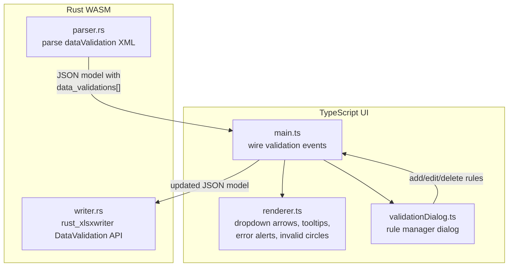

# XLSX Data Validation Feature

## Architecture Overview

Data validation follows the same pattern as conditional formatting: Rust
parses/writes the rules; TypeScript renders indicators and enforces rules during
editing.



## Layer 1: Rust Data Model and Parsing (`parser.rs`)

### New Struct: `DataValidationDef`

Add after the existing conditional formatting structs (~line 174). Mirrors the
OOXML `<dataValidation>` element attributes:

```rust
#[derive(Serialize, Deserialize, Clone, Debug)]
pub struct DataValidationDef {
    pub validation_type: String,   // "whole", "decimal", "list", "date", "time", "textLength", "custom", "any"
    #[serde(skip_serializing_if = "Option::is_none")]
    pub operator: Option<String>,  // "between", "notBetween", "equal", "notEqual", "greaterThan", etc.
    pub sqref: String,             // cell range e.g. "A1:A10"
    #[serde(default)]
    pub formula1: Option<String>,  // first value/formula (or comma-separated list for "list" type)
    #[serde(default)]
    pub formula2: Option<String>,  // second value (for "between"/"notBetween")
    #[serde(default = "default_true")]
    pub allow_blank: bool,
    #[serde(default = "default_true")]
    pub show_input_message: bool,
    #[serde(default = "default_true")]
    pub show_error_message: bool,
    #[serde(default = "default_true")]
    pub show_dropdown: bool,
    #[serde(skip_serializing_if = "Option::is_none")]
    pub input_title: Option<String>,
    #[serde(skip_serializing_if = "Option::is_none")]
    pub input_message: Option<String>,
    #[serde(skip_serializing_if = "Option::is_none")]
    pub error_title: Option<String>,
    #[serde(skip_serializing_if = "Option::is_none")]
    pub error_message: Option<String>,
    #[serde(default = "default_error_style")]
    pub error_style: String,       // "stop", "warning", "information"
}
```

### Add to `SheetData` (line ~295)

```rust
#[serde(default)]
pub data_validations: Vec<DataValidationDef>,
```

### New Parser Function: `parse_data_validations_from_zip`

Follow the exact same pattern as `parse_conditional_formatting_from_zip` (lines
1623-1715):

- Open ZIP archive
- Iterate `xl/worksheets/sheet*.xml` files
- Match sheet to `SheetData` by name via `parse_sheet_name_order`
- Use `quick_xml::Reader` to find `<dataValidation>` elements inside
  `<dataValidations>`
- Extract attributes: `type`, `operator`, `sqref`, `allowBlank`,
  `showInputMessage`, `showErrorMessage`, `showDropDown`, `promptTitle`,
  `prompt`, `errorTitle`, `error`, `errorStyle`
- Extract child `<formula1>` and `<formula2>` text content
- Map OOXML type names: `whole` -> `"whole"`, `decimal` -> `"decimal"`, `list`
  -> `"list"`, `date` -> `"date"`, `time` -> `"time"`, `textLength` ->
  `"textLength"`, `custom` -> `"custom"`

Call this new function from the main `load` method, right after
`parse_conditional_formatting_from_zip` (~line 394).

## Layer 2: Rust Writer (`writer.rs`)

### New Function: `write_data_validation`

Add after the `write_conditional_format` function (~line 540). This uses
`rust_xlsxwriter`'s native `DataValidation` API, so no ZIP post-processing is
needed.

```rust
fn write_data_validation(
    worksheet: &mut rust_xlsxwriter::Worksheet,
    rule: &DataValidationDef,
) -> Result<(), rust_xlsxwriter::XlsxError> {
    let coords = match parse_sqref_to_coords(&rule.sqref) { ... };
    let mut dv = rust_xlsxwriter::DataValidation::new();

    match rule.validation_type.as_str() {
        "whole" => { /* build DataValidationRule from operator + formula1/formula2, call dv.allow_whole_number() */ }
        "decimal" => { /* dv.allow_decimal_number() */ }
        "list" => { /* dv.allow_list_strings() or dv.allow_list_formula() */ }
        "date" => { /* dv.allow_date() */ }
        "time" => { /* dv.allow_time() */ }
        "textLength" => { /* dv.allow_text_length() */ }
        "custom" => { /* dv.allow_custom() */ }
        _ => return Ok(()),
    }

    // Set messages
    if let Some(ref t) = rule.input_title { dv = dv.set_input_title(t)?; }
    if let Some(ref m) = rule.input_message { dv = dv.set_input_message(m)?; }
    if let Some(ref t) = rule.error_title { dv = dv.set_error_title(t)?; }
    if let Some(ref m) = rule.error_message { dv = dv.set_error_message(m)?; }

    // Set error style
    match rule.error_style.as_str() {
        "warning" => { dv = dv.set_error_style(DataValidationErrorStyle::Warning); }
        "information" => { dv = dv.set_error_style(DataValidationErrorStyle::Information); }
        _ => {} // "stop" is default
    }

    dv = dv.ignore_blank(rule.allow_blank);
    dv = dv.show_dropdown(rule.show_dropdown);

    worksheet.add_data_validation(r1, c1, r2, c2, &dv)?;
    Ok(())
}
```

Add the call in the save loop after conditional formatting (~line 221):

```rust
for dv_rule in &sheet_data.data_validations {
    write_data_validation(worksheet, dv_rule)
        .map_err(|e| JsError::new(&e.to_string()))?;
}
```

## Layer 3: TypeScript Renderer (`renderer.ts`)

### 3a. Dropdown Arrow Indicator

In the cell rendering loop (~line 1880-2010), after icon set rendering, add:

- Check if cell has a `list`-type validation rule (lookup precomputed map)
- Draw a small dropdown arrow button (grey rectangle with triangle) on the right
  edge of the cell
- On click of that arrow region, emit a
  `onValidationDropdownClick(row, col, listItems)` callback

### 3b. Input Message Tooltip

In the selection change handler (where `onSelectionChanged` fires, ~line 1165):

- Check if the newly selected cell has a validation rule with
  `show_input_message === true`
- If so, show a floating tooltip div near the cell with `input_title` (bold) and
  `input_message`
- Hide the tooltip when selection moves away
- The tooltip is a simple absolutely-positioned div, created once and
  repositioned

### 3c. Cell Edit Validation

In `commitCellEdit()` (~line 2906):

- Before accepting the edit, check the cell's validation rule
- Validate the new value against the rule (type checking, range checking, list
  membership)
- If invalid and `show_error_message` is true:
  - **Stop**: Show error dialog, reject the edit, keep cell in edit mode
  - **Warning**: Show warning dialog with Retry/Cancel options
  - **Information**: Show info dialog, accept the edit anyway
- The error dialog is a simple modal div with the error title and message

### 3d. Invalid Data Circles

Add a method `markInvalidCells()` that iterates all cells with validation rules,
checks current values against rules, and stores invalid cell positions in a
`Set<string>`.

- During cell rendering, if a cell is in the invalid set, draw a red dashed
  oval/circle around the cell
- Expose a toggle for this feature (can be triggered from ribbon or context
  menu)

### 3e. Precomputed Validation Map

On `setData()` or when validations change, build a lookup map:

- `_validationOfCell: Map<string, DataValidationDef>` keyed by `"row:col"` for
  O(1) lookup during rendering
- Parse `sqref` ranges into individual cell coordinates (reuse existing
  `cellInRange` logic)

## Layer 4: Validation Dropdown Overlay (`renderer.ts` or new utility)

When the dropdown arrow is clicked for a list validation:

- Parse the formula1 value to get list items (comma-separated string or cell
  range reference)
- Show a floating `<select>` or custom dropdown div positioned below the cell
- On item selection, set the cell value and commit

## Layer 5: Validation Rule Manager Dialog (`validationDialog.ts`)

Create
`[media/validationDialog.ts](src/vs/workbench/contrib/void/browser/documentViewers/xlsxRustViewer/media/validationDialog.ts)`
following the exact same pattern as
`[conditionalFormatDialog.ts](src/vs/workbench/contrib/void/browser/documentViewers/xlsxRustViewer/media/conditionalFormatDialog.ts)`:

- **Structure**: Class `ValidationDialog` with `container`, `onAction` callback,
  `show(sqref, existingRules)`, `hide()`, `makeDraggable()`
- **Event type**:
  `VDDialogEvent { action: 'add' | 'edit' | 'delete' | 'close', rule?, ruleIndex? }`
- **Form fields**:
  - Validation type dropdown (Any, Whole number, Decimal, List, Date, Time, Text
    length, Custom)
  - Operator dropdown (between, not between, equal, not equal, greater than,
    less than, etc.) - shown/hidden based on type
  - Value 1 / Value 2 inputs (or list items textarea for list type)
  - Range input (sqref)
  - Input Message tab: title + message textareas, show checkbox
  - Error Alert tab: style dropdown (Stop/Warning/Information), title + message
    textareas, show checkbox
  - Ignore blank checkbox
  - Show dropdown checkbox (for list type)
- **Rule list panel**: Shows existing rules, with edit/delete buttons (same as
  CF dialog)

## Layer 6: Integration in `main.ts`

Wire the validation dialog similarly to the conditional format dialog (~lines
722-770):

- Import `ValidationDialog`
- Instantiate with `onAction` callback
- Handle `add`/`edit`/`delete` actions by modifying `sheet.data_validations`
- Call `renderer.render()` and `markDirty()` after changes
- Add ribbon button "Data Validation" that opens the dialog
- Pass selection range as default `sqref`

## Files Modified

| File                        | Changes                                                                                 |
| --------------------------- | --------------------------------------------------------------------------------------- |
| `wasm/src/parser.rs`        | Add `DataValidationDef` struct, `parse_data_validations_from_zip()`, call from `load()` |
| `wasm/src/writer.rs`        | Add `write_data_validation()`, call from `save()` loop                                  |
| `media/renderer.ts`         | Dropdown arrows, input tooltips, edit validation, invalid circles, validation map       |
| `media/validationDialog.ts` | **New file** - validation rule manager dialog                                           |
| `media/main.ts`             | Wire dialog, ribbon button, validation event handling                                   |
| `media/ribbon.ts`           | Add "Data Validation" button to ribbon                                                  |

## Build Steps After Implementation

1. `cd wasm && wasm-pack build --target web`
2. `cd media && node build.mjs`
3. Reload the window to test
