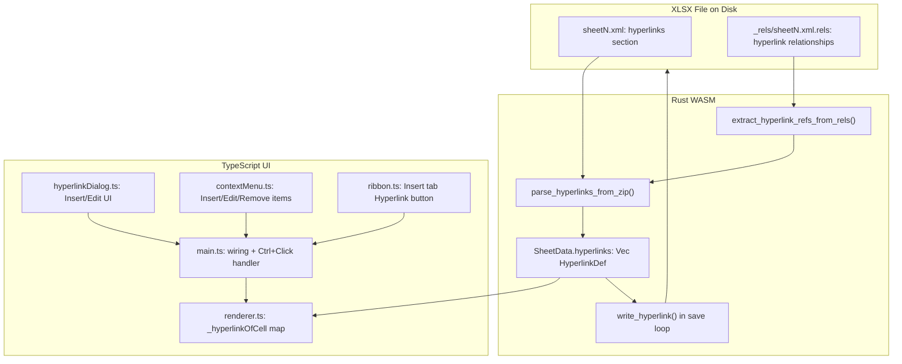

# XLSX Hyperlink Support

## OOXML Hyperlink Format

Real Excel files store hyperlinks in two places per worksheet:

1. **Worksheet XML** (`xl/worksheets/sheetN.xml`): `<hyperlinks>` section
  containing `<hyperlink>` elements with attributes:

- `ref` - cell reference (e.g., "A1")
- `r:id` - relationship ID linking to the external URL (absent for internal
links)
- `location` - internal target like "Sheet2!A1" (for cross-sheet links)
- `tooltip` - hover tooltip text
- `display` - explicit display text

1. **Relationship file** (`xl/worksheets/_rels/sheetN.xml.rels`):
  `<Relationship>` elements with:

- `Type="http://schemas.openxmlformats.org/officeDocument/2006/relationships/hyperlink"`
- `Target` - the actual URL
- `TargetMode="External"` - marks it as external
- `Id` - matches the `r:id` in the worksheet XML

This is the same rels-based pattern used for charts/drawings, which the codebase
already handles via `extract_drawing_refs_from_rels()` and
`extract_chart_refs_from_rels()`.

## Architecture




## Hyperlink Types to Support

- **External URL**: `https://...`, `http://...`, `ftp://...`
- **Email**: `mailto:user@example.com?subject=...`
- **Internal sheet reference**: `#Sheet2!A1` or `#'Sheet Name'!B5`
- **Named range**: `#MyNamedRange`
- **File link**: `file:///path/to/file.xlsx` (read-only, show in tooltip)

## Step 1: Rust Data Model (`parser.rs`)

Add `HyperlinkDef` after `DataValidationDef` (~line 237):

```rust
#[derive(Serialize, Deserialize, Clone, Debug)]
pub struct HyperlinkDef {
    pub cell_ref: String,        // "A1" or "B3:B5"
    pub url: String,             // full URL, mailto:, or internal #Sheet!A1
    #[serde(skip_serializing_if = "Option::is_none")]
    pub tooltip: Option<String>,
    #[serde(skip_serializing_if = "Option::is_none")]
    pub display: Option<String>, // explicit display text (if different from cell value)
    #[serde(default)]
    pub is_internal: bool,       // true for cross-sheet/named-range links
}
```

Add to `SheetData`:

```rust
#[serde(default)]
pub hyperlinks: Vec<HyperlinkDef>,
```

Initialize `hyperlinks: Vec::new()` in `load()` alongside `data_validations`.

## Step 2: Rust Parser (`parser.rs`)

### Helper: `extract_hyperlink_refs_from_rels()`

Follow `extract_chart_refs_from_rels()` pattern (line 2039-2073):

- Parse `<Relationship>` elements from the sheet's `.rels` file
- Filter by `rel_type.contains("/hyperlink")`
- Return `HashMap<String, String>` mapping rId to target URL
- Also capture `TargetMode` to distinguish external vs. internal

### Main: `parse_hyperlinks_from_zip()`

Follow `parse_charts_from_zip()` pattern exactly (line 2461-2579):

1. Open zip archive, call `parse_sheet_name_order()`
2. Collect and sort worksheet files
3. For each worksheet file:

- Map to correct `SheetData` via sheet name order (same index-mapping pattern)
- Read the `.rels` file for this sheet, call
`extract_hyperlink_refs_from_rels()`
- Parse the worksheet XML, find `<hyperlinks>` section
- For each `<hyperlink>` element:
  - Extract `ref`, `r:id`, `location`, `tooltip`, `display` attributes
  - If `r:id` is present: look up the URL from the rels map (external link)
  - If only `location` is present: prefix with `#` (internal link), set
  `is_internal = true`
  - If both `r:id` and `location`: URL from rels + location as fragment
- Push each `HyperlinkDef` to `sheet.hyperlinks`

Call from `load()` after `parse_data_validations_from_zip()`, before
`parse_charts_from_zip()`.

### Edge cases from real Excel files:

- Hyperlinks on merged cells (only the top-left cell has the `ref`)
- Multiple hyperlinks per sheet
- Hyperlinks with no display text (cell value serves as display)
- Hyperlinks with `location` attribute pointing to named ranges
- Email links stored as `mailto:` in the rels target

## Step 3: Rust Viewport (`viewport.rs`)

Add `hyperlinks: sheet.hyperlinks.clone()` to the `SheetData` copy block (~line
55-68), same as `data_validations`.

## Step 4: Rust Writer (`writer.rs`)

**Primary approach**: Use `rust_xlsxwriter::Url` API:

```rust
use rust_xlsxwriter::Url;

fn write_hyperlink(
    worksheet: &mut rust_xlsxwriter::Worksheet,
    link: &HyperlinkDef,
) -> Result<(), rust_xlsxwriter::XlsxError> {
    let (row, col) = parse_cell_ref(&link.cell_ref);
    let mut url = Url::new(&link.url);
    if let Some(ref tip) = link.tooltip {
        url = url.set_tip(tip);
    }
    if let Some(ref text) = link.display {
        url = url.set_text(text);
    }
    worksheet.write_url(row, col, &url)?;
    Ok(())
}
```

Call in the `save()` sheet loop after data validation writes, before
`workbook.save_to_buffer()`.

**Note**: Unlike charts (which needed OOXML injection because
`rust_xlsxwriter`'s Chart API produced invalid OOXML in WASM), the `Url` API is
simpler and should work. If it does not, fall back to the same
`inject_*_files()` post-processing pattern used by charts -- but this is
unlikely to be needed.

**Important**: The writer must preserve the cell's existing value when writing a
hyperlink. `write_url()` by default writes the URL as the cell value. Use
`write_url_with_text()` or write the cell value first, then the URL, to preserve
the original cell content.

## Step 5: TypeScript Renderer (`renderer.ts`)

### Data structures:

- `_hyperlinkOfCell: Map<string, HyperlinkDef>` keyed by `"row:col"`
- `onHyperlinkClick: ((url: string, isInternal: boolean) => void) | null`

### Methods:

- `_buildHyperlinkMap()` - called from `_syncFromActiveSheet()`, iterates
`sheet.hyperlinks[]`, expands range refs (e.g., "B3:B5") to individual cells
- `getHyperlinkForCell(row, col): HyperlinkDef | undefined`
- `setHyperlinks(links: HyperlinkDef[])` - updates model + rebuilds map
- `addHyperlink(link: HyperlinkDef)` / `removeHyperlink(row, col)` - for
insert/edit/remove operations

### Rendering changes (cell draw loop ~line 2029):

- If cell has a hyperlink entry in `_hyperlinkOfCell`:
  - Default text color: `#4a86e8` (blue) -- only if no explicit `textColor`
  style
  - Force underline decoration
  - This matches how Excel renders hyperlinked cells

### Mouse interaction:

- `mousemove`: if cell under cursor has a hyperlink, set
`canvas.style.cursor = 'pointer'` and show a small tooltip div with the URL
(reuse the validation tooltip pattern)
- `mousedown`: if `e.ctrlKey` (or `e.metaKey` on Mac) and cell has hyperlink,
fire `onHyperlinkClick(url, isInternal)` instead of selecting the cell
- Without Ctrl, clicking a hyperlink cell should select it normally (matches
Excel behavior)

### Clear on sheet switch:

- Clear `_hyperlinkOfCell` in `setData()` and `setActiveSheetIndex()`, same as
`_validationOfCell`.

## Step 6: Hyperlink Dialog (`hyperlinkDialog.ts` - new file)

Follow `formatCellsDialog.ts` pattern (dark theme, draggable, tab bar):

### Event interface:

```typescript
export interface HLDialogEvent {
	action: "insert" | "edit" | "remove" | "close";
	link?: HyperlinkDef;
}
```

### Three tabs:

- **URL tab**: URL input, display text input, tooltip input
- **Email tab**: email address input, subject input; auto-builds
`mailto:addr?subject=subj`
- **Sheet Reference tab**: sheet name dropdown (populated from model), cell
reference input; auto-builds `#SheetName!CellRef`

### Buttons:

- **OK** / **Cancel** in footer
- **Remove Link** button (only shown when editing an existing hyperlink)

### Public API:

- `show(sheetNames: string[], existing?: HyperlinkDef)` - opens dialog,
pre-populates if editing
- `hide()` / `isVisible()`

## Step 7: Context Menu (`contextMenu.ts`)

### New detector method (follows `setTableDetector()` pattern):

```typescript
setHyperlinkDetector(fn: (row: number, col: number) => HyperlinkDef | undefined) {
    this.getHyperlinkAtCell = fn;
}
```

### Menu items:

In the normal cell menu, after the `formatCells` entry:

- Always show: `{ action: 'insertHyperlink', label: 'Insert Hyperlink...' }`
- If cell has hyperlink (detected via the detector):
  - Replace with: `{ action: 'editHyperlink', label: 'Edit Hyperlink...' }`
  - Add: `{ action: 'removeHyperlink', label: 'Remove Hyperlink' }`

## Step 8: Ribbon (`ribbon.ts`)

Add `IC.hyperlink` SVG (chain link icon) to the icon constants.

Add a "Links" group to `buildInsertTab()` after the "Rows & Columns" group:

```typescript
const linkGroup = this.group("Links");
const linkBody = this.el("div", "group-body");
linkBody.appendChild(
	this.tallBtn(IC.hyperlink, "Hyperlink", "insertHyperlink"),
);
linkGroup.insertBefore(linkBody, linkGroup.lastChild);
panel.appendChild(linkGroup);
```

## Step 9: Main Wiring (`main.ts`)

### Imports and initialization:

- Import `HyperlinkDialog`, `HLDialogEvent`
- Declare `let hlDialog: HyperlinkDialog | null = null;`
- Instantiate during init:
`hlDialog = new HyperlinkDialog(document.body, handleHlDialogAction);`

### Hyperlink detector registration:

After renderer is set up, register the hyperlink detector on the context menu:

```typescript
contextMenu.setHyperlinkDetector((row, col) =>
	renderer.getHyperlinkForCell(row, col),
);
```

### Ribbon action wiring:

```typescript
case 'insertHyperlink': showHyperlinkDialog(); break;
```

### Context menu action wiring:

```typescript
case 'insertHyperlink': showHyperlinkDialog(event.row, event.col); break;
case 'editHyperlink': showHyperlinkDialog(event.row, event.col); break;
case 'removeHyperlink': removeHyperlink(event.row, event.col); break;
```

### Handler functions:

- `showHyperlinkDialog(row?, col?)` - gets sheet names from model, gets existing
hyperlink if editing, calls `hlDialog.show()`
- `handleHlDialogAction(event)` - on insert/edit: add/update hyperlink in
`sheet.hyperlinks[]` and call `renderer.setHyperlinks()`; on remove: splice
from array
- `removeHyperlink(row, col)` - finds and removes the hyperlink entry

### Ctrl+Click handler:

```typescript
renderer.onHyperlinkClick = (url, isInternal) => {
	if (isInternal) {
		// Parse #SheetName!CellRef, switch to that sheet, select cell
		navigateToInternalLink(url);
	} else {
		// Post message to VSCode host to open URL in external browser
		vscode.postMessage({ type: "openExternal", url });
	}
};
```

### Internal link navigation:

`navigateToInternalLink(url)` parses `#SheetName!CellRef`:

- Find sheet index by name, call `renderer.setActiveSheetIndex()`
- Parse cell ref, call `renderer.setSelection()`
- Rebuild sheet tabs, sync UI

### VSCode host side:

In the editor provider TypeScript (outside the webview), handle the
`openExternal` message by calling `vscode.env.openExternal(Uri.parse(url))`.
This is the secure way to open URLs from a webview.

## Step 10: HYPERLINK() Formula Function

In the formula engine evaluation path:

- Detect `=HYPERLINK(url, [friendly_name])` formula pattern
- Extract the `url` argument (first param) and optional `friendly_name` (second
param, defaults to url)
- Return `friendly_name` as the formula display result
- Register a synthetic `HyperlinkDef` in the renderer's hyperlink map for that
cell so it renders with blue underline and is clickable

## Files Changed

- `[parser.rs](src/vs/workbench/contrib/void/browser/documentViewers/xlsxRustViewer/wasm/src/parser.rs)`
-- Add `HyperlinkDef` struct, `extract_hyperlink_refs_from_rels()`,
`parse_hyperlinks_from_zip()`, update `SheetData` and `load()`
- `[viewport.rs](src/vs/workbench/contrib/void/browser/documentViewers/xlsxRustViewer/wasm/src/viewport.rs)`
-- Add `hyperlinks` field copy
- `[writer.rs](src/vs/workbench/contrib/void/browser/documentViewers/xlsxRustViewer/wasm/src/writer.rs)`
-- Add `write_hyperlink()` using `Url` API, call from save loop
- `[renderer.ts](src/vs/workbench/contrib/void/browser/documentViewers/xlsxRustViewer/media/renderer.ts)`
-- Hyperlink map, blue underline rendering, Ctrl+Click, hover cursor/tooltip
- `[hyperlinkDialog.ts](src/vs/workbench/contrib/void/browser/documentViewers/xlsxRustViewer/media/hyperlinkDialog.ts)`
-- New file: 3-tab dialog (URL/Email/Sheet Reference)
- `[contextMenu.ts](src/vs/workbench/contrib/void/browser/documentViewers/xlsxRustViewer/media/contextMenu.ts)`
-- Add hyperlink items + `setHyperlinkDetector()`
- `[ribbon.ts](src/vs/workbench/contrib/void/browser/documentViewers/xlsxRustViewer/media/ribbon.ts)`
-- Add Hyperlink button + chain link SVG icon to Insert tab
- `[main.ts](src/vs/workbench/contrib/void/browser/documentViewers/xlsxRustViewer/media/main.ts)`
-- Import dialog, wire all actions, Ctrl+Click handler, internal navigation

