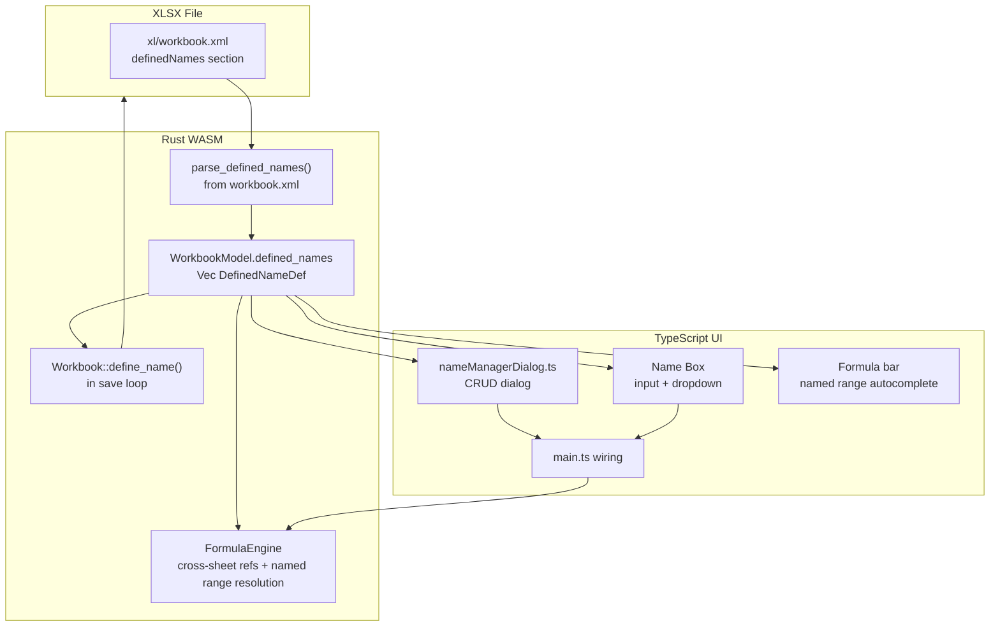

# XLSX Named Ranges Support

## Current State

- `WorkbookModel` only has `sheets: Vec<SheetData>` -- no workbook-level data
- The formula engine (`formulas.rs`) is single-sheet only: no `Sheet1!A1`
  syntax, no named range resolution
- The Name Box (`#cell-ref`) is a read-only `<span>` with no interactivity
- `parse_sheet_name_order()` already reads `xl/workbook.xml` (where
  `<definedNames>` live)
- `calamine` has `defined_names()` returning `&[(String, String)]` but no scope
  info
- `rust_xlsxwriter` has `Workbook::define_name(name, formula)` for writing

## Architecture



## Step 1: Rust Data Model and Parser (`parser.rs`)

### New struct `DefinedNameDef` (add after `HyperlinkDef` ~line 237):

```rust
#[derive(Serialize, Deserialize, Clone, Debug)]
pub struct DefinedNameDef {
    pub name: String,
    pub formula: String,           // "Sheet1!$A$1:$C$10" or "0.96"
    #[serde(skip_serializing_if = "Option::is_none")]
    pub local_sheet_id: Option<u32>, // None = workbook scope
    #[serde(skip_serializing_if = "Option::is_none")]
    pub comment: Option<String>,
    #[serde(default)]
    pub hidden: bool,              // built-in names like _xlnm.Print_Area
}
```

### Update `WorkbookModel` (line 354):

```rust
pub struct WorkbookModel {
    pub sheets: Vec<SheetData>,
    #[serde(default)]
    pub defined_names: Vec<DefinedNameDef>,
}
```

### New function `parse_defined_names_from_zip()`

Follow `parse_sheet_name_order()` pattern -- reads `xl/workbook.xml` with
`quick_xml`:

- Find `<definedNames>` section
- For each `<definedName>`: extract `name`, `localSheetId`, `comment`, `hidden`
  attributes
- Text content = the formula
- Push to a `Vec<DefinedNameDef>`
- Call from `load()` and store on `WorkbookModel`

### Update `load()` (~line 460):

```rust
let defined_names = parse_defined_names_from_zip(data);
let model = WorkbookModel { sheets, defined_names };
```

## Step 2: Rust Writer (`writer.rs`)

### Write defined names after all sheets are created, before `workbook.save_to_buffer()`:

```rust
for dn in &model.defined_names {
    let name_str = if let Some(sheet_id) = dn.local_sheet_id {
        let sheet_name = &model.sheets.get(sheet_id as usize)
            .map(|s| s.name.clone()).unwrap_or_default();
        if sheet_name.contains(' ') {
            format!("'{}'!{}", sheet_name, dn.name)
        } else {
            format!("{}!{}", sheet_name, dn.name)
        }
    } else {
        dn.name.clone()
    };
    let formula = format!("={}", dn.formula);
    let _ = workbook.define_name(&name_str, &formula);
}
```

Update the import line (line 15) to include `DefinedNameDef`.

## Step 3: Formula Engine -- Cross-Sheet References (`formulas.rs`)

This is the most complex change. The current engine is 964 lines and
single-sheet only.

### 3a. New Token variants:

```rust
enum Token {
    // ... existing ...
    SheetCellRef { sheet: String, cell: String },   // Sheet1!A1
    SheetRangeRef { sheet: String, range: String },  // Sheet1!A1:B5
    NamedRef(String),                                // TotalSales
}
```

### 3b. New Expr variants:

```rust
enum Expr {
    // ... existing ...
    SheetCellRef { sheet: String, col: u32, row: u32 },
    SheetRangeRef { sheet: String, col1: u32, row1: u32, col2: u32, row2: u32 },
    NamedRef { name: String },
}
```

### 3c. Tokenizer changes:

In `tokenize()`, add handling for:

- **Quoted sheet names**: When `'` is encountered (not in a string), read until
  matching `'`, then expect `!`, then read the cell/range ref
- **Unquoted sheet names**: After reading an identifier, if next char is `!`,
  treat it as `Sheet!Ref`
- **Named ranges**: In `classify_word()`, before falling through to
  `Token::Function`, check against `self.named_ranges` set

### 3d. FormulaEngine struct changes:

```rust
pub struct FormulaEngine {
    named_ranges: HashMap<String, String>,  // uppercased name -> formula
}
```

New WASM methods:

- `pub fn set_named_ranges(&mut self, json: &str) -> Result<(), JsError>` --
  receives `[{name, formula}, ...]`
- Update `evaluate_all` signature to:
  `pub fn evaluate_all(&mut self, all_sheets_json: &str, active_sheet: &str) -> Result<String, JsError>`

The `all_sheets_json` parameter is a JSON object:
`{ "Sheet1": { "0": { "0": {...}, ... }, ... }, "Sheet2": { ... } }`.

### 3e. Evaluator changes:

- `evaluate()` receives `&HashMap<String, SheetCells>` (all sheets) and
  `active_sheet: &str`
- `CellRef { col, row }` resolves against `all_sheets[active_sheet]` (same as
  today)
- `SheetCellRef { sheet, col, row }` resolves against `all_sheets[sheet]`
- `SheetRangeRef` iterates cells in `all_sheets[sheet]`
- `NamedRef { name }` looks up in `self.named_ranges`, parses the formula, and
  recursively evaluates (with depth guard)

## Step 4: TypeScript -- Name Box (`xlsxRustViewerEditor.ts`, `main.ts`)

### 4a. HTML change in [xlsxRustViewerEditor.ts](src/vs/workbench/contrib/void/browser/documentViewers/xlsxRustViewer/xlsxRustViewerEditor.ts) (line 1031):

Replace:

```html
<span id="cell-ref">A1</span>
```

With:

```html
<input id="cell-ref" type="text" value="A1" autocomplete="off" />
```

Add CSS for the dropdown overlay in the same file's style block.

### 4b. Name Box logic in `main.ts`:

- Create a dropdown overlay `<div id="name-box-dropdown">` appended to the
  formula bar container
- On focus of `#cell-ref`: show dropdown populated with all defined names
  (name + scope label)
- On selecting a name: navigate to that range (parse formula, switch sheet if
  needed, select cells)
- On typing a cell ref (e.g., "B5") and pressing Enter: navigate to that cell
- On typing a new name and pressing Enter with a selection active: prompt to
  define it
- On blur: hide dropdown, revert to showing current cell ref
- `updateFormulaBar()` updates the input value to the current cell ref or the
  name of the current selection if it matches a defined name

## Step 5: Name Manager Dialog (`nameManagerDialog.ts` -- new file)

Follow `formatCellsDialog.ts` pattern (dark theme, draggable, button-driven):

### Event interface:

```typescript
export interface NMDialogEvent {
	action: "create" | "edit" | "delete" | "close";
	name?: DefinedNameDef;
	index?: number;
}
```

### Layout:

- **Top section**: Filter input, scope filter dropdown (All / Workbook / sheet
  names)
- **List**: Table showing Name, Value (formula), Scope, Comment columns.
  Selectable rows.
- **Bottom**: "New...", "Edit...", "Delete" buttons
- **Sub-dialog** for New/Edit: Name input, "Refers to" formula input (with cell
  picker), Scope dropdown (Workbook vs each sheet name), Comment textarea

### Interactions:

- "New..." opens the sub-dialog with empty fields; scope defaults to Workbook
- "Edit..." opens the sub-dialog pre-populated with the selected name
- "Delete" removes the selected name (with confirmation)
- Filter narrows the displayed list
- Double-click a row opens Edit

## Step 6: Formula Bar Autocomplete (`main.ts`)

### Autocomplete overlay:

- When formula input starts with `=` and user types a partial word, show a
  dropdown of matching named range names
- Filter as user types (case-insensitive prefix match)
- Arrow keys to navigate, Enter/Tab to select, Escape to dismiss
- On selection: insert the name into the formula at the cursor position
- Position the dropdown below the formula input

### Implementation:

- Attach `input` event listener on `#formula-input`
- Extract the current "word" being typed (from last operator/paren/comma to
  cursor)
- If it matches any named range prefix and we're in formula mode, show overlay
- Also include function names in the autocomplete for a unified experience

## Step 7: Ribbon and Context Menu

### Ribbon ([ribbon.ts](src/vs/workbench/contrib/void/browser/documentViewers/xlsxRustViewer/media/ribbon.ts)):

Add a **"Formulas"** tab (insert between "Insert" and "View" in the tab list at
line 148):

```typescript
for (const name of ['Home', 'Insert', 'Formulas', 'View', 'Data']) {
```

Formulas tab contents:

- **"Defined Names"** group: "Name Manager" tall button, "Define Name" button
- **"Function Library"** group: existing SUM/AVG/COUNT/MIN/MAX buttons (move
  from Home tab, or duplicate)

Add `IC.nameManager` SVG icon (grid/bookmark icon).

### Context Menu ([contextMenu.ts](src/vs/workbench/contrib/void/browser/documentViewers/xlsxRustViewer/media/contextMenu.ts)):

After the hyperlink items in the normal cell menu, add:

- `{ action: 'defineName', label: 'Define Name...' }`

## Step 8: Main Wiring (`main.ts`)

### Initialization:

- Import `NameManagerDialog`, `NMDialogEvent`
- Instantiate `nmDialog` during init
- After parsing model, extract `model.defined_names` and:
  - Call `formulaEngine.set_named_ranges(JSON.stringify(model.defined_names))`
  - Store on a module-level variable for UI access

### Update `evaluateFormulas()`:

```typescript
function evaluateFormulas() {
	const data = renderer.getData();
	if (!data?.sheets || !formulaEngine) return;
	// Build all-sheets cells object
	const allSheets: Record<string, any> = {};
	for (const sheet of data.sheets) {
		allSheets[sheet.name] = sheet.cells || {};
	}
	const activeSheet = data.sheets[renderer.getActiveSheetIndex()]?.name ?? "";
	const resultJson = formulaEngine.evaluate_all(
		JSON.stringify(allSheets),
		activeSheet,
	);
	renderer.setFormulaResults(JSON.parse(resultJson));
}
```

### Wire ribbon actions:

- `case 'nameManager': showNameManagerDialog(); break;`
- `case 'defineName': showDefineNameDialog(); break;`

### Wire context menu:

- `case 'defineName': showDefineNameDialog(event.row, event.col); break;`

### Handler functions:

- `showNameManagerDialog()` -- opens the Name Manager dialog populated with
  `model.defined_names` and sheet names
- `showDefineNameDialog(row?, col?)` -- opens the sub-dialog for defining a new
  name, pre-populating the range from current selection
- `handleNmDialogAction(event)` -- handles create/edit/delete, updates
  `model.defined_names`, re-runs formula evaluation
- Update `navigateToInternalLink()` to resolve named ranges by looking them up
  in `defined_names`

### Name Box navigation:

- On name selected from dropdown, parse the formula, extract sheet name and cell
  range, call `renderer.setActiveSheetIndex()` and `renderer.setSelection()`

## Files Changed

- [parser.rs](src/vs/workbench/contrib/void/browser/documentViewers/xlsxRustViewer/wasm/src/parser.rs)
  -- `DefinedNameDef` struct, `parse_defined_names_from_zip()`, update
  `WorkbookModel` and `load()`
- [writer.rs](src/vs/workbench/contrib/void/browser/documentViewers/xlsxRustViewer/wasm/src/writer.rs)
  -- Write defined names via `workbook.define_name()`, update import
- [formulas.rs](src/vs/workbench/contrib/void/browser/documentViewers/xlsxRustViewer/wasm/src/formulas.rs)
  -- Cross-sheet tokens/AST, named range resolution, multi-sheet evaluator,
  `set_named_ranges()` API
- [xlsxRustViewerEditor.ts](src/vs/workbench/contrib/void/browser/documentViewers/xlsxRustViewer/xlsxRustViewerEditor.ts)
  -- Convert Name Box span to input, add dropdown CSS
- [renderer.ts](src/vs/workbench/contrib/void/browser/documentViewers/xlsxRustViewer/media/renderer.ts)
  -- Add `DefinedNameDef` interface if needed
- [nameManagerDialog.ts](src/vs/workbench/contrib/void/browser/documentViewers/xlsxRustViewer/media/nameManagerDialog.ts)
  -- **New file**: Name Manager dialog with CRUD
- [main.ts](src/vs/workbench/contrib/void/browser/documentViewers/xlsxRustViewer/media/main.ts)
  -- Name Box wiring, dialog wiring, formula autocomplete, updated
  `evaluateFormulas()`, named range navigation
- [ribbon.ts](src/vs/workbench/contrib/void/browser/documentViewers/xlsxRustViewer/media/ribbon.ts)
  -- New "Formulas" tab, Name Manager and Define Name buttons
- [contextMenu.ts](src/vs/workbench/contrib/void/browser/documentViewers/xlsxRustViewer/media/contextMenu.ts)
  -- "Define Name..." menu item

## Build Steps

1. `cd src/vs/workbench/contrib/void/browser/documentViewers/xlsxRustViewer/wasm && wasm-pack build --target web`
2. User runs `bun run compile`
