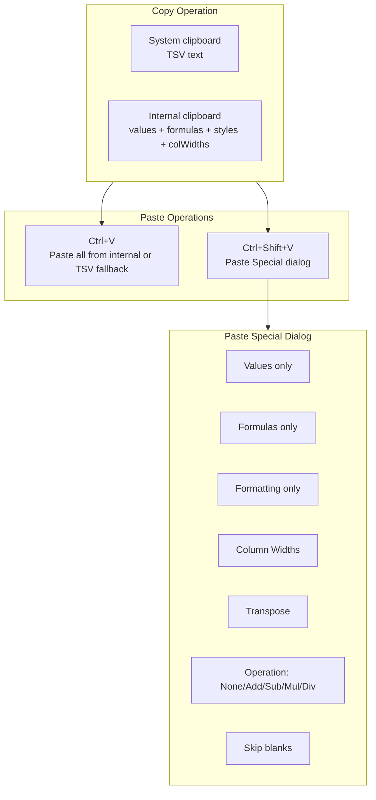

# Paste Special

## Current State

- Copy/Cut/Paste exists using `navigator.clipboard` with plain TSV text
- `getSelectedCellsData()` in `renderer.ts` (line 1142) exports selection as
  tab-separated values
- `pasteData()` in `renderer.ts` (line 1158) imports TSV into cells, detecting
  numbers vs strings
- No internal clipboard -- no way to preserve formulas, styles, or column widths
- Context menu has Cut/Copy/Paste items (`contextMenu.ts` line 173)
- Keyboard shortcuts: Ctrl+X/C/V in `main.ts` (line 1830)

## Architecture

The key insight: the system clipboard only holds text (TSV). To support Paste
Special, we need an **internal clipboard** stored in memory that captures the
full cell data (values, formulas, styles, column widths) alongside the TSV that
goes to the system clipboard.



## Implementation

All TypeScript only -- no Rust changes needed. Four files to modify.

### 1. Internal clipboard data structure (`renderer.ts`)

Add a module-level interface and variable before the `CanvasRenderer` class:

```typescript
interface ClipboardCell {
	value: string;
	dataType: string;
	style?: CellStyle;
	formula?: string; // raw formula text if value starts with '='
}
interface InternalClipboard {
	cells: ClipboardCell[][]; // [row][col] grid
	colWidths: number[]; // widths of source columns
	rowHeights: number[]; // heights of source rows
	sourceRange: SelectionRange;
	isCut: boolean;
}
```

Add a private field `_internalClipboard: InternalClipboard | null = null` to
`CanvasRenderer`.

### 2. Enhanced copy methods (`renderer.ts`)

Add a new method `copySelectionToClipboard(isCut: boolean): string` that:

- Captures `ClipboardCell[][]` for the selected range (value, data_type, style
  from `getCellStyle()`, formula if value starts with `=`)
- Captures column widths for the selected columns
- Captures row heights for the selected rows
- Stores in `_internalClipboard`
- Returns the TSV string (for the system clipboard, same as current
  `getSelectedCellsData()`)

### 3. Paste Special method (`renderer.ts`)

Add `pasteSpecial(options: PasteSpecialOptions): void`:

```typescript
interface PasteSpecialOptions {
	what: "all" | "values" | "formulas" | "formats" | "colWidths";
	operation: "none" | "add" | "subtract" | "multiply" | "divide";
	skipBlanks: boolean;
	transpose: boolean;
}
```

Logic:

- Uses `_internalClipboard` if available; falls back to system clipboard TSV
  (values only)
- `what: 'values'` -- pastes `value` field only, stripping formulas
- `what: 'formulas'` -- pastes raw formula text (or value if not a formula)
- `what: 'formats'` -- applies styles only, leaves cell values unchanged
- `what: 'colWidths'` -- copies source column widths to target columns
- `what: 'all'` -- pastes values + formulas + styles (current behavior enhanced)
- `transpose` -- swaps rows and columns during paste
- `operation` -- applies arithmetic: `existingValue OP pastedValue`
- `skipBlanks` -- skips source cells that are empty

### 4. Paste Special dialog (`pasteSpecialDialog.ts` -- new file)

Follow `formatCellsDialog.ts` pattern (dark theme, draggable):

- Event interface:
  `{ action: 'paste' | 'close', options?: PasteSpecialOptions }`
- Layout:
  - "Paste" radio group: All, Values, Formulas, Formats, Column Widths
  - "Operation" radio group: None, Add, Subtract, Multiply, Divide
  - Checkboxes: Skip blanks, Transpose
  - OK / Cancel buttons
- `show()` / `hide()` public API

### 5. Context menu updates (`contextMenu.ts`)

After the existing `paste` item (line 175), add:

```typescript
{ action: 'pasteSpecial', label: 'Paste Special...', shortcut: 'Ctrl+Shift+V' },
```

### 6. Wiring in `main.ts`

- Update `handleCopy()` and `handleCut()` to call
  `renderer.copySelectionToClipboard(isCut)` instead of
  `renderer.getSelectedCellsData()`
- Update `handlePaste()` to use `renderer.pasteFromClipboard()` which checks
  internal clipboard first
- Add `handlePasteSpecial()` that opens the paste special dialog
- Add Ctrl+Shift+V keyboard shortcut (line ~1840)
- Import and instantiate `PasteSpecialDialog`
- Handle `pasteSpecial` action from context menu and dialog
- Wire ribbon action if a paste dropdown exists

### 7. Ribbon update (`ribbon.ts`)

Add a small dropdown arrow next to the existing Paste button in the Home tab, or
add a "Paste Special" tall button next to Paste.

### Build

Run `node media/build.mjs` from the xlsxRustViewer directory.

## Files to Change

- `renderer.ts` -- internal clipboard, `copySelectionToClipboard()`,
  `pasteSpecial()`, `PasteSpecialOptions` interface
- `pasteSpecialDialog.ts` -- **new file** -- Paste Special options dialog
- `contextMenu.ts` -- add "Paste Special..." menu item
- `main.ts` -- wire dialog, Ctrl+Shift+V shortcut, update copy/cut/paste
  handlers
- `ribbon.ts` -- add Paste Special button/dropdown
