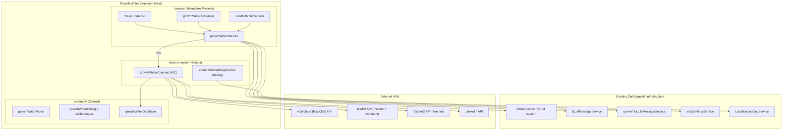

# Growth Writer Extension - Implementation Plan

## Overview

The Growth Writer is SafeAppeals' built-in marketing engine. It lives as a Void
extension inside `src/vs/workbench/contrib/void/` and leverages the existing RAG
pipeline, LLM infrastructure, and IPC architecture to generate, schedule, and
publish SEO-driven content across multiple platforms.

Every piece of content answers: **"How does SafeAppeals help [audience] with
[their problem]?"** RAG over core reference documents ensures content is grounded
in real product capabilities and domain knowledge.

The extension runs inside a dedicated **marketing workspace** - a normal
SafeAppeals workspace folder containing product documentation, feature lists,
use cases, and testimonials as core references. The RAG pipeline indexes these
and uses them as the source of truth for all generated content.

```
Marketing Workspace (core refs) → RAG → LLM → Blog Post → CMS Publish
                                             → Reddit Comments → Subreddit threads
                                             → Tweets → Twitter/X
                                             → LinkedIn Post (business silo only)
```

---

## Architecture



### Process Boundaries

Following the existing Void architecture (same pattern as DocuSign):

- **browser/** - UI components, orchestration service, scheduler timer, Reddit
  monitoring
- **common/** - Types, config, silo examples, database schema (no DOM, no
  Node.js)
- **electron-main/** - All HTTP calls to external APIs (Reddit, Twitter,
  LinkedIn, Blog CMS) via IPC channel. SQLite operations for growth data.
  Content embedding for semantic dedup.

---

## Marketing Workspace

The Growth Writer is an extension, not a standalone app, specifically to leverage
SafeAppeals' RAG pipeline. It runs inside a dedicated marketing workspace:

```
D:\SafeAppeals-Marketing\
├── Core_References\
│   ├── product_features.md          # Full feature list with details
│   ├── use_cases_lawyers.md         # Lawyer-specific workflows & value props
│   ├── use_cases_researchers.md     # Academic/research use cases
│   ├── use_cases_students.md        # Student-specific use cases
│   ├── use_cases_business.md        # Business/consulting use cases
│   ├── competitor_comparison.md     # How SafeAppeals differs from alternatives
│   ├── testimonials.md              # User quotes and success stories
│   ├── faq.md                       # Common questions and answers
│   └── app_changelog.md             # Recent features for timely content
├── Blog_Archive\                    # Past published blog posts for reference
├── Content_Examples\                # Gold-standard examples per silo (few-shot)
│   ├── example_blog_lawyers.md
│   ├── example_blog_researchers.md
│   ├── example_reddit_comment.md
│   └── example_tweets.md
└── .fileorg.json                    # Workspace config
```

These documents are indexed as core references via the existing RAG pipeline.
When the LLM generates content, it queries these docs for real product facts,
feature descriptions, and use cases - not hallucinated marketing copy.

---

## Content Silos

Four audience segments, each with dedicated subreddits and content angles:

| Silo            | Audience                    | Content Angle                                        | Subreddits                                                                | Keywords to Monitor                                                   |
| --------------- | --------------------------- | ---------------------------------------------------- | ------------------------------------------------------------------------- | --------------------------------------------------------------------- |
| **lawyers**     | Legal professionals         | Case document organization, appeal workflows         | r/LawFirm, r/legaladvicecanada, r/lawyers, r/WorkersComp, r/paralegal     | "organize case files", "document management law", "legal paperwork"   |
| **researchers** | PhD / academics             | Dissertation organization, research paper management | r/PhD, r/AskAcademia, r/GradSchool, r/academia, r/ResearchPapers          | "organize research papers", "dissertation files", "reference manager" |
| **students**    | College students            | Grade appeals, essay organization, study docs        | r/college, r/GradSchool, r/ApplyingToCollege, r/StudentLoans, r/studytips | "organize school files", "grade appeal", "essay organization"         |
| **business**    | Entrepreneurs / consultants | Client reports, proposals, business docs             | r/Entrepreneur, r/consulting, r/smallbusiness, r/startups, r/freelance    | "organize client docs", "proposal management", "business documents"   |

Content types per silo:

- **Product-focused**: "How SafeAppeals helps [audience] with [task]"
- **Educational**: "[N] tips for [audience problem]"
- **Problem-solving**: "Why [common pain point] and how to fix it"

---

## Reddit Strategy: Comment-First Approach

**Posting new self-promotion threads is the fastest way to get banned on Reddit.**
Most subreddits enforce strict self-promotion ratios (typically 10:1 community
participation to self-promo).

### Primary: Monitor & Comment

The extension monitors target subreddits for questions matching silo keywords.
When it finds a relevant thread:

1. AI scores the opportunity (relevance + recency + engagement potential)
2. Generates a genuinely helpful comment that answers the question
3. Naturally links to the relevant blog post at the end: _"I wrote a full guide
   on this: [link]"_
4. Queues for approval (Phase 1) or auto-posts (Phase 2)

```
Monitor r/LawFirm for "organize case files"
  → Find thread: "How do you all organize your case documents?"
  → Generate comment: "I've been dealing with this for years. Here's what
     worked for me: [3 specific tips]. I actually wrote a full guide on this
     with templates: [blog link]"
  → Queue for approval → Post comment
```

### Secondary: Occasional Top-Level Posts

Top-level posts are reserved for subreddits that explicitly welcome long-form
guides (e.g., r/WorkersComp, r/Entrepreneur). These should be rare (1-2 per
month per subreddit max) and must be genuinely valuable standalone content.

### Account Warm-Up Period

New or dormant Reddit accounts posting links immediately get shadowbanned. The
extension enforces a warm-up period:

- **Weeks 1-2**: Comment helpfully on posts with NO links. Build karma.
- **Weeks 3-4**: Start including blog links in comments (1-2 per day max).
- **Week 5+**: Ramp to full cadence.

Track account health:

- Karma per subreddit
- Post/comment removal rate (if > 10%, back off immediately)
- Time since last removal

---

## Weekly Schedule

| Day           | Silo        | Blog   | Reddit            | Twitter                  | LinkedIn |
| ------------- | ----------- | ------ | ----------------- | ------------------------ | -------- |
| **Monday**    | Lawyers     | 1 post | Monitor + comment | 5 tweets                 | -        |
| **Tuesday**   | _(none)_    | -      | Monitor + comment | 5 tweets (reshare/promo) | -        |
| **Wednesday** | Researchers | 1 post | Monitor + comment | 5 tweets                 | -        |
| **Thursday**  | Students    | 1 post | Monitor + comment | 5 tweets                 | -        |
| **Friday**    | Business    | 1 post | Monitor + comment | 5 tweets                 | 1 post   |
| **Saturday**  | _(none)_    | -      | Monitor + comment | 5 tweets (reshare/promo) | -        |
| **Sunday**    | _(none)_    | -      | Monitor + comment | 5 tweets (reshare/promo) | -        |

### Schedule Flexibility

The default schedule above is a preference, not a hard lock. The system supports
manual overrides:

```typescript
interface ScheduleConfig {
	siloSchedule: {
		lawyers: { preferredDay: "monday"; priority: 1 };
		researchers: { preferredDay: "wednesday"; priority: 2 };
		students: { preferredDay: "thursday"; priority: 3 };
		business: { preferredDay: "friday"; priority: 4 };
	};
	allowOverride: true; // can manually bump a silo to any day
	maxBlogsPerWeek: 4; // hard cap regardless of overrides
}
```

If a trending topic in the students space breaks on a Monday, you can override
the schedule and push a timely post.

### Posting Rules

- **Reddit**: Comment-first. Monitor subreddits daily for relevant threads.
  Comments are helpful answers with natural blog links. Minimum 7-day cooldown
  per subreddit for top-level posts. Unique content per comment (no copy-paste).
- **Twitter**: 5 tweets/day, drip-posted ~3 hours apart. Mix of blog promotion,
  app features, silo-relevant tips. Free tier (1,500 tweets/month = 50/day).
- **LinkedIn**: Professional tone, business-focused only. One post per week on
  Fridays.
- **Blog**: Published via existing `POST /blog/posts` API with `X-API-Key` auth.

### UTM Tracking

Every link to the blog includes UTM parameters for analytics:

```
safeappeals.com/blog/organize-case-documents
  ?utm_source=reddit
  &utm_medium=comment
  &utm_campaign=lawyers_wk3
  &utm_content=r_LawFirm
```

This tracks which silo, platform, subreddit, and week drives actual traffic.
Without this, optimization is guesswork.

---

## Approval Flow

### Phase 1 (Current)

Auto-generate all content → queue in Growth Writer panel → manually review and
approve each piece before publishing. This lets us dial in prompt quality.

### Phase 2 (Future)

Toggle per-platform to fully automated. Scheduler generates and publishes
without human intervention once prompts are proven.

---

## Few-Shot Examples (Gold Standard Templates)

LLMs produce significantly better output when given examples of what good looks
like. Each silo has 3-5 manually-written "gold standard" examples stored in
the marketing workspace's `Content_Examples/` folder and loaded into
`growthWriterConfig.ts`:

```typescript
interface SiloExamples {
	blogExcerpt: string; // opening paragraph style to emulate
	redditComment: string; // helpful comment with natural link placement
	tweetThread: string[]; // 5-tweet thread example
	linkedInPost?: string; // professional post example (business silo only)
}
```

These are injected into the LLM prompt as few-shot examples during content
generation. They define tone, structure, and link placement style.

---

## Content Quality: Semantic Dedup

Simple content hashing (SHA-256) catches identical content but misses
**semantically similar** content:

- "5 Tips for Organizing Case Documents" vs "How to Organize Your Legal Files"
  → different hashes, same topic

The extension uses the existing `LocalEmbeddingService` to embed blog idea
titles and check cosine similarity against existing ideas:

1. Before storing a new blog idea, embed the title
2. Check similarity against all existing ideas in the same silo
3. If similarity > 0.85, flag as potential duplicate
4. User decides: keep, merge, or reject

This reuses the same embedding model already loaded for RAG (no additional
model download).

---

## Engagement Metrics & Feedback Loop

The plan must track what **works**, not just what was posted. Metrics flow back
to optimize future content.

### Metrics Collected

| Platform | Metrics                                | How                                       |
| -------- | -------------------------------------- | ----------------------------------------- |
| Reddit   | upvotes, comment count, removal status | Reddit API polling (1x/day)               |
| Twitter  | likes, retweets, impressions           | Twitter API (1x/day)                      |
| Blog     | page views by UTM source               | Google Analytics UTM data (manual or API) |
| LinkedIn | likes, comments, impressions           | LinkedIn API (1x/day)                     |

### Feedback Into Content Generation

Stored in a `metrics` JSON column on `growth_social_posts`. Periodically
analyzed:

- "Reddit comments about document organization for lawyers get 5x more upvotes
  than comments about timeline features → generate more document organization
  content for lawyers silo"
- "Tweets with specific feature mentions get 3x more engagement than generic
  promo tweets → include specific features in tweet prompts"

This data feeds back into the blog ideas engine (adjust priority scores) and
prompt templates (adjust emphasis).

---

## Two-Mode LLM Usage

The extension uses the LLM in two distinct ways:

### 1. Automated (Programmatic) - Primary

The scheduler/service calls `ILLMMessageService` directly with structured
prompt templates from `growthWriterConfig.ts`. No chat UI involved.

- Custom system prompt tailored for content generation
- Includes RAG context, silo config, few-shot examples
- Outputs structured content (blog HTML, Reddit markdown, tweets)
- No mode switching needed - bypasses `chatMode` entirely

### 2. Interactive (Chat Mode) - Secondary

User switches to `blog_writer` mode in the sidebar to refine a draft
conversationally:

- "Make this more conversational"
- "Add a section about the AI workspace features"
- "Rewrite the Reddit comment to be less promotional"

The `blog_writer` chat mode is lightweight - stripped identity + "you're helping
refine marketing content." The heavy prompt engineering lives in the automated
templates.

---

## Blog Writer Chat Mode (`blog_writer`)

The Growth Writer extension needs its own LLM chat mode separate from the
existing `case_manager`, `research`, and `drafting` modes. This prevents
blog-writing prompts from interfering with the core workers' comp system prompt,
and lets us tune the content generation prompt independently.

### How Modes Work Today

The system prompt is assembled in `common/prompt/systemPrompt.ts`:

```
getSystemPrompt(options) →
  1. Identity & Purpose (workers' comp case assistant)
  2. Response Style
  3. Professional Objectivity
  4. Planning Guidelines
  5. Mode-Specific Workflow  ← getModeSpecificWorkflow(mode)
  6. Tool Calling Format
  7. Parallel Tool Strategy  ← getParallelToolStrategy(mode)
  8. Policy Verification Workflow
  9. Medical Evidence Analysis
  10. Document Handling
  11. Document Citation Format
  12. Timeline Management
  13. Case Configuration
  14. Workspace Configuration
  15. Communication Standards
  16. Error Handling
  17. File Operations Safety
  18. File Organization
  19. Context Window Management
  20. System Environment
  21. Workspace Structure
```

The `ChatMode` type is defined in `common/voidSettingsTypes.ts`:

```typescript
export type ChatMode = "case_manager" | "research" | "drafting";
```

### What Changes for `blog_writer` Mode

**1. Extend the `ChatMode` type:**

```typescript
export type ChatMode = "case_manager" | "research" | "drafting" | "blog_writer";
```

**2. Conditionally exclude irrelevant sections in `getSystemPrompt()`:**

When `mode === 'blog_writer'`, the following WC-specific sections should be
**skipped** (they waste tokens and confuse the LLM):

- Policy Verification Workflow (section 5)
- Medical Evidence Analysis (section 5.5)
- Timeline Management (section 8)
- Case Configuration usage (section 9)
- Workspace Configuration creation (section 10)
- File Organization with terminal commands (section 14)

The following sections should be **kept** (still useful):

- Response Style (section 1.5)
- Professional Objectivity (section 1.6)
- Tool Calling Format (section 3) - still needs RAG tools
- Context Window Management (section 6)
- System Environment (section 7)
- Error Handling (section 13)

**3. Override Identity & Purpose (section 1):**

Replace the workers' comp case assistant identity with a content marketing
identity when in `blog_writer` mode:

```
You are an expert SEO content writer and social media strategist for
SafeAppeals, a document organization and AI workspace tool.

Your job is to create compelling, audience-specific content that:
- Demonstrates how SafeAppeals solves real problems for [silo audience]
- Is grounded in factual product capabilities via RAG core references
- Follows SEO best practices (keyword density, headers, meta descriptions)
- Adapts tone and style per platform (blog vs Reddit vs Twitter vs LinkedIn)

You have access to RAG tools to search the product's core reference documents
and generate content grounded in real features and capabilities.
```

**4. Add `blog_writer` mode workflow in `getModeSpecificWorkflow()`:**

The blog writer mode workflow defines:

- **Blog writing workflow**: RAG query → outline → draft → SEO optimization
- **Reddit comment generation**: Genuinely helpful answer + natural link
  placement, subreddit-aware tone
- **Twitter thread generation**: Hook tweet → value tweets → CTA tweet
- **LinkedIn post generation**: Professional tone, business value focus
- **Content quality checklist**: Originality, factual grounding, SEO score,
  platform compliance

**5. Add `blog_writer` parallel tool strategy in `getParallelToolStrategy()`:**

```
✅ PARALLEL (content research phase):
[
  rag_search_reference("SafeAppeals features for lawyers"),
  rag_search_reference("document organization case management"),
  rag_search_reference("AI workspace capabilities")
]

❌ SEQUENTIAL (content generation):
Step 1: Generate blog outline from RAG context
Step 2: Write full blog post
Step 3: Generate social post variants
Step 4: Store all drafts in SQLite
```

### Files to Modify

- `common/voidSettingsTypes.ts` - Add `'blog_writer'` to `ChatMode` union type
- `common/prompt/systemPrompt.ts` - Add conditional section exclusion for
  `blog_writer` mode, add `blog_writer` identity override, add
  `getModeSpecificWorkflow()` and `getParallelToolStrategy()` branches

---

## Local Storage (SQLite)

All tracking data lives in the workspace's micro-database (same pattern as
existing RAG SQLite). No data stored on the website/cloud side.

### Schema

#### `growth_blog_ideas`

The AI-generated backlog of blog topics per silo.

```sql
CREATE TABLE IF NOT EXISTS growth_blog_ideas (
    id TEXT PRIMARY KEY,
    silo TEXT NOT NULL CHECK (silo IN ('lawyers', 'researchers', 'students', 'business')),
    title TEXT NOT NULL,
    description TEXT,
    keywords TEXT,           -- JSON array of SEO keywords
    content_angle TEXT,      -- 'product' | 'educational' | 'problem_solving'
    source TEXT NOT NULL DEFAULT 'ai',  -- 'ai' | 'manual'
    status TEXT NOT NULL DEFAULT 'pending',  -- 'pending' | 'used' | 'rejected'
    priority INTEGER DEFAULT 0,
    embedding_hash TEXT,     -- for semantic dedup (cosine similarity check)
    created_at TEXT NOT NULL DEFAULT (datetime('now')),
    used_at TEXT
);
CREATE INDEX idx_ideas_silo_status ON growth_blog_ideas(silo, status);
```

#### `growth_campaigns`

One row per silo-day execution (the atomic unit of work).

```sql
CREATE TABLE IF NOT EXISTS growth_campaigns (
    id TEXT PRIMARY KEY,
    silo TEXT NOT NULL CHECK (silo IN ('lawyers', 'researchers', 'students', 'business')),
    blog_idea_id TEXT REFERENCES growth_blog_ideas(id),
    blog_title TEXT,
    blog_slug TEXT,
    blog_content TEXT,       -- full HTML content
    blog_cms_id TEXT,        -- UUID from CMS after publishing
    blog_url TEXT,           -- full URL including UTM base
    status TEXT NOT NULL DEFAULT 'generating',
    -- Status flow: generating → draft → approved → publishing → published → failed
    scheduled_for TEXT,      -- ISO datetime for when this campaign should run
    generated_at TEXT,
    approved_at TEXT,
    published_at TEXT,
    error_message TEXT,
    created_at TEXT NOT NULL DEFAULT (datetime('now'))
);
CREATE INDEX idx_campaigns_status ON growth_campaigns(status);
CREATE INDEX idx_campaigns_silo ON growth_campaigns(silo, scheduled_for);
```

#### `growth_social_posts`

Every Reddit comment, Twitter tweet, and LinkedIn post tied to a campaign.

```sql
CREATE TABLE IF NOT EXISTS growth_social_posts (
    id TEXT PRIMARY KEY,
    campaign_id TEXT NOT NULL REFERENCES growth_campaigns(id),
    platform TEXT NOT NULL CHECK (platform IN ('reddit', 'twitter', 'linkedin')),
    channel TEXT,            -- subreddit name (reddit) or null (twitter/linkedin)
    post_type TEXT,          -- 'comment' | 'top_level' | 'tweet' | 'thread' | 'post'
    title TEXT,              -- post title (reddit top_level only)
    body TEXT NOT NULL,
    content_hash TEXT,       -- SHA-256 for exact dedup
    utm_url TEXT,            -- blog link with UTM params for this specific post
    status TEXT NOT NULL DEFAULT 'draft',
    -- Status flow: draft → approved → scheduled → posting → posted → failed
    scheduled_for TEXT,      -- ISO datetime (for twitter drip scheduling)
    posted_at TEXT,
    post_url TEXT,           -- URL after posting
    reddit_parent_id TEXT,   -- reddit thread ID being commented on (comments only)
    error_message TEXT,
    metrics TEXT,            -- JSON: { upvotes, comments, likes, retweets, impressions }
    metrics_updated_at TEXT,
    created_at TEXT NOT NULL DEFAULT (datetime('now'))
);
CREATE INDEX idx_social_campaign ON growth_social_posts(campaign_id);
CREATE INDEX idx_social_status ON growth_social_posts(status, platform);
CREATE INDEX idx_social_hash ON growth_social_posts(content_hash);
```

#### `growth_subreddit_config`

Per-silo subreddit tracking with cooldown management.

```sql
CREATE TABLE IF NOT EXISTS growth_subreddit_config (
    id TEXT PRIMARY KEY,
    silo TEXT NOT NULL CHECK (silo IN ('lawyers', 'researchers', 'students', 'business')),
    subreddit_name TEXT NOT NULL,
    display_name TEXT,       -- human-friendly name
    rules_summary TEXT,      -- key posting rules for this subreddit
    monitor_keywords TEXT,   -- JSON array of keywords to watch for
    cooldown_days INTEGER NOT NULL DEFAULT 7,
    last_posted_at TEXT,
    last_commented_at TEXT,
    total_posts INTEGER DEFAULT 0,
    total_comments INTEGER DEFAULT 0,
    is_active INTEGER NOT NULL DEFAULT 1,
    created_at TEXT NOT NULL DEFAULT (datetime('now')),
    UNIQUE(silo, subreddit_name)
);
CREATE INDEX idx_subreddit_silo ON growth_subreddit_config(silo, is_active);
```

#### `growth_reddit_opportunities`

Threads found by the subreddit monitor that are good commenting opportunities.

```sql
CREATE TABLE IF NOT EXISTS growth_reddit_opportunities (
    id TEXT PRIMARY KEY,
    subreddit TEXT NOT NULL,
    silo TEXT NOT NULL,
    reddit_post_id TEXT NOT NULL UNIQUE,
    reddit_post_title TEXT NOT NULL,
    reddit_post_url TEXT NOT NULL,
    reddit_post_body TEXT,
    matched_keywords TEXT,   -- JSON array of keywords that matched
    relevance_score REAL,    -- AI-scored 0.0 to 1.0
    status TEXT NOT NULL DEFAULT 'found',
    -- Status flow: found → drafted → approved → commented → skipped → expired
    comment_body TEXT,       -- generated comment draft
    social_post_id TEXT REFERENCES growth_social_posts(id),
    found_at TEXT NOT NULL DEFAULT (datetime('now')),
    expires_at TEXT           -- threads older than 24h lose relevance
);
CREATE INDEX idx_opportunities_status ON growth_reddit_opportunities(status, silo);
CREATE INDEX idx_opportunities_reddit ON growth_reddit_opportunities(reddit_post_id);
```

#### `growth_platform_auth`

Encrypted OAuth tokens for each platform.

```sql
CREATE TABLE IF NOT EXISTS growth_platform_auth (
    platform TEXT PRIMARY KEY CHECK (platform IN ('reddit', 'twitter', 'linkedin')),
    access_token_encrypted TEXT,
    refresh_token_encrypted TEXT,
    expires_at TEXT,
    account_name TEXT,
    account_karma INTEGER,   -- reddit karma tracking
    warmup_started_at TEXT,  -- when warmup period began
    warmup_complete INTEGER DEFAULT 0,  -- 1 when warmup is done
    removal_count INTEGER DEFAULT 0,    -- track removed posts/comments
    last_removal_at TEXT,
    created_at TEXT NOT NULL DEFAULT (datetime('now')),
    updated_at TEXT
);
```

---

## UI Architecture: Sidebar + Editor Pane

The Growth Writer uses **both** VSCode UI patterns - the sidebar for navigation
and controls, and the editor area for full-content views. This takes full
advantage of how VSCode works: the sidebar is the command center, the editor
area is the workspace.

### Existing Patterns in SafeAppeals

| Pattern              | Used By                                  | Location                        | Purpose                             |
| -------------------- | ---------------------------------------- | ------------------------------- | ----------------------------------- |
| **Sidebar ViewPane** | Chat, Timeline, Email Dashboard          | `ViewContainerLocation.Sidebar` | Compact navigation, controls, lists |
| **Editor Pane**      | Settings, Browser, PDF/DOCX/XLSX viewers | `EditorPane` + `EditorInput`    | Full-width content, rich editing    |

### Growth Writer UI Layout

```
┌──────────────────────────────────────────────────────────────────┐
│  Activity Bar  │  Sidebar (Growth Writer)  │  Editor Area        │
│                │                           │                     │
│  [Chat]        │  ┌─ Campaign Queue ─────┐ │  ┌─ Blog Editor ──┐│
│  [Files]       │  │ Mon: Lawyers ✓       │ │  │                ││
│  [Timeline]    │  │ Wed: Researchers ⏳  │ │  │  Full blog     ││
│  [Email]       │  │ Thu: Students        │ │  │  post content  ││
│ >[Growth] ◄────│  │ Fri: Business        │ │  │  with rich     ││
│  [Settings]    │  └──────────────────────┘ │  │  preview &     ││
│                │  ┌─ Reddit Opps ────────┐ │  │  editing       ││
│                │  │ r/LawFirm: 3 threads │ │  │                ││
│                │  │ r/PhD: 1 thread      │ │  │                ││
│                │  └──────────────────────┘ │  └────────────────┘│
│                │  ┌─ Quick Stats ────────┐ │                     │
│                │  │ Posts: 12/15 this wk │ │  Tabs: [Blog] [Reddit] [Schedule]│
│                │  │ Tweets: 28/35        │ │                     │
│                │  │ Ideas: 47 pending    │ │                     │
│                │  └──────────────────────┘ │                     │
└──────────────────────────────────────────────────────────────────┘
```

### Sidebar (ViewPane → `ViewContainerLocation.Sidebar`)

Compact, always-visible control panel. Shows at-a-glance status and quick
actions. Follows the same pattern as Timeline and Email Dashboard.

**Sections:**

- **Campaign Queue** - This week's campaigns with status indicators (✓ done,
  ⏳ pending, ▶ in progress). Click to open the full campaign in the editor.
- **Reddit Opportunities** - Live feed of found threads with relevance scores.
  Click to open the comment drafting view in the editor.
- **Quick Stats** - Weekly progress (posts published, tweets sent, ideas
  remaining). Account health indicators.
- **Quick Actions** - Buttons: "Generate Ideas", "New Campaign",
  "Open Schedule", "Open History"

**Registration pattern** (same as Timeline):

```typescript
// growthWriter.contribution.ts
const container = viewContainerRegistry.registerViewContainer(
	{
		id: "workbench.view.growthWriter",
		title: "Growth Writer",
		icon: Codicon.megaphone, // or Codicon.rocket
	},
	ViewContainerLocation.Sidebar,
);

viewsRegistry.registerViews(
	[
		{
			id: "workbench.view.growthWriter",
			name: "Growth Writer",
			ctorDescriptor: new SyncDescriptor(GrowthWriterPane),
		},
	],
	container,
);
```

### Editor Pane (EditorPane + EditorInput)

Full-width workspace views that open as tabs in the editor area. Used for
content that needs space: blog editing, comment drafting, schedule management,
history/metrics.

**Editor views (each opens as a tab):**

| Tab                   | Purpose                                                                                                             | Opened From                  |
| --------------------- | ------------------------------------------------------------------------------------------------------------------- | ---------------------------- |
| **Blog Editor**       | View/edit full blog post draft. Rich preview with HTML rendering. Side-by-side markdown source + preview.           | Click campaign in sidebar    |
| **Social Posts**      | View/edit all social posts for a campaign (Reddit comments, tweets, LinkedIn). Per-platform tabs within the editor. | Click campaign in sidebar    |
| **Reddit Comment**    | Draft a comment for a specific Reddit thread. Shows the original thread context + your draft. Approve/post button.  | Click opportunity in sidebar |
| **Blog Ideas**        | Full idea backlog per silo. Table view with filters, bulk actions, drag-to-reorder priority.                        | Sidebar "Ideas" button       |
| **Schedule**          | Weekly calendar view. Drag campaigns between days. Override controls.                                               | Sidebar "Schedule" button    |
| **History & Metrics** | Past campaigns with engagement data. Charts showing trends per silo/platform.                                       | Sidebar "History" button     |
| **Account Health**    | Reddit karma tracking, warmup progress, removal log, platform auth status.                                          | Sidebar stats section        |

**Registration pattern** (same as Settings pane):

```typescript
// growthWriterEditorPane.ts
class GrowthWriterEditorInput extends EditorInput {
    static readonly ID = 'workbench.input.growthWriter';
    // Resource URI encodes which view: void://growth-writer/blog-editor?campaignId=xxx
}

class GrowthWriterEditorPane extends EditorPane {
    static readonly ID = 'void.growthWriterEditor';
    // Mounts React component based on the input's view type
    protected createEditor(parent: HTMLElement): void {
        // Mount appropriate React view based on input
    }
}

// Register
Registry.as<IEditorPaneRegistry>(EditorExtensions.EditorPane)
    .registerEditorPane(
        EditorPaneDescriptor.create(GrowthWriterEditorPane, ...),
        [new SyncDescriptor(GrowthWriterEditorInput)]
    );
```

### Interaction Flow

1. User clicks Growth Writer icon in Activity Bar → sidebar opens
2. Sidebar shows campaign queue, Reddit opportunities, quick stats
3. User clicks a campaign → **Blog Editor** opens as a tab in editor area
4. User reviews blog draft in full-width editor, makes edits
5. User clicks "Approve" → sidebar updates status to ✓
6. User clicks a Reddit opportunity → **Reddit Comment** opens as a tab
7. User reviews thread context + generated comment, edits if needed
8. User clicks "Post Comment" → sidebar updates with posted status
9. User clicks "Schedule" in sidebar → **Schedule** opens as a tab showing
   weekly calendar

### Why This Split Works

- **Sidebar** = what you see at a glance. Compact, scannable, always visible
  while editing content in the editor area. No scrolling through long content.
- **Editor** = where you do the work. Full-width blog editing, comment drafting,
  metrics charts. Can have multiple tabs open (blog + social posts + schedule)
  and switch between them like you would between code files.
- **Both together** = sidebar shows the queue and status, editor shows the
  content you're working on. Exactly how VSCode's file explorer (sidebar) +
  code editor (tabs) interaction works.

---

## File Structure

```
src/vs/workbench/contrib/void/
├── common/growthWriter/
│   ├── growthWriterTypes.ts            # All TypeScript types and interfaces
│   ├── growthWriterConfig.ts           # Silo definitions, subreddits, schedule,
│   │                                   # prompt templates, few-shot examples
│   └── growthWriterDatabase.ts         # SQLite schema definitions and constants
│
├── browser/
│   ├── growthWriter/
│   │   ├── growthWriterService.ts      # Main orchestrator (IPC to main, RAG, LLM)
│   │   ├── growthWriterScheduler.ts    # Timer-based scheduler (cron-like)
│   │   ├── redditMonitorService.ts     # Subreddit keyword monitoring
│   │   ├── growthWriter.contribution.ts # Registers sidebar + editor + commands
│   │   ├── growthWriterPane.ts         # Sidebar ViewPane (compact controls)
│   │   ├── growthWriterEditorPane.ts   # Editor Pane (full-width content views)
│   │   └── growthWriterEditorInput.ts  # EditorInput for routing to views
│   └── react/src/growth-writer-tsx/
│       ├── sidebar/
│       │   ├── GrowthWriterSidebar.tsx  # Main sidebar: queue, opps, stats
│       │   ├── CampaignQueue.tsx        # Campaign list with status indicators
│       │   ├── RedditOpsFeed.tsx        # Live Reddit opportunity feed
│       │   └── QuickStats.tsx           # Weekly progress, account health
│       ├── editor/
│       │   ├── BlogEditor.tsx           # Full blog post editor + preview
│       │   ├── SocialPostsEditor.tsx    # Reddit/Twitter/LinkedIn post editor
│       │   ├── RedditCommentEditor.tsx  # Thread context + comment draft
│       │   ├── BlogIdeasTable.tsx       # Full idea backlog table
│       │   ├── ScheduleCalendar.tsx     # Weekly calendar with drag-drop
│       │   ├── HistoryMetrics.tsx       # Past campaigns + engagement charts
│       │   └── AccountHealth.tsx        # Platform auth, karma, warmup
│       └── shared/
│           ├── SiloSelector.tsx         # Silo picker (lawyers/researchers/etc)
│           └── StatusBadge.tsx          # Consistent status indicators
│
└── electron-main/
    └── growthWriter/
        ├── growthWriterChannel.ts       # IPC channel (DocuSignChannel pattern)
        ├── growthWriterDatabase.ts      # SQLite CRUD operations (main process)
        ├── contentEmbeddingService.ts   # Semantic dedup via LocalEmbeddingService
        ├── blogPublisher.ts             # HTTP client for void-cloud blog CMS API
        ├── redditClient.ts              # Reddit API: OAuth2, monitor, comment, post
        ├── twitterClient.ts             # Twitter/X API: OAuth2, tweet, threads
        ├── linkedinClient.ts            # LinkedIn API: OAuth2, posts
        └── metricsCollector.ts          # Periodic engagement metrics fetching
```

---

## Existing Infrastructure Used

### RAG Pipeline

```typescript
// Query core references for content generation
const contextPack = await ragService.search({
	query: "How does SafeAppeals help lawyers organize case documents",
	scope: "core_references",
	limit: 10,
	workspaceId: ragService.getWorkspaceId(),
});
// contextPack.answerContext contains assembled chunks with attributions
```

### LLM Message Service

```typescript
// Automated: Call ILLMMessageService directly with custom system prompt
// Interactive: Use blog_writer chat mode in sidebar for draft refinement
```

### LocalEmbeddingService (for semantic dedup)

```typescript
// Reuse existing embedding model for content similarity checking
// Already loaded for RAG - no additional model download needed
```

### IPC Channel Pattern (from DocuSignChannel)

```typescript
// electron-main/growthWriterChannel.ts
export class GrowthWriterChannel implements IServerChannel {
	async call(_ctx: any, command: string, params?: any): Promise<any> {
		switch (command) {
			case "publishBlog":
				return this.publishBlog(params);
			case "commentOnReddit":
				return this.commentOnReddit(params);
			case "postToReddit":
				return this.postToReddit(params);
			case "postToTwitter":
				return this.postToTwitter(params);
			case "postToLinkedIn":
				return this.postToLinkedIn(params);
			case "monitorSubreddits":
				return this.monitorSubreddits(params);
			case "fetchMetrics":
				return this.fetchMetrics(params);
			case "checkSimilarity":
				return this.checkSimilarity(params);
			// ... CRUD for all tables
		}
	}
}
```

### Blog CMS API (existing)

```
POST https://api.safeappeals.com/blog/posts
X-API-Key: <BLOG_API_KEY>
Content-Type: application/json

{
    "title": "5 Tips for Organizing Workers' Comp Appeal Documents",
    "content": "<h2>...</h2><p>...</p>",
    "excerpt": "Learn how to...",
    "tags": ["workers-comp", "legal-tips"],
    "status": "published"
}
```

---

## Platform API Details — Reddit (Deep Research)

### Decision: Script App + Raw Fetch

- **App Type**: **Script app** (personal use, single account, simpler auth flow)
  - Installed app is for distributed apps — not needed since we control the machine
  - Script app uses password grant — no browser redirect needed
  - Tokens last 24h, re-auth with credentials when expired (no refresh token)
- **Library**: **Raw `fetch`** (no wrapper libraries)
  - `snoowrap` — archived mid-2024, depends on deprecated `request` package
  - `snoots` — archived June 2023
  - `traw` — 4 GitHub stars, too immature
  - Raw fetch gives full control, Electron compatibility, TypeScript-first types

### Registration

1. Go to https://www.reddit.com/prefs/apps while logged in
2. Click "are you a developer? create an app..."
3. Select **"script"** type
4. Set redirect URI to `http://localhost` (required but unused for script apps)
5. Record **Client ID** (14-char string under app name) and **Client Secret**

### OAuth2 Scopes Needed

```
identity read submit flair history vote edit
```

| Scope      | Permission                             |
| ---------- | -------------------------------------- |
| `identity` | Access username and signup date        |
| `read`     | Read posts and comments                |
| `submit`   | Submit posts and comments              |
| `flair`    | Set post flair                         |
| `history`  | Access comment/post history            |
| `vote`     | Upvote/downvote (for engagement ratio) |
| `edit`     | Edit own posts and comments            |

### User-Agent (Critical — Reddit Bans Default UAs)

```
electron:com.safeappeals.growthwriter:v1.0.0 (by /u/YourRedditUsername)
```

Reddit bans `node-fetch`, `axios`, `Python/urllib` and generic UAs "with extreme
prejudice."

### Authentication Flow (Script App)

```typescript
async function getAccessToken(): Promise<{
	access_token: string;
	token_type: string;
	expires_in: number; // 86400 = 24 hours
	scope: string;
}> {
	const credentials = Buffer.from(
		`${REDDIT_CLIENT_ID}:${REDDIT_CLIENT_SECRET}`,
	).toString("base64");

	const response = await fetch("https://www.reddit.com/api/v1/access_token", {
		method: "POST",
		headers: {
			Authorization: `Basic ${credentials}`,
			"Content-Type": "application/x-www-form-urlencoded",
			"User-Agent": USER_AGENT,
		},
		body: new URLSearchParams({
			grant_type: "password",
			username: REDDIT_USERNAME,
			password: REDDIT_PASSWORD,
		}).toString(),
	});

	return response.json();
}
```

**Note**: Script apps do NOT receive a `refresh_token`. Re-authenticate with
password grant when the 24h token expires. Store credentials in Electron's
`safeStorage`.

### Base URLs

| Purpose                       | URL                                          |
| ----------------------------- | -------------------------------------------- |
| Token requests                | `https://www.reddit.com/api/v1/access_token` |
| All API calls (authenticated) | `https://oauth.reddit.com`                   |
| Public (unauthenticated)      | `https://www.reddit.com` (append `.json`)    |

### Rate Limits

| Type                             | Limit                                               | Tracking                  |
| -------------------------------- | --------------------------------------------------- | ------------------------- |
| OAuth authenticated              | **100 requests per minute** (safe baseline: 60 QPM) | Per OAuth client ID       |
| Unauthenticated                  | ~10 requests/minute                                 | Per IP                    |
| Posting/commenting (new account) | 1 action per 5-10 minutes                           | Per account per subreddit |
| Posting/commenting (established) | Rarely rate-limited                                 | Per account               |

**Response headers to monitor:**

```
X-Ratelimit-Used: 15          # Requests consumed this window
X-Ratelimit-Remaining: 585    # Requests remaining
X-Ratelimit-Reset: 342        # Seconds until quota resets
```

### Thing Type Prefixes (Fullnames)

| Prefix | Type         | Example      |
| ------ | ------------ | ------------ |
| `t1_`  | Comment      | `t1_cvp5afk` |
| `t2_`  | Account/User | `t2_1w72`    |
| `t3_`  | Post/Link    | `t3_abc123`  |
| `t4_`  | Message      | `t4_xyz789`  |
| `t5_`  | Subreddit    | `t5_2qh33`   |

### Pagination (Listing Model)

All listing endpoints return a `Listing` wrapper with cursor-based pagination:

```json
{
  "kind": "Listing",
  "data": {
    "after": "t3_abc123",
    "before": null,
    "children": [{ "kind": "t3", "data": { ... } }],
    "dist": 25
  }
}
```

Parameters: `limit` (max 100), `after` (next page cursor), `before` (prev page).
Reddit caps total retrievable items at ~1000 per listing endpoint.

### API Endpoint Reference

| Operation            | Method | Endpoint                                                 |
| -------------------- | ------ | -------------------------------------------------------- |
| Get token            | POST   | `www.reddit.com/api/v1/access_token`                     |
| Current user / karma | GET    | `oauth.reddit.com/api/v1/me`                             |
| New posts            | GET    | `oauth.reddit.com/r/{sub}/new`                           |
| Combined subs        | GET    | `oauth.reddit.com/r/sub1+sub2+sub3/new`                  |
| Search subreddit     | GET    | `oauth.reddit.com/r/{sub}/search?q=...&restrict_sr=true` |
| Post comments        | GET    | `oauth.reddit.com/r/{sub}/comments/{id}`                 |
| Submit comment       | POST   | `oauth.reddit.com/api/comment`                           |
| Submit post          | POST   | `oauth.reddit.com/api/submit`                            |
| Subreddit rules      | GET    | `oauth.reddit.com/r/{sub}/about/rules`                   |
| Subreddit metadata   | GET    | `oauth.reddit.com/r/{sub}/about`                         |
| Post flairs          | GET    | `oauth.reddit.com/r/{sub}/api/link_flair_v2`             |
| Batch lookup         | GET    | `oauth.reddit.com/api/info?id=t1_x,t3_y`                 |
| User comments        | GET    | `oauth.reddit.com/user/{name}/comments`                  |
| User posts           | GET    | `oauth.reddit.com/user/{name}/submitted`                 |
| Shadowban check      | GET    | `www.reddit.com/user/{name}/about.json` (unauth)         |
| Available scopes     | GET    | `www.reddit.com/api/v1/scopes.json`                      |

### Monitoring Subreddits — Efficient Polling

**Combined subreddit endpoint** — monitor all subs in one request:

```typescript
// 20 subreddits in ONE request
const combined = [
	"LawFirm",
	"legaladvicecanada",
	"PhD",
	"AskAcademia",
	"college",
	"GradSchool",
	"Entrepreneur",
	"consulting",
].join("+");

const response = await fetch(
	`https://oauth.reddit.com/r/${combined}/new?limit=100`,
	{ headers },
);
```

**Polling budget** at 60 QPM:

- Combined `/new` every 2 min = 0.5 req/min
- Per-silo keyword search × 4 every 5 min = 0.8 req/min
- Comment checks / metrics = ~2 req/min
- Total: ~3-4 req/min out of 60 available — well within budget

**Tracking already-seen posts**: Store fullnames (e.g., `t3_abc123`) in a
Map with 24h TTL. Use the `before` parameter to fetch only newer posts.

### Commenting — `POST /api/comment`

```typescript
// Reply to a post (t3_) or comment (t1_)
const response = await fetch("https://oauth.reddit.com/api/comment", {
	method: "POST",
	headers: {
		Authorization: `Bearer ${accessToken}`,
		"User-Agent": USER_AGENT,
		"Content-Type": "application/x-www-form-urlencoded",
	},
	body: new URLSearchParams({
		thing_id: "t3_abc123", // t3_ for post, t1_ for comment reply
		text: "Your markdown comment here",
		api_type: "json",
	}).toString(),
});
```

**Success**: `{ "json": { "errors": [], "data": { "things": [...] } } }`
**Rate limited**: `{ "json": { "errors": [["RATELIMIT", "try again in 8 minutes.", "ratelimit"]] } }`

**Content limits**: Comments max ~10,000 characters. Support standard Markdown.
Single `\n` does NOT create a line break — need `\n\n` or two trailing spaces.

### Posting — `POST /api/submit`

```typescript
const response = await fetch("https://oauth.reddit.com/api/submit", {
	method: "POST",
	headers: {
		Authorization: `Bearer ${accessToken}`,
		"User-Agent": USER_AGENT,
		"Content-Type": "application/x-www-form-urlencoded",
	},
	body: new URLSearchParams({
		sr: "LawFirm", // subreddit (no r/ prefix)
		kind: "self", // 'self' (text), 'link', 'crosspost'
		title: "Post title", // max ~300 chars
		text: "Post body (markdown)", // max ~40,000 chars
		flair_id: "uuid-here", // required if subreddit enforces flair
		flair_text: "Discussion",
		api_type: "json",
		sendreplies: "true",
	}).toString(),
});
```

**Check subreddit requirements before posting**:

- `GET /r/{sub}/about` → `submission_type` ('self' | 'link' | 'any')
- `GET /r/{sub}/api/link_flair_v2` → available flairs (check if required)
- `GET /r/{sub}/about/rules` → subreddit rules to follow

### Engagement Metrics Collection

```typescript
// Batch-check your own posts and comments
const response = await fetch(
	`https://oauth.reddit.com/api/info?id=t1_abc,t1_def,t3_ghi`,
	{ headers },
);
// Returns score, ups, downs, removed_by_category, num_comments

// Check if comment was removed:
// - removed_by_category: null | 'moderator' | 'automod_filtered' | 'reddit'
// - Or fetch without auth: body === '[removed]' means mod-removed

// Shadowban check (unauthenticated):
// GET https://www.reddit.com/user/{name}/about.json
// 404 = shadowbanned, 200 = fine
```

### Anti-Spam: What Reddit's System Detects

1. **Repetitive content** — same/similar text across subreddits
2. **Link-heavy profiles** — >10% of activity contains promotional links
3. **Velocity spikes** — many comments in a short burst
4. **New account + links** — fresh accounts posting URLs flagged aggressively
5. **Identical formatting** — structurally uniform comments (AI hallmark)
6. **User reports** — even a few spam reports trigger automated review
7. **Bot Bouncer** — Reddit app that auto-bans bots making unsolicited comments

### Account Health Rules

| Factor                        | Requirement                                          |
| ----------------------------- | ---------------------------------------------------- |
| Account age before automation | 30+ days (some subs require 90+)                     |
| Karma before promotion        | 100+ comment karma (some subs require 500+)          |
| Email verified                | Required — reduces posting cooldowns                 |
| Self-promotion ratio          | <10% of total activity (90/10 rule)                  |
| Max comments/day              | 3-5 per account to avoid velocity triggers           |
| Link frequency                | Not in every comment — vary between link and no-link |
| Posting intervals             | Random 5-45 minute delays between actions            |
| Content variety               | 10-15+ unique response templates, no copy-paste      |

### Common Mistakes That Get Accounts Banned

1. Copy-pasting the same comment across subreddits
2. Linking in every comment (violates 90/10 rule)
3. New account + immediate promotion
4. Ignoring subreddit-specific rules (AutoMod catches immediately)
5. AI-generated content without human editing
6. Posting at exact robotic intervals
7. AI-tell phrases: "Absolutely!", "This resonates with me", "Great question!"
8. Mass upvoting own content (vote manipulation = instant ban)
9. Ignoring 429 errors and hammering the API

### Implementation: RedditClient Class (for electron-main)

```typescript
interface RedditTokens {
  accessToken: string;
  expiresAt: number;
}

class RedditClient {
  private tokens: RedditTokens | null = null;
  private readonly clientId: string;
  private readonly clientSecret: string;
  private readonly username: string;
  private readonly password: string;
  private readonly userAgent: string;
  private readonly baseUrl = 'https://oauth.reddit.com';

  async authenticate(): Promise<void> {
    const credentials = Buffer.from(
      `${this.clientId}:${this.clientSecret}`
    ).toString('base64');

    const resp = await fetch('https://www.reddit.com/api/v1/access_token', {
      method: 'POST',
      headers: {
        'Authorization': `Basic ${credentials}`,
        'Content-Type': 'application/x-www-form-urlencoded',
        'User-Agent': this.userAgent,
      },
      body: new URLSearchParams({
        grant_type: 'password',
        username: this.username,
        password: this.password,
      }).toString(),
    });

    const data = await resp.json();
    this.tokens = {
      accessToken: data.access_token,
      expiresAt: Date.now() + data.expires_in * 1000,
    };
  }

  private async request<T>(path: string, method = 'GET',
    body?: Record<string, string>): Promise<T> {
    if (!this.tokens || Date.now() >= this.tokens.expiresAt - 60_000) {
      await this.authenticate();
    }

    const opts: RequestInit = {
      method,
      headers: {
        'Authorization': `Bearer ${this.tokens!.accessToken}`,
        'User-Agent': this.userAgent,
      },
    };
    if (body) {
      (opts.headers as Record<string, string>)['Content-Type'] =
        'application/x-www-form-urlencoded';
      opts.body = new URLSearchParams(body).toString();
    }

    const resp = await fetch(`${this.baseUrl}${path}`, opts);

    if (resp.status === 429) {
      const reset = Number(resp.headers.get('X-Ratelimit-Reset') ?? 60);
      await new Promise(r => setTimeout(r, reset * 1000));
      return this.request<T>(path, method, body);
    }
    if (resp.status === 401) {
      await this.authenticate();
      return this.request<T>(path, method, body);
    }

    return resp.json();
  }

  // Reading
  getNewPosts(sub: string, limit = 25, after?: string) { ... }
  searchSubreddit(sub: string, query: string, time = 'week') { ... }
  getComments(sub: string, articleId: string) { ... }
  getCombinedNew(subs: string[], limit = 100) { ... }

  // Writing
  submitComment(thingId: string, text: string) { ... }
  submitPost(sub: string, title: string, text: string, flairId?: string) { ... }

  // Utilities
  getSubredditFlairs(sub: string) { ... }
  getSubredditRules(sub: string) { ... }
  getMe() { ... }
  getUserComments(username: string) { ... }
  batchCheckItems(ids: string[]) { ... }
  checkShadowban(username: string) { ... }
}
```

### Documentation URLs

| Resource            | URL                                                            |
| ------------------- | -------------------------------------------------------------- |
| Official API docs   | https://www.reddit.com/dev/api/                                |
| OAuth2 wiki         | https://github.com/reddit-archive/reddit/wiki/oauth2           |
| App types           | https://github.com/reddit-archive/reddit/wiki/OAuth2-App-Types |
| API rules           | https://github.com/reddit-archive/reddit/wiki/API              |
| Rate limits         | https://developers.reddit.com/docs/limits                      |
| Guidelines          | https://developers.reddit.com/docs/guidelines                  |
| Developer terms     | https://redditinc.com/policies/developer-terms                 |
| Community API notes | https://github.com/Pyprohly/reddit-api-doc-notes               |
| r/redditdev         | https://www.reddit.com/r/redditdev/                            |

---

## Platform API Details — Twitter/X (Deep Research)

### Decision: Pay-Per-Usage + OAuth 2.0 PKCE + Raw Fetch

As of February 2026, X moved from fixed monthly tiers to **pay-per-usage**:

| Operation         | Cost Per Request |
| ----------------- | ---------------- |
| Reading a post    | $0.005           |
| User profile data | $0.010           |
| Creating a post   | $0.010           |
| Direct messages   | $0.015           |

**Estimated cost for our use case:**

- 5 tweets/day = 150/mo × $0.010 = **$1.50/mo**
- Read own tweets for metrics = ~150/mo × $0.005 = **$0.75/mo**
- Profile lookups = ~30/mo × $0.010 = **$0.30/mo**
- **Total: ~$2.55/month** (dramatically cheaper than the old $200/mo Basic tier)

No monthly subscriptions, no minimum spend, no usage caps.

### Registration

1. Go to [developer.x.com](https://developer.x.com)
2. Create a Project and App
3. Set User authentication settings:
   - Type: **Native App** (public client, uses PKCE)
   - Callback URL: `http://127.0.0.1:{PORT}/callback` (NOT `localhost`)
4. Note your **Client ID**

### OAuth 2.0 Scopes

| Scope            | Purpose                                  |
| ---------------- | ---------------------------------------- |
| `tweet.read`     | Read tweets, timelines, metrics          |
| `tweet.write`    | Post and delete tweets                   |
| `users.read`     | Read user profile info                   |
| `offline.access` | Get refresh tokens for persistent access |
| `media.upload`   | Upload images to attach to tweets        |

### Authentication Flow (PKCE for Desktop)

```typescript
import crypto from "crypto";

const CLIENT_ID = "YOUR_CLIENT_ID";
const REDIRECT_PORT = 3847;
const REDIRECT_URI = `http://127.0.0.1:${REDIRECT_PORT}/callback`;

function generateCodeVerifier(): string {
	return crypto.randomBytes(32).toString("base64url");
}

function generateCodeChallenge(verifier: string): string {
	return crypto.createHash("sha256").update(verifier).digest("base64url");
}

// Step 1: Build auth URL, open in browser/BrowserWindow
const authUrl = new URL("https://x.com/i/oauth2/authorize");
authUrl.searchParams.set("response_type", "code");
authUrl.searchParams.set("client_id", CLIENT_ID);
authUrl.searchParams.set("redirect_uri", REDIRECT_URI);
authUrl.searchParams.set(
	"scope",
	"tweet.read tweet.write users.read offline.access",
);
authUrl.searchParams.set("state", crypto.randomBytes(16).toString("hex"));
authUrl.searchParams.set("code_challenge", codeChallenge);
authUrl.searchParams.set("code_challenge_method", "S256");

// Step 2: User authorizes → callback to localhost with ?code=...&state=...

// Step 3: Exchange code for tokens
async function exchangeCode(code: string, codeVerifier: string) {
	const resp = await fetch("https://api.x.com/2/oauth2/token", {
		method: "POST",
		headers: { "Content-Type": "application/x-www-form-urlencoded" },
		body: new URLSearchParams({
			grant_type: "authorization_code",
			code,
			redirect_uri: REDIRECT_URI,
			client_id: CLIENT_ID,
			code_verifier: codeVerifier,
		}).toString(),
	});
	return resp.json();
	// → { access_token, refresh_token, expires_in: 7200, scope }
}
```

**Token lifetime**: Access tokens expire after **2 hours** (7200s). Refresh
tokens are **single-use** — each refresh gives a new access + refresh token pair.
Always store the latest refresh token.

```typescript
async function refreshAccessToken(refreshToken: string) {
	const resp = await fetch("https://api.x.com/2/oauth2/token", {
		method: "POST",
		headers: { "Content-Type": "application/x-www-form-urlencoded" },
		body: new URLSearchParams({
			grant_type: "refresh_token",
			refresh_token: refreshToken,
			client_id: CLIENT_ID,
		}).toString(),
	});
	return resp.json();
	// → { access_token, refresh_token (NEW), expires_in: 7200 }
}
```

### Posting Tweets — `POST /2/tweets`

```typescript
async function postTweet(text: string, accessToken: string) {
	const resp = await fetch("https://api.x.com/2/tweets", {
		method: "POST",
		headers: {
			Authorization: `Bearer ${accessToken}`,
			"Content-Type": "application/json",
		},
		body: JSON.stringify({ text }),
	});
	return resp.json();
	// → { data: { id: "1234567890", text: "..." } }
}
```

**Character limit**: 280 characters. All URLs count as exactly **23 characters**
regardless of actual length (t.co shortening). UTM parameters are preserved.

### Creating Tweet Threads

Post each tweet as a reply to the previous one:

```typescript
async function postThread(tweets: string[], accessToken: string) {
	const posted: { id: string; text: string }[] = [];
	let previousId: string | undefined;

	for (const text of tweets) {
		const body: Record<string, unknown> = { text };
		if (previousId) {
			body.reply = { in_reply_to_tweet_id: previousId };
		}

		const resp = await fetch("https://api.x.com/2/tweets", {
			method: "POST",
			headers: {
				Authorization: `Bearer ${accessToken}`,
				"Content-Type": "application/json",
			},
			body: JSON.stringify(body),
		});
		const result = await resp.json();
		previousId = result.data.id;
		posted.push(result.data);

		await new Promise((r) => setTimeout(r, 1000)); // 1s delay between tweets
	}
	return posted;
}
```

No hard limit on thread length. Rate limit: 100 tweets per 15-min window.

### Engagement Metrics

Request `public_metrics` on any tweet read:

```typescript
async function getTweetMetrics(tweetId: string, accessToken: string) {
	const url = `https://api.x.com/2/tweets/${tweetId}?tweet.fields=public_metrics,created_at`;
	const resp = await fetch(url, {
		headers: { Authorization: `Bearer ${accessToken}` },
	});
	return resp.json();
}
// → { data: { public_metrics: {
//     retweet_count, reply_count, like_count,
//     quote_count, impression_count, bookmark_count } } }
```

Metrics are available on any read request — no tier restriction under
pay-per-usage.

### Rate Limits

| Endpoint                  | Per User (15 min) | Per App (24 hrs) |
| ------------------------- | ----------------- | ---------------- |
| `POST /2/tweets`          | 100               | 10,000           |
| `GET /2/tweets/:id`       | 900               | 450              |
| `GET /2/users/:id/tweets` | 900               | 10,000           |

For 5 tweets/day, we use 5 out of 100 per window and 5 out of 10,000 per day.

### Rate Limit Headers

```
x-rate-limit-limit: 900
x-rate-limit-remaining: 847
x-rate-limit-reset: 1705420800    (unix timestamp)
```

### Anti-Spam / Best Practices

**Allowed**: Scheduled tweets/threads, blog links with varied text, analytics.

**Gets you flagged**: Duplicate content, mass @mentions, buying engagement,
identical cross-account posts, keyword-triggered auto-replies.

**Practical guidelines**:

- Space 5 tweets across the day (e.g., 9 AM, 12 PM, 3 PM, 6 PM, 9 PM)
- Vary tweet text — never post the same message twice
- Mix content types: blog links, app promo, tips, threads
- Add small random delays between posts
- Keep a human-like pattern (not exactly on the minute)

### API Endpoint Reference

| Endpoint         | Method | Purpose                        |
| ---------------- | ------ | ------------------------------ |
| Token exchange   | POST   | `api.x.com/2/oauth2/token`     |
| Create tweet     | POST   | `api.x.com/2/tweets`           |
| Delete tweet     | DELETE | `api.x.com/2/tweets/:id`       |
| Get tweet by ID  | GET    | `api.x.com/2/tweets/:id`       |
| Get user tweets  | GET    | `api.x.com/2/users/:id/tweets` |
| Get current user | GET    | `api.x.com/2/users/me`         |
| Upload media     | POST   | `api.x.com/2/media/upload`     |

### Documentation URLs

| Resource         | URL                                                                        |
| ---------------- | -------------------------------------------------------------------------- |
| Getting Started  | https://docs.x.com/x-api/getting-started                                   |
| POST /2/tweets   | https://docs.x.com/x-api/posts/creation-of-a-post                          |
| Metrics & Fields | https://docs.x.com/x-api/fundamentals/metrics                              |
| Rate Limits      | https://docs.x.com/x-api/fundamentals/rate-limits                          |
| OAuth 2.0 PKCE   | https://docs.x.com/fundamentals/authentication/oauth-2-0/user-access-token |
| Usage & Billing  | https://docs.x.com/x-api/fundamentals/usage-billing                        |
| Automation Rules | https://developer.x.com/en/developer-terms/more-on-restricted-use-cases    |

---

## Platform API Details — LinkedIn (Deep Research)

### Decision: Posts API + PKCE OAuth + Self-Serve Products

- **App Type**: Self-serve LinkedIn developer app (no partner approval needed)
- **Products to add**: "Sign In with LinkedIn using OpenID Connect" + "Share on
  LinkedIn" — both are instant, no review process
- **Library**: Raw `fetch` with OAuth2 headers
- **Engagement metrics limitation**: `r_member_social_feed` (read post metrics)
  is a **closed permission** — LinkedIn is not granting it. Use UTM tracking
  via Google Analytics as the workaround.

### Registration

1. Go to https://www.linkedin.com/developers/
2. Create App → associate with a LinkedIn Page
3. Go to Products tab → Add **"Sign In with LinkedIn using OpenID Connect"**
   and **"Share on LinkedIn"** (both self-serve, instant)
4. Note **Client ID** and **Client Secret**

### OAuth 2.0 Scopes

| Scope             | Product           | Purpose               |
| ----------------- | ----------------- | --------------------- |
| `openid`          | Sign In           | OpenID Connect auth   |
| `profile`         | Sign In           | Name, photo, headline |
| `w_member_social` | Share on LinkedIn | Create posts          |

### Authentication Flow (Native PKCE — for Desktop)

LinkedIn has a **dedicated PKCE endpoint** for native/desktop apps:

```typescript
// Step 1: Build auth URL (note: different endpoint than standard OAuth)
const authUrl = new URL(
	"https://www.linkedin.com/oauth/native-pkce/authorization",
);
authUrl.searchParams.set("response_type", "code");
authUrl.searchParams.set("client_id", LINKEDIN_CLIENT_ID);
authUrl.searchParams.set("redirect_uri", "http://127.0.0.1:3000/callback");
authUrl.searchParams.set("scope", "openid profile w_member_social");
authUrl.searchParams.set("code_challenge", codeChallenge);
authUrl.searchParams.set("code_challenge_method", "S256");
authUrl.searchParams.set("state", state);

// Step 2: User authorizes → callback with ?code=...&state=...

// Step 3: Exchange code for tokens
async function exchangeCode(code: string, codeVerifier: string) {
	const resp = await fetch("https://www.linkedin.com/oauth/v2/accessToken", {
		method: "POST",
		headers: { "Content-Type": "application/x-www-form-urlencoded" },
		body: new URLSearchParams({
			grant_type: "authorization_code",
			code,
			redirect_uri: "http://127.0.0.1:3000/callback",
			client_id: LINKEDIN_CLIENT_ID,
			code_verifier: codeVerifier,
		}).toString(),
	});
	return resp.json();
}
```

**Token lifetimes:**

| Token         | Lifetime                                 |
| ------------- | ---------------------------------------- |
| Access Token  | **60 days** (5,184,000 seconds)          |
| Refresh Token | **365 days** (counts down from creation) |

```typescript
async function refreshToken(refresh: string) {
	const resp = await fetch("https://www.linkedin.com/oauth/v2/accessToken", {
		method: "POST",
		headers: { "Content-Type": "application/x-www-form-urlencoded" },
		body: new URLSearchParams({
			grant_type: "refresh_token",
			refresh_token: refresh,
			client_id: LINKEDIN_CLIENT_ID,
			client_secret: LINKEDIN_CLIENT_SECRET,
		}).toString(),
	});
	return resp.json();
	// New access token gets fresh 60-day TTL
	// Refresh token TTL continues counting down from original 365 days
}
```

### Getting Person URN (Required for Posting)

```typescript
async function getPersonUrn(accessToken: string): Promise<string> {
	const resp = await fetch("https://api.linkedin.com/v2/userinfo", {
		headers: { Authorization: `Bearer ${accessToken}` },
	});
	const data = await resp.json();
	// data.sub = member ID string
	return `urn:li:person:${data.sub}`;
}
```

### URN System (LinkedIn's ID format)

| Entity       | Format                     | Example                              |
| ------------ | -------------------------- | ------------------------------------ |
| Person       | `urn:li:person:{id}`       | `urn:li:person:-f_Ut43FoQ`           |
| Organization | `urn:li:organization:{id}` | `urn:li:organization:5515715`        |
| Post         | `urn:li:ugcPost:{id}`      | `urn:li:ugcPost:6844785523593134080` |

### Required Headers for All API Calls

```typescript
const headers = {
	Authorization: `Bearer ${accessToken}`,
	"Content-Type": "application/json",
	"X-Restli-Protocol-Version": "2.0.0",
	"LinkedIn-Version": "202502", // YYYYMM format, use current month
};
```

### Creating Posts — `POST /rest/posts`

**Text-only post:**

```typescript
async function createTextPost(
	accessToken: string,
	personUrn: string,
	text: string,
) {
	const resp = await fetch("https://api.linkedin.com/rest/posts", {
		method: "POST",
		headers: linkedInHeaders(accessToken),
		body: JSON.stringify({
			author: personUrn,
			commentary: text,
			visibility: "PUBLIC",
			distribution: {
				feedDistribution: "MAIN_FEED",
				targetEntities: [],
				thirdPartyDistributionChannels: [],
			},
			lifecycleState: "PUBLISHED",
			isReshareDisabledByAuthor: false,
		}),
	});
	// Success: 201 Created, post URN in x-restli-id header
	return { postUrn: resp.headers.get("x-restli-id") };
}
```

**Article/link post (with UTM tracking):**

```typescript
async function createArticlePost(
	accessToken: string,
	personUrn: string,
	commentary: string,
	articleUrl: string,
	articleTitle: string,
	articleDescription: string,
) {
	const resp = await fetch("https://api.linkedin.com/rest/posts", {
		method: "POST",
		headers: linkedInHeaders(accessToken),
		body: JSON.stringify({
			author: personUrn,
			commentary,
			visibility: "PUBLIC",
			distribution: {
				feedDistribution: "MAIN_FEED",
				targetEntities: [],
				thirdPartyDistributionChannels: [],
			},
			content: {
				article: {
					source: articleUrl, // Include UTM params here
					title: articleTitle,
					description: articleDescription,
				},
			},
			lifecycleState: "PUBLISHED",
			isReshareDisabledByAuthor: false,
		}),
	});
	return { postUrn: resp.headers.get("x-restli-id") };
}
```

### Content Limits and Formatting

| Field                       | Limit                                             |
| --------------------------- | ------------------------------------------------- |
| `commentary` (post text)    | **3,000 characters** max                          |
| "See more" cutoff (desktop) | ~210-220 characters                               |
| "See more" cutoff (mobile)  | ~140 characters                                   |
| Hashtags                    | Inline in `commentary`: `#LegalTech #WorkersComp` |
| Optimal hashtag count       | 3-5 per post                                      |

**Visibility options**: `PUBLIC`, `CONNECTIONS`, `LOGGED_IN`

### Engagement Metrics — The Limitation

**`r_member_social_feed` is a CLOSED permission.** You cannot read engagement
metrics (likes, comments, impressions) on personal posts via API.

**Workarounds:**

1. **UTM tracking** — Track clicks through Google Analytics (recommended)
2. **Organization Page** — If posting from a Company Page, apply for Community
   Management API → org-level metrics ARE accessible
3. **Manual tracking** — View metrics in LinkedIn UI, enter in app

For the Growth Writer, we'll use UTM link tracking as the primary metric source
and store the UTM campaign ID per post in SQLite.

### Rate Limits

LinkedIn does NOT publicly document specific rate limit numbers. Limits are
per-app per-day, reset at midnight UTC. For 1 post/week, you're nowhere near
any limit.

**Rate limit headers:**

```
X-RateLimit-Limit: 1000
X-RateLimit-Remaining: 997
X-RateLimit-Reset: 3600
```

### Best Practices

**Optimal posting**: Tuesdays, Wednesdays, Thursdays at 8-10 AM or 11:30 AM-1:30 PM.

**Content strategy:**

- Front-load key message in first 140 chars (mobile "See more" cutoff)
- Ask a question to invite comments (15x more valuable than likes for reach)
- Place link in `content.article.source` (not in commentary) for proper preview
- 3-5 hashtags: 1 broad (#Leadership), 2 niche (#WorkersComp, #LegalTech)
- Respond to every comment within 60-120 minutes

**Risk level for 1 post/week**: **Very low.** This is exactly what the API is for.

### API Endpoint Reference

| Endpoint           | Method | Purpose                                        |
| ------------------ | ------ | ---------------------------------------------- |
| Auth (native PKCE) | GET    | `linkedin.com/oauth/native-pkce/authorization` |
| Token exchange     | POST   | `linkedin.com/oauth/v2/accessToken`            |
| User info          | GET    | `api.linkedin.com/v2/userinfo`                 |
| Create post        | POST   | `api.linkedin.com/rest/posts`                  |
| Delete post        | DELETE | `api.linkedin.com/rest/posts/{urn}`            |

### Documentation URLs

| Resource            | URL                                                                                              |
| ------------------- | ------------------------------------------------------------------------------------------------ |
| Developer Portal    | https://www.linkedin.com/developers/                                                             |
| Product Catalog     | https://developer.linkedin.com/product-catalog                                                   |
| OAuth (Native/PKCE) | https://learn.microsoft.com/en-us/linkedin/shared/authentication/authorization-code-flow-native  |
| Refresh Tokens      | https://learn.microsoft.com/en-us/linkedin/shared/authentication/programmatic-refresh-tokens     |
| Posts API           | https://learn.microsoft.com/en-us/linkedin/marketing/community-management/shares/posts-api       |
| Posts API Schema    | https://learn.microsoft.com/en-us/linkedin/marketing/community-management/shares/post-api-schema |
| Rate Limits         | https://learn.microsoft.com/en-us/linkedin/shared/api-guide/concepts/rate-limits                 |
| URNs                | https://learn.microsoft.com/en-us/linkedin/shared/api-guide/concepts/urns                        |

---

## Implementation Phases

### Phase 1: Foundation + Blog Writer Mode

**Goal**: Types, config, database schema, IPC channel skeleton, and the
`blog_writer` chat mode for content generation.

Files to create:

- `common/growthWriter/growthWriterTypes.ts`
- `common/growthWriter/growthWriterConfig.ts`
- `common/growthWriter/growthWriterDatabase.ts`
- `electron-main/growthWriter/growthWriterChannel.ts`
- `electron-main/growthWriter/growthWriterDatabase.ts`

Files to modify:

- `common/voidSettingsTypes.ts` - Add `'blog_writer'` to `ChatMode` type
- `common/prompt/systemPrompt.ts` - Add `blog_writer` mode workflow, parallel
  strategy, identity override, and conditional section exclusion

Deliverable: Extension compiles, IPC channel is registered, database tables are
created on first run, and `blog_writer` chat mode is available in settings.

### Phase 2: Blog Ideas Engine

**Goal**: AI generates backlog of blog ideas per silo using RAG. Semantic dedup
prevents duplicate topics.

Files to create/modify:

- `browser/growthWriter/growthWriterService.ts` (partial - idea generation)
- `electron-main/growthWriter/contentEmbeddingService.ts`

Deliverable: Can generate 20+ blog ideas per silo grounded in core references.
Ideas stored in SQLite with semantic similarity checking.

### Phase 3: Blog Generation Pipeline

**Goal**: Pick an idea → RAG context → LLM writes full blog post → publish to
CMS with UTM tracking.

Files to create/modify:

- `browser/growthWriter/growthWriterService.ts` (blog generation + publish)
- `electron-main/growthWriter/blogPublisher.ts`

Deliverable: End-to-end blog creation from idea to published post on
safeappeals.com/blog with UTM-tracked URLs.

### Phase 4: Reddit Integration (Monitor + Comment)

**Goal**: Monitor subreddits for keyword matches, find commenting opportunities,
generate helpful comments with natural blog links. Account warm-up enforcement.

Files to create:

- `electron-main/growthWriter/redditClient.ts`
- `browser/growthWriter/redditMonitorService.ts`

Deliverable: Can authenticate with Reddit, monitor subreddits, find relevant
threads, generate subreddit-appropriate comments, post with warm-up and cooldown
tracking.

### Phase 5: Twitter Integration

**Goal**: Generate tweets, drip-post throughout the day (free tier).

Files to create:

- `electron-main/growthWriter/twitterClient.ts`

Deliverable: Can authenticate with Twitter, generate daily tweets, post on
schedule with UTM links.

### Phase 6: UI - Sidebar + Editor Pane

**Goal**: Full dual-panel UI. Sidebar for navigation/status/quick actions.
Editor pane for full-width content editing and management views.

Files to create:

- `browser/growthWriter/growthWriter.contribution.ts` - Registers sidebar
  ViewContainer, editor pane, commands, keybindings
- `browser/growthWriter/growthWriterPane.ts` - Sidebar ViewPane class
- `browser/growthWriter/growthWriterEditorPane.ts` - Editor Pane class
- `browser/growthWriter/growthWriterEditorInput.ts` - EditorInput for view routing
- `browser/react/src/growth-writer-tsx/sidebar/GrowthWriterSidebar.tsx`
- `browser/react/src/growth-writer-tsx/sidebar/CampaignQueue.tsx`
- `browser/react/src/growth-writer-tsx/sidebar/RedditOpsFeed.tsx`
- `browser/react/src/growth-writer-tsx/sidebar/QuickStats.tsx`
- `browser/react/src/growth-writer-tsx/editor/BlogEditor.tsx`
- `browser/react/src/growth-writer-tsx/editor/SocialPostsEditor.tsx`
- `browser/react/src/growth-writer-tsx/editor/RedditCommentEditor.tsx`
- `browser/react/src/growth-writer-tsx/editor/BlogIdeasTable.tsx`
- `browser/react/src/growth-writer-tsx/editor/ScheduleCalendar.tsx`
- `browser/react/src/growth-writer-tsx/editor/HistoryMetrics.tsx`
- `browser/react/src/growth-writer-tsx/editor/AccountHealth.tsx`
- `browser/react/src/growth-writer-tsx/shared/SiloSelector.tsx`
- `browser/react/src/growth-writer-tsx/shared/StatusBadge.tsx`

Deliverable: Sidebar shows campaign queue, Reddit opportunities, and quick
stats. Clicking items opens full-width editor tabs for blog editing, comment
drafting, idea management, schedule, history/metrics, and account health.

### Phase 7: Scheduler + Metrics

**Goal**: Timer-based cron that auto-generates campaigns on the right day.
Periodic engagement metrics collection.

Files to create:

- `browser/growthWriter/growthWriterScheduler.ts`
- `electron-main/growthWriter/metricsCollector.ts`

Deliverable: When app is running, automatically generates campaigns on schedule.
Missed days are caught up on next app open. Engagement metrics fetched daily.

### Phase 8: LinkedIn Integration

**Goal**: Friday-only LinkedIn posting for business silo.

Files to create:

- `electron-main/growthWriter/linkedinClient.ts`

Deliverable: Can authenticate with LinkedIn, generate and post professional
content.

---

## Research TODOs — ALL COMPLETED

### System Prompt & LLM Integration

- [x] **Blog writer mode prompt**: Full prompt templates designed for all 4
      content types. See "Prompt Templates & Content Quality" section below.
- [x] **LLM message sending**: Confirmed. Use `ICloudLLMRouterService.sendLLMMessage()`
      with `chatMode: null` and a custom system prompt. Multiple existing patterns:
      SCM service (cleanest), email classifier (simplest), AI file classifier. Pass
      custom system message via `prepareLLMSimpleMessages()` or inline as `role: 'system'`.
      See "Programmatic LLM Calls" section below.
- [x] **Prompt templates per content type**: Full system + user prompt templates
      designed for blog posts, Reddit comments, tweets, and LinkedIn posts. Includes
      voice rules, banned phrases, output formats, and self-check checklists. See
      "Prompt Templates & Content Quality" section below.
- [x] **RAG query strategy**: Multi-query decomposition (3-5 sub-queries per
      content piece). 5 chunks/query for blogs, 3 for Reddit/LinkedIn, 2 for tweets.
      Deduplicate across queries by chunk ID. See "RAG Query Strategy" section below.
- [x] **Few-shot examples**: Strategy defined. 1-2 blog excerpts, 2-3 Reddit
      comments, 3-5 tweets, 1-2 LinkedIn posts. Per-silo for blogs/Reddit, generic
      for tweets/LinkedIn. Place after role definition in system prompt. Initial
      examples written. See "Few-Shot Examples" section below.

### Platform APIs

- [x] **Reddit API**: See "Platform API Details — Reddit" section.
- [x] **Twitter/X API**: See "Platform API Details — Twitter/X" section.
- [x] **LinkedIn API**: See "Platform API Details — LinkedIn" section.

### Void Extension Integration

- [x] **Electron safe storage**: Confirmed. DocuSign pattern in
      `docuSignChannel.ts`: `safeStorage.isEncryptionAvailable()` → `encryptString(JSON.stringify(token))`
      → `fs.writeFileSync(path, encrypted)`. Decrypt: `fs.readFileSync(path)` →
      `safeStorage.decryptString(buffer)` → `JSON.parse(decrypted)`. Storage at
      `{appDataPath}/growthWriter/*.enc`. See "Void Extension Integration Details".
- [x] **IPC channel registration**: Confirmed. In `app.ts` `initChannels()`:
      `new GrowthWriterChannel(...)` → `mainProcessElectronServer.registerChannel('void-channel-growth-writer', channel)`.
      Browser-side: inject `@IMainProcessService` → `mainProcessService.getChannel('void-channel-growth-writer')`.
      Call with `channel.call<T>('commandName', params)`, listen with
      `channel.listen<T>('eventName')`. See "Void Extension Integration Details".
- [x] **Sidebar panel registration**: Confirmed. ViewPane + Sidebar + EditorPane.
- [x] **ChatMode integration**: Confirmed safe. Adding `'blog_writer'` to the
      `ChatMode` union requires updating 8 specific locations (type def, default,
      UI name/detail maps, options array, tool availability, MCP tools gate, mode
      workflow, parallel strategy). Without updates, new mode works but with no
      tools and empty workflow. No runtime errors. See "ChatMode Integration Map".
- [x] **Semantic dedup**: Confirmed. `LocalEmbeddingService` is a plain class
      (not a DI service) in `common/rag/ragLocalEmbeddings.ts`. Already runs in
      electron-main via `ChromaPersistentAdapter`. Can instantiate directly:
      `new LocalEmbeddingService(logService)` → `initialize(cachePath)` →
      `generateEmbedding(text)`. Model: `Xenova/all-MiniLM-L6-v2` (384-dim,
      ~23 MB, cached on disk). No IPC needed from electron-main.

---

## Void Extension Integration Details

### safeStorage Pattern (from DocuSign)

```typescript
import { safeStorage } from 'electron';
import * as fs from 'fs';
import * as path from 'path';

// Store
private async storeToken(data: object, filename: string): Promise<void> {
  if (!safeStorage.isEncryptionAvailable()) {
    // Fallback: in-memory only
    return;
  }
  const dir = path.join(this.appDataPath, 'growthWriter');
  if (!fs.existsSync(dir)) fs.mkdirSync(dir, { recursive: true });
  const encrypted = safeStorage.encryptString(JSON.stringify(data));
  fs.writeFileSync(path.join(dir, `${filename}.enc`), encrypted);
}

// Load
private loadToken(filename: string): object | null {
  if (!safeStorage.isEncryptionAvailable()) return null;
  const filePath = path.join(this.appDataPath, 'growthWriter', `${filename}.enc`);
  if (!fs.existsSync(filePath)) return null;
  const encrypted = fs.readFileSync(filePath);
  return JSON.parse(safeStorage.decryptString(encrypted));
}

// Clear
private clearToken(filename: string): void {
  const filePath = path.join(this.appDataPath, 'growthWriter', `${filename}.enc`);
  if (fs.existsSync(filePath)) fs.unlinkSync(filePath);
}
```

### IPC Channel Registration Chain

```
1. Define channel class (electron-main):
   class GrowthWriterChannel implements IServerChannel {
     call(ctx, command, params) { switch(command) { ... } }
     listen(ctx, event) { ... }
   }

2. Register in app.ts initChannels():
   const growthWriterChannel = new GrowthWriterChannel(appDataPath, logService);
   mainProcessElectronServer.registerChannel('void-channel-growth-writer', growthWriterChannel);

3. Consume in browser-side service:
   @IMainProcessService mainProcessService: IMainProcessService
   this._channel = mainProcessService.getChannel('void-channel-growth-writer');
   const result = await this._channel.call<ReturnType>('commandName', params);
   this._channel.listen<EventType>('eventName')(handler);
```

### ChatMode Integration Map

Adding `'blog_writer'` requires changes in these 8 locations:

| #   | File                                                             | What to change                                                                |
| --- | ---------------------------------------------------------------- | ----------------------------------------------------------------------------- |
| 1   | `common/voidSettingsTypes.ts`                                    | Add `'blog_writer'` to `ChatMode` union type                                  |
| 2   | `common/voidSettingsTypes.ts`                                    | Keep `defaultGlobalSettings.chatMode` as `'case_manager'` (no change)         |
| 3   | `common/prompt/prompts.ts` (line ~763)                           | Add `blog_writer` to `availableTools()` — enable same tools as `case_manager` |
| 4   | `common/prompt/prompts.ts` (line ~782)                           | Add `blog_writer` to MCP tools gate                                           |
| 5   | `common/prompt/systemPrompt.ts` `getModeSpecificWorkflow()`      | Add `blog_writer` mode workflow text                                          |
| 6   | `common/prompt/systemPrompt.ts` `getParallelToolStrategy()`      | Add `blog_writer` parallel strategy                                           |
| 7   | `browser/react/src/sidebar-tsx/SidebarChat.tsx` `nameOfChatMode` | Add `blog_writer: "Blog Writer"`                                              |
| 8   | `browser/react/src/sidebar-tsx/SidebarChat.tsx` `options` array  | Add `"blog_writer"`                                                           |

### Semantic Dedup with LocalEmbeddingService

```typescript
import { LocalEmbeddingService } from '../../common/rag/ragLocalEmbeddings';

// In GrowthWriterChannel (electron-main)
private embeddingService: LocalEmbeddingService;

constructor(appDataPath: string, logService: ILogService) {
  this.embeddingService = new LocalEmbeddingService(logService);
}

async checkSemanticDuplicate(newTitle: string, existingTitles: string[]): Promise<{
  isDuplicate: boolean;
  mostSimilar: { title: string; similarity: number } | null;
}> {
  const cachePath = path.join(this.appDataPath, 'growthWriter', 'model-cache');
  if (!this.embeddingService.isInitialized()) {
    await this.embeddingService.initialize(cachePath);
  }

  const newEmbedding = await this.embeddingService.generateEmbedding(newTitle);
  const existingEmbeddings = await this.embeddingService.generateEmbeddings(existingTitles);

  let maxSimilarity = 0;
  let mostSimilarIdx = -1;

  for (let i = 0; i < existingEmbeddings.length; i++) {
    const sim = dotProduct(newEmbedding, existingEmbeddings[i]);
    if (sim > maxSimilarity) {
      maxSimilarity = sim;
      mostSimilarIdx = i;
    }
  }

  const SIMILARITY_THRESHOLD = 0.85; // tune based on testing
  return {
    isDuplicate: maxSimilarity >= SIMILARITY_THRESHOLD,
    mostSimilar: mostSimilarIdx >= 0
      ? { title: existingTitles[mostSimilarIdx], similarity: maxSimilarity }
      : null,
  };
}
```

---

## Programmatic LLM Calls (Non-Chat Pattern)

### Recommended Pattern: SCM Service Style

The Growth Writer service should inject `ICloudLLMRouterService`,
`IConvertToLLMMessageService`, and `IVoidSettingsService`. Use
`prepareLLMSimpleMessages()` for proper provider formatting, then send via
`cloudLLMRouterService.sendLLMMessage()` with `chatMode: null`.

```typescript
// In browser/growthWriter/growthWriterService.ts
@ICloudLLMRouterService private readonly llmRouter: ICloudLLMRouterService,
@IConvertToLLMMessageService private readonly convertService: IConvertToLLMMessageService,
@IVoidSettingsService private readonly settingsService: IVoidSettingsService,

async generateContent(systemPrompt: string, userPrompt: string): Promise<string> {
  const modelSelection = this.settingsService.state.modelSelectionOfFeature['Chat'];
  if (!modelSelection) throw new Error('No model selected');

  const modelSelectionOptions = this.settingsService.state.optionsOfModelSelection[
    JSON.stringify(modelSelection)
  ];
  const overridesOfModel = this.settingsService.state.overridesOfModel;

  const { messages, separateSystemMessage } =
    this.convertService.prepareLLMSimpleMessages({
      simpleMessages: [{ role: 'user', content: userPrompt }],
      systemMessage: systemPrompt,    // ← custom system prompt
      modelSelection,
      featureName: 'Chat',
    });

  return new Promise((resolve, reject) => {
    this.llmRouter.sendLLMMessage({
      messagesType: 'chatMessages',
      messages,
      separateSystemMessage,
      chatMode: null,                 // ← bypasses WC system prompt entirely
      modelSelection,
      modelSelectionOptions,
      overridesOfModel,
      logging: { loggingName: 'growth-writer-content' },
      onText: () => {},
      onFinalMessage: ({ fullText }) => resolve(fullText),
      onError: ({ message }) => reject(new Error(message)),
      onAbort: () => reject(new Error('Aborted')),
    });
  });
}
```

### Key Finding: chatMode: null Bypasses Everything

Setting `chatMode: null` means:

- No workers' comp system prompt is generated
- No mode-specific tools are loaded
- Your custom `systemMessage` is used as-is
- The LLM call goes through the same pipeline (cloud routing, provider formatting)
  but with YOUR prompt, not the SafeAppeals agent prompt

This is exactly what the SCM service, email classifier, and AI file classifier
already do for their non-chat LLM calls.

---

## RAG Query Strategy

### Multi-Query Decomposition (3-5 queries per content piece)

Each content piece fires multiple sub-queries to cover different angles:

```typescript
interface SiloQuerySet {
	featureQuery: string; // what features exist for this topic
	workflowQuery: string; // how the user does the task
	painPointQuery: string; // what problem this solves
	differentiatorQuery: string; // how SafeAppeals differs from alternatives
}

const queryTemplatesOfSilo: Record<Silo, (topic: string) => SiloQuerySet> = {
	lawyers: (topic) => ({
		featureQuery: `SafeAppeals features for ${topic} in legal case management`,
		workflowQuery: `how lawyers use SafeAppeals to ${topic}`,
		painPointQuery: `problems lawyers face with ${topic} and how SafeAppeals solves them`,
		differentiatorQuery: `how SafeAppeals compares to alternatives for legal ${topic}`,
	}),
	researchers: (topic) => ({
		featureQuery: `SafeAppeals features for ${topic} in academic research`,
		workflowQuery: `how researchers use SafeAppeals to ${topic}`,
		painPointQuery: `challenges researchers face with ${topic} and SafeAppeals helps`,
		differentiatorQuery: `how SafeAppeals differs from other tools for research ${topic}`,
	}),
	students: (topic) => ({
		featureQuery: `SafeAppeals features for ${topic} in student workflows`,
		workflowQuery: `how students use SafeAppeals to ${topic}`,
		painPointQuery: `student struggles with ${topic} that SafeAppeals addresses`,
		differentiatorQuery: `why SafeAppeals is better than alternatives for student ${topic}`,
	}),
	business: (topic) => ({
		featureQuery: `SafeAppeals features for ${topic} in business consulting`,
		workflowQuery: `how business professionals use SafeAppeals to ${topic}`,
		painPointQuery: `business document challenges with ${topic} and SafeAppeals solutions`,
		differentiatorQuery: `SafeAppeals advantages over competitors for business ${topic}`,
	}),
};
```

### Chunk Limits Per Content Type

| Content Type   | Chunks Per Sub-Query | Total Unique (after dedup) |
| -------------- | -------------------- | -------------------------- |
| Blog post      | 5                    | 8-12                       |
| Reddit comment | 3                    | 4-6                        |
| Tweet          | 2                    | 3-4                        |
| LinkedIn post  | 3                    | 4-6                        |

---

## Prompt Templates & Content Quality

### Banned Phrases (AI-Detection Tells)

These phrases MUST be explicitly banned in ALL content prompts:

**Openers**: "In today's [anything]", "Let's dive in", "Whether you're a X or Y",
"In this comprehensive guide", "Picture this:"

**Hedging**: "It's important to note", "may potentially help", "It should be noted",
"arguably", "to some extent"

**Buzzwords**: "leverage", "harness", "unlock", "empower", "streamline", "seamless",
"robust", "cutting-edge", "game-changer", "revolutionary", "holistic", "paradigm",
"synergy", "ecosystem", "actionable insights"

**Transitions**: "Moreover", "Furthermore", "Additionally", "In conclusion",
"Having said that", "As mentioned earlier"

**Reddit tells**: "Great question!", "Absolutely!", "This resonates with me",
"Hope this helps!", "As a [role]..."

### Content Type Summaries

**Blog** (system prompt ~2000 chars): Senior content strategist. Write like a
knowledgeable colleague. Open with reader's problem, not product. SafeAppeals
mentioned naturally in workflow descriptions. SEO: H1 with keyword, 4-6 H2s
that answer search queries independently, meta description 120-155 chars.
1800-2200 words HTML output.

**Reddit** (system prompt ~1500 chars): Real person who uses SafeAppeals and helps
others. Casual, direct, specific. Start with empathy or shared experience. Give
2-3 useful tips BEFORE any product mention. Link in 50% of comments max. Use
contractions, sentence fragments OK. 150-400 words.

**Twitter** (system prompt ~1000 chars): Confident, slightly opinionated. Numbers
and specifics. Hook must stop the scroll in under 10 words. Each thread tweet
independently valuable. 280 chars max (URLs = 23 chars). Rotate: tips, threads,
observations, feature spotlights, questions.

**LinkedIn** (system prompt ~1000 chars): First person, professional but not stiff.
Share observation/lesson, not announcement. Hook under 140 chars (mobile cutoff).
Short paragraphs. End with genuine question. Link in COMMENT, not post body
(algorithm penalty). 800-1500 chars. 3-5 hashtags at end.

### Few-Shot Strategy

| Content Type | Count                                 | Scope                         | Placement                              |
| ------------ | ------------------------------------- | ----------------------------- | -------------------------------------- |
| Blog         | 1-2 excerpts (opening + body section) | Per-silo                      | After role definition in system prompt |
| Reddit       | 2-3 complete comments                 | 1 silo-specific + 1-2 generic | After role definition                  |
| Tweet        | 3-5 tweets (mix standalone + thread)  | Generic                       | After role definition                  |
| LinkedIn     | 1-2 complete posts                    | Generic (business silo only)  | After role definition                  |

Place examples AFTER role definition but BEFORE rules and constraints. Best
example first. Quality matters more than quantity.

---

## Environment Variables Needed

```env
# Blog CMS (already exists)
BLOG_API_KEY=<existing key>

# Reddit OAuth2 (Script App — password grant)
# Register at: https://www.reddit.com/prefs/apps (type: "script")
REDDIT_CLIENT_ID=               # 14-char string under app name
REDDIT_CLIENT_SECRET=           # Secret shown on app page
REDDIT_USERNAME=                # Reddit account username
REDDIT_PASSWORD=                # Reddit account password
REDDIT_USER_AGENT=electron:com.safeappeals.growthwriter:v1.0.0 (by /u/username)

# Twitter/X OAuth2 (PKCE — pay-per-usage, ~$2.55/mo)
# Register at: https://developer.x.com (app type: Native App)
# Callback URL: http://127.0.0.1:{PORT}/callback
TWITTER_CLIENT_ID=              # From developer portal

# LinkedIn OAuth2 (Native PKCE — self-serve products)
# Register at: https://www.linkedin.com/developers/
# Add products: "Sign In with LinkedIn" + "Share on LinkedIn"
# Callback URL: http://127.0.0.1:{PORT}/callback
LINKEDIN_CLIENT_ID=             # From developer portal
LINKEDIN_CLIENT_SECRET=         # Needed for token refresh only
```

**Note**: Reddit credentials and Twitter/LinkedIn tokens are stored in Electron's
`safeStorage` at runtime. Environment variables are only for initial
configuration. OAuth tokens for Twitter and LinkedIn are obtained via browser
redirect flow and persisted locally.

---

## Success Metrics

- 4 blog posts/week published consistently
- 15+ Reddit comments/week across silo subreddits with no removals
- 35 tweets/week (5/day × 7 days) on free tier
- 1 LinkedIn post/week (business silo)
- Measurable traffic increase to safeappeals.com/blog within 4 weeks (via UTM)
- Zero duplicate content (enforced by content hashing + semantic dedup)
- Reddit account karma trending up (warm-up health)
- Engagement metrics improving week-over-week (feedback loop working)
