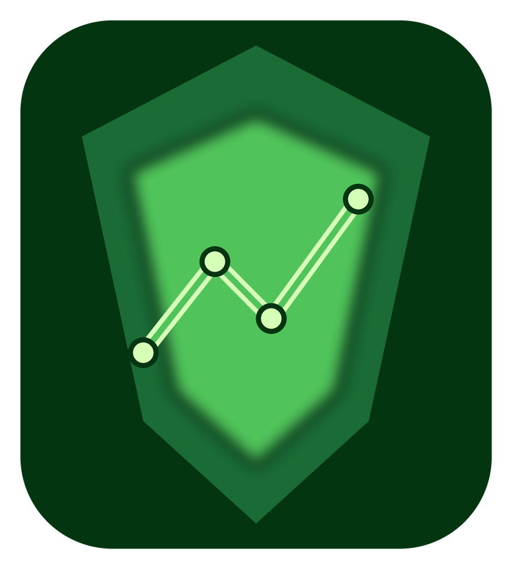

# SafeAppeals Navigator

_Support this project: [paypal.me/safeappealnavigator](https://paypal.me/safeappealnavigator)_

[](https://github.com/savagelysubtle/SafeAppeals2.0/stargazers)
[](https://opensource.org/licenses/Apache-2.0)
[](https://www.typescriptlang.org/)
[](https://github.com/savagelysubtle/SafeAppeals2.0/releases/latest)
[](#-download--install)

<div align="center">
  

  <h3>Stop Juggling Word, Excel, and ChatGPT.</h3>
  <p><strong>One AI-native desktop workspace for your entire project.</strong></p>
  <p>Available for Windows, macOS (Apple Silicon), and Linux.</p>
</div>

<video src="videos/adding-event-to-timeline.mp4" controls style="max-width: 100%;"></video>

---

SafeAppeals is a desktop workspace and AI assistant for complex document work. Legal appeals, research papers, dissertations, grant applications — open all your PDFs, Word docs, and sources in one place, then work with an AI that remembers everything.

## Who Is This For?

|                      |                                                                                             |
| -------------------- | ------------------------------------------------------------------------------------------- |
| **Legal Appeals** | Injured workers, advocates, and paralegals managing workers' comp and human-rights cases    |
| **Grad Students** | Dissertations, thesis research, literature reviews — all your sources and drafts in one place |
| **Researchers**   | Academic papers, grant applications, and multi-source analysis with AI assistance           |
| **Consultants**   | Client reports, case studies, and project documentation with context-aware AI               |

---

## Download & Install

**[Download SafeAppeals v2.0.0](https://safeappeals.com/downloads)** — choose your platform:

| Platform | Download | Notes |
| -------- | -------- | ----- |
| **Windows** | [Installer (.exe)](https://github.com/savagelysubtle/SafeAppeals2.0/releases/download/v2.0.0/SafeAppealsNavigator-2.0.0-win32-x64-user-setup.exe) / [Portable (.zip)](https://github.com/savagelysubtle/SafeAppeals2.0/releases/download/v2.0.0/SafeAppealsNavigator-2.0.0-win32-x64-portable.zip) | Windows 10/11 (64-bit) |
| **macOS** | [Apple Silicon (.zip)](https://github.com/savagelysubtle/SafeAppeals2.0/releases/download/v2.0.0/SafeAppealsNavigator-2.0.0-darwin-arm64.zip) | M1/M2/M3/M4 |
| **Linux** | [x64 (.tar.gz)](https://github.com/savagelysubtle/SafeAppeals2.0/releases/download/v2.0.0/SafeAppealsNavigator-2.0.0-linux-x64.tar.gz) | 64-bit |

> On Windows, if SmartScreen appears click "More info" then "Run anyway". On macOS, extract and drag to Applications. On Linux, extract the archive and run the executable.

### System Requirements

- **OS**: Windows 10/11 (64-bit), macOS (Apple Silicon), or Linux (64-bit)
- **Processor**: 1.6 GHz or faster
- **Storage**: 500 MB free space
- **Internet**: Required for AI features; document editing works offline

---

## Why SafeAppeals?

### Unified Project Workspace

All your files — PDFs, Word docs, spreadsheets, research papers, emails — in one place. No more switching between apps or losing track of sources.

### AI That Knows Your Whole Project

Unlike ChatGPT, our AI sees your entire project: documents, notes, and prior conversations. No re-explaining. No copy-paste. Three chat modes — Drafting, Research, and Case Manager — for different workflows.

### Native Document Editors (Rust/WASM)

Edit Word, Excel, and PDF files directly inside SafeAppeals. The XLSX and PDF viewers have been completely rewritten in Rust compiled to WebAssembly for dramatically improved performance.

### Integrated Web Browser

Browse the web without leaving your workspace. Research, reference, and draft all in one window.

---

## How It Works

1. **Create a Project Workspace** — Open a folder for your project and save as a `.code-workspace` file
2. **Drop In Your Documents** — Import PDFs, Word docs, notes, and sources
3. **Chat With Your AI** — Ask questions, draft content, analyze sources
4. **Export Your Work** — Generate polished papers, timelines, and summaries

---

## Document Viewing & Editing

Open and work with your documents directly — no external apps needed.

| Format   | View | Edit                                    | RAG Index |
| -------- | ---- | --------------------------------------- | --------- |
| PDF      | Yes  | Annotations, highlights, bookmarks      | Yes       |
| DOCX     | Yes  | Full editing (text, tables, formatting) | Yes       |
| XLSX/XLS | Yes  | Cells, formulas, charts, sparklines     | Yes       |
| TXT/MD   | Yes  | Yes                                     | Yes       |
| Images   | Yes  | Zoom, pan, rotate                       | —         |
| EML      | Yes  | AI draft replies                        | —         |

### PDF Viewer (Rust/WASM)

- Multi-page navigation with smooth scrolling
- Zoom controls (fit-to-width, fit-to-page, custom)
- Highlight annotations with color options
- AI integration and context gathering
- PDF extraction with Docling integration
- Copy with page numbers, quick edit actions

### Word Documents (DOCX)

- MS Word-like features with automatic pagination
- Ribbon interface with Tiptap extensions
- Working copy management and auto-save
- Signature line display and enhanced link handling

### Excel Spreadsheets (Rust/WASM)

- Complete rewrite in Rust for performance
- Charts, conditional formatting, sparklines
- Data validation, hyperlinks, named ranges
- Paste special, format cells, auto-fill, auto-fit
- AI Table Chart Tools integration
- Ribbon controller with selection tracking

---

## RAG System (v2.1)

Build a searchable knowledge base of policy manuals and reference documents.

- **Hybrid Search**: Combines semantic and keyword search with cross-encoder reranking
- **Micro Database Architecture**: Complete workspace isolation per project
- **Auto-Indexing**: Indexes workspace documents automatically
- **Local Embeddings**: Uses `all-MiniLM-L6-v2` model (~23 MB)
- **$0 Cost**: Works completely offline after first model download
- **AI Integration**: Search policy manuals from chat with source attribution

---

## Smart File Organization

Organize your project files intelligently with the File Organizer.

<video src="videos/organize-using-ai-chat.mp4" controls style="max-width: 100%;"></video>

- **Classification**: Categorize files as "Your Side" or "Their Side"
- **AI-Powered**: Automatic naming suggestions and tag recommendations
- **Rule Engine**: Apply naming patterns like `{Side}_{Category}_{Date}_{Description}`
- **Smart Routing**: Auto-detection of folder structure and classification-based routing
- **Safe**: Preview changes before applying, no overwrites, automatic backups

**Keyboard**: `Ctrl+Shift+O` to open File Organizer

---

## Email Dashboard

Manage case-related correspondence with AI-assisted draft replies.

- Import `.eml` and `.pdf` email files
- Full-text search across all emails
- View emails with complete headers and attachments
- **AI Draft Replies**: Generate contextual responses using your project documents
- DOCX output ready for editing

**Keyboard**: `Ctrl+Shift+E` to open Email Dashboard

---

## Timeline & Event Tracker

Visual timeline of project events for tracking important dates and deadlines.

- Add events with date, title, description, and category
- 8 event categories (Injury, Medical, Hearing, Decision, Deadline, Filing, Correspondence, Custom)
- Deadline tracking with reminder notifications
- 12 pre-configured jurisdictions for legal appeals
- Document linking and calendar view
- Export timeline to PDF and HTML

**Keyboard**: `Ctrl+Shift+T` to open Timeline

---

## Audio Transcription

- Integrated Whisper model for speech-to-text transcription
- FFmpeg integration for audio format conversion (m4a/mp3 to WAV)
- Audio recording capabilities

---

## OCR Support

- Bundled Tesseract OCR v5.4.0 for text extraction from images (Windows)
- Bundled Poppler v24.08.0 for PDF to image conversion (Windows)

---

## AI Assistant

Built-in AI chat to help with your project research.

### Providers

- **BYOK**: OpenAI, Anthropic, Google, DeepSeek (bring your own API keys — free)
- **SafeAppeals Cloud**: Claude, GPT, Gemini access without API key setup

### Models

Claude Opus 4.5 and Sonnet 4.5 (Anthropic), GPT-5.2 and GPT-5.1 (OpenAI), Gemini 3 Pro and Gemini 2.5 Pro/Flash (Google).

### Chat Modes

- **Drafting**: Writing and editing documents with AI assistance
- **Research**: Exploring policies and case law safely
- **Case Manager**: Autonomous multi-step tasks (file organization, case setup, research compilation)

### Cloud Credits

- Purchase once, use across all models
- Credits never expire
- Optional — BYOK always available
- Starter: $30 for 700K tokens | Pro: $65 for 2M tokens | Power: $130 for 5M tokens

---

## File Conversion

- Convert between formats (PDF to Word, Word to PDF, and more)
- Batch convert multiple files
- Merge PDFs
- Python-based conversion pipeline with Docling integration

---

## Development Setup

### Prerequisites

- **Node.js 22+**
- **Bun** (package manager)
- **Git**
- **Rust** with `wasm32-unknown-unknown` target (for building WASM artifacts from source)
- **Windows, macOS, or Linux**

### Build from Source

```bash
# Clone
git clone https://github.com/savagelysubtle/SafeAppeals2.0.git
cd SafeAppeals2.0

# Install dependencies
bun install

# Fetch Electron and prebuilts
node build/lib/preLaunch.js

# Build React components
bun run buildreact

# Start watch mode
bun run watch-clientd

# Launch
.\scripts\code.bat   # Windows
./scripts/code.sh    # macOS/Linux
```

### Building WASM Viewers

The XLSX and PDF viewers require Rust compilation:

```bash
# Install Rust wasm target (one-time)
rustup target add wasm32-unknown-unknown
cargo install wasm-bindgen-cli

# Build XLSX WASM viewer
bun run build-wasm

# Build PDF WASM viewer
bun run build-pdf-wasm
```

---

## Privacy & Security

- **Local Data Storage**: All project data stays on your computer
- **Offline Capable**: Document editing and RAG search work without internet
- **No Data Sharing**: Your documents are never uploaded without explicit action
- **Provider Choice**: You pick which AI provider receives your chat messages
- **Open Source**: Full transparency — review the code yourself

---

## Keyboard Shortcuts

| Action          | Shortcut               |
| --------------- | ---------------------- |
| Open AI Chat    | `Ctrl+L`               |
| Quick Edit      | `Ctrl+K`               |
| File Organizer  | `Ctrl+Shift+O`         |
| Email Dashboard | `Ctrl+Shift+E`         |
| Timeline        | `Ctrl+Shift+T`         |
| Command Palette | `F1` or `Ctrl+Shift+P` |
| Settings        | `Ctrl+,`               |

---

## Roadmap

We track features SafeAppeals has added (and what’s next) in **[ROADMAP.md](ROADMAP.md)**.

Highlights already shipping:

- Timeline, deadlines, and calendar sync
- Native PDF / DOCX / XLSX editors
- Private Search (local RAG)
- Email dashboard with AI draft replies
- Time tracker, file organizer, document converter
- SafeAppeals Cloud auth and credits

Engineers: see also [docs/ADDED_FEATURES_TRACKER.md](docs/ADDED_FEATURES_TRACKER.md).

---

## Contributing

SafeAppeals welcomes contributions from developers, legal professionals, and anyone who has navigated complex document work.

1. Read [CONTRIBUTING.md](CONTRIBUTING.md)
2. Check [ROADMAP.md](ROADMAP.md) and open issues for priorities
3. Follow coding standards in [AGENTS.md](AGENTS.md)

### Code Standards

- **TypeScript**: Follow existing conventions; avoid `any` types
- **SafeAppeals extensions**: Prefer `extensions/safeappeals-*` for product features
- **Security**: Encrypt user content at rest (see Local Data Security in AGENTS.md)
- Write tests for new features

---

## License

Licensed under the **Apache License 2.0** — see [LICENSE.txt](LICENSE.txt).

SafeAppeals is derived from Microsoft Code - OSS (MIT). Upstream attribution and third-party notices are in [LICENSE.txt](LICENSE.txt) and [ThirdPartyNotices.txt](ThirdPartyNotices.txt).

---

## Support

- **Website**: [safeappeals.com](https://safeappeals.com)
- **Documentation**: [safeappeals.com/docs](https://safeappeals.com/docs)
- **Downloads**: [safeappeals.com/downloads](https://safeappeals.com/downloads)
- **Issues**: [GitHub Issues](https://github.com/savagelysubtle/SafeAppeals2.0/issues)
- **Email**: support@safeappeals.com

**Disclaimer**: This tool assists with document research and preparation. AI-generated content may contain errors or hallucinated citations. Always verify information and consult qualified professionals for legal or medical advice.

---

<div align="center">

**[Download SafeAppeals](https://safeappeals.com/downloads)** · [Documentation](https://safeappeals.com/docs) · [Report Issue](https://github.com/savagelysubtle/SafeAppeals2.0/issues)

Created by [SavagelySubtle](https://github.com/savagelysubtle)

_Empowering people to navigate complex document work with confidence_

</div>
