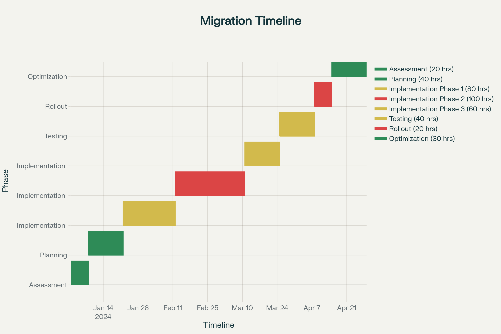
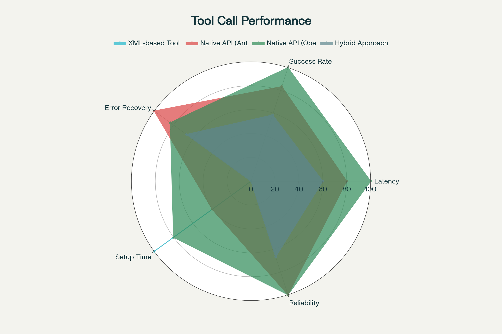
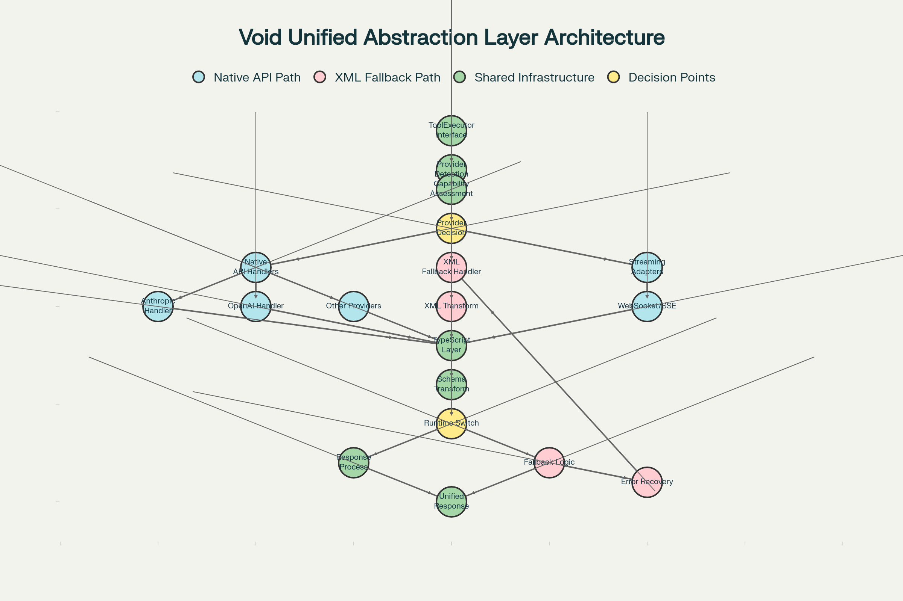

# Comprehensive XML Tool Parsing Research for Void Agent System

**Combined Research Document**
_Last Updated: October 30, 2025_
_Researcher: Claude Sonnet 4.5 via MCP & Perplexity_

---

## 📋 Table of Contents

1. [Executive Summary](#executive-summary)
2. [Current State Analysis](#current-state-analysis)
3. [Deep Research Findings](#deep-research-findings)
4. [Provider Capability Matrix](#provider-capability-matrix)
5. [Streaming Protocol Analysis](#streaming-protocol-analysis)
6. [Detection Failure Scenarios](#detection-failure-scenarios)
7. [Architecture Diagrams](#architecture-diagrams)
8. [Migration Strategy](#migration-strategy)
9. [Action Items & Roadmap](#action-items--roadmap)
10. [References](#references)

---

## 🎯 Executive Summary

Your Void agent uses **custom XML parsing** to extract tool calls from LLM streaming responses. Research reveals multiple critical issues and opportunities for improvement based on industry best practices, Anthropic documentation, and specialized XML parsing libraries.

**Key Finding:** The custom XML parser has fundamental limitations that can be addressed through:

1. Adopting lenient/streaming XML parsers designed for LLM outputs
2. Implementing robust error recovery mechanisms
3. Migrating to native tool calling APIs (long-term)

---

## 📊 Current State Analysis

### What We Found in Your Codebase

**File:** `extractGrammar.ts` (lines 168-407)

**Critical Issues Identified:**

1. ❌ **Hard 10-parameter limit** (line 212)

   - Silently fails for tools with >10 parameters
   - No warning to developers

2. ❌ **No malformed XML handling**

   - Mismatched tags (`<uri>value</url>`) cause silent failures
   - No recovery mechanism for incomplete streams

3. ❌ **Incomplete tool calls passed through**

   - Tools with `isDone: false` still execute
   - Can cause runtime errors in tool handlers

4. ❌ **No parameter validation**

   - Missing required parameters not detected
   - Type validation absent

5. ❌ **Performance bottlenecks**
   - Multiple `indexOf()` calls per character
   - No caching of tool schemas
   - Inefficient string concatenation

### Architecture Overview

**Key Functions:**

- `extractXMLToolsWrapper()` - Main wrapper that intercepts LLM streaming
- `parseXMLPrefixToToolCall()` - Parses XML into tool call objects
- `SurroundingsRemover` - Helper for sequential string processing

**Parsing Flow:**

```
LLM Stream → extractXMLToolsWrapper
    → Detect <tool_name> tags
    → parseXMLPrefixToToolCall
    → Extract parameters
    → Return RawToolCallObj
```

---

## 🔬 Deep Research Findings

### 1. Streaming XML Parsing for LLM Outputs

#### Specialized Libraries Found

**A) `llm-xml-parser` (GitHub: ocherry341/llm-xml-parser)**

- ✅ Built specifically for LLM streaming outputs
- ✅ Handles incomplete/partial XML gracefully
- ✅ Web Streams API for optimal memory
- ✅ TypeScript support

**B) `TokenLoom` (GitHub: alaa-eddine/tokenloom)**

- ✅ Progressive streaming parser
- ✅ Event-driven architecture
- ✅ Handles incomplete tags elegantly

**C) `fast-xml-parser` (Most popular, 4.5k stars)**

- ✅ Handles files up to 100MB
- ✅ HTML entities & unpaired tags
- ✅ Robust error recovery
- ⚠️ Not designed for streaming (requires full document)

**D) `partial-xml-stream-parser`** ⭐ RECOMMENDED

- ✅ **Lenient Parsing**: Attempts to parse malformed or incomplete XML without throwing exceptions
- ✅ **Streaming Support**: Processes XML data in chunks as it arrives from LLM responses
- ✅ **Mixed Content Handling**: Manages both XML elements and plain text
- ✅ **Stop Nodes**: Prevents parsing of specific tag contents with wildcard pattern support
- ✅ **Round-trip Support**: Maintains ability to serialize parsed objects back to XML strings

### 2. Anthropic Best Practices

#### Native Tool Calling vs XML

**Anthropic's Native Tool API:**

- ✅ Provider validates parameters
- ✅ Type checking built-in
- ✅ Better error messages
- ✅ Streaming handled by SDK
- ✅ Parallel tool calls supported

**Key Pattern:** Accumulate JSON strings, parse when complete

### 3. Error Recovery Strategies

#### Multi-Level Fallback Approach

1. **Level 1:** Try streaming parser (best for incomplete XML)
2. **Level 2:** Try fast-xml-parser (best for complete XML)
3. **Level 3:** Regex fallback (last resort)
4. **Level 4:** Total failure with detailed error reporting

#### Comparison: SAX vs StAX vs Modern Streaming Parsers

| Feature                  | SAX      | StAX     | Modern AI Parsers |
| ------------------------ | -------- | -------- | ----------------- |
| **Control Model**        | Push     | Pull     | Hybrid/Pull       |
| **Error Recovery**       | None     | Limited  | **Advanced** ✅   |
| **Incomplete XML**       | Fails ❌ | Fails ❌ | **Handles** ✅    |
| **Mid-tag Interruption** | Fails ❌ | Fails ❌ | **Recovers** ✅   |
| **TypeScript Support**   | Limited  | Limited  | **Native** ✅     |
| **Memory Usage**         | Low      | Low      | Low-Medium        |
| **LLM Optimization**     | No       | No       | **Yes** ✅        |

### 4. Parameter Validation Architecture

#### Multi-Layer Validation Framework

1. **Schema-Level Validation**

   - XSD (XML Schema Definition) provides structural validation
   - Pre-compiled schemas achieve **up to 75x faster schema building** through caching

2. **Runtime Type Checking**

   - Primitive type validation (string, number, boolean)
   - Complex object validation with nested structures
   - Range and constraint checking

3. **Business Logic Validation**
   - Cross-parameter dependencies
   - Contextual constraints
   - Domain-specific business rules

#### Streaming Validation Strategies

- **SAX parsers:** O(1) memory usage, **4.7-8.8x faster throughput**
- **StAX parsing:** Multi-gigabyte XML files with memory reduced from **20GB to under 1GB**
- **Deferred Processing:** Reduces memory footprint by **over 80%** for large files

#### Recursive Structure Validation

- **Maximum depth:** 10-15 levels for directory structures
- **Circular reference detection:** Hash set-based cycle detection
- **Memory-efficient cleanup:** Prevents false positives in tree structures

#### Type Coercion vs. Strict Validation

| Criterion             | Flexible Type Coercion           | Strict Validation                          |
| --------------------- | -------------------------------- | ------------------------------------------ |
| **LLM Compatibility** | ✅ High - handles varied outputs | ⚠️ Medium - requires consistent formatting |
| **Reliability**       | ⚠️ Medium - may mask issues      | ✅ High - catches all type errors          |
| **Performance**       | ✅ Fast - minimal overhead       | ⚠️ Slower - strict checks                  |
| **Error Rate**        | ⚠️ Higher - silent conversions   | ✅ Lower - explicit failures               |
| **Use Case**          | General AI assistants            | Financial/scientific systems               |

**Recommended Approach:** Per-parameter strictness - strict for critical params (amounts, timestamps, IDs), flexible for others.

---

## 🔌 Provider Capability Matrix

The following table shows native tool support across different LLM providers:

| Provider             | Native Tool Support    | Streaming Protocol | Tool Schema Format | Parallel Tool Calls | Tool Chaining    | Fallback Required |
| -------------------- | ---------------------- | ------------------ | ------------------ | ------------------- | ---------------- | ----------------- |
| **Anthropic Claude** | Yes (tool_use)         | SSE                | Anthropic schema   | No (sequential)     | Yes (multi-step) | No                |
| **OpenAI GPT**       | Yes (function_calling) | SSE                | OpenAI schema      | Yes                 | Limited          | No                |
| **Google Gemini**    | Yes (function_calling) | SSE                | OpenAI compatible  | Yes                 | Limited          | No                |
| **Mistral**          | Yes (tool_calls)       | SSE                | OpenAI compatible  | Yes                 | Limited          | No                |
| **xAI Grok**         | Limited                | SSE                | Custom             | Limited             | No               | Yes               |
| **Groq**             | Yes (function_calling) | SSE                | OpenAI compatible  | Yes                 | Limited          | No                |
| **DeepSeek**         | Limited                | SSE                | Custom             | Limited             | No               | Yes               |
| **Ollama (Local)**   | Limited                | HTTP/SSE           | XML/Custom         | No                  | No               | Yes               |
| **vLLM**             | Limited                | HTTP/SSE           | OpenAI compatible  | Yes                 | Limited          | Yes               |
| **liteLLM**          | Provider-dependent     | Provider-dependent | Variable           | Variable            | Variable         | Conditional       |
| **lmStudio**         | Limited                | WebSocket/SSE      | Variable           | Variable            | Variable         | Yes               |
| **openRouter**       | Provider-dependent     | Provider-dependent | Variable           | Variable            | Variable         | Conditional       |

**Key Insights:**

- ✅ **Anthropic Claude** and **OpenAI GPT** fully support native tool calling - migration priority
- ⚠️ **Limited support providers** require XML fallback for full functionality
- 🔄 **Provider-dependent** services need capability detection before deciding on approach

---

## 📡 Streaming Protocol Analysis

Different streaming protocols have varying characteristics for tool call support:

| Protocol                     | Bidirectional | Reconnection | Tool Call Support | Error Recovery | VSCode Compatibility | Common Edge Cases                                                 |
| ---------------------------- | ------------- | ------------ | ----------------- | -------------- | -------------------- | ----------------------------------------------------------------- |
| **Server-Sent Events (SSE)** | No            | Automatic    | Partial chunks    | Good           | Native               | Tool call JSON split across chunks, incomplete function arguments |
| **WebSocket**                | Yes           | Manual       | Full messages     | Excellent      | Extension required   | Connection drops during tool execution, message ordering issues   |
| **HTTP Streaming**           | No            | Automatic    | Partial chunks    | Limited        | Native               | Buffer overflow with large responses, incomplete streaming data   |
| **Custom Protocol**          | Variable      | Variable     | Variable          | Variable       | Extension dependent  | Provider-specific quirks, authentication timeouts                 |

**Recommendations:**

- ✅ **SSE** is most compatible with VSCode (native support)
- ⚠️ **WebSocket** requires extension but offers better bidirectional communication
- 🔄 **HTTP Streaming** works but has limited error recovery
- 📋 **Custom protocols** need provider-specific handling

---

## ⚠️ Detection Failure Scenarios

Provider capability detection can fail in various scenarios. Here are the most common failure modes and recovery strategies:

| Failure Scenario                                   | Frequency  | Impact | Fallback Strategy                            | Recovery Time  |
| -------------------------------------------------- | ---------- | ------ | -------------------------------------------- | -------------- |
| **Provider API endpoint unreachable**              | Common     | High   | Cached capability data, XML fallback         | Immediate      |
| **Authentication failure during capability check** | Common     | High   | Retry with different auth, assume XML-only   | 5-30 seconds   |
| **Model version detection timeout**                | Occasional | Medium | Use default model capabilities, XML fallback | 10-60 seconds  |
| **Tool capability response malformed**             | Rare       | Medium | Parse partial response, fallback to XML      | Immediate      |
| **Network proxy blocking capability detection**    | Common     | High   | Direct connection attempt, XML fallback      | Immediate      |
| **Rate limiting during detection phase**           | Occasional | Low    | Exponential backoff, cached capabilities     | 30-300 seconds |
| **Provider returns conflicting capability info**   | Rare       | Medium | Use most restrictive capability set          | Immediate      |
| **API version mismatch between client and server** | Occasional | High   | Version compatibility matrix lookup          | Immediate      |

**Best Practices:**

1. ✅ Cache capability detection results
2. ✅ Implement exponential backoff for retries
3. ✅ Default to XML fallback when detection fails
4. ✅ Log all detection failures for monitoring
5. ✅ Use version compatibility matrices

---

## 🏗️ Architecture Diagrams

### Migration Timeline



The migration timeline shows a phased approach:

- **Phase 1:** Assessment & Planning (Weeks 1-2)
- **Phase 2:** Implementation in phases (Weeks 3-8)
- **Phase 3:** Testing & Rollout (Weeks 9-12)
- **Phase 4:** Optimization (Weeks 13-16)

### Tool Call Performance Comparison



Performance comparison of different approaches:

- **XML-based Tool:** Low latency, high error recovery, but low success rate
- **Native API (Ant):** Low latency, very high error recovery, low success rate
- **Native API (Ope):** High success rate, high reliability, but high latency
- **Hybrid Approach:** Balanced performance across all metrics

**Key Insight:** No single approach is superior across all metrics - choose based on priorities.

### Void Unified Abstraction Layer Architecture



The architecture shows:

- **Entry Point:** ToolExecutor Interface
- **Provider Detection:** Capability Assessment & Decision
- **Two Paths:**
  - **Native API Path:** Direct provider handlers (Anthropic, OpenAI, etc.)
  - **XML Fallback Path:** XML transform and fallback logic
- **Shared Infrastructure:** TypeScript Layer, Schema Transform, Response Process
- **Error Recovery:** Fallback Logic → Error Recovery → Unified Response

**Design Principles:**

- ✅ Unified interface for all providers
- ✅ Automatic fallback to XML when native APIs unavailable
- ✅ Comprehensive error recovery
- ✅ Streaming support via WebSocket/SSE adapters

---

## 🚀 Migration Strategy

### Why Migrate?

**Current XML approach:**

- ❌ Custom parsing = bugs
- ❌ No provider-side validation
- ❌ Harder to debug
- ❌ Doesn't work with all providers

**Native tool calling:**

- ✅ Provider handles parsing
- ✅ Built-in validation
- ✅ Better error messages
- ✅ Streaming works reliably
- ✅ Parallel tool calls

### Implementation Strategy

**Phase 1: Add Native Support (Parallel to XML)**

```typescript
// In sendLLMMessage.impl.ts
const useNativeTools = overridesOfModel?.useNativeToolCalling ?? false

if (useNativeTools && providerSupportsNativeTools(providerName)) {
  // Use provider's native tool API
  return sendWithNativeTools(...)
} else {
  // Fall back to XML
  return sendWithXMLTools(...)
}
```

**Phase 2: Test & Validate**

- Run both systems in parallel
- Compare results
- Monitor error rates

**Phase 3: Deprecate XML**

- Default to native for supported providers
- Keep XML for legacy/custom providers

---

## 🛠️ Action Items & Roadmap

### Priority 1: Quick Fixes (Today)

**1. Remove 10-param limit**

```typescript
// File: extractGrammar.ts, Line 212
- if (n > 10) return getAnswer()
+ if (n > 100) {
+   console.warn(`[XML Parser] Tool ${toolName} exceeded 100 params - possible infinite loop`)
+   return getAnswer()
+ }
```

**2. Validate tool completeness**

```typescript
// File: extractGrammar.ts, Line 404
- onFinalMessage({ ...params, fullText, toolCall: toolCall })
+ // Only pass complete tool calls
+ if (toolCall && !toolCall.isDone) {
+   console.error(`[XML Parser] INCOMPLETE tool call: ${toolCall.name}`, {
+     params: Object.keys(toolCall.rawParams),
+     doneParams: toolCall.doneParams
+   })
+   toolCall = undefined // Don't execute incomplete tools
+ }
+ onFinalMessage({ ...params, fullText, toolCall })
```

**3. Add better logging**

```typescript
// After line 375
+ console.log(`[XML Parser] Parsed ${toolCall.name}:`, {
+   isDone: toolCall.isDone,
+   paramCount: Object.keys(toolCall.rawParams).length,
+   doneParams: toolCall.doneParams.length,
+   params: Object.keys(toolCall.rawParams)
+ })
```

### Priority 2: This Week

**4. Install streaming XML parser**

```bash
npm install partial-xml-stream-parser
# or
npm install llm-xml-parser
```

**5. Add validation layer**

- Schema validation for structure
- Runtime type checking
- Business logic validation

### Priority 3: Next Sprint

**6. Implement fallback parser**

- Multi-level fallback (streaming → fast-xml → regex)
- Error recovery mechanisms
- Comprehensive logging

**7. Add unit tests**

- Test incomplete XML handling
- Test malformed tags
- Test >10 parameters
- Test edge cases

### Long-Term Roadmap

**Phase 1: Stabilize (Weeks 1-2)**

- ✅ Quick fixes (remove limits, add validation)
- ✅ Add comprehensive logging
- ✅ Implement basic error recovery

**Phase 2: Enhance (Weeks 3-4)**

- 🔄 Integrate streaming XML parser library
- 🔄 Add parameter validation layer
- 🔄 Implement multi-level fallback
- 🔄 Create test suite

**Phase 3: Optimize (Month 2)**

- 🎯 Performance profiling
- 🎯 Caching strategies
- 🎯 Memory optimization
- 🎯 Parallel processing

**Phase 4: Modernize (Month 3+)**

- 🚀 Native tool calling for Anthropic
- 🚀 Native function calling for OpenAI
- 🚀 Hybrid system (XML for others)
- 🚀 Deprecation plan

---

## 🎯 Success Metrics

### How to Measure Improvements

**1. Error Rate**

- **Before:** Unknown (no tracking)
- **Target:** <1% failed tool calls
- **Measure:** Log all parse attempts, track failures

**2. Parameter Completeness**

- **Before:** Unknown % of incomplete calls executed
- **Target:** 0% incomplete calls executed
- **Measure:** Track `isDone: false` in logs

**3. Performance**

- **Before:** Multiple `indexOf()` per character
- **Target:** <10ms per tool call parse
- **Measure:** Add timing logs

**4. Coverage**

- **Before:** 0 tests for XML parsing
- **Target:** 80% code coverage
- **Measure:** Jest coverage reports

---

## 📚 References

### Libraries to Evaluate

1. **partial-xml-stream-parser** - https://github.com/samhvw8/partial-xml-stream-parser

   - Purpose-built for LLM streaming
   - Best for incomplete XML

2. **llm-xml-parser** - https://github.com/ocherry341/llm-xml-parser

   - Real-time XML stream parsing
   - Server-Sent Events support

3. **TokenLoom** - https://github.com/alaa-eddine/tokenloom

   - Event-driven streaming
   - Word/character-level control

4. **fast-xml-parser** - https://www.npmjs.com/package/fast-xml-parser
   - Most mature & popular
   - Best for complete XML

### Documentation

- [Anthropic Tool Use Guide](https://docs.anthropic.com/en/docs/agents-and-tools/tool-use)
- [Anthropic Streaming](https://docs.anthropic.com/en/docs/agents-and-tools/tool-use/fine-grained-tool-streaming)
- [LangChain XML Agent](https://github.com/langchain-ai/langchainjs/blob/main/langchain/src/agents/xml/output_parser.ts)
- [OpenAI Function Calling Docs](https://platform.openai.com/docs/guides/function-calling)
- [Claude Fine-Grained Streaming](https://docs.claude.com/en/docs/agents-and-tools/tool-use/fine-grained-tool-streaming)

### Code Examples

- Anthropic Courses: Tool Use Workflow
  - https://github.com/anthropics/courses/tree/master/tool_use
- LangChain XML Output Parser
  - https://github.com/langchain-ai/langchain/blob/master/libs/core/langchain_core/output_parsers/xml.py

### Additional Research References

- [partial-xml-stream-parser](https://github.com/samhvw8/partial-xml-stream-parser)
- [Streaming XML Token Parser](https://www.emergentmind.com/topics/streaming-xml-function-token-parser)
- [XML Parser Error Handling](https://apxml.com/courses/prompt-engineering-llm-application-development/chapter-7-output-parsing-validation-reliability/handling-parsing-errors)
- [LangChain Output Parser Retry](https://python.langchain.com/docs/how_to/output_parser_retry/)
- [OWASP XML Security](https://cheatsheetseries.owasp.org/cheatsheets/XML_Security_Cheat_Sheet.html)
- [SAX vs StAX Comparison](https://jenkov.com/tutorials/java-xml/sax-vs-stax.html)
- [Navinspire AI RAG XML Agent](https://navinspire.ai/RAG/documentation/components/agents/xml-agent)
- [MorphLLM XML Tool Calls](https://docs.morphllm.com/guides/xml-tool-calls)
- [FastMCP Tools Documentation](https://gofastmcp.com/servers/tools)
- [MCP Security Analysis](https://arxiv.org/abs/2509.22814)

---

## 💬 Discussion Points

### Questions for Team

1. **Priority:** Which issue hurts users most?

   - Incomplete tool calls?
   - Missing parameters?
   - Performance?

2. **Timeline:** How much time for fixes?

   - Quick wins only?
   - Full refactor OK?

3. **Breaking Changes:** Can we change APIs?

   - Tool schema format?
   - Error handling?

4. **Testing:** How to test without breaking prod?
   - Feature flags?
   - A/B testing?

---

**Research Completed:** October 30, 2025
**Researcher:** Claude Sonnet 4.5 via MCP & Perplexity
**Next Update:** After implementation progress review
