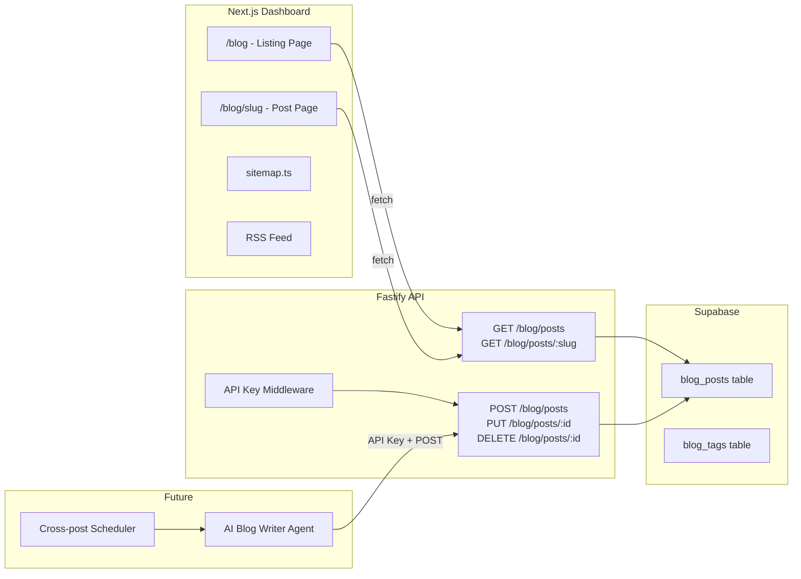

# Add SEO Blog System to SafeAppeals

## Architecture Overview



## 1. Database Migration (`supabase/migrations/007_blog.sql`)

Create two tables in Supabase:

`**blog_posts**` table:

- `id` UUID PK (auto-generated)
- `title` TEXT NOT NULL
- `slug` TEXT UNIQUE NOT NULL (URL-friendly, e.g. `workers-comp-appeal-tips`)
- `content` TEXT NOT NULL (HTML rich content)
- `excerpt` TEXT (short summary for listings/meta description, ~160 chars)
- `cover_image_url` TEXT (og:image for social sharing)
- `status` TEXT DEFAULT 'draft' (enum: `draft`, `published`, `archived`)
- `author_name` TEXT DEFAULT 'Safe Appeals Team'
- `tags` TEXT[] (PostgreSQL array, e.g. `{'workers-comp', 'legal-tips'}`)
- `meta_title` TEXT (SEO title override, falls back to `title`)
- `meta_description` TEXT (SEO description override, falls back to `excerpt`)
- `published_at` TIMESTAMPTZ (set when status changes to published)
- `created_at` TIMESTAMPTZ DEFAULT NOW()
- `updated_at` TIMESTAMPTZ DEFAULT NOW()

**RLS Policies**: Public read access for published posts (no auth needed). No
direct client writes -- all writes go through the API.

**Indexes**: On `slug` (unique), `status` + `published_at` (for listing
queries), `tags` (GIN index for array queries).

## 2. API Key Authentication (`api/src/middleware/api-key-auth.ts`)

A new middleware separate from Supabase user auth. Uses a `BLOG_API_KEY` env
variable:

- Request header: `X-API-Key: <key>`
- This is what the AI blog writer agent will use to authenticate
- Simple, stateless, no OAuth complexity for programmatic access
- Follows the same middleware pattern as
  `[api/src/middleware/auth.ts](void-cloud/api/src/middleware/auth.ts)`

## 3. Blog API Routes (`api/src/routes/blog.ts`)

Register at prefix `/blog` in `[api/src/index.ts](void-cloud/api/src/index.ts)`.

**Public (no auth):**

- `GET /blog/posts` - List published posts (paginated, filterable by tag)
  - Query params: `page`, `limit`, `tag`
  - Returns: posts array with pagination metadata
  - Orders by `published_at` DESC
- `GET /blog/posts/:slug` - Get single post by slug
  - Returns full post content + SEO metadata
- `GET /blog/tags` - List all tags with post counts

**Protected (API key auth):**

- `POST /blog/posts` - Create new post (draft or published)
  - Auto-generates slug from title if not provided
  - Sets `published_at` when status is `published`
- `PUT /blog/posts/:id` - Update existing post
  - Can transition draft to published (sets `published_at`)
- `DELETE /blog/posts/:id` - Soft delete (set status to `archived`)

## 4. Frontend Pages (Next.js App Router)

All blog pages are **public** (add `/blog` to public routes in
`[dashboard/middleware.ts](void-cloud/dashboard/middleware.ts)`).

### `dashboard/app/blog/page.tsx` - Blog Listing

- Server-rendered page fetching from the API
- Grid/list layout matching existing site styling (dark theme, `void-ambient`
  class)
- Each card shows: cover image, title, excerpt, date, tags
- Pagination controls
- Filter by tag (optional query param)

### `dashboard/app/blog/[slug]/page.tsx` - Blog Post

- Server-rendered with `generateMetadata()` for full SEO
- Rich HTML content rendering (sanitized)
- Open Graph + Twitter Card metadata
- JSON-LD structured data (`BlogPosting` schema)
- Author, date, reading time
- Related posts or tag-based navigation at bottom
- Back to blog link

### `dashboard/app/blog/layout.tsx` - Blog Layout

- Consistent nav header (reuse from landing page or docs)
- Clean, readable typography for blog content
- Responsive design

## 5. SEO Enhancements

### Sitemap Update (`[dashboard/app/sitemap.ts](void-cloud/dashboard/app/sitemap.ts)`)

- Fetch all published blog post slugs from the API at build/request time
- Add `/blog` listing page and all `/blog/:slug` pages to sitemap
- Set `changeFrequency: 'weekly'` and `priority: 0.8` for blog content

### RSS Feed (`dashboard/app/blog/rss.xml/route.ts`)

- Generate RSS 2.0 XML feed of published posts
- Useful for future Reddit cross-posting and general syndication
- Endpoint: `https://safeappeals.com/blog/rss.xml`

### Navigation Updates

Add a "Blog" link in **three** locations:

1. **Landing page nav**
   (`[dashboard/app/page.tsx](void-cloud/dashboard/app/page.tsx)` line 52-61)

- Add `<Link href="/blog">Blog</Link>` between "FAQ" and the YouTube icon in the
  header nav
- Same styling as existing links:
  `text-gray-300 hover:text-white transition-colors`

1. **Dashboard sidebar**
   (`[dashboard/app/dashboard/layout.tsx](void-cloud/dashboard/app/dashboard/layout.tsx)`
   line 55-99)

- Add a "Blog" nav item with `FileText` icon (already imported-compatible via
  lucide)
- Place it after "Settings" in the main nav section (before the Help divider)
- Same active/inactive styling pattern as existing nav items

1. **Blog layout header** - Blog pages get their own nav header (reuse the
   landing page nav pattern with Blog highlighted)

## 6. API Key Generation

Generate a secure `BLOG_API_KEY` for the AI blog writer agent:

- Use `node -e "console.log(require('crypto').randomBytes(32).toString('hex'))"`
  to generate a 64-char hex key
- Store as `BLOG_API_KEY` env var in the API service (Railway)
- Add to `api/.env.example` with placeholder and documentation
- The blog writer agent authenticates with header: `X-API-Key: <generated-key>`

**Agent usage example** (for future blog writer app):

```
POST https://api.safeappeals.com/blog/posts
X-API-Key: <BLOG_API_KEY>
Content-Type: application/json

{
  "title": "5 Tips for Workers Comp Appeals",
  "content": "<h2>...</h2><p>...</p>",
  "excerpt": "Learn the top strategies...",
  "tags": ["workers-comp", "legal-tips"],
  "status": "published"
}
```

## 7. Environment Variables

Add to API service:

- `BLOG_API_KEY` - Secret key for agent write access (generated, 64-char hex)

## Files to Create

- `supabase/migrations/007_blog.sql` - Database schema
- `api/src/middleware/api-key-auth.ts` - API key middleware
- `api/src/routes/blog.ts` - Blog CRUD routes
- `dashboard/app/blog/page.tsx` - Blog listing page
- `dashboard/app/blog/[slug]/page.tsx` - Blog post page
- `dashboard/app/blog/layout.tsx` - Blog layout
- `dashboard/app/blog/rss.xml/route.ts` - RSS feed

## Files to Modify

- `api/src/index.ts` - Register blog routes
- `api/.env.example` - Add BLOG_API_KEY entry
- `dashboard/middleware.ts` - Add `/blog` to public routes
- `dashboard/app/sitemap.ts` - Add blog posts dynamically
- `dashboard/app/page.tsx` - Add Blog link to landing page nav
- `dashboard/app/dashboard/layout.tsx` - Add Blog link to dashboard sidebar
