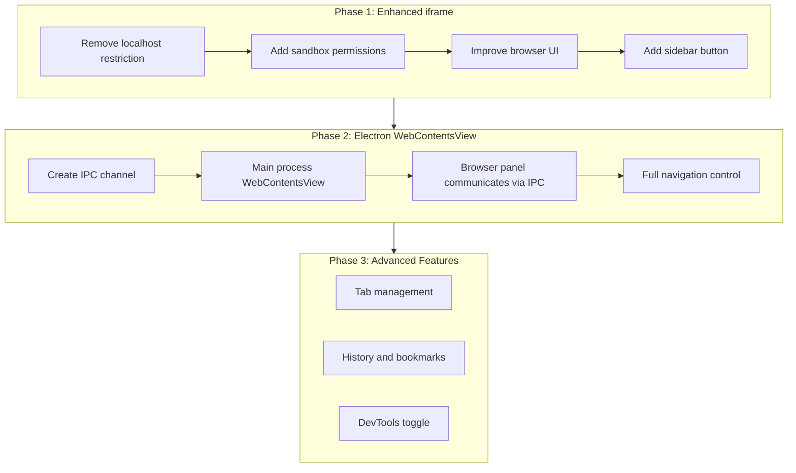

# Browser Extension Upgrade Plan

## Current State

The [simple-browser extension](extensions/simple-browser/) is a minimal
iframe-based preview designed only for localhost URLs. Key limitations:

- **Localhost-only**: Host allowlist in
  `[extension.ts:18-30](extensions/simple-browser/src/extension.ts)` blocks all
  non-local URLs
- **iframe-based**: Uses
  `<iframe sandbox="allow-scripts allow-forms allow-same-origin allow-downloads">`
  in
  `[simpleBrowserView.ts:168](extensions/simple-browser/src/simpleBrowserView.ts)`
  -- many websites set `X-Frame-Options: DENY` which blocks iframe embedding
  entirely
- **No real navigation tracking**: Back/forward use
  `history.back()`/`history.forward()` on the outer page, not the iframe's
  internal navigation
- **No browser features**: No tabs, no history, no bookmarks, no DevTools

## Should We Use Rust?

**No.** Rust does not help with this problem because:

- Web rendering is already handled by **Chromium** (via Electron) -- you cannot
  make it faster with Rust
- Network requests go through Chromium's C++ network stack -- Rust adds nothing
- The bottleneck is the **iframe architecture**, not CPU performance
- Rust would add build complexity (WASM compilation, FFI bridges) with zero
  benefit for a browser panel

Rust is great for things like the xlsx parser where we need raw data processing
speed. For a browser, Chromium is already the best tool.

## Architecture Decision: iframe vs Electron WebContentsView

There are two approaches. I recommend doing **both in phases**:

| Concern                       | iframe (Phase 1)          | WebContentsView (Phase 2) |
| ----------------------------- | ------------------------- | ------------------------- |
| Difficulty                    | Low                       | Medium-High               |
| Sites that work               | ~60% (many block iframes) | 100%                      |
| Requires main process changes | No                        | Yes (outside `void/`)     |
| Navigation tracking           | Limited                   | Full                      |
| DevTools                      | Not possible              | Possible                  |
| Cookie/auth support           | Limited by sandbox        | Full                      |



---

## Phase 1: Enhanced Simple Browser (Quick Win)

### 1.1 Remove Localhost Restriction

**File**:
`[extensions/simple-browser/src/extension.ts](extensions/simple-browser/src/extension.ts)`

- Remove or expand the `enabledHosts` set (lines 18-30)
- Change `canOpenExternalUri` to return `ExternalUriOpenerPriority.Option` for
  all `http`/`https` URIs instead of `None`

### 1.2 Add Sandbox Permissions

**File**:
`[extensions/simple-browser/src/simpleBrowserView.ts](extensions/simple-browser/src/simpleBrowserView.ts)`

- Add `allow-popups allow-popups-to-escape-sandbox allow-modals` to the iframe
  sandbox attribute (line 168)
- This lets sites that need popups (OAuth flows, etc.) work

### 1.3 Improve Browser UI

**File**:
`[extensions/simple-browser/preview-src/index.ts](extensions/simple-browser/preview-src/index.ts)`
and
`[extensions/simple-browser/media/main.css](extensions/simple-browser/media/main.css)`

- Add a **Home** button (configurable home URL)
- Add URL validation and `https://` auto-prefixing
- Show loading indicator while iframe loads
- Add keyboard shortcut (Enter in URL bar to navigate, Ctrl+L to focus URL bar)
- Improve back/forward to properly track iframe navigation

### 1.4 Add Browser Button to Sidebar Title Bar

**File**:
`[src/vs/workbench/contrib/void/browser/sidebarActions.ts](src/vs/workbench/contrib/void/browser/sidebarActions.ts)`

Register a new action next to the settings gear (after line 508):

```typescript
registerAction2(
	class extends Action2 {
		constructor() {
			super({
				id: "void.openBrowser",
				title: "Open Browser",
				icon: { id: "globe" },
				menu: [
					{
						id: MenuId.ViewTitle,
						group: "navigation",
						order: 0,
						when: ContextKeyExpr.equals("view", VOID_VIEW_ID),
					},
				],
			});
		}
		async run(accessor: ServicesAccessor): Promise<void> {
			const commandService = accessor.get(ICommandService);
			commandService.executeCommand("simpleBrowser.show");
		}
	},
);
```

This places a globe icon in the sidebar title bar that opens the browser with
one click.

---

## Phase 2: Electron WebContentsView (Full Browser)

This phase creates a proper browser that can load any website without iframe
restrictions. Requires modifications **outside**
`src/vs/workbench/contrib/void/` (specifically in `electron-main/`).

### 2.1 Create IPC Channel for Browser Management

**New file**: `src/vs/workbench/contrib/void/electron-main/browserService.ts`

- Register IPC handlers for: `navigate`, `goBack`, `goForward`, `reload`,
  `getURL`, `openDevTools`
- Create and manage `WebContentsView` instances
- Forward navigation events back to the browser process

### 2.2 Create Browser Editor Panel

**New files in**: `src/vs/workbench/contrib/void/browser/browserPanel/`

- `browserEditor.ts` - Custom editor that hosts the browser controls (URL bar,
  buttons)
- `browserInput.ts` - Editor input representing a browser tab
- `browserService.ts` - Browser-process service that communicates with main
  process via IPC

### 2.3 Wire WebContentsView to Editor Area

- When the browser editor opens, send IPC to main process to create a
  `WebContentsView`
- Position the `WebContentsView` over the editor content area using
  `BrowserWindow.contentView.addChildView()`
- Update position on editor resize/move
- Remove the view when editor closes or switches

---

## Phase 3: Advanced Features

- **Tabs**: Multiple browser tabs within the editor panel
- **History**: Persistent browsing history with search
- **Bookmarks**: Save and manage frequently visited URLs
- **DevTools toggle**: Button to open Chrome DevTools for the active page
- **Downloads**: Download manager integrated with the file explorer
- **Find in page**: Ctrl+F search within the web page

---

## Recommended Execution Order

Start with Phase 1 -- it can be done in a single session and immediately gives
users internet browsing capability (for sites that allow iframe embedding).
Phase 2 is the real solution for a full browser experience but requires more
architectural work and main process modifications.
