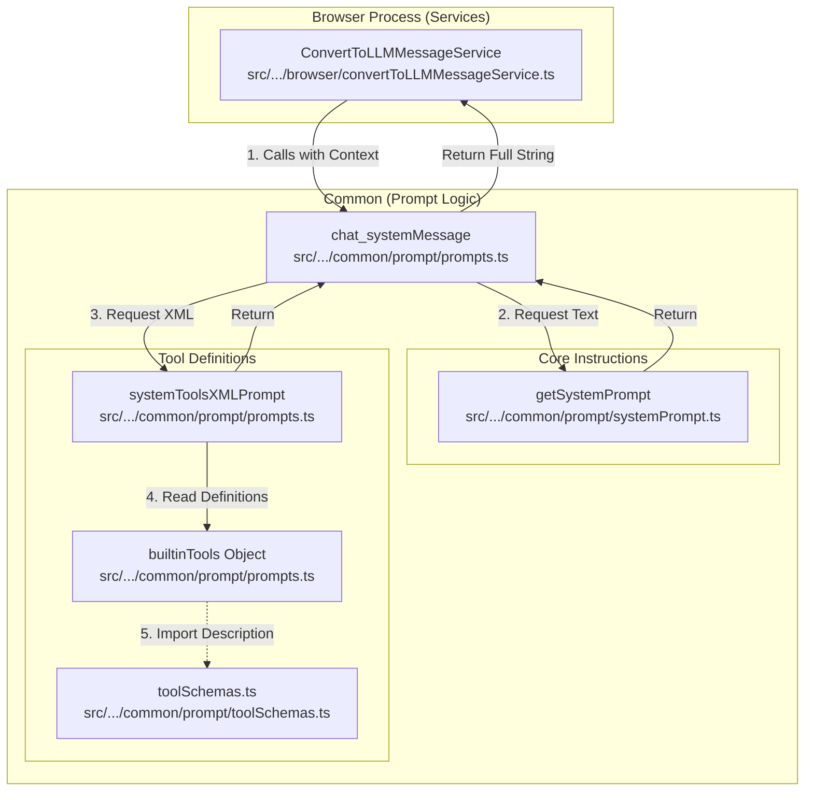

# System Prompt Architecture

Documentation for how system prompts are dynamically assembled, structured, and sent to LLMs.

## Overview

The system prompt is the foundational instruction set that defines the AI's persona, capabilities, tools, and operational constraints. In SafeAppeals, this prompt is **dynamically generated** at runtime based on:

1.  **Chat Mode** (`case_manager`, `research`, `drafting`, etc.)
2.  **Available Tools** (Built-in + MCP)
3.  **Workspace Context** (Open files, directory structure)
4.  **User Settings** (Custom instructions, .fileorg.json)

## Prompt Assembly Flow

The construction of the prompt is orchestrated by the browser process before the message is sent to the main process.

## Key Components

### 1. Orchestrator: `ConvertToLLMMessageService`

**Location**: `src/vs/workbench/contrib/void/browser/convertToLLMMessageService.ts`

This service is the entry point. It gathers live data from the IDE:

- List of open files (`openedURIs`)
- Active editor (`activeURI`)
- Workspace folders
- Persistent terminal IDs
- Directory structure string

It then calls `chat_systemMessage` with this context.

### 2. Assembler: `prompts.ts`

**Location**: `src/vs/workbench/contrib/void/common/prompt/prompts.ts`

This file contains the logic to stitch everything together.

- **`chat_systemMessage`**: The main function that combines the base prompt with tool definitions.
- **`systemToolsXMLPrompt`**: Generates the XML block for available tools and guidelines.
- **`builtinTools`**: Defines the name, description, and parameters for every tool.

### 3. Core Definitions: `systemPrompt.ts`

**Location**: `src/vs/workbench/contrib/void/common/prompt/systemPrompt.ts`

This file contains the **static text** and **logic** for the AI's behavior. It exports `getSystemPrompt`, which returns the prompt string based on the `ChatMode`.

Sections include:

- **Identity & Purpose**: Role definition.
- **Response Style**: Communication guidelines.
- **Mode Workflows**: Specific instructions for `case_manager`, `research`, etc.
- **Tool Calling Format**: ANTML instructions (`<function_calls>`).
- **Policy Verification**: Rules for citing sources.

### 4. Tool Schemas: `toolSchemas.ts`

**Location**: `src/vs/workbench/contrib/void/common/prompt/toolSchemas.ts`

Contains complex JSON schemas for tools like `edit_document` (DOCX/XLSX editing operations). These schemas are imported by `prompts.ts` to populate the tool descriptions.

## Structure of the Final System Message

The final string sent to the LLM follows this order:

1.  **Identity & Purpose** ("You are an expert...")
2.  **Response Style** ("Be direct, no self-narration...")
3.  **Mode-Specific Workflow** (e.g., "Research Mode: RAG-First...")
4.  **Tool Calling Format** (ANTML instructions & examples)
5.  **Available Tools** (List of tools in XML format)
6.  **Context Management** (Token usage guidelines)
7.  **System Environment** (OS, Workspace folders, Open files)
8.  **Feature-Specific Instructions** (Timeline, Case Config, Documents)
