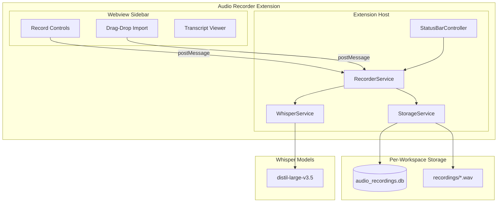
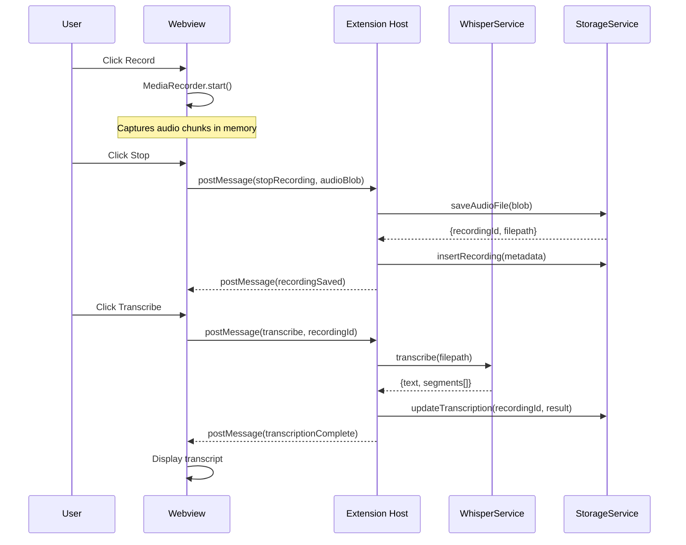
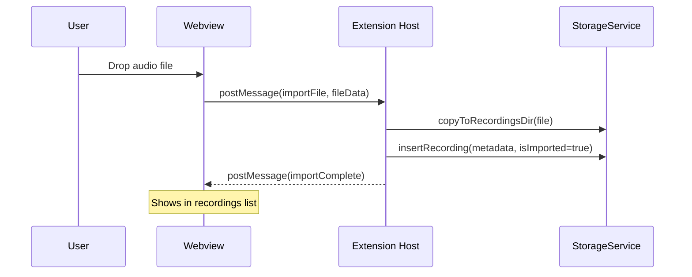

# Audio Recorder with Whisper Transcription

## Architecture Overview



## Key Technical Decisions

- **Implementation Style**: VS Code Extension (like time-tracker), not core Void
  service
- **Whisper Implementation**: Use `@xenova/transformers` with
  `distil-large-v3.5` ONNX model
- **Audio Format**: Record as WAV (16kHz mono) - optimal for Whisper models
- **Model**: Bundle `distil-large-v3.5` (~~1.5GB) - best accuracy (~~2.8% WER) +
  6x faster on CPU
- **Recording**: MediaRecorder API in webview, chunks sent to extension host for
  saving
- **Storage**: Per-workspace SQLite (`better-sqlite3`) + file storage following
  time-tracker pattern
- **Database Library**: `better-sqlite3` (same as time-tracker extension)

## Extension Structure

**Reference**: [extensions/time-tracker/](extensions/time-tracker/) for patterns

```
extensions/audio-recorder/
├── package.json          # Extension manifest (commands, views, keybindings)
├── src/
│   ├── extension.ts      # Entry point, service initialization
│   ├── storageService.ts # Per-workspace SQLite database
│   ├── recorderService.ts # Recording state machine
│   ├── whisperService.ts # Whisper model management and transcription
│   ├── sidebarProvider.ts # Webview sidebar panel
│   ├── statusBarController.ts # Status bar integration
│   ├── exportService.ts  # DOCX/TXT/SRT export
│   └── types.ts          # TypeScript interfaces
├── media/
│   └── sidebar.css       # Webview styles (VSCode CSS variables)
└── README.md
```

## Implementation Components

### 1. Extension Entry Point

**File**: `extensions/audio-recorder/src/extension.ts`

**Reference**:
[extensions/time-tracker/src/extension.ts](extensions/time-tracker/src/extension.ts)

```typescript
export async function activate(context: vscode.ExtensionContext) {
	// Initialize services
	const storageService = new StorageService(context);
	await storageService.initialize();

	const whisperService = new WhisperService(context);
	const recorderService = new RecorderService(storageService, whisperService);
	const statusBarController = new StatusBarController(recorderService);

	// Register sidebar provider
	const sidebarProvider = new SidebarProvider(
		context.extensionUri,
		recorderService,
		storageService,
	);
	context.subscriptions.push(
		vscode.window.registerWebviewViewProvider(
			"audioRecorder.sidebar",
			sidebarProvider,
		),
	);

	// Register commands
	context.subscriptions.push(
		vscode.commands.registerCommand("audioRecorder.startRecording", () =>
			recorderService.start(),
		),
		vscode.commands.registerCommand("audioRecorder.stopRecording", () =>
			recorderService.stop(),
		),
		vscode.commands.registerCommand("audioRecorder.toggleRecording", () =>
			recorderService.toggle(),
		),
		vscode.commands.registerCommand("audioRecorder.importAudio", () =>
			recorderService.importFile(),
		),
	);
}
```

### 2. Whisper Service

**File**: `extensions/audio-recorder/src/whisperService.ts`

**Key Methods:**

```typescript
class WhisperService {
	private modelsDir: string; // ~/.safe-appeals-navigator/models/whisper/

	async downloadModel(
		modelName: "tiny" | "small" | "medium" | "large",
	): Promise<void>;
	async getAvailableModels(): Promise<WhisperModel[]>;
	async transcribe(
		audioPath: string,
		options?: TranscribeOptions,
	): Promise<TranscriptionResult>;
	isModelDownloaded(modelName: string): boolean;
}
```

**Whisper Integration** (using `@xenova/transformers`):

```typescript
import { pipeline, env } from '@xenova/transformers';

async transcribe(audioPath: string): Promise<TranscriptionResult> {
    // Using @xenova/transformers for distil-large-v3.5
    env.localModelPath = path.join(process.resourcesPath, 'models', 'whisper');

    // Point to bundled model in app resources
    const modelPath = path.join(process.resourcesPath, 'models', 'whisper', 'distil-large-v3.5');

    const transcriber = await pipeline('automatic-speech-recognition', modelPath, {
        local_files_only: true,  // Use bundled model, don't download
    });

    const result = await transcriber(audioPath, {
        return_timestamps: true,
        chunk_length_s: 30,
    });

    return {
        text: result.text,
        segments: result.chunks,  // [{timestamp: [start, end], text}, ...]
        language: 'en'
    };
}
```

### 3. Recorder Service

**File**: `extensions/audio-recorder/src/recorderService.ts`

**State Machine:**

```typescript
type RecorderState = "idle" | "recording" | "paused" | "transcribing";

class RecorderService {
	private _onStateChanged = new vscode.EventEmitter<RecorderState>();
	readonly onStateChanged = this._onStateChanged.event;

	private state: RecorderState = "idle";
	private startTime: number | null = null;

	async start(): Promise<void>;
	async stop(): Promise<AudioRecording>;
	pause(): void;
	resume(): void;
	async importFile(): Promise<AudioRecording>;
}
```

### 4. Sidebar Webview Provider

**File**: `extensions/audio-recorder/src/sidebarProvider.ts`

**Reference**:
[extensions/time-tracker/src/sidebarProvider.ts](extensions/time-tracker/src/sidebarProvider.ts)

**Webview Features:**

- Record button with timer display (uses `setInterval` for elapsed time)
- Pause/Resume controls
- Drag-and-drop zone for audio file import (HTML5 drag events)
- Recordings list with metadata (date, duration, transcription status)
- Transcript viewer with clickable timestamps
- Export buttons (DOCX/TXT/SRT)
- Audio playback with waveform visualization

**Message Passing** (webview <-> extension):

```typescript
// From webview to extension
interface WebviewMessage {
	type:
		| "startRecording"
		| "stopRecording"
		| "importFile"
		| "transcribe"
		| "export"
		| "deleteRecording";
	payload?: any;
}

// From extension to webview
interface ExtensionMessage {
	type: "stateChanged" | "recordingsList" | "transcriptionProgress" | "error";
	payload: any;
}
```

### 5. Status Bar Controller

**File**: `extensions/audio-recorder/src/statusBarController.ts`

**Reference**:
[extensions/time-tracker/src/statusBarController.ts](extensions/time-tracker/src/statusBarController.ts)

```typescript
class StatusBarController {
	private statusBarItem: vscode.StatusBarItem;
	private updateInterval: NodeJS.Timeout | null = null;

	constructor(recorderService: RecorderService) {
		this.statusBarItem = vscode.window.createStatusBarItem(
			vscode.StatusBarAlignment.Left,
			99, // Priority (just below time-tracker at 100)
		);
		this.statusBarItem.command = "audioRecorder.toggleRecording";

		recorderService.onStateChanged(() => this.updateDisplay());
		this.updateDisplay();
		this.statusBarItem.show();
	}

	private updateDisplay(): void {
		switch (this.state) {
			case "idle":
				this.statusBarItem.text = "$(mic) Record";
				this.statusBarItem.backgroundColor = undefined;
				break;
			case "recording":
				this.statusBarItem.text = `$(record) ${this.formatElapsed()}`;
				this.statusBarItem.backgroundColor = new vscode.ThemeColor(
					"statusBarItem.errorBackground",
				);
				break;
			case "paused":
				this.statusBarItem.text = `$(debug-pause) ${this.formatElapsed()} (Paused)`;
				this.statusBarItem.backgroundColor = new vscode.ThemeColor(
					"statusBarItem.warningBackground",
				);
				break;
			case "transcribing":
				this.statusBarItem.text = "$(sync~spin) Transcribing...";
				this.statusBarItem.backgroundColor = undefined;
				break;
		}
	}
}
```

### 5. Per-Workspace Database (Following Time-Tracker Pattern)

**Reference Implementation**:
[extensions/time-tracker/src/storageService.ts](extensions/time-tracker/src/storageService.ts)

**New File**: `extensions/audio-recorder/src/storageService.ts`

**Database Location:**

- Windows:
  `%USERPROFILE%\.safe-appeals-navigator\databases\workspaces\{workspaceId}\audio_recordings.db`
- macOS/Linux:
  `~/.safe-appeals-navigator/databases/workspaces/{workspaceId}/audio_recordings.db`

**Audio Files Location:**

- `~/.safe-appeals-navigator/databases/workspaces/{workspaceId}/recordings/*.wav`

**Workspace ID Generation** (same as time-tracker):

```typescript
private generateWorkspaceId(): string {
    const workspaceFolders = vscode.workspace.workspaceFolders;
    if (!workspaceFolders || workspaceFolders.length === 0) {
        return crypto.createHash('sha256')
            .update(this.context.globalStorageUri.fsPath)
            .digest('hex')
            .substring(0, 16);
    }
    const workspacePath = workspaceFolders[0].uri.fsPath;
    return crypto.createHash('sha256')
        .update(workspacePath)
        .digest('hex')
        .substring(0, 16);
}
```

**Database Path Generation** (same as time-tracker):

```typescript
private getDbPath(): string {
    const homeDir = process.env.HOME || process.env.USERPROFILE || '';
    const baseDir = path.join(
        homeDir,
        '.safe-appeals-navigator',
        'databases',
        'workspaces',
        this.workspaceId
    );
    if (!fs.existsSync(baseDir)) {
        fs.mkdirSync(baseDir, { recursive: true });
    }
    return path.join(baseDir, 'audio_recordings.db');
}

private getRecordingsDir(): string {
    const homeDir = process.env.HOME || process.env.USERPROFILE || '';
    const recordingsDir = path.join(
        homeDir,
        '.safe-appeals-navigator',
        'databases',
        'workspaces',
        this.workspaceId,
        'recordings'
    );
    if (!fs.existsSync(recordingsDir)) {
        fs.mkdirSync(recordingsDir, { recursive: true });
    }
    return recordingsDir;
}
```

**SQLite Library**: `better-sqlite3` (same as time-tracker)

**Schema:**

```sql
CREATE TABLE IF NOT EXISTS recordings (
    id TEXT PRIMARY KEY,
    workspace_id TEXT NOT NULL,
    filename TEXT NOT NULL,
    filepath TEXT NOT NULL,
    duration_seconds REAL,
    file_size_bytes INTEGER,
    sample_rate INTEGER DEFAULT 16000,
    channels INTEGER DEFAULT 1,
    created_at INTEGER DEFAULT (strftime('%s','now') * 1000),
    transcription_status TEXT DEFAULT 'pending' CHECK(transcription_status IN ('pending', 'processing', 'completed', 'failed')),
    transcription_text TEXT,
    transcription_segments TEXT,  -- JSON array with timestamps
    transcription_language TEXT,
    case_id TEXT,  -- Link to case if applicable
    notes TEXT,
    is_imported INTEGER DEFAULT 0,  -- 1 if drag-dropped, 0 if recorded
    original_filename TEXT  -- Original name for imported files
);

CREATE INDEX IF NOT EXISTS idx_recordings_workspace ON recordings(workspace_id, created_at);
CREATE INDEX IF NOT EXISTS idx_recordings_case ON recordings(case_id);
CREATE INDEX IF NOT EXISTS idx_recordings_status ON recordings(transcription_status);

-- FTS5 for transcript search
CREATE VIRTUAL TABLE IF NOT EXISTS recordings_fts USING fts5(
    id UNINDEXED,
    transcription_text,
    notes,
    content='recordings',
    content_rowid='rowid'
);

-- Triggers to keep FTS in sync
CREATE TRIGGER IF NOT EXISTS recordings_ai AFTER INSERT ON recordings BEGIN
    INSERT INTO recordings_fts(rowid, id, transcription_text, notes)
    VALUES (new.rowid, new.id, new.transcription_text, new.notes);
END;

CREATE TRIGGER IF NOT EXISTS recordings_au AFTER UPDATE ON recordings BEGIN
    INSERT INTO recordings_fts(recordings_fts, rowid, id, transcription_text, notes)
    VALUES ('delete', old.rowid, old.id, old.transcription_text, old.notes);
    INSERT INTO recordings_fts(rowid, id, transcription_text, notes)
    VALUES (new.rowid, new.id, new.transcription_text, new.notes);
END;
```

**Whisper Models Table** (global, not per-workspace):

```sql
-- Location: ~/.safe-appeals-navigator/models/whisper/models.db
CREATE TABLE IF NOT EXISTS whisper_models (
    name TEXT PRIMARY KEY,
    path TEXT NOT NULL,
    size_bytes INTEGER,
    checksum TEXT,
    downloaded_at INTEGER
);
```

### 6. Whisper Model Management

**Bundled Model (ships with app):**

- `distil-whisper/distil-large-v3.5` (~1.5GB ONNX) - Bundled in installer, works
  immediately
- Located at: `{app}/resources/models/whisper/distil-large-v3.5/`
- **Best accuracy + speed for legal transcription (~2.8% WER)**
- 6x faster than Whisper large-v3 on CPU
- Uses @xenova/transformers for Node.js integration

**Optional User-Downloaded Models:**

Users can download larger models for better accuracy via Settings:

| Model             | Size   | Speed         | Accuracy  | Use Case                           |
| ----------------- | ------ | ------------- | --------- | ---------------------------------- |
| distil-large-v3.5 | ~1.5GB | **6x faster** | ~2.8% WER | **Default (bundled)**              |
| large-v3          | ~3GB   | Slow          | 2.72% WER | Optional download for max accuracy |

**Model Download Command:**

```typescript
// User can trigger via command palette: "Audio: Download Whisper Model"
vscode.commands.registerCommand("audioRecorder.downloadModel", async () => {
	const model = await vscode.window.showQuickPick(["medium", "large"], {
		placeHolder: "Select model to download (small is already bundled)",
	});
	if (model) {
		await whisperService.downloadModel(model);
	}
});
```

### 7. Integration Points

**RAG Indexing:**

- Add transcripts to RAG index for searchability
- Link transcript chunks to source recording
- Enable "search across all transcripts" in case

**Case Association:**

- Option to link recording to current case (.caseinfo.json)
- Recordings appear in case timeline if linked

**File Organizer Integration:**

- AI can suggest naming for imported audio files
- Auto-categorize based on transcript content

## Data Flow



## Import Flow (Drag-and-Drop)



## Extension package.json

**File**: `extensions/audio-recorder/package.json`

**Reference**:
[extensions/time-tracker/package.json](extensions/time-tracker/package.json)

```json
{
	"name": "audio-recorder",
	"displayName": "Audio Recorder & Transcription",
	"description": "Record audio and transcribe with local Whisper AI",
	"version": "0.0.1",
	"engines": { "vscode": "^1.85.0" },
	"categories": ["Other"],
	"activationEvents": ["onStartupFinished"],
	"main": "./out/extension.js",
	"contributes": {
		"commands": [
			{
				"command": "audioRecorder.startRecording",
				"title": "Start Recording",
				"category": "Audio"
			},
			{
				"command": "audioRecorder.stopRecording",
				"title": "Stop Recording",
				"category": "Audio"
			},
			{
				"command": "audioRecorder.toggleRecording",
				"title": "Toggle Recording",
				"category": "Audio"
			},
			{
				"command": "audioRecorder.importAudio",
				"title": "Import Audio File",
				"category": "Audio"
			},
			{
				"command": "audioRecorder.downloadModel",
				"title": "Download Whisper Model",
				"category": "Audio"
			}
		],
		"views": {
			"void-sidebar": [
				{
					"type": "webview",
					"id": "audioRecorder.sidebar",
					"name": "Audio Recorder",
					"icon": "$(mic)"
				}
			]
		},
		"keybindings": [
			{
				"command": "audioRecorder.toggleRecording",
				"key": "ctrl+shift+r",
				"mac": "cmd+shift+r"
			}
		]
	},
	"dependencies": {
		"@xenova/transformers": "^2.17.0",
		"onnxruntime-node": "^1.17.0",
		"better-sqlite3": "^9.4.0",
		"@ffmpeg/ffmpeg": "^0.12.0",
		"@ffmpeg/util": "^0.12.0",
		"docx": "^8.5.0"
	}
}
```

## Audio Format Conversion

**Problem**: MediaRecorder in Chromium outputs webm/opus format, but Whisper requires WAV 16kHz mono.

**Solution**: Use `@ffmpeg/ffmpeg` (ffmpeg-wasm) for in-browser/Node conversion.

```typescript
// In recorderService.ts or audioConverter.ts
import { FFmpeg } from "@ffmpeg/ffmpeg";
import { fetchFile } from "@ffmpeg/util";

async function convertToWav(webmBlob: Blob): Promise<ArrayBuffer> {
	const ffmpeg = new FFmpeg();
	await ffmpeg.load();

	await ffmpeg.writeFile("input.webm", await fetchFile(webmBlob));

	// Convert to 16kHz mono WAV (optimal for Whisper)
	await ffmpeg.exec([
		"-i",
		"input.webm",
		"-ar",
		"16000", // 16kHz sample rate
		"-ac",
		"1", // Mono
		"-c:a",
		"pcm_s16le", // 16-bit PCM
		"output.wav",
	]);

	const data = await ffmpeg.readFile("output.wav");
	return data.buffer;
}
```

## Microphone Permissions

**Permission Request Flow**:

```typescript
// In sidebarProvider.ts (webview)
async function requestMicrophoneAccess(): Promise<MediaStream | null> {
	try {
		const stream = await navigator.mediaDevices.getUserMedia({
			audio: {
				channelCount: 1,
				sampleRate: 16000,
				echoCancellation: true,
				noiseSuppression: true,
			},
		});
		return stream;
	} catch (error) {
		if (error.name === "NotAllowedError") {
			// User denied permission
			vscode.postMessage({
				type: "error",
				payload: {
					code: "PERMISSION_DENIED",
					message:
						"Microphone access was denied. Please enable it in your system settings.",
				},
			});
		} else if (error.name === "NotFoundError") {
			// No microphone found
			vscode.postMessage({
				type: "error",
				payload: {
					code: "NO_MICROPHONE",
					message:
						"No microphone found. Please connect a microphone and try again.",
				},
			});
		}
		return null;
	}
}
```

**UI States for Permissions**:

- Show "Enable Microphone" button if permission not yet requested
- Show error message with instructions if permission denied
- Show device selector if multiple microphones available

## Error Handling Strategy

**Error Types and Handling**:

| Error Type           | Code                   | User Message                | Recovery Action              |
| -------------------- | ---------------------- | --------------------------- | ---------------------------- |
| Permission denied    | `PERMISSION_DENIED`    | "Microphone access denied"  | Show system settings link    |
| No microphone        | `NO_MICROPHONE`        | "No microphone found"       | Prompt to connect device     |
| Recording failed     | `RECORDING_FAILED`     | "Recording failed to start" | Retry button                 |
| Transcription failed | `TRANSCRIPTION_FAILED` | "Transcription failed"      | Retry or use different model |
| Model not found      | `MODEL_NOT_FOUND`      | "Whisper model not found"   | Download model button        |
| Storage full         | `STORAGE_FULL`         | "Disk space low"            | Delete old recordings        |
| Audio too short      | `AUDIO_TOO_SHORT`      | "Recording too short"       | Minimum 1 second required    |

**Error Handling Pattern**:

```typescript
// In types.ts
interface AudioRecorderError {
	code: string;
	message: string;
	recoveryAction?: "retry" | "settings" | "download" | "delete";
	details?: any;
}

// In recorderService.ts
class RecorderService {
	private _onError = new vscode.EventEmitter<AudioRecorderError>();
	readonly onError = this._onError.event;

	async transcribe(recordingId: string): Promise<void> {
		try {
			// ... transcription logic
		} catch (error) {
			this._onError.fire({
				code: "TRANSCRIPTION_FAILED",
				message: `Transcription failed: ${error.message}`,
				recoveryAction: "retry",
				details: { recordingId, originalError: error },
			});
		}
	}
}
```

## Progress Tracking

**Transcription Progress Events**:

```typescript
// In types.ts
interface TranscriptionProgress {
    recordingId: string;
    stage: 'loading_model' | 'processing' | 'decoding' | 'complete';
    progress: number;  // 0-100
    estimatedTimeRemaining?: number;  // seconds
    currentChunk?: number;
    totalChunks?: number;
}

// In whisperService.ts
async transcribe(audioPath: string, onProgress?: (p: TranscriptionProgress) => void): Promise<TranscriptionResult> {
    onProgress?.({ stage: 'loading_model', progress: 0 });

    const transcriber = await pipeline('automatic-speech-recognition', modelPath, {
        local_files_only: true,
        progress_callback: (progress) => {
            onProgress?.({
                stage: 'processing',
                progress: Math.round(progress.progress * 100),
                currentChunk: progress.chunk,
                totalChunks: progress.total
            });
        }
    });

    onProgress?.({ stage: 'decoding', progress: 90 });

    const result = await transcriber(audioPath, {
        return_timestamps: true,
        chunk_length_s: 30,
    });

    onProgress?.({ stage: 'complete', progress: 100 });

    return result;
}
```

**UI Progress Display**:

- Show progress bar during transcription
- Display current stage (Loading model → Processing → Complete)
- Show estimated time remaining for long recordings
- Allow cancellation of in-progress transcription

## Dependencies

**NPM Packages** (in `extensions/audio-recorder/package.json`):

- `@xenova/transformers` - Transformers.js for distil-large-v3.5 inference
- `better-sqlite3` - Synchronous SQLite (same as time-tracker)
- `onnxruntime-node` - ONNX runtime for Node.js (peer dependency)
- `@ffmpeg/ffmpeg` - Audio format conversion (webm → WAV)
- `@ffmpeg/util` - FFmpeg utilities
- `docx` - DOCX document generation for transcript export
- No additional packages needed for MediaRecorder (built into Chromium/Electron)

**Whisper Model (Bundled with Installer - Accuracy Priority for Legal):**

For a legal application, transcription accuracy is paramount. Users must trust
the output.

- Model is pre-downloaded during build and included in the installer
- Zero download wait for users - transcription works immediately on first use
- Bundled location: `resources/models/whisper/distil-large-v3.5/`
- **Default model: `distil-whisper/distil-large-v3.5` (~1.5GB) - best accuracy +
  speed for legal**
- Word Error Rate: **~2.8%** (better than medium.en's 2.81%)
- **6x faster than Whisper large-v3 on CPU** - optimized for local inference
- Adds ~1.5GB to installer size (acceptable for professional legal desktop app)
- Trained on 98k hours of audio (4x previous distil versions)

**Why distil-large-v3.5 for legal applications:**

| Aspect    | medium.en    | distil-large-v3.5        | large-v3         |
| --------- | ------------ | ------------------------ | ---------------- |
| WER       | 2.81%        | **~2.8%**                | 2.72%            |
| Size      | ~1.5GB       | ~1.5GB                   | ~3GB             |
| CPU Speed | 2x real-time | **6x faster**            | 15-20x real-time |
| Node.js   | whisper-node | **@xenova/transformers** | whisper-node     |

- Best accuracy-to-speed ratio for local CPU transcription
- Legal transcription errors can have serious consequences
- Court transcripts, depositions, client calls require maximum reliability
- Professional users expect high accuracy and will accept larger installer
- Trust in the app depends on transcription quality

## ONNX Model Verification

**Verified**: distil-large-v3.5 ONNX files are available on HuggingFace:

- Repository: `distil-whisper/distil-large-v3.5`
- ONNX files location: `onnx/` directory
- Files needed:
  - `config.json` - Model configuration
  - `tokenizer.json` - Tokenizer vocabulary
  - `tokenizer_config.json` - Tokenizer settings
  - `preprocessor_config.json` - Audio preprocessing settings
  - `onnx/encoder_model.onnx` - Encoder (~600MB)
  - `onnx/decoder_model_merged.onnx` - Decoder with KV cache (~900MB)

**Alternative if ONNX not available**: Use Xenova's pre-converted models:

- `Xenova/distil-whisper-large-v3` (already converted to ONNX for Transformers.js)

**Build-time Model Download Script:**

New file: `scripts/download-whisper-model.js`

```javascript
const https = require("https");
const fs = require("fs");
const path = require("path");
const crypto = require("crypto");

// Using distil-large-v3.5 for best accuracy + speed (~2.8% WER, 6x faster on CPU)
const MODEL_REPO = "distil-whisper/distil-large-v3.5";
const OUTPUT_DIR = path.join(
	__dirname,
	"..",
	"resources",
	"models",
	"whisper",
	"distil-large-v3.5",
);

// Files needed for ONNX inference via @xenova/transformers
const MODEL_FILES = [
	"config.json",
	"tokenizer.json",
	"tokenizer_config.json",
	"preprocessor_config.json",
	"onnx/encoder_model.onnx", // ~600MB
	"onnx/decoder_model_merged.onnx", // ~900MB
];

async function downloadModel() {
	console.log(
		"Downloading distil-large-v3.5 model (~1.5GB) for legal-grade accuracy...",
	);
	fs.mkdirSync(OUTPUT_DIR, { recursive: true });
	fs.mkdirSync(path.join(OUTPUT_DIR, "onnx"), { recursive: true });

	for (const file of MODEL_FILES) {
		const url = `https://huggingface.co/${MODEL_REPO}/resolve/main/${file}`;
		// Download each file...
	}
	// Download with progress bar, verify checksum
}
```

**Electron Builder Configuration** (add to packaging config):

```json
{
	"extraResources": [
		{
			"from": "resources/models/whisper",
			"to": "models/whisper",
			"filter": ["**/*"]
		}
	]
}
```

**Runtime Model Path** (in whisperService.ts):

```typescript
private getModelPath(): string {
    // Check bundled location first (in app resources)
    const bundledPath = path.join(
        process.resourcesPath,  // Electron's resources folder
        'models', 'whisper', 'distil-large-v3.5'
    );
    if (fs.existsSync(bundledPath)) {
        return bundledPath;
    }

    // Fallback to user cache (if downloaded via @xenova/transformers)
    const userPath = path.join(
        process.env.HOME || process.env.USERPROFILE || '',
        '.cache', 'huggingface', 'hub', 'models--distil-whisper--distil-large-v3.5'
    );
    return userPath;
}
```

## Files to Create

**Build Script (for bundling Whisper model):**

- `scripts/download-whisper-model.js` - Downloads distil-large-v3.5 ONNX files
  during build

**Model Resources (created by build script):**

- `resources/models/whisper/distil-large-v3.5/` - Bundled model directory
  (~1.5GB total)
  - `config.json`, `tokenizer.json`, `preprocessor_config.json`
  - `onnx/encoder_model.onnx` (~600MB)
  - `onnx/decoder_model_merged.onnx` (~900MB)

**New Extension** (`extensions/audio-recorder/`):

- `package.json` - Extension manifest with commands, views, keybindings
- `src/extension.ts` - Entry point
- `src/storageService.ts` - Per-workspace SQLite database
- `src/recorderService.ts` - Recording state machine
- `src/whisperService.ts` - Whisper model management and transcription
- `src/sidebarProvider.ts` - Webview sidebar panel with HTML/JS
- `src/statusBarController.ts` - Status bar integration
- `src/exportService.ts` - DOCX/TXT/SRT export
- `src/types.ts` - TypeScript interfaces
- `media/sidebar.css` - Webview styles

## Files to Modify

- `extensions/package.json` - Add `audio-recorder` to workspaces
- `extensions/bun.lock` - Lock file will update with new dependencies

## Export Service Implementation

**File**: `extensions/audio-recorder/src/exportService.ts`

### DOCX Export (using `docx` library)

```typescript
import { Document, Paragraph, TextRun, HeadingLevel, Packer } from "docx";

async function exportToDocx(recording: AudioRecording): Promise<Buffer> {
	const doc = new Document({
		sections: [
			{
				properties: {},
				children: [
					// Title
					new Paragraph({
						text: `Transcript: ${recording.filename}`,
						heading: HeadingLevel.HEADING_1,
					}),
					// Metadata
					new Paragraph({
						children: [
							new TextRun({
								text: `Date: ${recording.created_at}`,
								italics: true,
							}),
							new TextRun({
								text: `  |  Duration: ${formatDuration(recording.duration_seconds)}`,
								italics: true,
							}),
						],
					}),
					new Paragraph({ text: "" }), // Spacer
					// Transcript with timestamps
					...recording.transcription_segments.map(
						(segment) =>
							new Paragraph({
								children: [
									new TextRun({
										text: `[${formatTimestamp(segment.start)}] `,
										bold: true,
										color: "666666",
									}),
									new TextRun({ text: segment.text }),
								],
							}),
					),
				],
			},
		],
	});

	return await Packer.toBuffer(doc);
}
```

### TXT Export

```typescript
function exportToTxt(
	recording: AudioRecording,
	includeTimestamps: boolean,
): string {
	if (includeTimestamps) {
		return recording.transcription_segments
			.map((s) => `[${formatTimestamp(s.start)}] ${s.text}`)
			.join("\n");
	}
	return recording.transcription_text;
}
```

### SRT Export (Subtitle Format)

```typescript
function exportToSrt(recording: AudioRecording): string {
	return recording.transcription_segments
		.map((segment, index) => {
			const startTime = formatSrtTimestamp(segment.start);
			const endTime = formatSrtTimestamp(segment.end);
			return `${index + 1}\n${startTime} --> ${endTime}\n${segment.text}\n`;
		})
		.join("\n");
}

// SRT timestamp format: 00:00:00,000
function formatSrtTimestamp(seconds: number): string {
	const h = Math.floor(seconds / 3600);
	const m = Math.floor((seconds % 3600) / 60);
	const s = Math.floor(seconds % 60);
	const ms = Math.floor((seconds % 1) * 1000);
	return `${pad(h)}:${pad(m)}:${pad(s)},${pad(ms, 3)}`;
}
```

### JSON Export

```typescript
function exportToJson(recording: AudioRecording): string {
	return JSON.stringify(
		{
			id: recording.id,
			filename: recording.filename,
			created_at: recording.created_at,
			duration_seconds: recording.duration_seconds,
			transcription: {
				text: recording.transcription_text,
				language: recording.transcription_language,
				segments: recording.transcription_segments,
			},
			metadata: {
				sample_rate: recording.sample_rate,
				channels: recording.channels,
				is_imported: recording.is_imported,
				case_id: recording.case_id,
			},
		},
		null,
		2,
	);
}
```

## Export Options Summary

| Format   | Extension | Use Case                          | Includes Timestamps |
| -------- | --------- | --------------------------------- | ------------------- |
| **DOCX** | .docx     | Court submissions, client reports | Yes (formatted)     |
| **TXT**  | .txt      | Simple text, copy/paste           | Optional            |
| **SRT**  | .srt      | Video subtitles, media players    | Yes (timecodes)     |
| **JSON** | .json     | API integration, backup           | Yes (structured)    |
