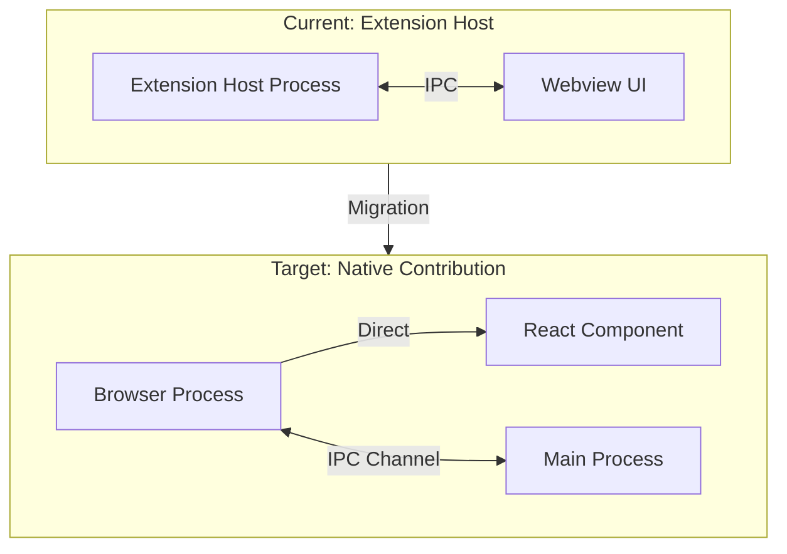

# Audio Recorder Extension to Void Contribution Migration

## Architecture Overview



## File Structure Migration

```
extensions/audio-recorder/src/          -->  src/vs/workbench/contrib/void/
├── extension.ts                              browser/audioRecorder/
├── recorderService.ts                        ├── audioRecorder.contribution.ts
├── whisperService.ts                         ├── audioRecorderPane.ts
├── storageService.ts                         ├── audioRecorderService.ts
├── exportService.ts                          └── whisperTranscriptionService.ts
├── statusBarController.ts
└── sidebarProvider.ts (webview)        common/audioRecorder/
                                              ├── audioRecorderTypes.ts
                                              └── IAudioRecorderService.ts

                                        electron-main/audioRecorder/
                                              ├── audioRecorderMainService.ts
                                              └── audioRecorderChannel.ts

                                        browser/react/src/audio-recorder-tsx/
                                              ├── index.tsx
                                              ├── AudioRecorder.tsx
                                              ├── RecordingControls.tsx
                                              ├── RecordingsList.tsx
                                              ├── RecordingCard.tsx       (NEW: with inline playback)
                                              ├── AudioPlaybackBar.tsx    (NEW: seek bar + controls)
                                              └── AudioImporter.tsx
```

## Phase 1: Create Core Infrastructure

### 1.1 Type Definitions

Create `common/audioRecorder/audioRecorderTypes.ts` with shared types:

```typescript
// Recording lifecycle states
export type RecorderState = "idle" | "recording" | "paused";

// Individual recording status
export type RecordingStatus =
	| "pending"
	| "transcribing"
	| "completed"
	| "failed";

// Playback state (managed per-card in React)
export type PlaybackState = "stopped" | "playing" | "paused";

export interface Recording {
	id: string;
	filename: string;
	filePath: string; // Full path to WAV file
	createdAt: string; // ISO timestamp
	duration: number; // Duration in seconds
	status: RecordingStatus;
	transcript?: string; // Full transcript text
	transcriptSegments?: TranscriptSegment[]; // Timestamped segments
	isImported: boolean; // true if imported vs recorded
}

export interface TranscriptSegment {
	start: number; // Start time in seconds
	end: number; // End time in seconds
	text: string;
}

export interface TranscriptionResult {
	text: string;
	segments: TranscriptSegment[];
	language: string;
}
```

### 1.2 Service Interface

Create `common/audioRecorder/IAudioRecorderService.ts`:

```typescript
export interface IAudioRecorderService {
	// Recording lifecycle
	readonly state: RecorderState;
	readonly onStateChanged: Event<RecorderState>;
	startRecording(): Promise<void>;
	stopRecording(): Promise<Recording>;
	pauseRecording(): void;
	resumeRecording(): void;

	// Recording management
	readonly onRecordingsChanged: Event<Recording[]>;
	getRecordings(): Promise<Recording[]>;
	getRecording(id: string): Promise<Recording | undefined>;
	deleteRecording(id: string): Promise<void>;
	importAudio(filePath: string): Promise<Recording>;

	// Playback support
	getAudioUrl(recordingId: string): Promise<string>; // Returns blob URL for playback

	// Transcription
	readonly onTranscriptionProgress: Event<{
		recordingId: string;
		progress: number;
	}>;
	transcribe(recordingId: string): Promise<TranscriptionResult>;

	// Export
	exportRecording(
		recordingId: string,
		format: "docx" | "txt" | "srt" | "json",
	): Promise<void>;
}

export const IAudioRecorderService = createDecorator<IAudioRecorderService>(
	"audioRecorderService",
);
```

### 1.3 Main Process Service

Create `electron-main/audioRecorder/audioRecorderMainService.ts`:

- Handle file I/O for saving recordings to
  `~/.safe-appeals-navigator/databases/workspaces/{workspaceId}/recordings/`
- Manage SQLite database via `better-sqlite3`
- Handle Whisper model downloads and caching

### 1.4 IPC Channel

Create `electron-main/audioRecorder/audioRecorderChannel.ts`:

- Implement `IServerChannel` interface
- Bridge browser service to main process for file operations
- Register in [app.ts](src/vs/code/electron-main/app.ts) (line ~700, near other
  void channels)

## Phase 2: Browser Services

### 2.1 Audio Recorder Service

Create `browser/audioRecorder/audioRecorderService.ts`:

- Extend `Disposable`, implement `IAudioRecorderService`
- Manage recording state machine (idle/recording/paused/transcribing)
- Use `Emitter<T>` for events (`onStateChanged`, `onRecordingComplete`, etc.)
- Communicate with main process via IPC channel
- Register with
  `registerSingleton(IAudioRecorderService, AudioRecorderService, InstantiationType.Delayed)`

### 2.2 Whisper Transcription Service

Create `browser/audioRecorder/whisperTranscriptionService.ts`:

- Handle `@huggingface/transformers` dynamic import
- Progress callbacks for model loading/transcription
- WAV decoding and audio processing
- Model: `distil-whisper/distil-large-v3.5-ONNX`

### 2.3 Audio Playback Implementation

Playback is handled client-side in React using the HTML5 Audio API:

```typescript
// In AudioPlaybackBar.tsx
const audioRef = useRef<HTMLAudioElement>(null);
const [isPlaying, setIsPlaying] = useState(false);
const [currentTime, setCurrentTime] = useState(0);

// Get blob URL from service (IPC call to read file from disk)
useEffect(() => {
	const loadAudio = async () => {
		const url = await audioRecorderService.getAudioUrl(recordingId);
		if (audioRef.current) {
			audioRef.current.src = url;
		}
	};
	loadAudio();

	return () => {
		// Revoke blob URL on cleanup
		if (audioRef.current?.src) {
			URL.revokeObjectURL(audioRef.current.src);
		}
	};
}, [recordingId]);

// Time update handler
useEffect(() => {
	const audio = audioRef.current;
	if (!audio) return;

	const handleTimeUpdate = () => setCurrentTime(audio.currentTime);
	const handleEnded = () => setIsPlaying(false);

	audio.addEventListener("timeupdate", handleTimeUpdate);
	audio.addEventListener("ended", handleEnded);

	return () => {
		audio.removeEventListener("timeupdate", handleTimeUpdate);
		audio.removeEventListener("ended", handleEnded);
	};
}, []);
```

The `getAudioUrl()` method in the service:

1. Reads the WAV file from disk via IPC channel
2. Creates a Blob from the file data
3. Returns a blob URL via `URL.createObjectURL()`
4. Blob URLs are revoked on component unmount to prevent memory leaks

## Phase 3: React UI Migration

### 3.0 CSS/Styling Conventions (CRITICAL)

Follow these patterns from Timeline and File Organizer components for visual
consistency:

**Approach 1: Inline Style Objects (Preferred for Timeline-style components)**

Define reusable style objects at the top of each component:

```typescript
// Reusable style objects with VSCode CSS variables
const containerStyle: React.CSSProperties = {
	backgroundColor: "var(--vscode-editor-background)",
	color: "var(--vscode-editor-foreground)",
};

const cardStyle: React.CSSProperties = {
	backgroundColor: "var(--vscode-input-background)",
	border: "1px solid var(--vscode-panel-border)",
	borderRadius: "12px",
};

const buttonPrimaryStyle: React.CSSProperties = {
	backgroundColor: "var(--vscode-button-background)",
	color: "var(--vscode-button-foreground)",
	border: "none",
	borderRadius: "8px",
	cursor: "pointer",
};

const buttonSecondaryStyle: React.CSSProperties = {
	backgroundColor: "var(--vscode-button-secondaryBackground)",
	color: "var(--vscode-button-secondaryForeground)",
	border: "1px solid var(--vscode-panel-border)",
	borderRadius: "8px",
};

const textMutedStyle: React.CSSProperties = {
	color: "var(--vscode-descriptionForeground)",
};

const selectStyle: React.CSSProperties = {
	backgroundColor: "var(--vscode-input-background)",
	color: "var(--vscode-input-foreground)",
	border: "1px solid var(--vscode-input-border)",
	borderRadius: "8px",
};
```

**Approach 2: CSS File (For complex layouts like File Organizer)**

Create `audio-recorder-tsx/styles.css` if needed for:

- Grid layouts
- Animations (`@keyframes`)
- Complex hover states
- Scrollbar styling

**Key VSCode CSS Variables to Use:**

| Purpose               | Variable                                   |
| --------------------- | ------------------------------------------ |
| Main background       | `var(--vscode-editor-background)`          |
| Sidebar background    | `var(--vscode-sideBar-background)`         |
| Card/input background | `var(--vscode-input-background)`           |
| Primary text          | `var(--vscode-editor-foreground)`          |
| Muted text            | `var(--vscode-descriptionForeground)`      |
| Disabled text         | `var(--vscode-disabledForeground)`         |
| Border                | `var(--vscode-panel-border)`               |
| Focus border          | `var(--vscode-focusBorder)`                |
| Primary button        | `var(--vscode-button-background)`          |
| Secondary button      | `var(--vscode-button-secondaryBackground)` |
| Error                 | `var(--vscode-errorForeground)`            |
| Warning               | `var(--vscode-editorWarning-foreground)`   |
| Success/Green         | `var(--vscode-charts-green)`               |
| Blue accent           | `var(--vscode-charts-blue)`                |

**Tailwind + Inline Styles Pattern:**

Use Tailwind for layout/spacing, inline styles for colors:

```tsx
<div
  className="flex items-center gap-2 p-4 rounded-xl transition-all"
  style={cardStyle}
>
```

**Status Indicators Pattern:**

```typescript
// From TimelineEventCard - status dots and badges
const statusColors = {
	recording: "var(--vscode-charts-red)", // Pulsing red
	paused: "var(--vscode-charts-yellow)", // Yellow
	transcribing: "var(--vscode-charts-blue)", // Blue with animation
	completed: "var(--vscode-charts-green)", // Green
	failed: "var(--vscode-errorForeground)", // Error red
};
```

**Badge Pattern (from TimelineEventCard):**

```tsx
<span
	className="inline-flex items-center rounded-md px-2 py-0.5 text-xs font-semibold"
	style={{
		backgroundColor: `${statusColor}20`, // 20% opacity background
		color: statusColor,
		border: `1px solid ${statusColor}30`, // 30% opacity border
	}}
>
	<i className="codicon codicon-mic mr-1" style={{ fontSize: "10px" }} />
	Recording
</span>
```

**Custom Scrollbar:**

Add `void-scrollbar` class to scrollable containers (defined in styles.css).

### 3.1 Component Structure

Create `browser/react/src/audio-recorder-tsx/`:

**AudioRecorder.tsx** (main container):

- Timer display with pause/resume
- State-driven UI rendering
- Service integration via accessor
- Use `containerStyle` for main wrapper

**RecordingControls.tsx**:

- Start/Stop/Pause buttons using `buttonPrimaryStyle`/`buttonSecondaryStyle`
- Visual recording indicator with pulsing animation
- Status display with badges

**RecordingsList.tsx**:

- Scrollable list container with `void-scrollbar` class
- Maps recordings to `RecordingCard` components
- Handles empty state ("No recordings yet")

**RecordingCard.tsx** (NEW - Enhanced with Playback):

Each recording card includes integrated playback controls:

```
┌─────────────────────────────────────────────────────────┐
│ recording_1770330775163.wav              [Completed]    │
│ 2/5/2026, 2:32:55 PM - 00:07                            │
│                                                         │
│ [▶] ━━━━━━━●━━━━━━━━━━━━━━━━━━━━  0:03 / 0:07    [🔊]   │
│                                                         │
│ "Here's a test recording just to show what the..."      │
│                                                         │
│ [📄 Export ▾] [🗑️]                                      │
└─────────────────────────────────────────────────────────┘
```

Card features:

- Filename, date/time, duration header
- Status badge (Pending/Transcribing/Completed/Failed)
- **AudioPlaybackBar** component (see below)
- Transcript preview (truncated with expand option)
- Export dropdown (DOCX, TXT, SRT, JSON)
- Delete button with confirmation

**AudioPlaybackBar.tsx** (NEW - Reusable Playback Component):

Inline audio player controls for each card:

```typescript
interface AudioPlaybackBarProps {
	audioUrl: string; // Blob URL or file path
	duration: number; // Total duration in seconds
	onPlayStateChange?: (isPlaying: boolean) => void;
}
```

Features:

- Play/Pause toggle button
- Seek bar (clickable range input styled with VSCode vars)
- Current time / Total time display
- Volume control (optional, icon + slider on hover)
- Uses HTML5 `<audio>` element under the hood

Styling:

```typescript
const seekBarStyle: React.CSSProperties = {
	appearance: "none",
	height: "4px",
	backgroundColor: "var(--vscode-panel-border)",
	borderRadius: "2px",
	cursor: "pointer",
};

const seekBarFilledStyle: React.CSSProperties = {
	backgroundColor: "var(--vscode-button-background)",
};
```

State management:

- `isPlaying`: boolean
- `currentTime`: number (seconds)
- `volume`: number (0-1)
- Uses `useRef` for audio element
- `useEffect` for timeupdate event listener

**AudioImporter.tsx**:

- File picker button using `buttonSecondaryStyle`
- Drag-and-drop zone with dashed border (`2px dashed var(--vscode-panel-border)`)
- Hover state: border color changes to `var(--vscode-focusBorder)`
- Format validation with error states
- Supported formats badge: MP3, WAV, M4A, OGG, WEBM, FLAC
- Imported files appear in RecordingsList with "Pending" status

### 3.2 Audio Capture in Browser

The MediaRecorder API runs in the browser process:

- Capture via `navigator.mediaDevices.getUserMedia()`
- Record as WebM, convert to WAV using Web Audio API
- Send WAV data to service for storage

### 3.3 Mount Function

Create `browser/react/src/audio-recorder-tsx/index.tsx`:

```typescript
import { mountFnGenerator } from "../util/mountFnGenerator.js";
import { AudioRecorder } from "./AudioRecorder.js";

export const mountAudioRecorder = mountFnGenerator(AudioRecorder);
```

## Phase 4: View Registration

### 4.1 ViewPane

Create `browser/audioRecorder/audioRecorderPane.ts`:

- Extend `ViewPane`
- Mount React component in `renderBody()`
- Handle disposal properly

### 4.2 Contribution File

Create `browser/audioRecorder/audioRecorder.contribution.ts`:

**Register View Container:**

- ID: `workbench.view.audioRecorder`
- Icon: `Codicon.mic`
- Location: Activity Bar (Sidebar)

**Register Actions:**

- `void.audioRecorder.toggle` (Ctrl+Shift+R)
- `void.audioRecorder.start`
- `void.audioRecorder.stop`
- `void.audioRecorder.import`

### 4.3 Import in Main Contribution

Add to
[void.contribution.ts](src/vs/workbench/contrib/void/browser/void.contribution.ts):

```typescript
import "./audioRecorder/audioRecorder.contribution.js";
```

## Phase 5: Build Integration

### 5.1 React Build

Add audio-recorder-tsx to
[build.js](src/vs/workbench/contrib/void/browser/react/build.js):

- Add entry point to the build configuration
- Ensure Tailwind scoping applies

### 5.2 Dependencies

Ensure native modules are handled:

- `better-sqlite3` - Already used by Void, should work
- `@huggingface/transformers` - Dynamic import, no bundling needed
- `docx` - For export, dynamic import

## Phase 6: Cleanup

### 6.1 Remove Extension

After migration is verified:

- Delete `extensions/audio-recorder/` folder
- Remove from `extensions/package.json` if listed
- Update any references in build scripts

## Key Files to Reference

| Pattern                   | Example File                                                                                        |
| ------------------------- | --------------------------------------------------------------------------------------------------- |
| Contribution registration | [timeline.contribution.ts](src/vs/workbench/contrib/void/browser/timeline/timeline.contribution.ts) |
| ViewPane implementation   | [timelinePane.ts](src/vs/workbench/contrib/void/browser/timeline/timelinePane.ts)                   |
| Service registration      | [chatThreadService.ts](src/vs/workbench/contrib/void/browser/chatThreadService.ts)                  |
| React mount pattern       | [sidebar-tsx/index.tsx](src/vs/workbench/contrib/void/browser/react/src/sidebar-tsx/index.tsx)      |
| IPC channel pattern       | [docxViewerChannel.ts](src/vs/workbench/contrib/void/electron-main/docxViewer/docxViewerChannel.ts) |
| Main process service      | [ragMainService.ts](src/vs/workbench/contrib/void/electron-main/rag/ragMainService.ts)              |

## Testing Approach

1. Build React:
   `cd src/vs/workbench/contrib/void/browser/react && node build.js`
2. Compile TypeScript: `bun run compile`
3. Launch: `.\scripts\code.bat`
4. Verify: Audio Recorder icon appears in Activity Bar
5. Test Recording:

- Start/pause/stop recording
- Verify timer updates correctly
- Check WAV file saved to correct location

1. Test Playback:

- Click play button on recording card
- Verify seek bar updates during playback
- Click seek bar to jump to position
- Verify pause/resume works
- Test volume control (if implemented)

1. Test Transcription:

- Verify progress indicator during transcription
- Check transcript appears after completion
- Verify timestamped segments if applicable

1. Test Import:

- Drag and drop audio file
- Click import button and select file
- Verify imported file appears in list with playback controls

1. Test Export:

- Export as DOCX, TXT, SRT, JSON
- Verify file contents are correct
