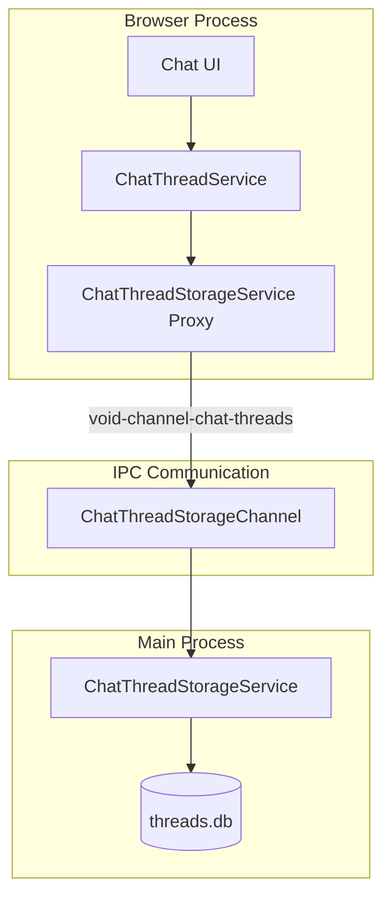
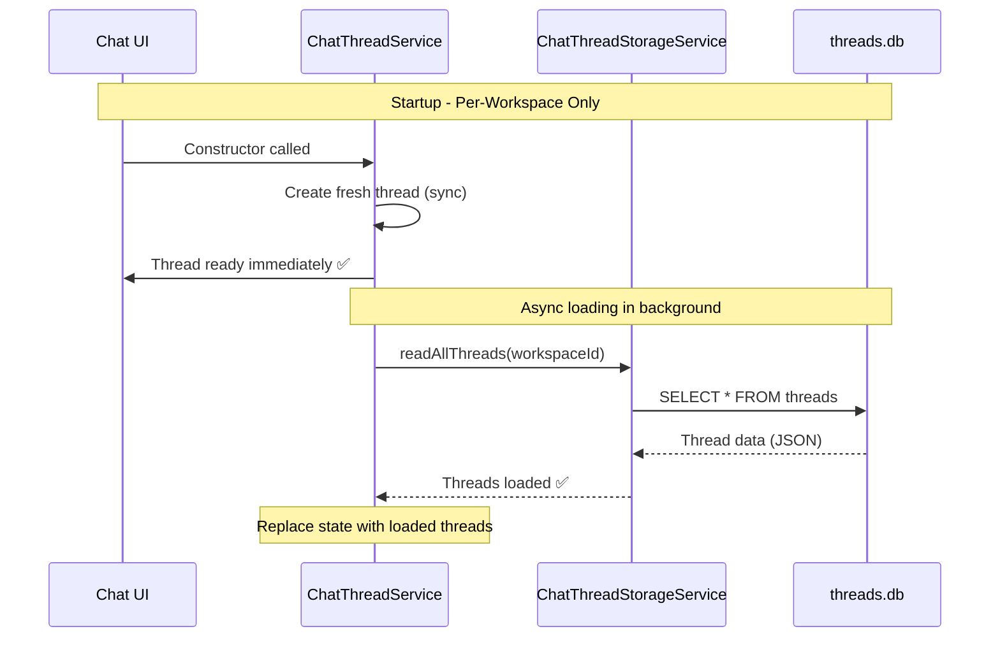

# Per-Workspace Chat Thread Storage

> **See also**: [Storage & Database Locations](../storage/README.md) for complete path reference.

## Overview

Chat threads are stored **exclusively** in per-workspace SQLite databases (`threads.db`). Global storage has been completely removed, ensuring complete data isolation between projects/workspaces.

## Storage Location

For full path details, see the [Storage documentation](../storage/README.md). Quick reference:

| Environment | threads.db Location |
|-------------|---------------------|
| **Development** | `%APPDATA%\safe-appeals-dev\` (Linux: `~/.config/safe-appeals-dev`) — see [storage README](../../storage/README.md); legacy Void path was `code-oss-dev\User\.safe-appeals-navigator\…` |
| **Production** | Safe Appeals user-data (`product.nameShort` / `safe-appeals-navigator`) — not Void; see [storage README](../../storage/README.md) |

---

## ⚠️ Breaking Change Notice

**Previous behavior:** Threads stored globally, shared across all projects.

**New behavior:** Threads stored per-workspace only. No fallback to global storage.

**Impact:**
- Existing global threads will NOT be available after this update
- New threads are created fresh for each workspace
- Thread history is completely isolated per project

---

## Architecture



### Components

#### Browser Process (`src/vs/workbench/contrib/void/browser/`)

| Component | File | Purpose |
|-----------|------|---------|
| **ChatThreadService** | `chatThreadService.ts` | Main orchestrator, state management |
| **ChatThreadStorageService** | `chat/chatThreadStorageService.ts` | IPC proxy to main process |

#### Main Process (`src/vs/workbench/contrib/void/electron-main/`)

| Component | File | Purpose |
|-----------|------|---------|
| **ChatThreadStorageService** | `chat/chatThreadStorageService.ts` | SQLite operations, URI revival |
| **ChatThreadStorageChannel** | `chat/chatThreadStorageChannel.ts` | IPC handler, instance management |

#### Common (`src/vs/workbench/contrib/void/common/`)

| Component | File | Purpose |
|-----------|------|---------|
| **RAGPathService** | `rag/ragPathService.ts` | Path computation (extended for threads) |
| **IChatThreadStorageService** | `chat/chatThreadStorageService.ts` | Service interface |

---

## Database Schema

```sql
CREATE TABLE threads (
    id TEXT PRIMARY KEY,
    data TEXT NOT NULL,  -- JSON serialized thread with URI objects
    last_modified TEXT NOT NULL
);

CREATE TABLE schema_version (
    version INTEGER PRIMARY KEY
);
```

---

## Implementation Details

### Initialization Sequence



### URI Revival

Thread data contains URI objects that need special handling when loading from JSON:

```typescript
// In ChatThreadStorageService (electron-main)
private uriReviver(_key: string, value: any): any {
    // $mid === 1 indicates a marshalled URI object
    if (value && typeof value === 'object' && value.$mid === 1) {
        return URI.from(value);
    }
    return value;
}

// Used when parsing stored JSON
threads[row.id] = JSON.parse(row.data, this.uriReviver.bind(this));
```

### Workspace ID Computation

Uses the same algorithm as RAGService for consistency:

```typescript
private _getWorkspaceId(): string | null {
    const folders = this._workspaceContextService.getWorkspace().folders
    if (folders.length === 0) return null

    const folderPath = folders[0].uri.fsPath
    let hash = 0
    for (let i = 0; i < folderPath.length; i++) {
        hash = ((hash << 5) - hash) + folderPath.charCodeAt(i)
        hash = hash & hash
    }

    return Math.abs(hash).toString(16).padStart(8, '0').substring(0, 16)
}
```

---

## Files Changed/Created

| File | Type | Changes |
|------|------|---------|
| `common/rag/ragPathService.ts` | Modified | Added `getChatThreadsSqlitePath()` |
| `browser/chatThreadService.ts` | Modified | Removed global storage, per-workspace only |
| `browser/chat/chatThreadStorageService.ts` | **Created** | Browser-side IPC proxy |
| `electron-main/chat/chatThreadStorageService.ts` | **Created** | SQLite operations + URI revival |
| `electron-main/chat/chatThreadStorageChannel.ts` | **Created** | IPC handler |
| `common/chat/chatThreadStorageService.ts` | **Created** | Service interface |
| `src/vs/code/electron-main/app.ts` | Modified | Registered IPC channel |

---

## Testing Scenarios

### Normal Operation
1. Open Project A → threads stored in `[hashA]/threads.db`
2. Create/modify threads → saved to workspace database
3. Close/reopen → threads persist

### No Workspace Open
1. Open folder-less editor
2. Threads work but are not persisted
3. Warning in console: "No workspace - threads not persisted"

### Workspace Switching
1. Open Project A → threads A loaded
2. Switch to Project B → threads B loaded
3. Switch back to A → threads A restored

---

## Benefits

✅ **Complete Data Isolation** - No leakage between workspaces
✅ **Legal Compliance** - Proper data boundaries for HIPAA/case management
✅ **Performance** - SQLite faster than global storage serialization
✅ **Simplicity** - No hybrid storage complexity
✅ **Consistency** - Same pattern as RAG micro databases
✅ **Immediate UI** - Thread available before storage loads

---

## Removed Features

❌ **Global Storage Fallback** - No more shared threads
❌ **Migration Prompts** - Clean break, no legacy support
❌ **Cross-Workspace Threads** - Each workspace is isolated

---

## Debug Commands

See [Storage documentation](../storage/README.md#powershell-debug-commands) for full commands.

Quick check:
```powershell
# Dev - Query thread count
node -e "const Database = require('@vscode/sqlite3').Database; const db = new Database('C:/Users/Steve/AppData/Roaming/safe-appeals-dev/User/globalStorage/<extension-id>/…/threads.db', (err) => { if(err) console.log('Error:', err); else { db.all('SELECT COUNT(*) as count FROM threads', (err, rows) => { console.log('Thread count:', rows[0].count); db.close(); }); } });"
```

---

## Future Enhancements

- **Thread Export/Import** - Manual thread migration between workspaces
- **Thread Search** - FTS5 index for searching across threads
- **Schema Migrations** - Version-based database upgrades
- **Workspace Cleanup** - UI to manage/delete old workspace databases
