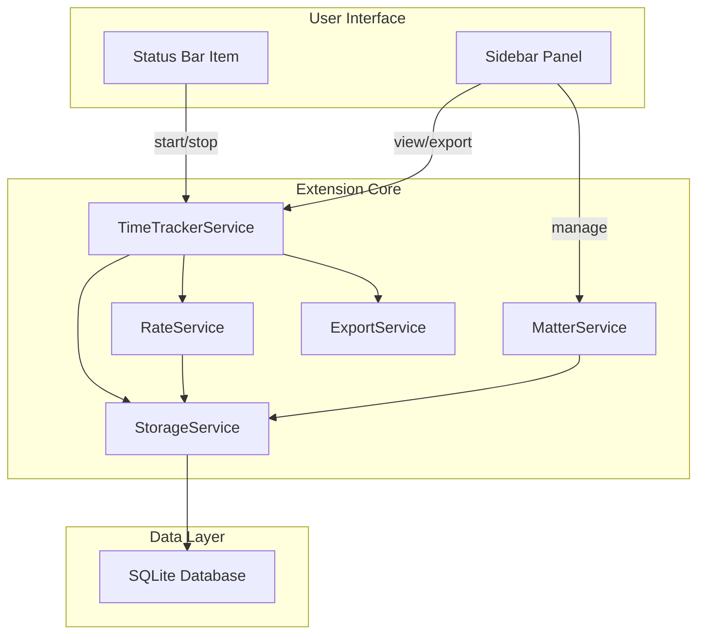

# Legal Time Tracker Extension

A professional time tracking extension for SafeAppeals designed for legal professionals. Features UTBMS task codes, 6-minute billing increments, configurable billing rates, and industry-standard LEDES 1998B export format.

## Features

- **6-Minute Billing Increments** - Standard legal billing with configurable rounding (up/down/nearest)
- **UTBMS Code Support** - Full litigation and workers' compensation task/activity codes
- **Matter/Case Management** - Track time by client, matter name, and case number
- **Multiple Billing Rates** - Partner, Associate, Paralegal rate tiers with defaults
- **LEDES 1998B Export** - Industry-standard legal billing export format
- **CSV/JSON Export** - Human-readable and API-friendly export options
- **Per-Workspace Storage** - SQLite database following RAG path isolation pattern
- **Auto-Stop on Exit** - Configurable auto-save when VSCode closes
- **Live Timer Display** - Status bar shows running timer and today's total
- **Agent LM Tools** - Chat can read timer state and start/stop via `safeappeals_timer_*` (see below)

## Agent LM Tools

Contributed in `package.json` (`languageModelTools`) and registered from `src/agentTools.ts` with `vscode.lm.registerTool`. Allowed in the agent loop via the `safeappeals_*` prefix (see [Agent LM Tools Pattern](../../agent-tools-pattern.md)).

| Tool | Purpose |
| ---- | ------- |
| `safeappeals_timer_getState` | Current running state, elapsed time, matter/rate, description, billable flag |
| `safeappeals_timer_start` | Start timer (optional `description`, `matterId`, `rateId`, `isBillable`); user confirmation |
| `safeappeals_timer_stop` | Stop running timer and save a time entry; user confirmation |

There is no LM tool for `updateEntry` or `listMatters` on this surface.

## Quick Start

### Starting a Timer

1. **Click the status bar** - Shows "0.0 hrs today" when idle
2. **Or use keyboard shortcut** - `Ctrl+Shift+T` (Windows/Linux) / `Cmd+Shift+T` (Mac)
3. **Or via Command Palette** - `Time Tracker: Toggle Timer`

### Using the Sidebar

1. Click the **clock icon** in the activity bar to open the Time Tracker sidebar
2. Select a **Matter** from the dropdown (or leave empty for general time)
3. Select a **Billing Rate** (optional)
4. Choose **UTBMS codes** for task and activity classification
5. Enter a **Description** of your work
6. Toggle **Billable** status
7. Click **Start Timer**

### Exporting Time

1. Open the Time Tracker sidebar
2. Click one of the export buttons:
   - **CSV** - Spreadsheet-friendly format
   - **JSON** - API-friendly format
   - **LEDES** - Industry-standard legal billing format
3. Select a date range when prompted
4. Choose a save location

## Documentation

| Document                                | Description                        |
| --------------------------------------- | ---------------------------------- |
| [User Guide](./user-guide.md)           | Complete usage instructions        |
| [Developer Guide](./developer-guide.md) | Technical implementation details   |
| [API Reference](./api-reference.md)     | TypeScript interfaces and services |

## Architecture Overview



## File Structure

```
extensions/time-tracker/
├── package.json              # Extension manifest
├── tsconfig.json             # TypeScript config
├── src/
│   ├── extension.ts          # Activation + commands
│   ├── agentTools.ts         # LM tools (getState / start / stop)
│   ├── timeTrackerService.ts # Core timer logic + 6-min rounding
│   ├── matterService.ts      # Case/matter management
│   ├── rateService.ts        # Billing rate configuration
│   ├── storageService.ts     # SQLite operations
│   ├── exportService.ts      # CSV/JSON export
│   ├── ledesFormatter.ts     # LEDES 1998B format generator
│   ├── utbmsCodes.ts         # UTBMS code definitions
│   ├── statusBarController.ts # Status bar UI
│   ├── sidebarProvider.ts    # Webview sidebar panel
│   └── types.ts              # TypeScript interfaces
├── data/
│   └── utbms-codes.json      # Standard UTBMS code reference
└── media/
    └── sidebar.css           # Sidebar styles (VSCode CSS variables)
```

## Database Location

Follows the SafeAppeals per-workspace micro database pattern:

**Development** (`VSCODE_DEV` → `safe-appeals-dev`; see [storage README](../../storage/README.md)):

```
%APPDATA%\safe-appeals-dev\…   (Linux: ~/.config/safe-appeals-dev/…)
```

Time-tracker DB location is owned by `extensions/time-tracker` under extension/workspace storage — confirm in that extension rather than assuming a Void-era `.safe-appeals-navigator/databases/…` tree.

**Production:** Safe Appeals user-data (`product.nameShort` / `safe-appeals-navigator`) — not `%APPDATA%\Void\`.

## Commands

| Command                    | Keybinding     | Description             |
| -------------------------- | -------------- | ----------------------- |
| `timeTracker.toggle`       | `Ctrl+Shift+T` | Start/stop timer        |
| `timeTracker.start`        | -              | Start timer with dialog |
| `timeTracker.stop`         | -              | Stop and save timer     |
| `timeTracker.addEntry`     | `Ctrl+Shift+E` | Add manual time entry   |
| `timeTracker.manageMatter` | -              | Manage matters/cases    |
| `timeTracker.manageRates`  | -              | Manage billing rates    |
| `timeTracker.exportCSV`    | -              | Export to CSV           |
| `timeTracker.exportJSON`   | -              | Export to JSON          |
| `timeTracker.exportLEDES`  | -              | Export to LEDES 1998B   |

## Configuration

Access via `File > Preferences > Settings` and search for "Time Tracker":

| Setting                            | Type                        | Default | Description                                |
| ---------------------------------- | --------------------------- | ------- | ------------------------------------------ |
| `timeTracker.defaultRoundingMode`  | `up` \| `down` \| `nearest` | `up`    | How to round time to 0.1 hour increments   |
| `timeTracker.minimumIncrement`     | number                      | `0.1`   | Minimum billable time in hours (6 minutes) |
| `timeTracker.descriptionMaxLength` | number                      | `500`   | Maximum description length                 |
| `timeTracker.autoStopOnClose`      | boolean                     | `true`  | Auto-stop timer when VSCode closes         |

## UTBMS Codes

The extension supports standard Uniform Task-Based Management System codes:

### Litigation Tasks (L-codes)

| Code | Description                                      |
| ---- | ------------------------------------------------ |
| L100 | Case Assessment, Development, and Administration |
| L110 | Fact Investigation/Development                   |
| L120 | Analysis/Strategy                                |
| L200 | Pre-Trial Pleadings and Motions                  |
| L300 | Discovery                                        |
| L400 | Trial Preparation and Trial                      |
| L500 | Appeal                                           |

### Workers' Compensation Tasks (W-codes)

| Code | Description             |
| ---- | ----------------------- |
| W100 | Initial Claim Review    |
| W110 | Medical Records Review  |
| W200 | Hearing Preparation     |
| W300 | Settlement Negotiations |

### Activity Codes

| Code | Description               |
| ---- | ------------------------- |
| A101 | Plan and prepare for      |
| A102 | Research                  |
| A103 | Draft/revise              |
| A104 | Review/analyze            |
| A105 | Communicate (in firm)     |
| A106 | Communicate (with client) |
| A108 | Appear for/attend         |

## Support

- **Issues:** Report bugs or request features through the SafeAppeals issue tracker
- **Documentation:** See the [Developer Guide](./developer-guide.md) for technical details

---

**Last Updated:** February 2026
**Extension Version:** 1.0.0
