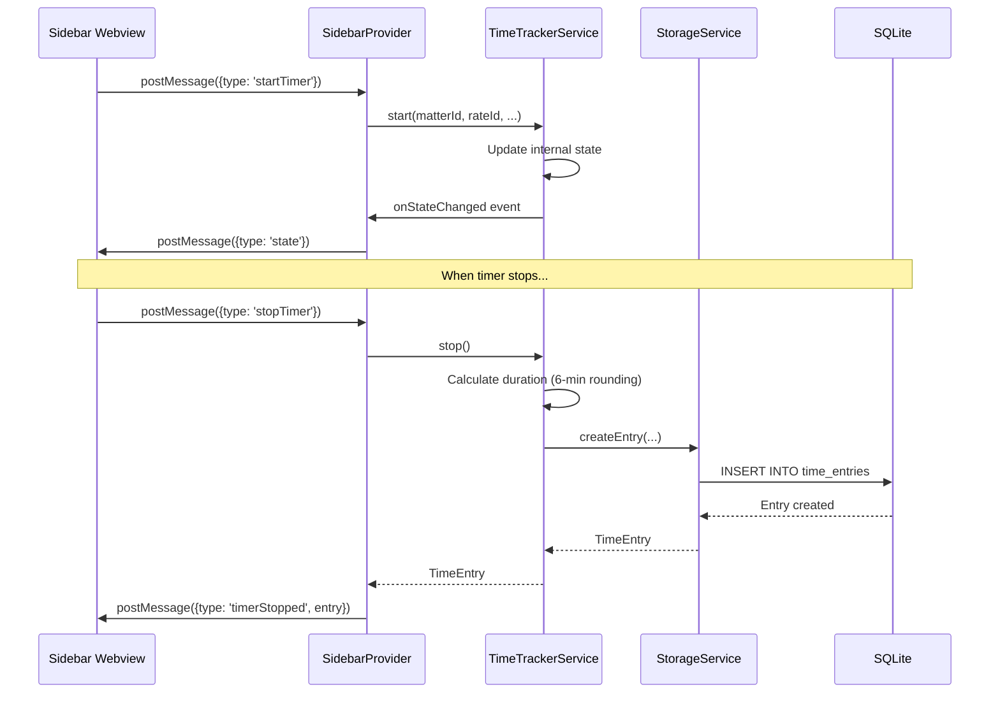

# Time Tracker Developer Guide

Technical implementation details for the Legal Time Tracker extension.

## Table of Contents

- [Architecture](#architecture)
- [Service Layer](#service-layer)
- [Database Schema](#database-schema)
- [Webview Communication](#webview-communication)
- [Building and Testing](#building-and-testing)
- [Extending the Extension](#extending-the-extension)
- [Code Patterns](#code-patterns)

## Architecture

### Extension Structure

```
extensions/time-tracker/
├── package.json              # Extension manifest (commands, views, settings)
├── tsconfig.json             # TypeScript configuration
├── src/
│   ├── extension.ts          # Entry point, activation, command registration
│   ├── types.ts              # TypeScript interfaces and types
│   ├── storageService.ts     # SQLite database operations
│   ├── timeTrackerService.ts # Core timer logic
│   ├── matterService.ts      # Matter/case management
│   ├── rateService.ts        # Billing rate management
│   ├── exportService.ts      # Export functionality
│   ├── ledesFormatter.ts     # LEDES 1998B format
│   ├── utbmsCodes.ts         # UTBMS code definitions
│   ├── statusBarController.ts # Status bar UI
│   └── sidebarProvider.ts    # Webview panel
├── data/
│   └── utbms-codes.json      # UTBMS reference data
├── media/
│   └── sidebar.css           # Webview styles
└── out/                      # Compiled JavaScript (generated)
```

### Process Model

The extension runs entirely in the **Extension Host** process:

```
┌─────────────────────────────────────────────────────────────┐
│                    Extension Host Process                    │
│                                                             │
│  ┌─────────────┐  ┌─────────────┐  ┌─────────────────────┐ │
│  │ extension.ts│  │  Services   │  │ StatusBarController │ │
│  │   (entry)   │──│  (logic)    │──│    (status bar)     │ │
│  └─────────────┘  └─────────────┘  └─────────────────────┘ │
│         │                │                                  │
│         │                │         ┌─────────────────────┐ │
│         │                └─────────│  SidebarProvider    │ │
│         │                          │    (webview)        │ │
│         ▼                          └─────────────────────┘ │
│  ┌─────────────┐                            │              │
│  │   SQLite    │◀───────────────────────────┘              │
│  │  (storage)  │                                           │
│  └─────────────┘                                           │
└─────────────────────────────────────────────────────────────┘
```

### Data Flow



## Service Layer

### StorageService

Manages all SQLite database operations with workspace-scoped isolation.

**Key Methods:**

```typescript
class StorageService {
  // Initialization
  async initialize(): Promise<void>
  getWorkspaceId(): string

  // Matters
  createMatter(clientName: string, matterName: string, ...): Matter
  getMatters(activeOnly?: boolean): Matter[]
  updateMatter(id: number, updates: Partial<Matter>): Matter
  deleteMatter(id: number): void  // Soft delete

  // Rates
  createRate(name: string, hourlyRate: number, isDefault?: boolean): BillingRate
  getRates(): BillingRate[]
  getDefaultRate(): BillingRate | undefined

  // Entries
  createEntry(startTime: number, endTime: number, ...): TimeEntry
  getEntries(options?: ExportOptions): TimeEntryWithDetails[]
  getRunningEntry(): TimeEntry | undefined
  getTodayEntries(): TimeEntryWithDetails[]

  // Cleanup
  close(): void
}
```

**Workspace ID Generation:**

```typescript
private generateWorkspaceId(): string {
  const workspacePath = vscode.workspace.workspaceFolders[0].uri.fsPath;
  return crypto.createHash('sha256')
    .update(workspacePath)
    .digest('hex')
    .substring(0, 16);
}
```

### TimeTrackerService

Core timer logic with 6-minute billing increment support.

**Key Methods:**

```typescript
class TimeTrackerService {
  // State
  getState(): TimerState & { elapsedMs: number }
  getElapsedMs(): number
  getElapsedTenths(): number

  // Timer control
  start(matterId?, rateId?, description?, ...): TimerState
  stop(): TimeEntry | null
  toggle(): { started: boolean; entry?: TimeEntry }
  updateTimerState(updates: Partial<TimerState>): void

  // Events
  readonly onStateChanged: Event<TimerState>

  // Utilities
  roundToTenths(durationMs: number, mode: RoundingMode): number
}
```

**6-Minute Rounding Algorithm:**

```typescript
roundToTenths(durationMs: number, mode: 'up' | 'down' | 'nearest'): number {
  const hours = durationMs / (1000 * 60 * 60);
  const tenths = hours * 10;

  switch (mode) {
    case 'up':    return Math.ceil(tenths) / 10;
    case 'down':  return Math.floor(tenths) / 10;
    case 'nearest': return Math.round(tenths) / 10;
  }
}
```

### ExportService

Handles CSV, JSON, and LEDES 1998B exports.

**Key Methods:**

```typescript
class ExportService {
	exportToCSV(options?: ExportOptions): Promise<string | undefined>;
	exportToJSON(options?: ExportOptions): Promise<string | undefined>;
	exportToLEDES(options?: ExportOptions): Promise<string | undefined>;
	exportWithDateRange(
		format: "csv" | "json" | "ledes",
	): Promise<string | undefined>;
}
```

### LedesFormatter

LEDES 1998B format generator following the legal billing standard.

**Column Order (24 columns):**

```typescript
const LEDES_COLUMNS = [
	"INVOICE_DATE",
	"INVOICE_NUMBER",
	"CLIENT_ID",
	"LAW_FIRM_MATTER_ID",
	"INVOICE_TOTAL",
	"BILLING_START_DATE",
	"BILLING_END_DATE",
	"INVOICE_DESCRIPTION",
	"LINE_ITEM_NUMBER",
	"EXP/FEE/INV_ADJ_TYPE",
	"LINE_ITEM_NUMBER_OF_UNITS",
	"LINE_ITEM_ADJUSTMENT_AMOUNT",
	"LINE_ITEM_TOTAL",
	"LINE_ITEM_DATE",
	"LINE_ITEM_TASK_CODE",
	"LINE_ITEM_EXPENSE_CODE",
	"LINE_ITEM_ACTIVITY_CODE",
	"TIMEKEEPER_ID",
	"LINE_ITEM_DESCRIPTION",
	"LAW_FIRM_ID",
	"LINE_ITEM_UNIT_COST",
	"TIMEKEEPER_NAME",
	"TIMEKEEPER_CLASSIFICATION",
	"CLIENT_MATTER_ID",
];
```

## Database Schema

### Tables

```sql
-- Matters/Cases
CREATE TABLE matters (
    id INTEGER PRIMARY KEY AUTOINCREMENT,
    workspace_id TEXT NOT NULL,
    client_name TEXT NOT NULL,
    matter_name TEXT NOT NULL,
    matter_number TEXT,              -- Optional case number
    default_rate REAL,               -- $/hour, NULL = use global
    is_active INTEGER DEFAULT 1,     -- Soft delete flag
    created_at INTEGER DEFAULT (strftime('%s','now') * 1000)
);

-- Billing Rates
CREATE TABLE billing_rates (
    id INTEGER PRIMARY KEY AUTOINCREMENT,
    workspace_id TEXT NOT NULL,
    name TEXT NOT NULL,              -- "Partner", "Associate", etc.
    hourly_rate REAL NOT NULL,       -- $/hour
    is_default INTEGER DEFAULT 0,    -- Only one default per workspace
    created_at INTEGER DEFAULT (strftime('%s','now') * 1000)
);

-- Time Entries
CREATE TABLE time_entries (
    id INTEGER PRIMARY KEY AUTOINCREMENT,
    workspace_id TEXT NOT NULL,
    matter_id INTEGER,               -- FK to matters, NULL allowed
    rate_id INTEGER,                 -- FK to billing_rates
    start_time INTEGER NOT NULL,     -- Unix timestamp (ms)
    end_time INTEGER,                -- NULL if running
    duration_tenths REAL,            -- Duration in 0.1 hour increments
    utbms_task TEXT,                 -- e.g., "L110"
    utbms_activity TEXT,             -- e.g., "A101"
    description TEXT NOT NULL,
    is_billable INTEGER DEFAULT 1,
    created_at INTEGER DEFAULT (strftime('%s','now') * 1000),
    FOREIGN KEY (matter_id) REFERENCES matters(id),
    FOREIGN KEY (rate_id) REFERENCES billing_rates(id)
);

-- Indexes
CREATE INDEX idx_entries_workspace ON time_entries(workspace_id, start_time);
CREATE INDEX idx_entries_matter ON time_entries(matter_id);
CREATE INDEX idx_matters_workspace ON matters(workspace_id);
CREATE INDEX idx_rates_workspace ON billing_rates(workspace_id);
```

### Database Location

Follows the SafeAppeals per-workspace pattern from `ragPathService`:

```typescript
private getDbPath(): string {
  const homeDir = process.env.HOME || process.env.USERPROFILE;
  const baseDir = path.join(
    homeDir,
    '.safe-appeals-navigator',
    'databases',
    'workspaces',
    this.workspaceId
  );
  return path.join(baseDir, 'timetracker.db');
}
```

## Webview Communication

### Message Protocol

The sidebar uses VSCode's webview message passing:

**Extension → Webview:**

```typescript
type WebviewResponse =
	| { type: "state"; data: TimerState & { elapsedMs: number } }
	| { type: "matters"; data: Matter[] }
	| { type: "rates"; data: BillingRate[] }
	| { type: "entries"; data: TimeEntryWithDetails[] }
	| { type: "timerStarted"; data: TimerState }
	| { type: "timerStopped"; entry: TimeEntry }
	| { type: "error"; message: string };
// ... more types
```

**Webview → Extension:**

```typescript
type WebviewMessage =
  | { type: 'getState' }
  | { type: 'startTimer'; matterId: number | null; ... }
  | { type: 'stopTimer' }
  | { type: 'toggleTimer' }
  | { type: 'getMatters' }
  | { type: 'exportCSV'; options?: ExportOptions }
  // ... more types
```

### Webview Security

The sidebar uses Content Security Policy:

```html
<meta
	http-equiv="Content-Security-Policy"
	content="
  default-src 'none';
  style-src ${webview.cspSource} 'unsafe-inline';
  script-src 'nonce-${nonce}';
  font-src ${webview.cspSource};
"
/>
```

## Building and Testing

### Build Commands

```bash
# Navigate to extension
cd extensions/time-tracker

# Install dependencies
npm install
# or
bun install

# Compile TypeScript
npm run compile
# or
npx tsc -p ./

# Watch mode
npm run watch
```

### Testing the Extension

1. Compile the extension
2. Reload VSCode window: `Ctrl+Shift+P` → "Developer: Reload Window"
3. Look for the clock icon in the activity bar
4. Check Developer Console for errors: `Help > Toggle Developer Tools`

### Debugging

1. Set breakpoints in TypeScript files
2. Open the Run and Debug panel
3. Select "Launch Extension"
4. A new VSCode window opens with the extension loaded

## Extending the Extension

### Adding a New UTBMS Code

1. Edit `src/utbmsCodes.ts`:

```typescript
export const UTBMS_TASKS: Record<string, string> = {
	// Existing codes...
	L600: "Your New Phase",
};
```

2. Also update `data/utbms-codes.json` for reference

### Adding a New Export Format

1. Create formatter in `src/`:

```typescript
// src/newFormatter.ts
export function formatNewEntry(entry: TimeEntry): string {
	// Your format logic
}
```

2. Add method to `ExportService`:

```typescript
async exportToNewFormat(options?: ExportOptions): Promise<string | undefined> {
  const entries = this.storageService.getEntries(options);
  const content = entries.map(formatNewEntry).join('\n');
  return this.saveExport(content, 'ext', 'Format Name');
}
```

3. Register command in `extension.ts`
4. Add button to sidebar webview

### Adding New Configuration

1. Add to `package.json` contributes.configuration:

```json
"timeTracker.newSetting": {
  "type": "string",
  "default": "value",
  "description": "Description of setting"
}
```

2. Read in service:

```typescript
const config = vscode.workspace.getConfiguration("timeTracker");
const value = config.get<string>("newSetting", "default");
```

## Code Patterns

### Event Emitter Pattern

Used for timer state updates:

```typescript
private _onStateChanged = new vscode.EventEmitter<TimerState>();
readonly onStateChanged = this._onStateChanged.event;

private emitState(): void {
  this._onStateChanged.fire(this.getState());
}
```

### Disposable Pattern

All services implement proper cleanup:

```typescript
class MyController implements vscode.Disposable {
	private disposables: vscode.Disposable[] = [];

	constructor() {
		this.disposables.push(someService.onEvent(() => this.handleEvent()));
	}

	dispose(): void {
		this.disposables.forEach((d) => d.dispose());
	}
}
```

### State Persistence

Timer state survives restarts via workspace state:

```typescript
// Save
this.context.workspaceState.update("timerState", this.timerState);

// Restore
const saved = this.context.workspaceState.get<TimerState>("timerState");
if (saved?.isRunning) {
	this.timerState = saved;
}
```

---

**Next:** [API Reference](./api-reference.md) | [User Guide](./user-guide.md)
