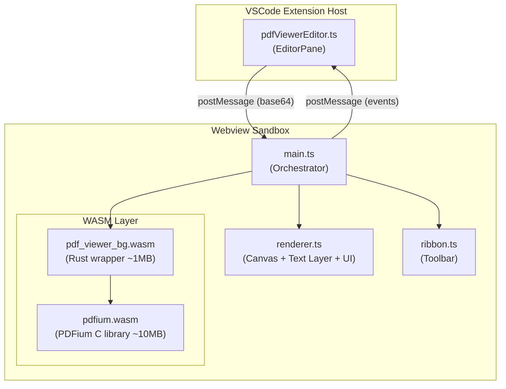
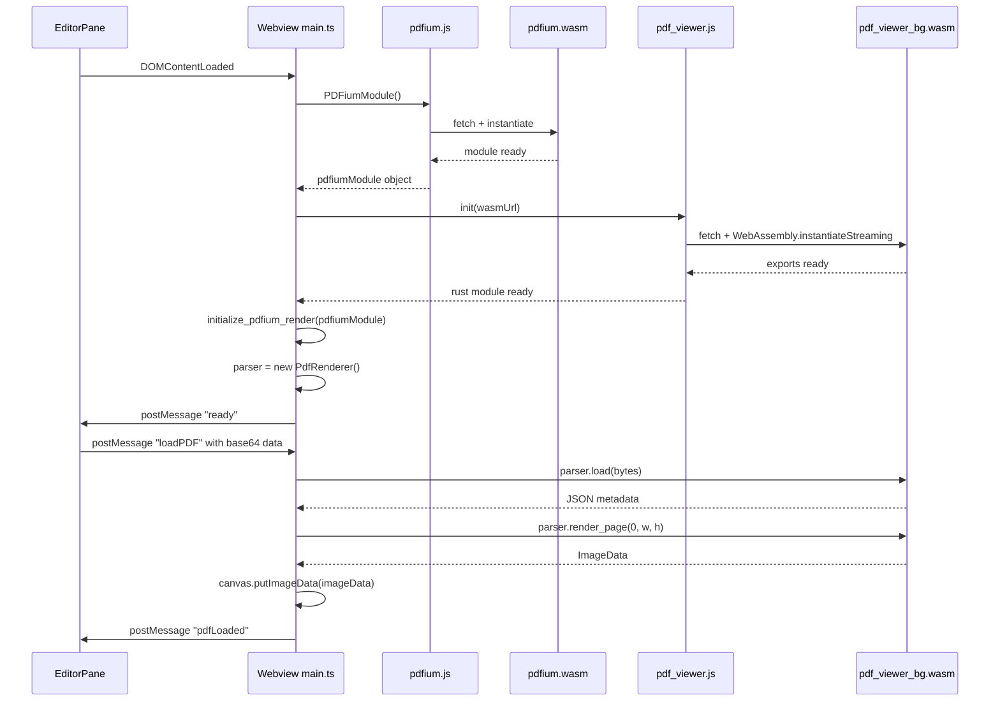

# PDF Viewer Rust/WASM Refactor

## Architecture Overview

Replace Mozilla pdf.js (loaded from CDN) with Google's PDFium engine via
`pdfium-render` compiled to WASM. This mirrors the existing XLSX Rust viewer
pattern but with one added complexity: **two WASM modules** must load (PDFium
Emscripten binary + your Rust wasm-bindgen wrapper).



### Responsibility Split

**Rust/WASM handles (replacing pdf.js):**

- PDF binary loading from bytes
- Page rendering to RGBA `ImageData` (via
  `pdfium-render::PdfBitmap::as_image_data()`)
- Text extraction with character bounding boxes (for text layer overlay)
- Document outline/bookmark extraction
- Page dimensions and count
- Thumbnail rendering (at 0.2x scale)
- Form field rendering (built into PDFium)

**TypeScript handles (stays the same):**

- Canvas display (`putImageData` from WASM output)
- Text layer positioning (transparent spans over canvas)
- Annotation/highlight rendering and interaction
- Signature modal, placement, drag, resize
- Sidebar (thumbnails, outline, bookmarks tabs)
- Zoom controls, page navigation, keyboard shortcuts
- Page cache/preload strategy
- All VSCode integration (EditorPane, messages, state persistence)

---

## Key Technical Decisions

### PDFium WASM Binary Source

Use **paulocoutinhox/pdfium-lib** (NOT bblanchon/pdfium-binaries). The bblanchon
WASM builds use a non-growable heap allocator that crashes on multi-page PDFs.
The paulocoutinhox binary is ~10 MB compressed.

### Dual-WASM Loading Sequence

Unlike the XLSX viewer (single WASM module), this requires loading two modules:

```
1. Load pdfium.js (Emscripten glue) → instantiates pdfium.wasm
2. Load pdf_viewer.js (wasm-bindgen glue) → instantiates pdf_viewer_bg.wasm
3. Call initialize_pdfium_render(pdfiumModule) to bind them
4. Send 'ready' to host
```

### Text Layer Strategy

PDFium provides character-level bounding boxes via `PdfPageText::chars()`. The
Rust module will export a function that returns a JSON array of text segments
with positions. TypeScript will position `<span>` elements over the canvas (same
approach as current `pdfjsLib.renderTextLayer()` but with our own data).

---

## Files to Create

### Rust Crate

- `**pdfViewer/wasm/Cargo.toml**` -- Crate config with `pdfium-render`
  (0.8.37+), `wasm-bindgen`, `serde`, `serde_json`, `web-sys`, `js-sys`,
  `console_error_panic_hook`
- `**pdfViewer/wasm/src/lib.rs**` -- Module root, re-exports,
  `init_panic_hook()`
- `**pdfViewer/wasm/src/renderer.rs**` -- Core rendering: `PdfRenderer` struct
  with `#[wasm_bindgen]` methods:
  - `load(data: &[u8]) -> Result<String, JsError>` -- Load PDF, return JSON
    metadata (page count, dimensions, outline)
  - `render_page(index: u16, width: u16, height: u16) -> ImageData` -- Render
    page to ImageData
  - `render_thumbnail(index: u16, max_width: u16) -> ImageData` -- Render
    thumbnail
  - `get_page_text(index: u16) -> String` -- Return JSON array of text blocks
    with bounding boxes
  - `get_outline() -> String` -- Return JSON tree of bookmarks/outline
  - `get_page_dimensions(index: u16) -> String` -- Return JSON `{width, height}`
    in points

### TypeScript (Webview)

- `**pdfViewer/media/main.ts**` -- Webview orchestrator (replaces
  `pdfViewer.js`):
  - Loads both WASM modules via dual-init sequence
  - Handles all `postMessage` communication with host
  - Coordinates renderer, sidebar, annotations, signatures
- `**pdfViewer/media/renderer.ts**` -- Canvas rendering + text layer:
  - Takes `ImageData` from WASM, paints to canvas via `putImageData`
  - Builds text layer from WASM text extraction data
  - Manages page cache (rendered `ImageData` objects)
  - Handles zoom (re-render at new dimensions via WASM)
- `**pdfViewer/media/sidebar.ts**` -- Sidebar panel (thumbnails, outline,
  bookmarks)
- `**pdfViewer/media/annotations.ts**` -- Highlight/annotation rendering
  (extracted from current pdfViewer.js)
- `**pdfViewer/media/signatures.ts**` -- Signature modal, placement, drag,
  resize (extracted from current pdfViewer.js)
- `**pdfViewer/media/build.mjs**` -- esbuild config (IIFE bundle, same pattern
  as XLSX viewer)

### Build Artifacts

- `**pdfViewer/media/wasm/pdfium.js**` -- PDFium Emscripten glue (from
  paulocoutinhox release)
- `**pdfViewer/media/wasm/pdfium.wasm**` -- PDFium binary (~10 MB)
- `**pdfViewer/media/wasm/pdf_viewer_bg.wasm**` -- Your Rust WASM binary
- `**pdfViewer/media/wasm/pdf_viewer.js**` -- wasm-bindgen JS glue
- `**pdfViewer/media/wasm/pdf_viewer.d.ts**` -- TypeScript type definitions
- `**pdfViewer/media/pdfRustViewer.js**` -- Final bundled IIFE (esbuild output)

---

## Files to Modify

### `[pdfViewerEditor.ts](src/vs/workbench/contrib/void/browser/documentViewers/pdfViewer/pdfViewerEditor.ts)`

- **Remove** CDN script tags for pdf.js and pdf.worker.js
- **Update** `getWebviewHTML()` to:
  - Add `data-wasm-url` and `data-pdfium-url` data attributes on `#config` div
  - Reference bundled `pdfRustViewer.js` script instead of `pdfViewer.js`
  - Reference `pdfium.js` as a separate script tag (Emscripten needs to load
    first)
  - Update CSP: add `'wasm-unsafe-eval'`, keep `vscode-resource:`
- **Update** `getMediaUri()` path if the folder is renamed
- **Update** `localResourceRoots` to include the wasm subdirectory
- **Remove** JSZip CDN reference (no longer needed)
- **No changes** to message protocol -- same messages, same handlers

### `[pdfViewer.css](src/vs/workbench/contrib/void/browser/documentViewers/pdfViewer/media/pdfViewer.css)`

- **Minor tweaks** to text layer styling (PDFium character boxes may have
  slightly different positioning than pdf.js text spans)
- **No major changes** -- all UI styling remains the same

### `[documentViewer.contribution.ts](src/vs/workbench/contrib/void/browser/documentViewers/documentViewer.contribution.ts)`

- **No changes** -- the editor registration stays the same (`**/*.pdf`,
  exclusive priority)

---

## Files That Do NOT Change

These files are purely host-side services and actions that don't touch pdf.js:

- `[pdfViewerInput.ts](src/vs/workbench/contrib/void/browser/documentViewers/pdfViewer/pdfViewerInput.ts)`
  -- EditorInput model
- `[pdfViewerInputSerializer.ts](src/vs/workbench/contrib/void/browser/documentViewers/pdfViewer/pdfViewerInputSerializer.ts)`
  -- Session persistence
- `[pdfAnnotationService.ts](src/vs/workbench/contrib/void/browser/documentViewers/pdfViewer/pdfAnnotationService.ts)`
  -- Annotation storage
- `[pdfContentExtractor.ts](src/vs/workbench/contrib/void/browser/documentViewers/pdfViewer/pdfContentExtractor.ts)`
  -- IPC text extraction (electron-main)
- `[pdfQuickEditActions.ts](src/vs/workbench/contrib/void/browser/documentViewers/pdfViewer/pdfQuickEditActions.ts)`
  -- Ctrl+K/L actions
- `[pdfContextGathering.ts](src/vs/workbench/contrib/void/browser/documentViewers/pdfViewer/pdfContextGathering.ts)`
  -- AI context window

---

## Dual-WASM Initialization Detail

The trickiest part of this refactor is the two-phase WASM loading. Here's the
exact sequence:



---

## Rust WASM API Surface

```rust
// wasm/src/renderer.rs

#[wasm_bindgen]
pub struct PdfRenderer {
    document: Option<PdfDocument<'static>>,
    pdfium: &'static Pdfium,
}

#[wasm_bindgen]
impl PdfRenderer {
    #[wasm_bindgen(constructor)]
    pub fn new() -> PdfRenderer;

    /// Load PDF from bytes, return JSON: { pageCount, pages: [{width, height}] }
    pub fn load(&mut self, data: &[u8]) -> Result<String, JsError>;

    /// Render page to ImageData at target pixel dimensions
    pub fn render_page(&self, index: u16, width: u16, height: u16) -> Result<ImageData, JsError>;

    /// Render thumbnail at reduced scale
    pub fn render_thumbnail(&self, index: u16, max_width: u16) -> Result<ImageData, JsError>;

    /// Extract text with bounding boxes: JSON array of {text, x, y, width, height}
    pub fn get_page_text(&self, index: u16) -> Result<String, JsError>;

    /// Get document outline as JSON tree
    pub fn get_outline(&self) -> Result<String, JsError>;

    /// Get page dimensions in PDF points
    pub fn get_page_dimensions(&self, index: u16) -> Result<String, JsError>;

    /// Free the loaded document
    pub fn close(&mut self);
}
```

---

## Migration Strategy

The refactor should be done incrementally to allow testing at each stage:

1. **Phase 1 -- Rust crate + basic rendering**: Get PDFium WASM loading, PDF
   opening, and single-page canvas rendering working. Verify with a simple test
   page.
2. **Phase 2 -- Text layer**: Implement text extraction with bounding boxes.
   Build the text layer overlay in TypeScript to replace
   `pdfjsLib.renderTextLayer()`.
3. **Phase 3 -- Port all UI from pdfViewer.js to TypeScript modules**: Split the
   2,053-line `pdfViewer.js` into modular TypeScript files (main.ts,
   renderer.ts, sidebar.ts, annotations.ts, signatures.ts). This is a code
   quality improvement independent of the Rust work.
4. **Phase 4 -- Thumbnails + Outline + Preloading**: Implement thumbnail
   rendering via WASM, outline extraction, and the three preload strategies
   (all/adjacent/on-demand) using cached `ImageData` objects.
5. **Phase 5 -- Integration + Editor update**: Update `pdfViewerEditor.ts` to
   use the new webview HTML with WASM loading. Wire up the full message
   protocol. Remove pdf.js CDN references.
6. **Phase 6 -- Polish + Performance**: Implement bitmap reuse for rendering
   perf, tune text layer alignment, handle edge cases (encrypted PDFs, very
   large files, CJK fonts).

---

## Bundle Size Impact

| Component             | Current                             | After Refactor                          |
| --------------------- | ----------------------------------- | --------------------------------------- |
| pdf.js + worker (CDN) | ~14 MB (loaded at runtime from CDN) | Removed                                 |
| PDFium WASM binary    | N/A                                 | ~10 MB (bundled locally)                |
| Rust WASM binary      | N/A                                 | ~1 MB                                   |
| pdfViewer.js          | ~2,053 lines                        | Replaced by pdfRustViewer.js (~similar) |
| **Net change**        |                                     | **~3 MB smaller**, no CDN dependency    |

---

## Risk Mitigation

- **Keep `pdfViewer.js` + pdf.js as fallback** during development -- don't
  delete until Rust version is fully validated
- **PDFium font coverage**: Test with CJK documents, legal forms, scanned PDFs.
  PDFium has better font handling than pdf.js but may need font files bundled
  for edge cases
- **Memory**: PDFium WASM linear memory grows but never shrinks. Monitor memory
  with large PDFs and implement page eviction if needed
- **The `pdfContentExtractor.ts` is unaffected** -- it uses a separate IPC
  channel to electron-main for text extraction (RAG/AI features), independent of
  the webview renderer
