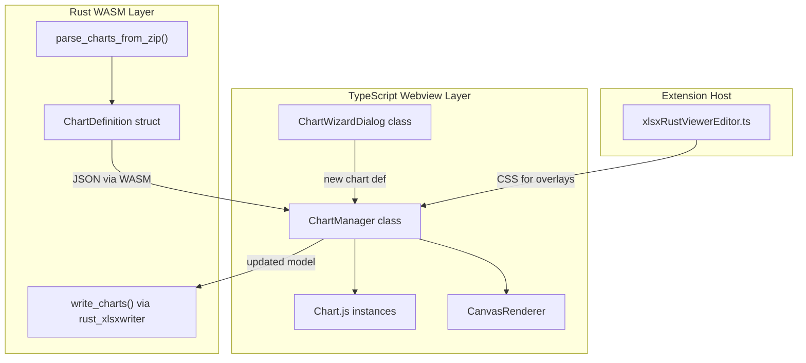

# Charts & Visualization for XLSX Rust Viewer

## Architecture Overview

Charts span all three layers of the existing architecture. Chart data is parsed
from OOXML XML in Rust, passed as JSON to the TypeScript webview, rendered via
Chart.js inside positioned HTML overlays, and written back using
`rust_xlsxwriter`'s chart API.




## Approach Decisions

- **Rendering Library**: Chart.js (v4) -- tree-shakeable, canvas-based, covers
all needed chart types (bar, line, pie, scatter, area, combo), ~14-48 KB with
selective imports. Works in IIFE esbuild bundle.
- **Chart parsing**: Custom `quick-xml` + `zip` parsing in Rust (same pattern as
conditional formatting, tables, merged cells). `calamine` does not support
charts.
- **Chart writing**: `rust_xlsxwriter`'s `Chart` / `Worksheet::insert_chart()`
API.
- **Overlay system**: HTML `<div>` containers with `position: absolute` inside
`_wrapper`, each holding a Chart.js `<canvas>`. Follows the same pattern as
filter buttons.
- **Sparklines**: Custom canvas drawing within cells in `renderer.ts` (too small
for Chart.js instances).

## Phase 1: Rust Data Model & Parser

**Files**:
[wasm/src/parser.rs](src/vs/workbench/contrib/void/browser/documentViewers/xlsxRustViewer/wasm/src/parser.rs),
[wasm/src/viewport.rs](src/vs/workbench/contrib/void/browser/documentViewers/xlsxRustViewer/wasm/src/viewport.rs)

Define the chart data model:

```rust
pub struct ChartDefinition {
    pub chart_type: String,       // "bar", "line", "pie", "scatter", "area", "combo"
    pub series: Vec<ChartSeries>,
    pub title: Option<String>,
    pub legend: Option<ChartLegend>,
    pub axes: Vec<ChartAxis>,
    pub anchor: ChartAnchor,      // position on the sheet
    pub style: Option<ChartStyle>,
}

pub struct ChartSeries {
    pub name: Option<String>,
    pub categories_ref: Option<String>,  // "Sheet1!$A$2:$A$10"
    pub values_ref: Option<String>,      // "Sheet1!$B$2:$B$10"
    pub categories_cache: Vec<String>,
    pub values_cache: Vec<f64>,
    pub chart_type: Option<String>,      // for combo charts
}

pub struct ChartAnchor {
    pub from_col: u32, pub from_row: u32,
    pub from_col_off: i64, pub from_row_off: i64,  // EMU offsets
    pub to_col: u32, pub to_row: u32,
    pub to_col_off: i64, pub to_row_off: i64,
}
```

Implement `parse_charts_from_zip()`:

1. Walk worksheet `.rels` files to find `drawing` relationships
2. Parse each `xl/drawings/drawingN.xml` for `<xdr:twoCellAnchor>` positions and
  chart `rId` references
3. Parse each `xl/charts/chartN.xml`: extract
  `c:chartSpace > c:chart > c:plotArea` for chart type elements (`c:barChart`,
   `c:lineChart`, etc.), `c:ser` for series data (with `c:f` formula refs and
   `c:numCache`/`c:strCache` fallback values), title, legend, axes
4. Add `pub charts: Vec<ChartDefinition>` to `SheetData`
5. Pass through in `viewport.rs`

## Phase 2: Chart.js Integration & ChartManager

**Files**: new
[media/chartManager.ts](src/vs/workbench/contrib/void/browser/documentViewers/xlsxRustViewer/media/chartManager.ts),
[media/main.ts](src/vs/workbench/contrib/void/browser/documentViewers/xlsxRustViewer/media/main.ts),
[media/build.mjs](src/vs/workbench/contrib/void/browser/documentViewers/xlsxRustViewer/media/build.mjs),
[xlsxRustViewerEditor.ts](src/vs/workbench/contrib/void/browser/documentViewers/xlsxRustViewer/xlsxRustViewerEditor.ts)

Add Chart.js dependency:

```bash
npm install chart.js --save
```

Tree-shake imports in `chartManager.ts`:

```typescript
import {
	Chart,
	BarController,
	LineController,
	PieController,
	ScatterController,
	DoughnutController,
	RadarController,
	BarElement,
	LineElement,
	PointElement,
	ArcElement,
	Filler,
	CategoryScale,
	LinearScale,
	Title,
	Tooltip,
	Legend,
} from "chart.js";
Chart.register(/* only needed components */);
```

`ChartManager` class responsibilities:

- Holds an array of `ChartOverlay` objects (one per chart)
- Each `ChartOverlay` owns: a positioned `<div>` container, a `<canvas>` inside
it, a `Chart` instance
- `syncCharts(chartsData, renderer)` -- creates/updates/destroys overlays to
match the model
- `updatePositions(renderer)` -- called after scroll/resize to reposition
overlays using `renderer.cx()`, `renderer.ry()`, `renderer.cw()`,
`renderer.rh()` and scroll offsets
- `getChartAt(x, y)` -- hit-test for click/drag
- `selectChart(index)` / `deselectAll()` -- selection with blue outline
- `deleteSelected()` -- remove chart from model

CSS in `xlsxRustViewerEditor.ts`:

```css
.chart-overlay {
	position: absolute;
	z-index: 10;
	border: 1px solid var(--vscode-editorWidget-border);
	background: var(--vscode-editor-background);
	pointer-events: auto;
	cursor: move;
	box-shadow: 0 2px 8px rgba(0, 0, 0, 0.15);
}
.chart-overlay.selected {
	border: 2px solid var(--vscode-focusBorder);
}
.chart-resize-handle {
	position: absolute;
	width: 8px;
	height: 8px;
	background: var(--vscode-focusBorder);
}
```

Wire into `main.ts`: create `ChartManager` after renderer init, call
`syncCharts()` on data load and sheet change, call `updatePositions()` in
renderer's scroll and resize callbacks.

## Phase 3: Chart Rendering (Map Data to Chart.js)

**File**:
[media/chartManager.ts](src/vs/workbench/contrib/void/browser/documentViewers/xlsxRustViewer/media/chartManager.ts)

Implement `buildChartConfig(chartDef)` that maps `ChartDefinition` to a Chart.js
configuration object:

- `bar` / `column` -> `type: 'bar'` (horizontal via `indexAxis: 'y'`)
- `line` -> `type: 'line'`
- `area` -> `type: 'line'` with `fill: true`
- `pie` / `donut` -> `type: 'pie'` / `type: 'doughnut'`
- `scatter` -> `type: 'scatter'`
- `combo` -> use `datasets` with per-dataset `type` overrides

Map each `ChartSeries` to a Chart.js dataset:

- `label` from `series.name`
- `data` from `series.values_cache` (parsed cached values; live formula
resolution as stretch goal)
- `labels` from `series.categories_cache` (for category axis)

Configure axes from `chartDef.axes` (title, min/max, position). Configure legend
and title from `chartDef.legend` and `chartDef.title`.

## Phase 4: Chart Interaction (Move, Resize, Select)

**File**:
[media/chartManager.ts](src/vs/workbench/contrib/void/browser/documentViewers/xlsxRustViewer/media/chartManager.ts)

Interaction features on each chart overlay `<div>`:

- **Click to select**: Add `selected` class, show resize handles (8 handles:
corners + midpoints)
- **Drag to move**: `mousedown` on chart body -> track delta -> update anchor
`from_col`/`from_row` -> reposition div -> mark dirty
- **Drag to resize**: `mousedown` on resize handle -> track delta -> update
anchor `to_col`/`to_row` -> resize div + `chart.resize()` -> mark dirty
- **Delete key**: Remove selected chart from model, destroy Chart.js instance,
remove overlay div
- **Double-click**: Open chart editing dialog (Phase 5)

Coordinate snapping: convert pixel deltas to column/row units using
`renderer.colAtX()` and `renderer.rowAtY()` helpers (may need to add these).

## Phase 5: Chart Creation -- Insert Dialog (Wizard)

**Files**: new
[media/chartWizardDialog.ts](src/vs/workbench/contrib/void/browser/documentViewers/xlsxRustViewer/media/chartWizardDialog.ts),
[media/ribbon.ts](src/vs/workbench/contrib/void/browser/documentViewers/xlsxRustViewer/media/ribbon.ts),
[media/main.ts](src/vs/workbench/contrib/void/browser/documentViewers/xlsxRustViewer/media/main.ts)

Add "Insert Chart" button to the ribbon (Insert tab). Create `ChartWizardDialog`
class (follows the same pattern as `ConditionalFormatDialog`):

Step 1 -- **Chart Type Picker**: Grid of chart type icons (Bar, Column, Line,
Area, Pie, Donut, Scatter, Combo). Each shows a small preview thumbnail.

Step 2 -- **Data Range Selection**: Text input for range (e.g. `A1:D10`).
"Select Range" button that enters a selection mode on the renderer (like formula
point-mode). Option to swap rows/columns. Preview updates live as range changes.

Step 3 -- **Customization**: Title input, legend position
(top/bottom/left/right/none), axis labels, color scheme selector (presets
matching Excel's chart styles).

On confirm: construct a `ChartDefinition`, push to
`data.sheets[sheetIdx].charts`, call `chartManager.syncCharts()`, mark dirty.

## Phase 6: Chart Writing (Rust)

**File**:
[wasm/src/writer.rs](src/vs/workbench/contrib/void/browser/documentViewers/xlsxRustViewer/wasm/src/writer.rs)

Implement `write_charts()` using `rust_xlsxwriter`:

```rust
for chart_def in &sheet_data.charts {
    let chart_type = match chart_def.chart_type.as_str() {
        "bar" => ChartType::Bar,
        "line" => ChartType::Line,
        "pie" => ChartType::Pie,
        "scatter" => ChartType::Scatter,
        "area" => ChartType::Area,
        _ => ChartType::Column,
    };
    let mut chart = Chart::new(chart_type);
    for series in &chart_def.series {
        let mut s = ChartSeries::new();
        if let Some(ref cats) = series.categories_ref {
            s.set_categories(cats);
        }
        if let Some(ref vals) = series.values_ref {
            s.set_values(vals);
        }
        chart.add_series(&s);
    }
    if let Some(ref title) = chart_def.title {
        chart.title().set_name(title);
    }
    worksheet.insert_chart(
        chart_def.anchor.from_row, chart_def.anchor.from_col, &chart
    )?;
}
```

## Phase 7: Sparklines

**File**:
[media/renderer.ts](src/vs/workbench/contrib/void/browser/documentViewers/xlsxRustViewer/media/renderer.ts),
[wasm/src/parser.rs](src/vs/workbench/contrib/void/browser/documentViewers/xlsxRustViewer/wasm/src/parser.rs)

Sparklines are mini in-cell charts, too small for Chart.js instances. Custom
canvas drawing within the cell rendering loop:

Rust parser: Parse `<x14:sparklineGroups>` from worksheet extension lists.
Extract type (line/column/win-loss), data range, location cell, color settings.

TypeScript renderer: In the cell rendering section of `render()`, after drawing
cell text, check if the cell has a sparkline. Draw directly on the canvas:

- **Line sparkline**: `ctx.beginPath()` + `lineTo()` through normalized data
points within the cell bounds
- **Column sparkline**: Small filled rectangles for each data point
- **Win/Loss sparkline**: Binary up/down bars

## File Summary


| File                         | Changes                                                              |
| ---------------------------- | -------------------------------------------------------------------- |
| `wasm/Cargo.toml`            | No new deps needed (quick-xml + zip already present)                 |
| `wasm/src/parser.rs`         | New structs, `parse_charts_from_zip()`, sparkline parsing            |
| `wasm/src/writer.rs`         | `write_charts()` using `rust_xlsxwriter` chart API                   |
| `wasm/src/viewport.rs`       | Pass `charts` through to viewport                                    |
| `package.json`               | Add `chart.js` dependency                                            |
| `media/build.mjs`            | No changes needed (chart.js will be bundled automatically)           |
| `media/chartManager.ts`      | **New** -- Chart overlay management, Chart.js rendering, move/resize |
| `media/chartWizardDialog.ts` | **New** -- Chart insert/edit dialog                                  |
| `media/renderer.ts`          | Sparkline rendering in cells, `colAtX()`/`rowAtY()` helpers          |
| `media/ribbon.ts`            | "Insert Chart" button                                                |
| `media/main.ts`              | Wire ChartManager and ChartWizardDialog                              |
| `xlsxRustViewerEditor.ts`    | CSS for chart overlays                                               |


