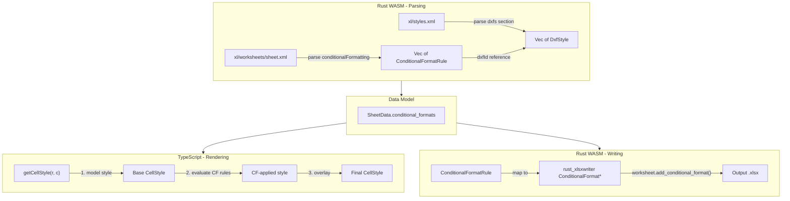

# Conditional Formatting for XLSX Viewer

## Architecture Overview

Conditional formatting adds a third layer to the existing style system.
Currently styles are resolved as `model style + overlay style`. With CF, it
becomes `model style + conditional format style + overlay style`, where CF is
evaluated dynamically each render.



## Phase 1: Rust WASM - Data Model and Parsing

### 1.1 Add CF data types to `parser.rs`

Add new structs to represent conditional formatting rules. These map directly to
the OOXML `<cfRule>` elements:

```rust
#[derive(Serialize, Deserialize, Clone, Debug)]
pub struct DxfStyle {
    pub bold: Option<bool>,
    pub italic: Option<bool>,
    pub underline: Option<bool>,
    pub text_color: Option<String>,
    pub fill_color: Option<String>,
    pub number_format: Option<String>,
}

#[derive(Serialize, Deserialize, Clone, Debug)]
pub struct ConditionalFormatRule {
    pub rule_type: String,       // "cellIs", "colorScale", "dataBar", "iconSet",
                                 // "top10", "aboveAverage", "expression", "containsText",
                                 // "duplicateValues", "uniqueValues", "containsBlanks"
    pub operator: Option<String>,// "greaterThan", "lessThan", "equal", "between", etc.
    pub priority: u32,
    pub values: Vec<String>,     // formula values / thresholds
    pub dxf_id: Option<u32>,     // index into dxf styles array
    pub dxf_style: Option<DxfStyle>, // resolved inline (for convenience)
    pub sqref: String,           // cell range like "A1:D10"
    // Color scale specific
    pub color_scale: Option<ColorScaleSpec>,
    // Data bar specific
    pub data_bar: Option<DataBarSpec>,
    // Icon set specific
    pub icon_set: Option<IconSetSpec>,
    // Top/bottom specific
    pub rank: Option<u32>,
    pub percent: Option<bool>,
    pub bottom: Option<bool>,
    pub above_average: Option<bool>,
    pub std_dev: Option<u32>,
    pub text: Option<String>,    // for containsText rules
}

#[derive(Serialize, Deserialize, Clone, Debug)]
pub struct ColorScaleSpec {
    pub colors: Vec<String>,     // 2 or 3 hex colors
    pub values: Vec<f64>,        // min/mid/max percentile values
    pub value_types: Vec<String>,// "min", "max", "percentile", "num"
}

#[derive(Serialize, Deserialize, Clone, Debug)]
pub struct DataBarSpec {
    pub color: String,
    pub min_value: Option<f64>,
    pub max_value: Option<f64>,
}

#[derive(Serialize, Deserialize, Clone, Debug)]
pub struct IconSetSpec {
    pub icon_style: String,      // "3Arrows", "3TrafficLights", "4Arrows", etc.
    pub thresholds: Vec<f64>,
    pub reverse: bool,
}
```

Add to `SheetData`:

```rust
pub conditional_formats: Vec<ConditionalFormatRule>,
```

### 1.2 Parse conditional formatting from worksheet XML

In
[parser.rs](src/vs/workbench/contrib/void/browser/documentViewers/xlsxRustViewer/wasm/src/parser.rs),
add a new function `parse_conditional_formatting()` that:

1. Reads the `<dxfs>` section from `xl/styles.xml` to build a `Vec<DxfStyle>`
   (differential formatting records). Each `<dxf>` has optional `<font>`,
   `<fill>`, `<numFmt>` children.
2. For each worksheet XML, finds all `<conditionalFormatting sqref="...">`
   elements.
3. For each `<cfRule>` child, extracts: `type`, `operator`, `dxfId`, `priority`,
   `<formula>` children, and type-specific children (`<colorScale>`,
   `<dataBar>`, `<iconSet>`).
4. Resolves `dxfId` to the corresponding `DxfStyle` and stores it inline on the
   rule.

Use the existing `quick-xml` + `zip` approach already used for styles, tables,
and merged cells.

### 1.3 Write conditional formatting in `writer.rs`

In
[writer.rs](src/vs/workbench/contrib/void/browser/documentViewers/xlsxRustViewer/wasm/src/writer.rs),
after writing cells and tables, iterate `sheet.conditional_formats` and map each
rule to the appropriate `rust_xlsxwriter` type:

- `"cellIs"` -> `ConditionalFormatCell` with `ConditionalFormatCellRule::*`
- `"expression"` -> `ConditionalFormatFormula`
- `"top10"` -> `ConditionalFormatTop`
- `"aboveAverage"` -> `ConditionalFormatAverage`
- `"containsText"` -> `ConditionalFormatText`
- `"colorScale"` -> `ConditionalFormat2ColorScale` or
  `ConditionalFormat3ColorScale`
- `"dataBar"` -> `ConditionalFormatDataBar`
- `"iconSet"` -> `ConditionalFormatIconSet`
- `"duplicateValues"` / `"uniqueValues"` -> `ConditionalFormatDuplicate`

For classic rules, create a `Format` from the `DxfStyle` fields and attach via
`.set_format()`.

Parse the `sqref` string into `(first_row, first_col, last_row, last_col)` for
the `add_conditional_format()` call.

## Phase 2: TypeScript - Rule Evaluation Engine

### 2.1 Add CF evaluator to `renderer.ts`

Create a new method `evaluateConditionalFormats(row, col)` that returns an
optional `CellStyle` override. Called from `getCellStyle()` between model style
and overlay style:

```typescript
private evaluateConditionalFormats(row: number, col: number): CellStyle | undefined {
    const sheet = this.data?.sheets?.[this._activeSheetIndex];
    if (!sheet?.conditional_formats?.length) return undefined;
    // Rules are sorted by priority (lower = higher priority)
    // Last matching rule wins (Excel convention: highest priority applied last)
    let result: CellStyle | undefined;
    for (const rule of sheet.conditional_formats) {
        if (!this.cellInRange(row, col, rule.sqref)) continue;
        const match = this.evaluateRule(rule, row, col);
        if (match) {
            result = { ...result, ...match };
        }
    }
    return result;
}
```

### 2.2 Rule evaluation logic

Implement `evaluateRule()` with type-specific logic:

- **cellIs**: Compare cell numeric value against rule values using rule operator
  (greaterThan, lessThan, equal, between, notBetween, greaterThanOrEqual,
  lessThanOrEqual, notEqual). Return `dxf_style` as CellStyle if match.
- **containsText**: Check if cell string value contains/begins with/ends
  with/does not contain the rule text. Return dxf_style.
- **top10**: Collect all numeric values in the sqref range, sort, check if cell
  is in top/bottom N (or N%). Cache the computed threshold per rule per render
  cycle.
- **aboveAverage**: Compute average of range values, check if cell is
  above/below. Cache per rule.
- **duplicateValues/uniqueValues**: Count value occurrences in range, check if
  cell value appears more than once (or exactly once).
- **expression**: Evaluate formula (could reuse FormulaEngine if extended, or do
  simple expression evaluation for common patterns).
- **colorScale**: Compute cell's position in the value range, interpolate
  between colors. Return computed fillColor.
- **dataBar**: Compute cell's proportion in the value range. Store as a special
  rendering flag (not a CellStyle property -- needs custom drawing in the render
  loop).
- **iconSet**: Compute cell's percentile position, map to icon index. Store as
  rendering flag.

### 2.3 Integrate into getCellStyle()

In
[renderer.ts getCellStyle()](src/vs/workbench/contrib/void/browser/documentViewers/xlsxRustViewer/media/renderer.ts)
(line ~2763), add the CF evaluation between model and overlay:

```typescript
private getCellStyle(row: number, col: number): CellStyle | undefined {
    const overlay = this.styles[row]?.[col];
    const sheet = this.data?.sheets?.[this._activeSheetIndex];
    const modelStyle = sheet?.cells?.[row]?.[col]?.style;
    const cfStyle = this.evaluateConditionalFormats(row, col);
    if (!modelStyle && !overlay && !cfStyle) return undefined;
    const merged: CellStyle = {};
    // 1. Model style (base)
    if (modelStyle) { /* existing merge logic */ }
    // 2. Conditional formatting (overrides model)
    if (cfStyle) {
        if (cfStyle.fillColor) merged.fillColor = cfStyle.fillColor;
        if (cfStyle.textColor) merged.textColor = cfStyle.textColor;
        if (cfStyle.bold !== undefined) merged.bold = cfStyle.bold;
        if (cfStyle.italic !== undefined) merged.italic = cfStyle.italic;
        // etc.
    }
    // 3. Overlay (user edits, highest priority)
    if (overlay) { /* existing merge logic */ }
    return merged;
}
```

### 2.4 Special rendering for data bars and icon sets

In the `render()` cell loop, after drawing cell fill and text, add:

- **Data bars**: Draw a horizontal rectangle inside the cell proportional to the
  value. Use the data bar color with ~40% opacity so text remains readable.
- **Icon sets**: Draw a small icon (Unicode character or SVG path) at the left
  edge of the cell, shifting text right.

These require checking `conditional_formats` during the render loop for the
current cell.

### 2.5 Performance: Cache computed values

For rules that need aggregate computation (top10, aboveAverage, duplicateValues,
colorScale, dataBar, iconSet), pre-compute the aggregates once per render cycle
and cache them. Add a `_cfCache` that is invalidated when data changes:

```typescript
private _cfCache: Map<string, any> = new Map();  // keyed by rule index
```

Clear in `setData()`, `setActiveSheetIndex()`, and after cell edits.

## Phase 3: UI - Rule Management

### 3.1 Add "Conditional Formatting" button to Home tab ribbon

In
[ribbon.ts](src/vs/workbench/contrib/void/browser/documentViewers/xlsxRustViewer/media/ribbon.ts),
add a new button in the Home tab (or a dedicated section). On click, dispatch
`{ action: 'conditionalFormatting' }`.

### 3.2 Create a CF dialog/panel

Create a new file `conditionalFormatDialog.ts` (similar to `filterDropdown.ts`)
that provides:

- **Rule type selector**: Dropdown with "Highlight Cells Rules", "Top/Bottom
  Rules", "Color Scales", "Data Bars", "Icon Sets", "New Rule"
- **Rule configuration**: Based on type, show appropriate inputs (operator
  dropdown, value inputs, color pickers)
- **Range input**: Text field showing the target range (default: current
  selection)
- **Rule list**: Show existing rules with edit/delete/reorder buttons
- **Preview**: Mini preview of what the formatting looks like
- **OK/Cancel/Apply buttons**

### 3.3 Wire dialog to renderer

In
[main.ts](src/vs/workbench/contrib/void/browser/documentViewers/xlsxRustViewer/media/main.ts),
handle the ribbon action by showing the dialog. When the user confirms:

1. Build a `ConditionalFormatRule` object from the dialog inputs
2. Push it to `renderer.getData().sheets[activeSheet].conditional_formats`
3. Call `renderer.render()` to apply immediately
4. Mark dirty for save

## Files Changed

### Rust WASM (requires `wasm-pack build`)

- [parser.rs](src/vs/workbench/contrib/void/browser/documentViewers/xlsxRustViewer/wasm/src/parser.rs)
  -- Add CF data types, parse `<dxfs>` from styles.xml, parse
  `<conditionalFormatting>` from worksheets
- [writer.rs](src/vs/workbench/contrib/void/browser/documentViewers/xlsxRustViewer/wasm/src/writer.rs)
  -- Write CF rules using rust_xlsxwriter ConditionalFormat API

### TypeScript Webview (requires `node media/build.mjs`)

- [renderer.ts](src/vs/workbench/contrib/void/browser/documentViewers/xlsxRustViewer/media/renderer.ts)
  -- CF evaluation engine, getCellStyle integration, data bar/icon rendering
- [ribbon.ts](src/vs/workbench/contrib/void/browser/documentViewers/xlsxRustViewer/media/ribbon.ts)
  -- Add CF button to ribbon
- [main.ts](src/vs/workbench/contrib/void/browser/documentViewers/xlsxRustViewer/media/main.ts)
  -- Wire CF dialog actions
- [conditionalFormatDialog.ts](src/vs/workbench/contrib/void/browser/documentViewers/xlsxRustViewer/media/conditionalFormatDialog.ts)
  -- New file: CF rule management dialog
- [xlsxRustViewerEditor.ts](src/vs/workbench/contrib/void/browser/documentViewers/xlsxRustViewer/xlsxRustViewerEditor.ts)
  -- CSS for CF dialog

## Implementation Order

The phases should be done in order since each depends on the previous:

1. Data model + parsing (Rust) -- enables loading files with existing CF rules
2. Evaluation engine + rendering (TypeScript) -- makes parsed rules visible
3. Writing (Rust) -- enables saving CF rules back to files
4. UI dialog (TypeScript) -- enables creating new CF rules
