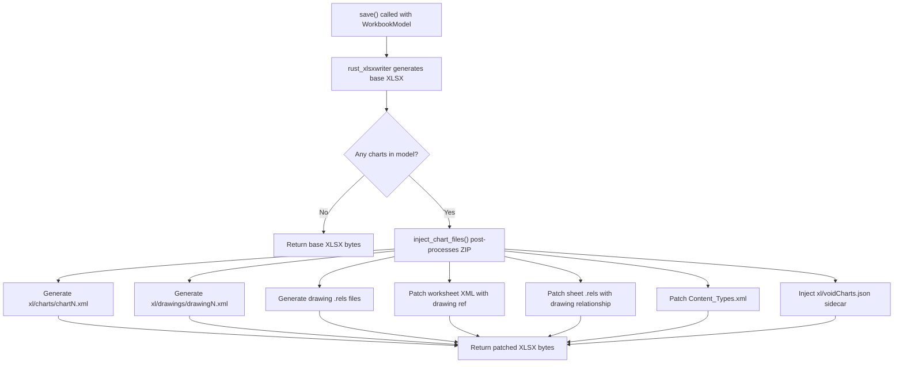

# Fix XLSX Charts Not Appearing in Excel

## Problem

Charts created in our viewer don't appear when the saved XLSX is opened in
Excel. Tables work fine because `rust_xlsxwriter`'s Table API generates valid
OOXML in WASM, but its Chart API does not.

The current `write_chart()` in
`[writer.rs](src/vs/workbench/contrib/void/browser/documentViewers/xlsxRustViewer/wasm/src/writer.rs)`
(line 523) calls `worksheet.insert_chart()` from `rust_xlsxwriter`, which
produces incomplete or invalid chart XML when compiled to WASM via `wasm-pack`.

## Root Cause

`rust_xlsxwriter`'s chart rendering relies on internal XML generation that
doesn't produce valid OOXML chart structures in the WASM target. The
`workbook.save_to_buffer()` at line 225 outputs a ZIP that either:

- Omits the `xl/charts/chartN.xml` files entirely, or
- Produces malformed chart XML that Excel silently ignores

## Solution: Custom OOXML Chart Injection

**Strategy**: Use `rust_xlsxwriter` for everything except charts (cells, tables,
formatting, conditional formats). Then post-process the ZIP to inject proper
OOXML chart files using the `zip` and `quick-xml` crates already in our
dependencies.

### Architecture

### File Changes

All changes are in
`[writer.rs](src/vs/workbench/contrib/void/browser/documentViewers/xlsxRustViewer/wasm/src/writer.rs)`:

**1. Modify `save()` function (line 25)**

- Remove the `write_chart()` call at line 220 (skip charts during
  `rust_xlsxwriter` generation)
- After `workbook.save_to_buffer()`, collect charts by sheet
- If charts exist, call `inject_chart_files(base_bytes, charts_by_sheet)` to
  post-process

**2. Add OOXML chart XML generators (~400 lines)**

- `generate_chart_xml(chart_def, sheet_name) -> String` -- Produces
  `xl/charts/chartN.xml` with proper `<c:chartSpace>` wrapper, chart type
  elements (`c:barChart`, `c:lineChart`, etc.), series with
  `<c:numRef>`/`<c:strRef>` formula references, axis definitions, and legend
- `generate_drawing_xml(charts) -> String` -- Produces
  `xl/drawings/drawingN.xml` with `<xdr:twoCellAnchor>` elements positioning
  charts using the anchor coordinates from `ChartDefinition`
- `generate_rels_xml(entries) -> String` -- Generic helper for `.rels` XML files
- `to_ooxml_range(range, default_sheet) -> String` -- Converts `A1:D10` to
  `'Sheet1'!$A$1:$D$10`
- `build_str_cache(values) / build_num_cache(values)` -- Build inline cache
  elements for chart series data
- `xml_escape(s) -> String` -- Escape XML special characters

**3. Add ZIP injection function (~250 lines)**

`inject_chart_files(xlsx_bytes, charts_by_sheet) -> Result<Vec<u8>, String>`:

- Read existing ZIP entries into memory
- For each sheet with charts:
  - Generate `xl/charts/chartN.xml` for each chart
  - Generate `xl/drawings/drawingN.xml` with all chart anchors
  - Generate `xl/drawings/_rels/drawingN.xml.rels` mapping rIds to chart files
  - Register content types in `[Content_Types].xml`
- Patch worksheet XML to add `<drawing r:id="rIdN"/>` (without redundant
  `xmlns:r` since `rust_xlsxwriter` already declares it on the root
  `<worksheet>`)
- Create or patch `xl/worksheets/_rels/sheetN.xml.rels` with drawing
  relationship
- Use dynamic rId assignment (scan existing rels, use next available) instead of
  hardcoded values
- Inject `xl/voidCharts.json` sidecar for our viewer's metadata
- Write all entries to new ZIP and return bytes

**4. Add helper functions**

- `find_next_rid(existing_entries, rels_path) -> usize` -- Scans existing .rels
  file for max rId number
- `parse_sheet_name_to_xml(entries) -> Vec<(name, xml_path)>` -- Maps sheet
  display names to `xl/worksheets/sheetN.xml` paths via `xl/workbook.xml` +
  `xl/_rels/workbook.xml.rels`
- `sheet_xml_to_rels(sheet_xml) -> String` -- Converts path to its `.rels` path
- `archive_had_file(xlsx_bytes, name) -> bool` -- Check if file exists in
  original ZIP
- `extract_xml_attr(xml_fragment, attr) -> Option<String>` -- Simple XML
  attribute extraction

### Critical Details to Get Right

- The `<drawing>` element in worksheet XML must NOT include `xmlns:r="..."`
  because `rust_xlsxwriter` already declares this namespace on the `<worksheet>`
  root. Excel is strict about duplicate namespace declarations.
- Use `r:id="rIdN"` where N is dynamically determined (not hardcoded) to avoid
  collision with existing relationships (tables, images, etc.)
- The OOXML chart XML requires `<c:chartSpace>` as root with namespaces for
  `c:`, `a:`, and `r:`.
- Series data references must be in OOXML formula format:
  `'SheetName'!$A$1:$A$10` (single-quoted sheet name, absolute cell references)
- All generated files must be registered in `[Content_Types].xml` with proper
  content types

### Testing

After making changes:

1. `cd src/vs/workbench/contrib/void/browser/documentViewers/xlsxRustViewer/wasm && wasm-pack build --target web`
2. `cd src/vs/workbench/contrib/void/browser/documentViewers/xlsxRustViewer && node build.mjs`
3. Reload window, create a chart in the viewer, save, open in Excel -- chart
   should appear
4. Create a chart in Excel, save, open in viewer -- chart should appear (already
   works via parser)
