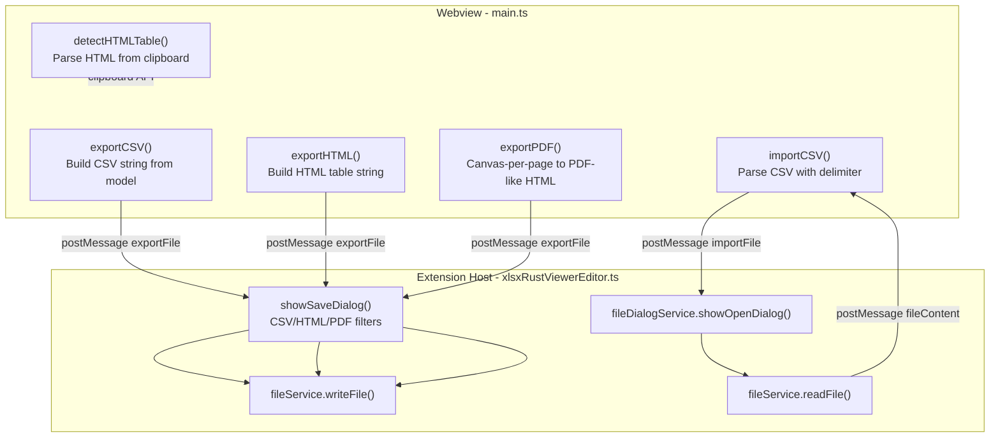

# Import / Export Formats

## Current State

- **Save**: XLSX only (via Rust WASM writer, base64 to extension host)
- **Export**: PNG image only (canvas snapshot via `handleExportImage` in
  `xlsxRustViewerEditor.ts`)
- **Print**: Canvas snapshot as temp HTML opened in browser
- **Import**: Only system clipboard TSV paste via `pasteData()` (splits on `\n`
  and `\t`)
- **Ribbon**: Save, Print, Export (PNG) buttons in file-ops area (right side of
  tab bar)
- **No CSV/TSV/PDF/HTML export or CSV/HTML import exists**

## Architecture

## Implementation

### 1. Export as CSV (`main.ts`)

New function `handleExportCSV()`:

- Iterate all cells in the active sheet from `renderer.getData()`
- Build CSV string: quote fields containing commas/newlines/double-quotes,
  escape `"` as `""`
- Send to extension host via
  `vscode.postMessage({ type: 'exportFile', content, format: 'csv', defaultExt: 'csv' })`

### 2. Export as HTML table (`main.ts`)

New function `handleExportHTML()`:

- Build a `<table>` element string from the active sheet's cells
- Include inline styles for cell formatting (bold, italic, colors, alignment)
- Include merged cell `colspan`/`rowspan` attributes
- Wrap in a full HTML document with basic styling
- Send via
  `vscode.postMessage({ type: 'exportFile', content, format: 'html', defaultExt: 'html' })`

### 3. Export as PDF (`main.ts`)

Upgrade the existing `exportPDF` action:

- Reuse the paginated print HTML approach from `handlePrintPreview()`
  (headers/footers, page setup margins)
- Instead of opening in browser, send via
  `vscode.postMessage({ type: 'exportFile', content, format: 'pdf', defaultExt: 'html' })`
- The extension host saves as `.html` (true PDF generation would require a
  headless browser or PDF library, so we export a print-ready HTML that can be
  "Print to PDF" from the browser -- same approach Excel Online uses)
- Alternatively, use the canvas snapshot PNG approach but with a save dialog
  instead of opening externally

### 4. Import CSV (`main.ts`)

New function `handleImportCSV()`:

- Send
  `vscode.postMessage({ type: 'importFile', formats: ['csv', 'tsv', 'txt'] })`
  to request file picker
- Extension host opens file dialog, reads file content, sends back to webview
- Parse CSV with configurable delimiter (comma, tab, semicolon, pipe) using a
  proper CSV parser that handles quoted fields
- Show a small import options dialog before import: delimiter selector, "has
  header row" checkbox, encoding
- Write parsed data into the active sheet at the selected cell (or create a new
  sheet)

### 5. Import TSV (`main.ts`)

Same infrastructure as CSV import but with tab delimiter pre-selected. The
delimiter options dialog handles both CSV and TSV.

### 6. Import from clipboard -- HTML table paste (`main.ts` + `renderer.ts`)

Enhance `handlePaste()` in `main.ts`:

- Use `navigator.clipboard.read()` to check for `text/html` MIME type alongside
  `text/plain`
- If HTML content contains a `<table>`, parse it with a DOM parser
  (`new DOMParser()`)
- Extract cell values, detect merged cells (`colspan`/`rowspan`), detect
  bold/italic/color from inline styles
- Fall back to TSV paste if no HTML table found

### 7. Extension Host: File Export Handler (`xlsxRustViewerEditor.ts`)

Add a new `case 'exportFile'` in the message handler:

- Call `fileDialogService.showSaveDialog()` with appropriate filters based on
  `data.format`
- Write `data.content` as UTF-8 text via `fileService.writeFile()`

Filter map:

- `csv` -> `{ name: 'CSV', extensions: ['csv'] }`
- `html` -> `{ name: 'HTML', extensions: ['html', 'htm'] }`
- `pdf` -> `{ name: 'HTML (Print to PDF)', extensions: ['html'] }`

### 8. Extension Host: File Import Handler (`xlsxRustViewerEditor.ts`)

Add a new `case 'importFile'` in the message handler:

- Call `fileDialogService.showOpenDialog()` with CSV/TSV/TXT filters
- Read the file via `fileService.readFile()`
- Send content back:
  `webview.postMessage({ type: 'fileContent', content: text, fileName })`

### 9. CSV Import Options Dialog (`csvImportDialog.ts` -- new file)

Small dialog following the existing pattern:

- **Delimiter**: Radio buttons (Comma, Tab, Semicolon, Pipe, Custom)
- **Text qualifier**: Dropdown (Double quote, Single quote, None)
- **Has header row**: Checkbox
- **Preview**: Small table showing first 5 rows with current settings
- **Destination**: "Current sheet at selection" or "New sheet"
- OK / Cancel buttons

### 10. Ribbon Updates (`ribbon.ts`)

Replace the single "Export" button with a dropdown or add items to the file-ops
area:

- Change the existing `exportPDF` button to an "Export" dropdown with options:
  - "Export as CSV" -> action `exportCSV`
  - "Export as HTML" -> action `exportHTML`
  - "Export as PDF" -> action `exportPDF`
  - "Export as PNG" -> action `exportPNG` (existing canvas snapshot)
- Add an "Import" button (or dropdown) near Save:
  - "Import CSV/TSV..." -> action `importCSV`

### 11. Wiring in `main.ts`

Add ribbon action cases:

- `case 'exportCSV': handleExportCSV(); break;`
- `case 'exportHTML': handleExportHTML(); break;`
- `case 'exportPNG': handleExportPNG(); break;` (existing exportPDF logic
  renamed)
- `case 'importCSV': handleImportCSV(); break;`

Add message handler for `fileContent` from extension host (import response).

Update `handlePaste()` to try HTML table detection before TSV fallback.

## Files to Change

- `[main.ts](src/vs/workbench/contrib/void/browser/documentViewers/xlsxRustViewer/media/main.ts)`
  -- Export CSV/HTML/PDF functions, import CSV handler, enhanced paste with HTML
  detection, file content message handler
- `[xlsxRustViewerEditor.ts](src/vs/workbench/contrib/void/browser/documentViewers/xlsxRustViewer/xlsxRustViewerEditor.ts)`
  -- `exportFile` and `importFile` message handlers with save/open dialogs
- `[ribbon.ts](src/vs/workbench/contrib/void/browser/documentViewers/xlsxRustViewer/media/ribbon.ts)`
  -- Export dropdown, Import button
- `[csvImportDialog.ts](src/vs/workbench/contrib/void/browser/documentViewers/xlsxRustViewer/media/csvImportDialog.ts)`
  -- **New file**: CSV import options dialog with delimiter picker and preview
- `[renderer.ts](src/vs/workbench/contrib/void/browser/documentViewers/xlsxRustViewer/media/renderer.ts)`
  -- Optional: add `importCsvData()` method for writing parsed CSV into sheet

## Build

TypeScript only -- no Rust/WASM changes needed. Run `node media/build.mjs` from
the xlsxRustViewer directory.
