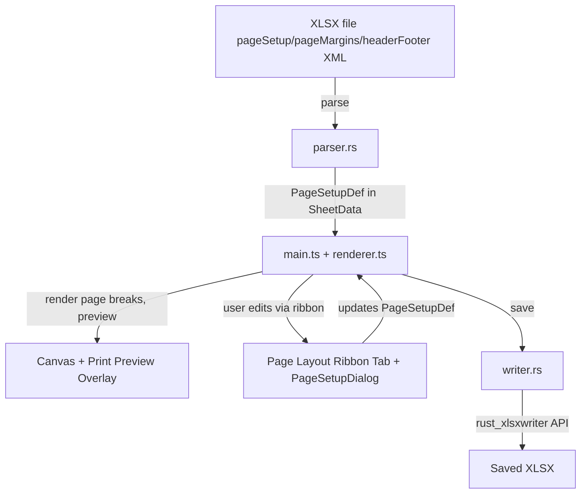

# Page Layout and Print Setup

## Current State

- **Print button** exists but only captures a canvas snapshot as PNG and opens
  it in the browser -- no page awareness
- **No page setup data** is parsed from or written to XLSX files
- **No Page Layout tab** in the ribbon (only Home, Insert, Formulas, View, Data)
- `**rust_xlsxwriter` 0.80 supports all needed APIs: `set_margins`,
  `set_landscape`/`set_portrait`, `set_paper`, `set_header`/`set_footer`,
  `set_print_area`, `set_page_breaks`, `set_repeat_rows`/`set_repeat_columns`,
  `set_print_scale`, `set_print_fit_to_pages`, `set_print_gridlines`

## Architecture



## Implementation Plan

### 1. Rust Data Model -- `PageSetupDef` struct ([parser.rs](src/vs/workbench/contrib/void/browser/documentViewers/xlsxRustViewer/wasm/src/parser.rs))

Add a new `PageSetupDef` struct and attach it as
`page_setup: Option<PageSetupDef>` to `SheetData`:

```rust
pub struct PageSetupDef {
    pub orientation: String,          // "portrait" | "landscape"
    pub paper_size: u8,               // Excel paper size index (1=Letter, 9=A4, 5=Legal, etc.)
    pub scale: u16,                   // 10-400, default 100
    pub fit_to_width: Option<u16>,    // pages wide (0 = auto)
    pub fit_to_height: Option<u16>,   // pages tall (0 = auto)
    pub margin_top: f64,
    pub margin_bottom: f64,
    pub margin_left: f64,
    pub margin_right: f64,
    pub margin_header: f64,
    pub margin_footer: f64,
    pub header: String,               // Excel header format string (&L, &C, &R, &P, &N, &D, etc.)
    pub footer: String,
    pub print_area: String,           // e.g. "A1:H50" or empty
    pub print_titles_rows: String,    // e.g. "1:2" for repeat rows
    pub print_titles_cols: String,    // e.g. "A:B" for repeat cols
    pub row_breaks: Vec<u32>,         // row indices for horizontal page breaks
    pub col_breaks: Vec<u32>,         // col indices for vertical page breaks
    pub print_gridlines: bool,
    pub center_horizontally: bool,
    pub center_vertically: bool,
}
```

### 2. Rust Parser -- Read page setup from OOXML ([parser.rs](src/vs/workbench/contrib/void/browser/documentViewers/xlsxRustViewer/wasm/src/parser.rs))

Parse these OOXML elements from each worksheet XML:

- `<pageSetup>` -- orientation, paperSize, scale, fitToWidth, fitToHeight
- `<pageMargins>` -- top, bottom, left, right, header, footer
- `<headerFooter>` -- `<oddHeader>`, `<oddFooter>` text content
- `<printOptions>` -- gridLines, horizontalCentered, verticalCentered
- `<rowBreaks>` / `<colBreaks>` -- manual page break positions
- Print area and print titles come from `definedName` elements
  (`_xlnm.Print_Area`, `_xlnm.Print_Titles`) which are already in
  `defined_names` but currently skipped in the writer

### 3. Rust Writer -- Write page setup to XLSX ([writer.rs](src/vs/workbench/contrib/void/browser/documentViewers/xlsxRustViewer/wasm/src/writer.rs))

Use `rust_xlsxwriter` worksheet APIs to write the `PageSetupDef` back:

- `worksheet.set_margins(left, right, top, bottom, header, footer)`
- `worksheet.set_landscape()` / `worksheet.set_portrait()`
- `worksheet.set_paper(paper_size)`
- `worksheet.set_print_scale(scale)` or
  `worksheet.set_print_fit_to_pages(width, height)`
- `worksheet.set_header(header_str)` / `worksheet.set_footer(footer_str)`
- `worksheet.set_print_area(first_row, first_col, last_row, last_col)`
- `worksheet.set_repeat_rows(first_row, last_row)` /
  `worksheet.set_repeat_columns(first_col, last_col)`
- `worksheet.set_page_breaks(&row_breaks)` /
  `worksheet.set_page_breaks(&col_breaks)` (horizontal/vertical)
- `worksheet.set_print_gridlines(bool)`
- Remove the `_xlnm.Print_Area` skip logic (line ~307)

### 4. TypeScript -- Page Layout Ribbon Tab ([ribbon.ts](src/vs/workbench/contrib/void/browser/documentViewers/xlsxRustViewer/media/ribbon.ts))

Add **"Page Layout"** tab (inserted between Formulas and View) with these
groups:

- **Page Setup** group:
  - Margins dropdown (Normal / Wide / Narrow / Custom)
  - Orientation dropdown (Portrait / Landscape)
  - Size dropdown (Letter / A4 / Legal / etc.)
  - Print Area button (Set / Clear)
  - Breaks button (Insert / Remove / Reset All)
  - Print Titles button (opens dialog)
- **Scale to Fit** group:
  - Width dropdown (Automatic / 1-9 pages)
  - Height dropdown (Automatic / 1-9 pages)
  - Scale percentage input
- **Sheet Options** group:
  - Print Gridlines checkbox
  - Print Headings checkbox
- **Page Setup Dialog** button (full dialog with all options on tabs)

### 5. TypeScript -- Page Setup Dialog ([pageSetupDialog.ts](src/vs/workbench/contrib/void/browser/documentViewers/xlsxRustViewer/media/pageSetupDialog.ts) -- new file)

Multi-tab dialog following the existing dialog pattern (like
`formatCellsDialog.ts`):

- **Page tab**: Orientation, Scale (% or Fit-to), Paper size, Print quality,
  First page number
- **Margins tab**: Top/Bottom/Left/Right/Header/Footer margin inputs with visual
  preview
- **Header/Footer tab**: Preset dropdowns + custom editor with section codes
  (&L, &C, &R, &P, &N, &D, &T, &F, &A)
- **Sheet tab**: Print area, Print titles (rows to repeat / columns to repeat),
  Print gridlines, Page order (down-then-over / over-then-down)

### 6. TypeScript -- Page Break Visualization ([renderer.ts](src/vs/workbench/contrib/void/browser/documentViewers/xlsxRustViewer/media/renderer.ts))

- Render dashed blue lines at page break positions during normal view
- Add a **Page Break Preview** mode (toggled from View tab) that shows page
  numbers as watermarks and allows drag-repositioning of break lines
- Store `pageSetup: PageSetupDef` per sheet in the renderer for break
  calculations

### 7. TypeScript -- Print Preview ([main.ts](src/vs/workbench/contrib/void/browser/documentViewers/xlsxRustViewer/media/main.ts))

Upgrade the existing simple canvas-snapshot print to a paginated print:

- Calculate page boundaries from margins, paper size, and column/row dimensions
- Render each page as a separate canvas capturing the correct cell range
- Render headers/footers with substitution codes
- Show a preview overlay with page navigation (Prev/Next, page count)
- The actual print sends paginated HTML (one `<div class="page">` per page with
  `page-break-after`) to the extension host

### 8. Wire Everything Together ([main.ts](src/vs/workbench/contrib/void/browser/documentViewers/xlsxRustViewer/media/main.ts))

- Load `page_setup` from parsed model into per-sheet state
- Handle all ribbon events from the new Page Layout tab
- Instantiate and wire `PageSetupDialog`
- Update `handleSave()` to include `page_setup` in the data sent to the Rust
  writer
- Add View tab toggle for "Page Break Preview" mode
