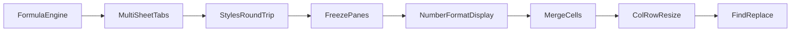

# Spreadsheet and Tables Improvement Roadmap

## Current State Summary

The viewer has: canvas-based cell rendering, basic cell editing, selection
(click/drag/Shift+Arrow/Ctrl+A), undo/redo, clipboard, insert/delete
rows/columns, sorting, cell formatting (bold/italic/underline/color/alignment),
table CRUD (create/resize/rename/style/totals/filter/convert-to-range), 16
visual table styles, a 4-tab ribbon (Home/Insert/View/Data), and context menus
with table awareness.

## Tier 1 -- High-Impact Missing Features

### 1. Formula Engine (currently a non-functional stub)

`formulas.rs` is a placeholder that returns `0.0` for everything. This is the
single biggest gap.

- **Rust side**: Implement a real tokenizer/parser/evaluator in
[formulas.rs](src/vs/workbench/contrib/void/browser/documentViewers/xlsxRustViewer/wasm/src/formulas.rs)
supporting at minimum: `SUM`, `AVERAGE`, `COUNT`, `MIN`, `MAX`, `IF`,
`VLOOKUP`, cell references (`A1`, `$A$1`), range references (`A1:B5`), and
basic arithmetic (`+`, `-`, `*`, `/`, `^`)
- **TS side**: When a cell value starts with `=`, pass it to the formula engine,
display the computed result, show the formula in the formula bar, and
recalculate dependents on edit
- **Dependency graph**: Track which cells depend on which, so editing one cell
recalculates all downstream cells

### 2. Multi-Sheet Tabs

The model stores `sheets: Vec<SheetData>` but the UI always renders `sheets[0]`.

- Add a **sheet tab bar** at the bottom of the canvas (like Excel) showing all
sheet names
- Clicking a tab switches which sheet index the renderer and formula bar use
- Context menu on tabs: Rename Sheet, Add Sheet, Delete Sheet, Duplicate Sheet
- Track `activeSheetIndex` in renderer state

### 3. Cell Styles Round-Trip (styles are lost on save)

Currently, cell formatting (bold, italic, font color, fill, alignment) lives
only in the TypeScript `styles` overlay map and is never serialized to the WASM
model or written to the XLSX file.

- Extend `CellData` in
[parser.rs](src/vs/workbench/contrib/void/browser/documentViewers/xlsxRustViewer/wasm/src/parser.rs)
with an optional `style` field (font, fill, alignment, number format)
- Parse cell styles from the XLSX shared styles table (`xl/styles.xml`)
- Write styles back in
[writer.rs](src/vs/workbench/contrib/void/browser/documentViewers/xlsxRustViewer/wasm/src/writer.rs)
using `rust_xlsxwriter::Format`
- Renderer reads style from the model instead of the separate overlay map

### 4. Freeze Panes (set but not rendered)

`freezePanes()` stores `_freezeRow`/`_freezeCol` but the render method has a
`// TODO: implement split-pane rendering`. This is important for usability with
large files.

- Split the viewport into 4 quadrants (frozen-rows-cols corner, frozen-rows,
frozen-cols, scrollable body)
- Each quadrant clips and offsets independently
- Draw separator lines at the freeze boundary

## Tier 2 -- Important Functional Gaps

### 5. Number Formatting Display

Number format dropdowns exist but `renderer.ts` just calls
`fillText(cell.value)` -- no formatting is applied. Currency, percentage, date,
and comma-separated values should render correctly.

- Add a
`formatCellValue(value: string, dataType: string, format: string): string`
function in the renderer
- Apply locale-aware formatting: `$1,234.56` for currency, `45.6%` for
percentage, date strings for date type

### 6. Merge Cells

The ribbon has "Merge" but the handler is `/* TODO: merge cells */`.

- Add a `mergedCells` list to the data model (array of ranges)
- Parser reads `<mergeCells>` from the XLSX
- Renderer skips drawing inner borders for merged ranges and spans text across
the merged area
- Writer serializes merge info back

### 7. Column Resize and Row Resize

All columns are fixed at 100px, all rows at 24px. Users cannot drag to resize.

- Track per-column widths and per-row heights arrays
- Parse column widths from `<col>` elements and row heights from
`<row ht="...">` in the XLSX
- Add drag handles on column/row headers (cursor changes to resize cursor on
hover near border)
- Double-click header border = auto-fit to content width

### 8. Find and Replace

No search functionality exists.

- Add Ctrl+F shortcut to show a find bar overlay
- Search across visible cells, highlight matches, navigate between them
- Optional replace mode

## Tier 3 -- Polish and UX

### 9. Implement Remaining Stub Buttons

Several ribbon buttons have no implementation:

- `mergeCells` -- see item 6
- `increaseDecimal` / `decreaseDecimal` -- adjust decimal places on formatted
numbers
- `exportPDF` -- render the sheet to a PDF blob

### 10. Performance: Virtualized Viewport Fetching

Currently the entire model JSON is held in the webview. For very large files
(100k+ rows), this will be slow.

- Use the existing `ViewportManager` in Rust to return only visible rows
- Renderer requests data chunks as the user scrolls
- Cache recently viewed chunks

### 11. Conditional Formatting

Read and display conditional formatting rules (color scales, data bars, icon
sets) from the XLSX.

### 12. Charts

Parse chart objects from the XLSX and render them as embedded `<canvas>` or SVG
overlays.

## Recommended Execution Order

Start with **Formula Engine** -- it is the most impactful single feature and
unlocks table totals rows, SUM/AVG buttons, and the formula bar actually
working. Then **Multi-Sheet Tabs** (small effort, high usability). Then **Styles
Round-Trip** so formatting is not lost on save.