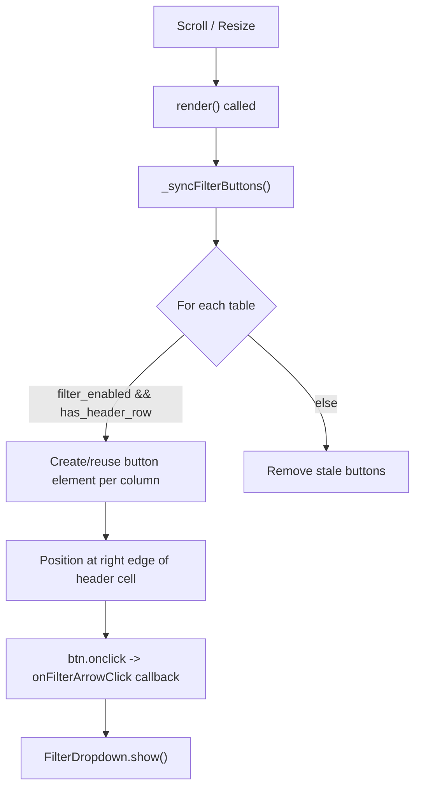

# Real HTML Filter Buttons for Table Headers

## Problem

The current filter arrows are tiny triangles painted on the canvas. Canvas
hit-testing is unreliable because of coordinate scaling mismatches between mouse
events and the canvas drawing context. Excel uses real DOM buttons that always
work regardless of scaling.

## Architecture

## Changes

### 1. `renderer.ts` -- Add filter button management

**In the constructor** (line ~217): add `position:relative` to the wrapper div
so absolutely-positioned buttons are placed correctly inside it.

**New private field**: `_filterButtons: HTMLButtonElement[]` to track current
filter button elements.

**New method `_syncFilterButtons()`**: Called at the end of every `render()`.
For each table with `filter_enabled && has_header_row`, for each column in the
table:

- Create (or reuse) a small `<button>` element with the dropdown arrow character
- Position it absolutely at the right edge of the header cell using the same
  layout cache math already used for rendering:
  `left = cx(c) - scrollLeft + effHeaderWidth + cw(c) - 20`,
  `top = ry(start_row) - scrollTop + effHeaderHeight`
- Size: ~18px wide, row height tall
- If the button would be off-screen (scrolled out of view or behind headers),
  hide it
- On click: fire
  `this.onFilterArrowClick(tableName, colIndex, colName, btn screen X, btn screen Y)`

Remove stale buttons when tables change, filter is disabled, or sheet is
switched.

**Remove `hitTestFilterArrow()`**: No longer needed since real buttons handle
clicks. Also remove the call in `handleMouseDown` and the guard in
`handleDoubleClick`.

### 2. `renderer.ts` -- Style the buttons

The buttons will be styled inline (or via a CSS class defined in the webview
HTML in `xlsxRustViewerEditor.ts`):

- Transparent background, no border
- White dropdown arrow character (matching the current header text color)
- Cursor: pointer
- On hover: subtle highlight
- `pointer-events: auto` (so they intercept clicks before the canvas)
- `z-index: 5` (above canvas, below edit input at z-index 10)

### 3. `xlsxRustViewerEditor.ts` -- Add CSS for filter buttons

Add a `.filter-arrow-btn` class in the webview `<style>` block (around line
~640):

- Transparent background, no border, white text
- Hover: slight background highlight
- Fixed width ~18px, font-size for the arrow character
- `position: absolute; z-index: 5; pointer-events: auto; cursor: pointer;`

### 4. `main.ts` -- No changes needed

The existing `renderer.onFilterArrowClick` callback and `FilterDropdown` wiring
remain exactly as-is. The only difference is that the callback is now triggered
by a real button click instead of canvas hit-testing.

### 5. Cleanup

- Remove `hitTestFilterArrow()` method from renderer
- Remove the filter arrow check from `handleMouseDown`
- Remove the filter arrow guard from `handleDoubleClick`
- Keep the canvas-drawn triangle as a visual-only decoration (no hit-testing),
  OR remove it since the HTML button provides its own arrow character

## Files Modified

- `[renderer.ts](src/vs/workbench/contrib/void/browser/documentViewers/xlsxRustViewer/media/renderer.ts)`
  -- Main changes: add button management, remove hit-testing
- `[xlsxRustViewerEditor.ts](src/vs/workbench/contrib/void/browser/documentViewers/xlsxRustViewer/xlsxRustViewerEditor.ts)`
  -- CSS for `.filter-arrow-btn`
- No changes to `main.ts` or `filterDropdown.ts`
