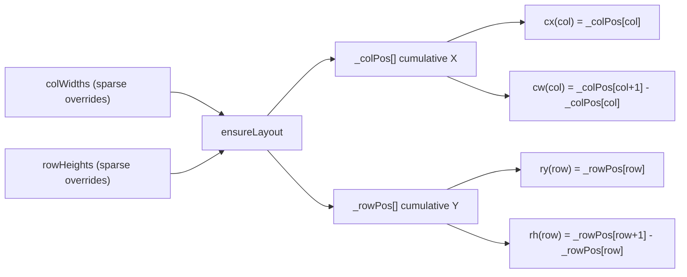

# Variable Column/Row Sizing for XLSX Renderer

## Problem

The resize drag infrastructure already exists -- `hitTestResize` detects header
border drags, `handleMouseMove` updates `this.colWidths[col]` /
`this.rowHeights[row]`, and the cursor changes to `col-resize`/`row-resize`. But
`render()` and all supporting methods use **fixed sizes** (`r * this.rowHeight`,
`c * this.colWidth`) for positioning, so nothing visually changes.

## Architecture: Layout Position Cache

Add a **pre-computed position cache** to `CanvasRenderer` so all position
lookups are O(1):




- `_colPos[i]` = absolute X pixel of column `i` start (sum of all prior widths)
- `_rowPos[i]` = absolute Y pixel of row `i` start (sum of all prior heights)
- Cache is rebuilt when `_layoutDirty` flag is set (on any width/height change)
- Pre-compute up to 200 columns and 1100 rows (covers typical usage)

## All changes are in one file

`src/vs/workbench/contrib/void/browser/documentViewers/xlsxRustViewer/media/renderer.ts`

## Step 1: Add layout cache infrastructure

Add new private members and `ensureLayout()` method after line ~159:

```typescript
private _layoutDirty = true;
private _colPos: number[] = [0];
private _rowPos: number[] = [0];

private ensureLayout(minCols = 200, minRows = 1100) {
    if (!this._layoutDirty
        && this._colPos.length > minCols
        && this._rowPos.length > minRows) return;
    // rebuild cumulative arrays from colWidths/rowHeights
    this._layoutDirty = false;
}
```

Mark `_layoutDirty = true` in: `setColWidth()`, `setRowHeight()`, `setData()`,
`updateModel()`, and the resize mousemove handler.

## Step 2: Fix viewport calculation in render()

Replace the fixed-size viewport calc (lines 1447-1450):

```
// OLD: const startRow = Math.floor(this.scrollTop / this.rowHeight);
// NEW: binary-walk through _rowPos to find first visible row
```

Walk through `_rowPos` / `_colPos` to find `startRow`, `endRow`, `startCol`,
`endCol` based on `scrollTop` / `scrollLeft`.

## Step 3: Replace all cell positioning in render()

Replace **all ~59 occurrences** of the following patterns across the render
method:

- `(r * this.rowHeight)` --> `this._rowPos[r]`
- `(c * this.colWidth)` --> `this._colPos[c]`
- `this.rowHeight` (as cell height) --> `(this._rowPos[r+1] - this._rowPos[r])`
or use a local `rh` variable
- `this.colWidth` (as cell width) --> `(this._colPos[c+1] - this._colPos[c])` or
use a local `cw` variable
- Multi-cell spans like `(endCol - startCol + 1) * this.colWidth` -->
`this._colPos[endCol+1] - this._colPos[startCol]`

Affected render sections (in order):

1. **Main cell loop** (lines 1457-1583) -- cell fill, gridlines, selection,
  active cell, text
2. **Table overlays** (lines 1585-1703) -- banded rows/cols, header, totals,
  border
3. **Merged cells** (lines 1705-1762)
4. **Find highlights** (lines 1764-1782)
5. **Row headers** (lines 1784-1821)
6. **Column headers** (lines 1823-1862)
7. **Formula range highlights** (lines 1864-1891)
8. **Selection range border** (lines 1893-1920)
9. **Freeze panes** (lines 1922-2065)

## Step 4: Fix supporting methods

- `**hitTestCell()` (line 881) -- replace `Math.floor(gridX / this.colWidth)`
with a walk through `_colPos`
- `**hitTestResize()` (line 1191) -- already uses variable widths, but the
starting offset uses `scrollLeft % this.colWidth` which is wrong; fix to use
cache
- `**hitTestColHeader()` (line 1029) -- already walks variable widths, OK as-is
- `**hitTestRowHeader()` (line 1044) -- already walks variable heights, OK as-is
- `**scrollIntoView()`_ (line 1370) -- replace `row _ this.rowHeight`with`\_rowPos[row]`
- `**startCellEdit()` (line 2277) -- replace inline editor positioning to use
cache
- `**handleDoubleClick()` (line 2195) -- replace
`Math.floor(gridX / this.colWidth)` with cache walk
- `**getVirtualWidth()`_ (line 2431) -- replace `totalCols _ this.colWidth`with`\_colPos[totalCols]`
- `**getVirtualHeight()`_ (line 2447) -- replace `totalRows _ this.rowHeight`with`\_rowPos[totalRows]`

## Performance Note

Pre-computing 200 columns + 1100 rows = 1300 additions per layout rebuild. This
is negligible. The cache is only rebuilt when widths/heights change, not on
every render.

## Build and Test

After changes:

```bash
cd src/vs/workbench/contrib/void/browser/documentViewers/xlsxRustViewer
node media/build.mjs
# then: bun run compile
```

Test by:

1. Open a test.xlsx file
2. Hover column header borders -- cursor should show `col-resize`
3. Drag a column border right/left -- column should visually widen/shrink
4. Drag a row header border down/up -- row should visually grow/shrink
5. Verify cells, headers, table overlays, and selection all stay aligned
6. Verify scrolling still works correctly with mixed sizes

