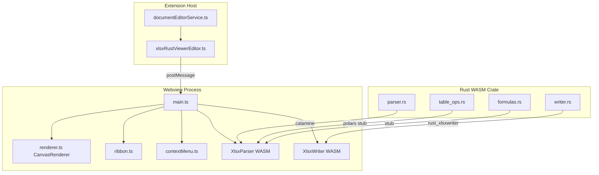

# Rust XLSX Tables -- Revised Plan

## What the Old Plan Got Wrong

The original plan was written against the **abandoned** SheetJS/x-spreadsheet
viewer (`xlsxViewer/`). The current codebase uses a completely different
architecture:

- **No x-spreadsheet, no SheetJS** -- the grid is a custom `CanvasRenderer` in
TypeScript
- **No electron-main sidecar** -- Rust compiles to WASM via `wasm-pack` and runs
**inside the webview** (not in the main process)
- **No `xlsxRibbon.js` or
`xlsxViewer.js`**-- replaced by`ribbon.ts`, `main.ts`, `contextMenu.ts`, `renderer.ts`
- The `documentEditorService.ts` still references the abandoned
`XLSXViewerEditor` in `findXLSXViewer()` -- this needs updating to the Rust
viewer

## Actual Architecture




**Data model**: `WorkbookModel { sheets: Vec<SheetData> }` where
`SheetData { name, cells: HashMap<u32, HashMap<u32, CellData>>, row_count, col_count }`.
Cells are sparse. No table metadata exists yet.

**Crate dependencies** (from
[Cargo.toml](src/vs/workbench/contrib/void/browser/documentViewers/xlsxRustViewer/wasm/Cargo.toml)):

- `calamine 0.25` (read)
- `rust_xlsxwriter 0.80` with `wasm` feature (write)
- `polars 0.45` (currently only used in `table_ops.rs` stub for sorting)
- `serde`, `serde_json`, `wasm-bindgen`, `js-sys`, `console_error_panic_hook`

## Revised Plan Steps

### 1. Extend the Rust data model with table metadata

**File**:
[parser.rs](src/vs/workbench/contrib/void/browser/documentViewers/xlsxRustViewer/wasm/src/parser.rs)

Add new structs alongside the existing `WorkbookModel`:

- `TableDefinition` -- name, range (as `{startRow, startCol, endRow, endCol}`),
has_header_row, has_totals_row, style_name, banded_rows, banded_cols,
filter_enabled
- `TableColumn` -- name, col_index, totals_function
(None/Sum/Average/Count/Min/Max), totals_label
- `TableStyle` -- name, show_first_column, show_last_column
- Add `tables: Vec<TableDefinition>` field to `SheetData`

**Read path**: `calamine` does **not** natively expose table metadata (it reads
cell ranges only). Options:

- (a) Parse table XML directly from the XLSX zip (`xl/tables/table*.xml`) using
`calamine`'s `Xlsx` struct's inner `ZipArchive` -- requires accessing the zip
reader
- (b) Use a lightweight XML parser (`quick-xml`, already a transitive dep of
calamine) to read table definitions from the zip entries
- **Recommendation**: Option (b) -- add a `parse_tables()` method that takes the
raw XLSX bytes, opens the zip, reads `xl/tables/*.xml`, and returns
`Vec<TableDefinition>` per sheet

### 2. Extend the Rust writer with table support

**File**:
[writer.rs](src/vs/workbench/contrib/void/browser/documentViewers/xlsxRustViewer/wasm/src/writer.rs)

`rust_xlsxwriter` has first-class `Table` support:

- `Worksheet::add_table(row, col, &Table)`
- `Table::new()`, `.set_name()`, `.set_style()`, `.set_header_row()`,
`.set_total_row()`, `.set_columns()`
- `TableColumn::new()`, `.set_total_function(TableFunction::Sum)`, etc.

Update `XlsxWriter::save()` to:

- Deserialize `tables` from the model JSON
- For each table definition, construct `rust_xlsxwriter::Table` with columns,
style, headers, totals
- Call `worksheet.add_table()` at the correct position

### 3. Add table operations to `table_ops.rs`

**File**:
[table_ops.rs](src/vs/workbench/contrib/void/browser/documentViewers/xlsxRustViewer/wasm/src/table_ops.rs)

Replace the current Polars sorting stub with actual table operation functions
(all `#[wasm_bindgen]`):

- `create_table(model_json, sheet_idx, range_json) -> Result<String, JsError>`
-- adds a TableDefinition to the model, returns updated JSON
- `resize_table(model_json, table_name, new_range_json) -> Result<String, JsError>`
- `rename_table(model_json, old_name, new_name) -> Result<String, JsError>`
- `add_table_column(model_json, table_name, col_name) -> Result<String, JsError>`
- `remove_table_column(model_json, table_name, col_index) -> Result<String, JsError>`
- `set_totals_row(model_json, table_name, enabled, functions_json) -> Result<String, JsError>`
- `set_table_style(model_json, table_name, style_name) -> Result<String, JsError>`
- `toggle_filter(model_json, table_name) -> Result<String, JsError>`
- `convert_to_range(model_json, table_name) -> Result<String, JsError>` --
removes table, keeps data

Each function deserializes the model, mutates it, re-serializes. The webview
holds the model JSON in memory, so these are stateless transforms.

### 4. Webview table model + renderer integration

**Files**:
[renderer.ts](src/vs/workbench/contrib/void/browser/documentViewers/xlsxRustViewer/media/renderer.ts),
[main.ts](src/vs/workbench/contrib/void/browser/documentViewers/xlsxRustViewer/media/main.ts)

**renderer.ts** changes:

- Add a `tables: TableDefinition[]` property (TS interface mirroring the Rust
struct)
- In `setData()`, extract `model.sheets[0].tables` and store them
- In `render()`, after drawing cells and before headers:
  - For each table, draw: header row with styled background + bold text + filter
  dropdown icons; alternating banded row fills; totals row; table border
  - Highlight the table range distinctly from normal selection
- Add `getTableAtCell(row, col)` to check if a cell is inside a table (needed
for context menu)

**main.ts** changes:

- Import the new WASM table functions
- Add `handleTableAction()` dispatcher for table ribbon/context menu events
- When a table operation returns updated model JSON, call
`renderer.setData(JSON.parse(result))`
- Wire formula bar to show table structured references when inside a table
(e.g., `=TableName[Column]`)

### 5. Ribbon "Insert" tab + context menu table items

**File**:
[ribbon.ts](src/vs/workbench/contrib/void/browser/documentViewers/xlsxRustViewer/media/ribbon.ts)

Add a new **"Insert"** tab (between Home and View) containing:

- **Tables** group: "Table" button (creates table from selection), "Table
Styles" dropdown (preset styles from `rust_xlsxwriter`)
- In the **Data** tab, add: "Toggle Filter" button, "Totals Row" toggle

**File**:
[contextMenu.ts](src/vs/workbench/contrib/void/browser/documentViewers/xlsxRustViewer/media/contextMenu.ts)

When right-clicking inside a table range, add table-specific items:

- "Insert Table Column Left/Right"
- "Delete Table Column"
- "Table" submenu: Rename Table, Resize Table, Toggle Headers, Toggle Totals,
Table Style, Convert to Range

### 6. Fix documentEditorService.ts reference

**File**:
[documentEditorService.ts](src/vs/workbench/contrib/void/browser/documentViewers/documentEditorService.ts)

- Line 13: Change import from `xlsxViewerAbandoned/xlsxViewerEditor.js` to
`xlsxRustViewer/xlsxRustViewerEditor.js`
- Line 266-277: Change `findXLSXViewer` to look for `XLSXRustViewerEditor`
instead of the abandoned `XLSXViewerEditor`
- Add table operation types to `XLSXEditOperation` union (create_table,
resize_table, set_table_style, etc.)

### 7. Save round-trip validation

- Non-table workbooks must round-trip unchanged (existing behavior)
- Workbooks WITH tables: on load, parser extracts table metadata into model
JSON; on save, writer reconstructs tables from model JSON
- Verify: header row, totals row (with functions), banded rows, filter state,
table style name, structured references
- Test with Excel-generated table files to confirm fidelity

## Key Files


| Purpose                  | File                       |
| ------------------------ | -------------------------- |
| Rust data model + parser | `wasm/src/parser.rs`       |
| Rust writer              | `wasm/src/writer.rs`       |
| Rust table operations    | `wasm/src/table_ops.rs`    |
| Rust crate root          | `wasm/src/lib.rs`          |
| Rust dependencies        | `wasm/Cargo.toml`          |
| Webview renderer         | `media/renderer.ts`        |
| Webview entry point      | `media/main.ts`            |
| Ribbon toolbar           | `media/ribbon.ts`          |
| Context menu             | `media/contextMenu.ts`     |
| Editor host              | `xlsxRustViewerEditor.ts`  |
| Document editor service  | `documentEditorService.ts` |


## Cargo.toml Changes

- Add `quick-xml = "0.37"` for parsing table XML from the zip (unless we can
reuse calamine's internal `quick_xml`)
- Add `zip = "2.0"` for direct zip entry access (calamine wraps `ZipArchive` but
may not expose it)
- Consider removing `polars` dependency if table_ops no longer needs it (saves
significant WASM size)

## Build Commands

After Rust changes:

```bash
cd src/vs/workbench/contrib/void/browser/documentViewers/xlsxRustViewer/wasm
wasm-pack build --target web --out-dir ../media/wasm
cd ..
node media/build.mjs
```

After TypeScript changes:

```bash
bun run compile
```

