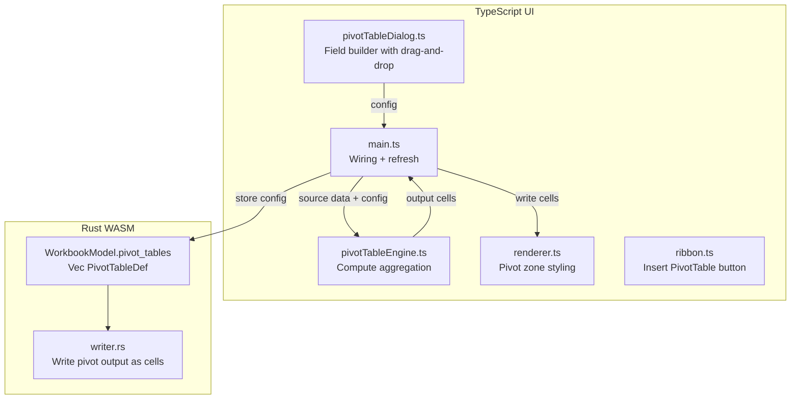

# XLSX Pivot Tables

## Important: Architecture Decision

`rust_xlsxwriter` does **not** support pivot tables, and the OOXML pivot table
format (`xl/pivotTables/`, `xl/pivotCache/`) is one of the most complex parts of
the Office Open XML spec (the Python XlsxWriter maintainer estimated months of
work for just the writing side). Therefore:

- **Pivot tables are computed in-app** (TypeScript) and their output is written
  as **regular formatted cells** on a destination sheet
- The pivot table **configuration** (source range, field layout, aggregation
  settings) is stored as app-level metadata in `WorkbookModel.pivot_tables`
- When saved to XLSX, the pivot output appears as a regular formatted table
  (readable in Excel but not editable as a native Excel PivotTable)
- The "Refresh data" feature re-computes from the source range and rewrites the
  output cells

This is a pragmatic approach that delivers the core pivot table functionality
without the enormous complexity of OOXML pivot table serialization.

## Current State

- No pivot table code exists anywhere in the codebase
- Table support (`TableDefinition`, `TableOps`, `create_table`) is fully
  implemented and provides a good pattern
- Chart wizard dialog (`chartWizardDialog.ts`) demonstrates the complex
  interactive dialog pattern with overlay
- `WorkbookModel` currently holds `sheets` and `defined_names`
- Data is sparse: `cells[row][col] = { value, data_type, style }`

## Architecture



## Step 1: Data Model -- Rust (`parser.rs`) and TypeScript

### New structs in [parser.rs](src/vs/workbench/contrib/void/browser/documentViewers/xlsxRustViewer/wasm/src/parser.rs) (add after `DefinedNameDef`):

```rust
#[derive(Serialize, Deserialize, Clone, Debug)]
pub struct PivotFieldDef {
    pub name: String,
    pub source_col: u32,
    pub area: String,           // "row", "column", "value", "filter"
    #[serde(skip_serializing_if = "Option::is_none")]
    pub aggregation: Option<String>,  // "sum", "count", "average", "min", "max" (for value fields)
    #[serde(skip_serializing_if = "Option::is_none")]
    pub group_by: Option<String>,     // "none", "day", "month", "quarter", "year" (for date grouping)
    #[serde(skip_serializing_if = "Option::is_none")]
    pub custom_name: Option<String>,
    #[serde(skip_serializing_if = "Option::is_none")]
    pub sort_order: Option<String>,   // "asc", "desc", "none"
    #[serde(skip_serializing_if = "Option::is_none")]
    pub number_format: Option<String>,
}

#[derive(Serialize, Deserialize, Clone, Debug)]
pub struct PivotCalcFieldDef {
    pub name: String,
    pub formula: String,   // e.g., "'Revenue' - 'Cost'"
}

#[derive(Serialize, Deserialize, Clone, Debug)]
pub struct PivotTableDef {
    pub name: String,
    pub source_sheet: String,
    pub source_range: String,          // "A1:F100"
    pub dest_sheet: String,
    pub dest_cell: String,             // "A1" -- top-left of output
    pub fields: Vec<PivotFieldDef>,
    #[serde(default)]
    pub calc_fields: Vec<PivotCalcFieldDef>,
    #[serde(skip_serializing_if = "Option::is_none")]
    pub style_name: Option<String>,    // "PivotStyleMedium9" etc.
    #[serde(default)]
    pub show_grand_total_rows: bool,
    #[serde(default)]
    pub show_grand_total_cols: bool,
    #[serde(default)]
    pub show_subtotals: bool,
    #[serde(default)]
    pub compact_layout: bool,          // vs tabular layout
    #[serde(default)]
    pub filter_values: Vec<PivotFilterValueDef>,
}

#[derive(Serialize, Deserialize, Clone, Debug)]
pub struct PivotFilterValueDef {
    pub field_name: String,
    pub included_values: Vec<String>,
}
```

### Update `WorkbookModel` (line 369):

```rust
pub struct WorkbookModel {
    pub sheets: Vec<SheetData>,
    #[serde(default)]
    pub defined_names: Vec<DefinedNameDef>,
    #[serde(default)]
    pub pivot_tables: Vec<PivotTableDef>,
}
```

Update `load()` to initialize `pivot_tables: Vec::new()` (no OOXML parsing
needed since we store our own format).

### TypeScript interfaces -- add to [renderer.ts](src/vs/workbench/contrib/void/browser/documentViewers/xlsxRustViewer/media/renderer.ts) or a shared types location:

Mirror the Rust structs as TypeScript interfaces (`PivotFieldDef`,
`PivotTableDef`, etc.).

## Step 2: Pivot Table Computation Engine -- New file `pivotTableEngine.ts`

This is the core logic. New file:
[pivotTableEngine.ts](src/vs/workbench/contrib/void/browser/documentViewers/xlsxRustViewer/media/pivotTableEngine.ts)

### Main function:

```typescript
export interface PivotOutputCell {
	value: string;
	dataType: string;
	style?: Partial<CellStyle>;
	isHeader?: boolean;
	isGrandTotal?: boolean;
	isSubtotal?: boolean;
	sourceRows?: number[]; // for drill-down
}

export interface PivotOutput {
	cells: PivotOutputCell[][]; // [row][col] dense grid
	rowCount: number;
	colCount: number;
}

export function computePivotTable(
	sourceData: Record<
		number,
		Record<number, { value: string; data_type: string }>
	>,
	config: PivotTableDef,
	formulaResults?: Record<string, { display: string; numeric: number | null }>,
): PivotOutput;
```

### Computation logic:

1. **Extract source data** -- Read cells from the source range, row 0 = headers
2. **Apply filters** -- Exclude rows based on `filter_values`
3. **Group by row fields** -- Build a tree of unique value combinations for all
   "row" area fields
4. **Group by column fields** -- Build a tree for "column" area fields
5. **Aggregate** -- For each (row-group, col-group) intersection, aggregate the
   "value" fields using the specified function
6. **Date grouping** -- If a row/column field has `group_by` set, transform date
   serial numbers into group labels (e.g., "Jan 2024", "Q1 2024", "2024")
7. **Calculated fields** -- Evaluate simple expressions referencing other field
   values
8. **Subtotals** -- If `show_subtotals`, add subtotal rows for each row group
   level
9. **Grand totals** -- If enabled, add grand total row/column
10. **Build output grid** -- Assemble the 2D `PivotOutputCell[][]` array with
    headers, data, and totals
11. **Style assignment** -- Mark cells with `isHeader`, `isGrandTotal`,
    `isSubtotal` flags for styling

### Aggregation functions:

- `sum` -- sum of numeric values
- `count` -- count of non-empty values
- `average` -- mean of numeric values
- `min` / `max` -- minimum / maximum
- `countNums` -- count of numeric values only
- `product` -- product of numeric values

### Date grouping helper:

Reuse the date serial helpers already in `renderer.ts` (from the Auto-Fill
feature): `dateToSerial()`, `serialToDate()`.

Add grouping functions:

- `groupByMonth(serial)` -> "Jan", "Feb", ...
- `groupByQuarter(serial)` -> "Q1", "Q2", ...
- `groupByYear(serial)` -> "2024", "2025", ...

## Step 3: Pivot Table Field Builder Dialog -- New file `pivotTableDialog.ts`

New file:
[pivotTableDialog.ts](src/vs/workbench/contrib/void/browser/documentViewers/xlsxRustViewer/media/pivotTableDialog.ts)

Follow the `ChartWizardDialog` pattern (overlay + dialog, not fixed position):

### Event interface:

```typescript
export interface PivotDialogEvent {
	action: "create" | "update" | "delete" | "refresh" | "cancel";
	config?: PivotTableDef;
	editIndex?: number;
}
```

### Dialog layout:

- **Left panel**: "Field List" -- scrollable list of all source column headers.
  Each field has a drag handle and a checkbox. Fields are draggable to the four
  area boxes.
- **Right panel**: Four drop zones arranged in a 2x2 grid:
  - **Filters** (top-left) -- fields dropped here become report filters
  - **Columns** (top-right) -- fields defining column headers
  - **Rows** (bottom-left) -- fields defining row headers
  - **Values** (bottom-right) -- fields to aggregate (shows aggregation function
    label, e.g., "Sum of Revenue")
- **Bottom**: Source range input, destination selector (new sheet / existing
  sheet + cell), style picker
- **Footer**: "OK" / "Cancel" / "Delete PivotTable" buttons

### Drag-and-drop implementation:

Use HTML5 drag-and-drop API (`draggable`, `ondragstart`, `ondragover`,
`ondrop`):

- Each field in the field list is `draggable="true"`
- Each area box is a drop zone
- When a field is dropped, it moves from its current location to the target area
- Clicking a value field shows a dropdown to change the aggregation function
- Right-clicking a row/column field shows options: sort order, date grouping

### Field configuration popover:

When clicking the dropdown arrow on a field chip in an area box:

- **Value field**: aggregation function selector (Sum, Count, Average, Min, Max)
- **Row/Column field**: sort order (A-Z, Z-A), date grouping (None, Day, Month,
  Quarter, Year), show subtotals toggle
- **Filter field**: value checklist for filtering

### Show method:

```typescript
show(
    sourceHeaders: string[],
    sourceRange: string,
    sourceSheet: string,
    sheetNames: string[],
    existingConfig?: PivotTableDef,
    editIndex?: number
)
```

## Step 4: Pivot Output Rendering and Drill-Down

### In [renderer.ts](src/vs/workbench/contrib/void/browser/documentViewers/xlsxRustViewer/media/renderer.ts):

Add a method to track which cells belong to pivot table output zones:

```typescript
private _pivotZones: Array<{
    startRow: number; startCol: number;
    endRow: number; endCol: number;
    pivotIndex: number;
}> = [];
```

- `setPivotZones(zones)` -- called from `main.ts` after pivot computation
- In the cell rendering loop, check if a cell is inside a pivot zone to apply
  pivot styling (header fill color, subtotal bold, grand total darker fill)
- `getPivotZoneAtCell(row, col)` -- returns the pivot index if the cell is in a
  pivot output zone (used by context menu for refresh/edit options)

### Drill-down:

- Double-clicking a **data cell** (not header/total) in a pivot zone opens a
  drill-down view
- The drill-down creates a new sheet named `"PivotDrill_<n>"` containing only
  the source rows that contributed to that cell
- Uses `sourceRows` metadata from `PivotOutputCell` to extract the relevant rows

### Pivot output styling (based on `style_name`):

Define a set of pivot styles as constants:

- `PivotStyleLight`: white headers, light blue alternating rows
- `PivotStyleMedium`: blue headers with white text, light alternating rows
- `PivotStyleDark`: dark blue headers, darker alternating rows

Apply styles to output cells based on their flags (`isHeader`, `isSubtotal`,
`isGrandTotal`).

## Step 5: Ribbon Integration ([ribbon.ts](src/vs/workbench/contrib/void/browser/documentViewers/xlsxRustViewer/media/ribbon.ts))

### Add PivotTable button to Insert tab:

In `buildInsertTab()`, add a new **"PivotTable"** group before or after the
Charts group:

```typescript
const pivotGroup = this.group("PivotTable");
const pivotBody = this.el("div", "group-body");
pivotBody.appendChild(
	this.tallBtn(IC.pivotTable, "PivotTable", "insertPivotTable"),
);
pivotGroup.insertBefore(pivotBody, pivotGroup.lastChild);
panel.appendChild(pivotGroup);
```

Add `IC.pivotTable` SVG icon constant (grid/table icon with pivot arrows).

### Add Pivot actions to Data tab if appropriate:

In `buildDataTab()`, add a "Refresh All" button to refresh all pivot tables.

## Step 6: Context Menu ([contextMenu.ts](src/vs/workbench/contrib/void/browser/documentViewers/xlsxRustViewer/media/contextMenu.ts))

### Add pivot detection:

```typescript
setPivotDetector(fn: (row: number, col: number) => number | null)
```

### Context menu items when inside a pivot zone:

- `{ action: 'refreshPivot', label: 'Refresh PivotTable' }`
- `{ action: 'editPivot', label: 'Edit PivotTable...' }`
- `{ action: 'deletePivot', label: 'Delete PivotTable' }`
- `{ action: 'drillDown', label: 'Show Details (Drill Down)' }`

### Context menu items in normal area:

- In the Insert section (near "Insert Hyperlink"):
  `{ action: 'insertPivotTable', label: 'Insert PivotTable...' }`

## Step 7: Main Wiring ([main.ts](src/vs/workbench/contrib/void/browser/documentViewers/xlsxRustViewer/media/main.ts))

### Imports and initialization:

- Import `PivotTableDialog`, `PivotDialogEvent`
- Import `computePivotTable`, `PivotOutput` from `pivotTableEngine.ts`
- Declare `let pivotDialog: PivotTableDialog | null = null`
- Instantiate in init:
  `pivotDialog = new PivotTableDialog(document.body, handlePivotDialogAction)`

### Wire ribbon actions:

```typescript
case 'insertPivotTable': showPivotTableDialog(); break;
case 'refreshAllPivots': refreshAllPivotTables(); break;
```

### Wire context menu actions:

```typescript
case 'insertPivotTable': showPivotTableDialog(); break;
case 'refreshPivot': refreshPivotTable(pivotIndex); break;
case 'editPivot': showPivotTableDialog(pivotIndex); break;
case 'deletePivot': deletePivotTable(pivotIndex); break;
case 'drillDown': drillDownPivot(event.row, event.col); break;
```

### Handler functions:

- `**showPivotTableDialog(editIndex?)**`: Extracts source column headers from
  the selected range (or from an existing pivot config), sheet names from model,
  and calls `pivotDialog.show()`
- `**handlePivotDialogAction(event)**`:
  - `create`: Run `computePivotTable()`, write output cells to the destination
    sheet, store `PivotTableDef` in `model.pivot_tables`, update pivot zones,
    refresh rendering
  - `update`: Same as create but replaces existing config at `editIndex`
  - `delete`: Remove config, clear output cells
  - `refresh`: Re-compute from source data, rewrite output
- `**refreshPivotTable(index)**`: Gets the pivot config at index, reads current
  source data, re-runs `computePivotTable()`, rewrites output cells
- `**refreshAllPivotTables()**`: Loops over all configs and refreshes each
- `**deletePivotTable(index)**`: Clears output cells, removes config from model
- `**drillDownPivot(row, col)**`: Finds the pivot zone, gets the `sourceRows`
  metadata, creates a new sheet with the filtered source data

### Writing pivot output to cells:

```typescript
function writePivotOutput(
	output: PivotOutput,
	destSheetIndex: number,
	destRow: number,
	destCol: number,
) {
	const sheet = model.sheets[destSheetIndex];
	pushUndo();
	for (let r = 0; r < output.rowCount; r++) {
		for (let c = 0; c < output.colCount; c++) {
			const cell = output.cells[r][c];
			if (!cell) continue;
			const row = destRow + r;
			const col = destCol + c;
			if (!sheet.cells[row]) sheet.cells[row] = {};
			sheet.cells[row][col] = {
				value: cell.value,
				data_type: cell.dataType,
				style: cell.style ? convertToSnakeCase(cell.style) : null,
			};
		}
	}
	// Update row/col counts if needed
	sheet.row_count = Math.max(sheet.row_count, destRow + output.rowCount);
	sheet.col_count = Math.max(sheet.col_count, destCol + output.colCount);
	renderer.render();
	markDirty();
}
```

## Step 8: Writer (`writer.rs`)

### Persist pivot table configs:

Since `PivotTableDef` is stored in `WorkbookModel`, it will be serialized when
the model JSON is passed to the writer. The writer already writes all cell data,
so the **output cells** are already written as regular cells.

To preserve the pivot config across save/load cycles, store it as a custom XML
part in the XLSX:

In
[writer.rs](src/vs/workbench/contrib/void/browser/documentViewers/xlsxRustViewer/wasm/src/writer.rs),
after `workbook.save_to_buffer()`, inject a custom XML file
`xl/voidPivotTables.xml` into the ZIP containing the serialized `pivot_tables`
array. This follows the same `inject_chart_files()` ZIP post-processing pattern.

In
[parser.rs](src/vs/workbench/contrib/void/browser/documentViewers/xlsxRustViewer/wasm/src/parser.rs),
add `parse_void_pivot_tables_from_zip()` to read this custom XML back during
load.

## Files Changed

- [parser.rs](src/vs/workbench/contrib/void/browser/documentViewers/xlsxRustViewer/wasm/src/parser.rs)
  -- `PivotTableDef`, `PivotFieldDef`, `PivotCalcFieldDef`,
  `PivotFilterValueDef` structs, update `WorkbookModel`,
  `parse_void_pivot_tables_from_zip()`, update `load()`
- [writer.rs](src/vs/workbench/contrib/void/browser/documentViewers/xlsxRustViewer/wasm/src/writer.rs)
  -- Inject `xl/voidPivotTables.xml` custom part for config persistence
- [pivotTableEngine.ts](src/vs/workbench/contrib/void/browser/documentViewers/xlsxRustViewer/media/pivotTableEngine.ts)
  -- **New file**: Core computation engine for aggregation, grouping, filtering,
  calculated fields
- [pivotTableDialog.ts](src/vs/workbench/contrib/void/browser/documentViewers/xlsxRustViewer/media/pivotTableDialog.ts)
  -- **New file**: Field builder dialog with drag-and-drop, field configuration,
  style picker
- [renderer.ts](src/vs/workbench/contrib/void/browser/documentViewers/xlsxRustViewer/media/renderer.ts)
  -- Pivot zone tracking, pivot cell styling, drill-down detection
- [main.ts](src/vs/workbench/contrib/void/browser/documentViewers/xlsxRustViewer/media/main.ts)
  -- Dialog wiring, pivot output writing, refresh/delete handlers, drill-down
  logic
- [ribbon.ts](src/vs/workbench/contrib/void/browser/documentViewers/xlsxRustViewer/media/ribbon.ts)
  -- PivotTable button in Insert tab, Refresh All in Data tab
- [contextMenu.ts](src/vs/workbench/contrib/void/browser/documentViewers/xlsxRustViewer/media/contextMenu.ts)
  -- Pivot detector, pivot-specific context menu items

## Build Steps

1. `cd src/vs/workbench/contrib/void/browser/documentViewers/xlsxRustViewer/wasm && wasm-pack build --target web`
   (for Rust changes)
2. `node media/build.mjs` from the xlsxRustViewer directory (for TypeScript
   bundling)
3. User runs `bun run compile`
